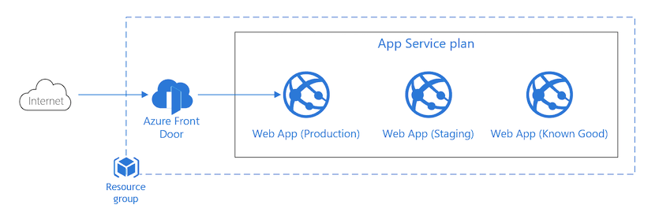
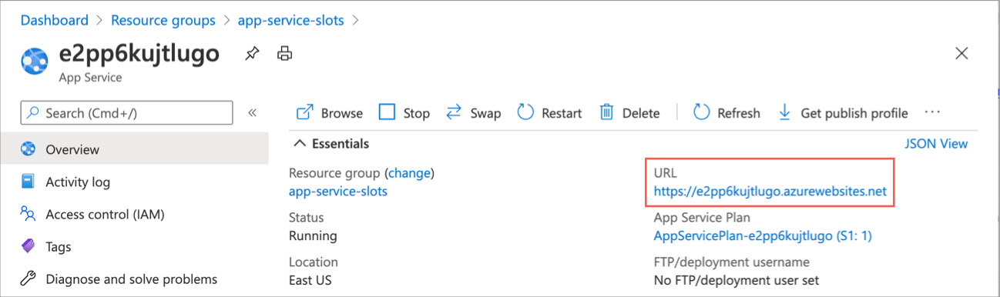
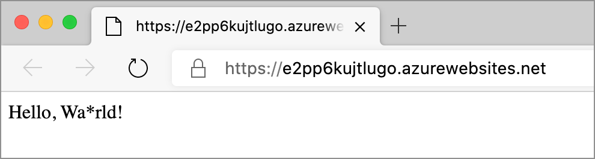
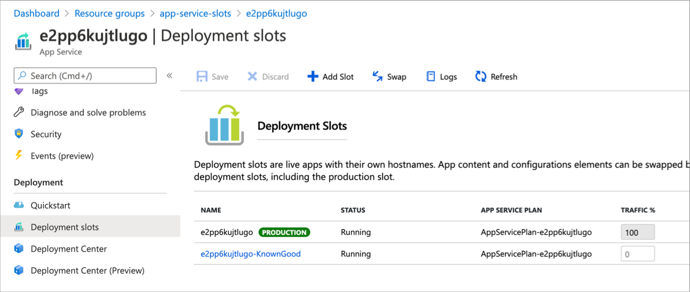
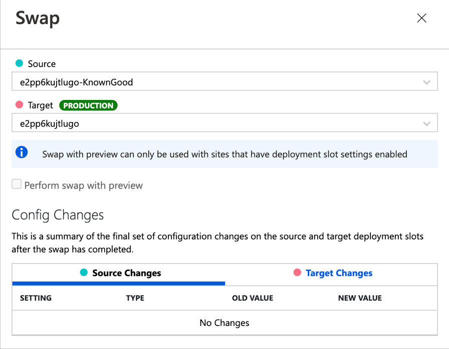
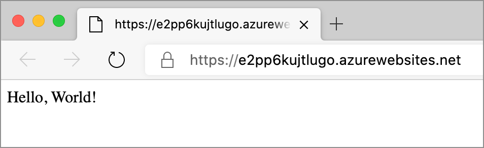

# Azure App Service deployment slot rollback

When you deploy your web app, web app on Linux, mobile back end, or API app to Azure App Service, you can use a separate deployment slot instead of the default production slot when running in the Standard, Premium, or Isolated App Service plan tier. Deployment slots are live apps with their own hostnames. App content and configurations elements can be swapped between two deployment slots, including the production slot.

## Solution overview

This example solution deploys an Azure App Service Plan, with two additional slots, Staging, and KnownGood. A problematic application is deployed to the production slot, and a know good version deployed to the KnownGood slot. This solution demonstrates basic rollback between two deployment slots. Specifically, you can swap the Production and KnownGood slot to revert the application to a working state.



The architecture consists of the following components:

- [Azure App Service](https://docs.microsoft.com/azure/app-service/overview-hosting-plans): The App Service plan defines a set of compute resources for a web app to run. 
- [Azure App Service](https://docs.microsoft.com/azure/app-service/overview): Azure App Service is an HTTP-based service for hosting web applications, REST APIs, and mobile back ends.
- [Azure App Service Slots](https://docs.microsoft.com/azure/app-service/deploy-staging-slots): Deployment slots are live apps with their own hostnames. App content and configurations elements can be swapped between two deployment slots, including the production slot.
- [Azure Front Door](https://docs.microsoft.com/azure/frontdoor/front-door-overview): Azure Front Door is a global, scalable entry-point that uses the Microsoft global edge network to create fast, secure, and widely scalable web applications.

## Solution video

To see a video demo of the solution, see the Azure Monitor and [Azure Policy and Azure Kubernetes Service (AKS)  on Channel9]().

## Deploy the solution

Create a resource group for the Azure App Service plan, application, and slots.

```azurecli-interactive
az group create --location eastus --name app-service-slots
```

Use an Azure Resource Manager (ARM) template to deploy the Azure App Service plan, an app, and a last know good slot, loaded with the app in a known good state. To examine the ARM templates used to deploy this solution, visit the [Azure Documentation code samples repository](https://github.com/neilpeterson/samples/tree/appservice-slots-demo/OperationalExcellence/azure-appservice-slots).

```azurecli-interactive
az deployment group create \
    --resource-group app-service-slots \
    --template-uri https://raw.githubusercontent.com/neilpeterson/samples/appservice-slots-demo/OperationalExcellence/azure-appservice-slots/azuredeploy.json
```

Once the deployment has completed, run the following command to return both the application name and URL.

```azurecli-interactive
az webapp list --resource-group app-service-slots --output table
```

## Demo solution

# [Azure CLI](#tab/azure-cli)

Use the curl command to see the application content. Replace the URL with that from your application. The application should return 'Hello World', notice this it is malformed.

```azurecli-interactive
curl wh7srjrdniwve.azurewebsites.net
```

Use the _az webapp deployment slot list_ command to return a list of application slots. Replace the application name with the name from your deployment.

```azurecli-interactive
az webapp deployment slot list --resource-group app-service-slots --name wh7srjrdniwve --output table
```

Use the _az webapp deployment slot list_ command to swap the known good and production slot. Replace the application name with the name from your deployment.

```azurecli-interactive
az webapp deployment slot swap --slot KnownGood --target-slot production --resource-group app-service-slots --name wh7srjrdniwve 
```

Run the curl command again; this time, notice that the application returns _Hello World_. Replace the URL with that from your application.

```azurecli-interactive
curl wh7srjrdniwve.azurewebsites.net
```

# [Azure Portal](#tab/azure-portal)











---

### Delete solution

```azurecli-interactive
az group delete --location eastus --name app-service-slots
```

## Next steps

> [!div class="nextstepaction"]
> [Set up staging environments in Azure App Service](https://docs.microsoft.com/azure/app-service/deploy-staging-slots)
