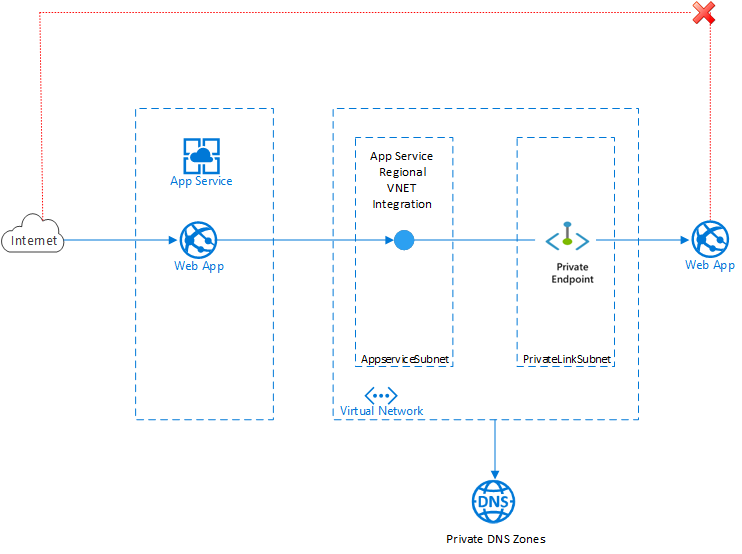

The architecture described in this article uses private endpoints to provide highly secure communications between app services in a multi-tier environment.

For information about using service endpoints to accomplish the same thing, see [Multi-tier app service with service endpoints](../../reference-architectures/app-service-web-app/multi-tier-app-service-service-endpoint.yml).

## Architecture

*Download a [Visio file](https://arch-center.azureedge.net/Multi-tier-App-Service-with-Private-Endpoint.vsdx) of this architecture.* 

### Dataflow

Here's the traffic flow and basic configuration of the architecture:
1. A front-end web app connects to Azure through the AppserviceSubnet subnet in an Azure virtual network by using Azure App Service [regional VNet Integration](/azure/app-service/web-sites-integrate-with-vnet#regional-vnet-integration).
2. A [private endpoint](/azure/private-link/private-endpoint-overview) for the API app is configured in [Azure Private Link](/azure/azure-sql/database/private-endpoint-overview#how-to-set-up-private-link-for-azure-sql-database) in the PrivateLinkSubnet subnet of the virtual network.
3. The front-end web app connects to the back-end API app private endpoint through the PrivateLinkSubnet subnet of the virtual network.
4. The API app isn't accessible from the public internet. It allows traffic only from PrivateLinkSubnet.

### Components

- [Azure App Service](https://azure.microsoft.com/services/app-service) enables you to build and host web apps and API apps in the programming language that you choose without needing to manage infrastructure. 
- [Azure Virtual Network](https://azure.microsoft.com/services/virtual-network) is the fundamental building block for creating your own network in Azure. It provides a highly secure environment for running Azure resources like virtual machines.
- [Azure Private Link](https://azure.microsoft.com/services/private-link) provides private connectivity that you can use to access Azure PaaS services like Azure Storage and Azure SQL Database, or to access customer or partner services, from a virtual network.

### Alternatives

One way to implement this solution is to deploy both the front-end app and the API app in the same internal load balancer App Service Environment (ILB ASE) and make the front-end app directly internet accessible via an application gateway. For more information, see [Introduction to the App Service Environments](/azure/app-service/environment/intro).

Another method is to deploy the front-end app in the multitenant service and the API app in an ILB ASE. Or you can host both the front-end app and the API app in the multitenant service.

These are some alternative ways to provide security for your web apps:
- App-assigned addresses
- Azure service endpoints
- Access restrictions

For more information, see [App Service networking features](/azure/app-service/networking-features).

## Scenario details

A front-end application that makes calls to one or more API applications behind it is known as a *multi-tier web application*. This type of architecture usually gets complicated when you want to secure the API applications by making them unavailable from the internet. 

You can provide security for your API applications in several ways that make them accessible only from your front-end applications. This involves securing your API application's inbound traffic.

A network interface that uses Azure Private Link to connect you privately, in a highly secure way, to your web app is known as a *private endpoint*. It uses a private IP address from the virtual network, effectively bringing the web app into that network. This feature is applicable only for inbound flows to your web app.

[Private endpoints](/azure/private-link/private-endpoint-overview) help to protect against data exfiltration because the only thing you can access across the private endpoint is the app with which it's configured.

### Potential use cases

Here are some use cases for this architecture:
- Applications that require private connections to a back-end API app.
- Restricting app access from resources in a virtual network.
- Exposing your app on a private IP in a virtual network.
- Connecting from a web app to Azure Storage, Azure Event Grid, Azure Cognitive Search, Azure Cosmos DB, or any other service that supports a [private endpoint](/azure/private-link/private-endpoint-overview#private-link-resource) for inbound connectivity.

### Benefits

These are some benefits of using a private endpoint for your web app:
- Eliminates public exposure and makes the app more secure.
- Enables you to create high-security connections from on-premises networks that connect to the virtual network by using a virtual private network (VPN) or Azure ExpressRoute private peering.
- Helps prevent data exfiltration.

If you only need a secure connection between the virtual network and the web app, you should use a [service endpoint](../../reference-architectures/app-service-web-app/multi-tier-app-service-service-endpoint.yml). However, if you need to access the web app from on-premises through an Azure gateway, a regionally peered virtual network, or a globally peered virtual network, use a private endpoint.

## Considerations

- When you use a private endpoint for a web app, remote debugging isn't available. You need to deploy code to a slot to debug it remotely.
- FTP access isn't available when you use a private endpoint for a web app.
- Private endpoints don't support IP-based SSL.

### DNS configuration

When you use a private endpoint, the requested URL must match the name of your web app. By default, the app name is mywebappname.azurewebsites.net. When you deploy the private endpoint, you need to update the DNS entry to the canonical name mywebappname.privatelink.azurewebsites.net.

You need to set up a private DNS server or an Azure DNS private zone. Create the DNS zone privatelink.azurewebsites.net.

After this configuration, you'll be able to reach your web app privately by using the default name mywebappname.azurewebsites.net. For more information, see [DNS](/azure/app-service/networking/private-endpoint#dns).

### Availability

- A system can't be highly available if it's not reliable. For information about increasing reliability, see [Reliability patterns](/azure/architecture/framework/resiliency/reliability-patterns).
- Take private link availability into consideration when you evaluate the SLA of the entire architecture. Private Link provides a [high availability SLA](https://azure.microsoft.com/support/legal/sla/private-link/v1_0).

### Scalability

- Performance efficiency is the ability of your workload to scale to meet the demands placed on it in an efficient way. Be aware of performance efficiency patterns when you design and build your cloud application. For more information, see [Performance Efficiency patterns](/azure/architecture/framework/scalability/performance-efficiency-patterns).
- For information about scaling a basic web app, see [Scaling the App Service app](../../reference-architectures/app-service-web-app/basic-web-app.yml#scaling-the-app-service-app). 
- For an Azure Well-Architected Framework checklist, see [Performance efficiency](/azure/architecture/framework/scalability/performance-efficiency).

### Cost optimization

Use the [Azure pricing calculator](https://azure.microsoft.com/pricing/calculator) to estimate costs.

The cost of your implementation is affected by:
- The scalability of the solution—how well it supports changes in demand.
- Whether the solution runs continuously or intermittently.
- The service tiers that you use.

## Contributors

*This article is maintained by Microsoft. It was originally written by the following contributors.* 

Principal author:

 - Dixit Arora | Senior Customer Engineer
 
*To see non-public LinkedIn profiles, sign in to LinkedIn.*

## Next steps

- [App Service documentation](/azure/app-service)
- [App Service networking features](/azure/app-service/networking-features)
- [Integrate your app with an Azure virtual network](/azure/app-service/web-sites-integrate-with-vnet)
- [Virtual Network service endpoints](/azure/virtual-network/virtual-network-service-endpoints-overview)
- [Introduction to the App Service Environments](/azure/app-service/environment/intro)
- [Private-link resource](/azure/private-link/private-endpoint-overview#private-link-resource)
- [App Service overview](/azure/app-service/overview)
- [Reliability patterns](/azure/architecture/framework/resiliency/reliability-patterns)
- [Performance Efficiency patterns](/azure/architecture/framework/scalability/performance-efficiency-patterns)

## Related resources
- [Multi-tier app service with service endpoints](../../reference-architectures/app-service-web-app/multi-tier-app-service-service-endpoint.yml)
- [Basic web application](../../reference-architectures/app-service-web-app/basic-web-app.yml)
- [Web application monitoring on Azure](../../reference-architectures/app-service-web-app/app-monitoring.yml)
- [Highly available multi-region web application](../../reference-architectures/app-service-web-app/multi-region.yml)
- [Scalable web application](../../reference-architectures/app-service-web-app/scalable-web-app.yml)
