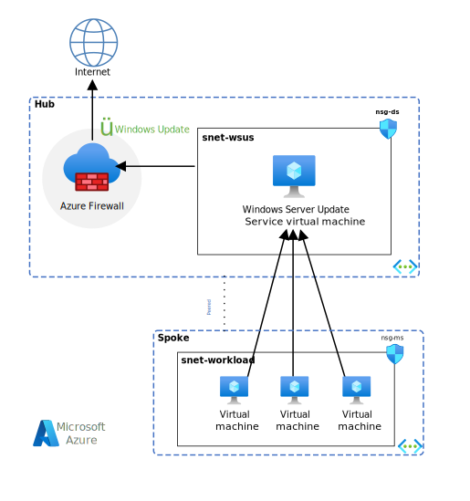

<!-- cSpell:ignore vpaulreed WSUS NSGs VM's -->

If you've locked down your Azure virtual network from the internet, you can still get Windows updates without jeopardizing security and opening up access to the internet as a whole. This article contains recommendations on how you can set up a perimeter network, also called a DMZ, to host a Windows Server Update Service (WSUS) instance to securely update virtual networks without internet connectivity.

If you're using Azure Firewall, you can use the Windows Update FQDN tag in application rules to allow the required outbound network traffic through your firewall. For more information, see [FQDN tags overview](/azure/firewall/fqdn-tags).

To implement the recommendations in this article, you should be familiar with Azure services. The following sections describe the recommended deployment design, which uses a hub-and-spoke configuration in a single-region or multiregion configuration.

## Azure Virtual Network hub-and-spoke network topology

We recommend that you set up a hub-and-spoke model network topology by creating a perimeter network. Host the WSUS server on an Azure virtual machine that's in the hub between the internet and the virtual networks. The hub should have open ports. WSUS uses port 80 for HTTP protocol and port 443 for HTTPS protocol to obtain updates from Microsoft. The spokes are all the other virtual networks, which will communicate with the hub and not with the internet. You can accomplish this by creating a subnet, network security groups (NSGs), and Azure virtual network peering that allows WSUS traffic while blocking other internet traffic. This image illustrates an example of hub-and-spoke topology:



*Download a [Visio file](https://arch-center.azureedge.net/wsus-vnet.vsdx) of this architecture.*

In this image:

- **WSUSSubnet** is the hub of the hub and spoke.
- **NSG_DS** is a network security group rule that allows traffic for WSUS while blocking other internet traffic.
- **WSUS VM** is the Azure virtual machine that's configured to run WSUS.
- **MainSubnet** is a virtual network, a spoke, containing virtual machines.
- **NSG_MS** is a network security group policy that allows traffic from WSUS VM but denies internet traffic.

You can reuse an existing server or deploy a new one that will be the WSUS server. For the WSUS VM, we recommend the following, at a minimum:

- **Operating system:** Windows Server 2016 or later.
- **Processor:** Dual core, 2 GHz or faster.
- **Memory:** 2 GB of RAM, in addition to the RAM required by the server and all other running services and software.
- **Storage:** 40 GB or more.
- **Access**: Access this virtual machine more securely by using just-in-time (JIT). See [Manage virtual machine access using just-in-time](/azure/security-center/security-center-just-in-time).

Your network will have more than one Azure virtual network, which can be in the same region or in different regions. You'll need to evaluate all Windows Server VMs to see if one can be used as a WSUS server. If you have thousands of VMs to update, we recommend dedicating a Windows Server VM to the WSUS role.

If all your virtual networks are in the same region, we suggest having one WSUS for every 18,000 VMs. This suggestion is based on a combination of the VM requirements, the number of client VMs being updated, and the cost of communicating between virtual networks. For more information on WSUS capacity requirements, see [Plan your WSUS deployment](/windows-server/administration/windows-server-update-services/plan/plan-your-wsus-deployment).

You can determine the cost of these configurations by using the [Azure pricing calculator](https://azure.microsoft.com/pricing/calculator). You'll need to provide the following information:

- Virtual machine:
  - Region: The region where your Azure virtual network is deployed.
  - Operating system: **Windows**
  - Tier: **Standard**
  - Instance: **D4 configuration**
  - Managed disks: **Standard HDD**, **64 GB**
- Virtual network:
  - Type
    - **Same Region** if transfer is in the same region.
    - **Across Region** if you're moving data from one region to another.
  - Data Transfer: **2 GB**
  - Region
    - If transfer is within one region, choose the region the WSUS server and virtual networks are in.
    - If transfer crosses regions, the source virtual network region is where the WSUS server is. The destination virtual network region is where the data is going.
  - If you have multiple regions, you'll need to select **Virtual Network** multiple times.

Note that prices will vary by region.

## Manual deployment

After you either identify the Azure virtual network to use as the hub or determine you need to create a new Windows Server instance, you need to create an NSG rule. The rule will allow internet traffic, which allows Windows Update metadata and content to sync with the WSUS server that you'll create. Here are the rules that you need to add:

- Inbound/outbound NSG rule to allow traffic to and from the internet on port 80 (for content).
- Inbound/outbound NSG rule to allow traffic to and from the internet on port 443 (for metadata).
- Inbound/outbound NSG rule to allow traffic from the client VMs on port 8530 (default unless configured).

## Set up WSUS

There are two approaches you can use to set up your WSUS server:

- If you want to automatically set up a server that's configured to handle a typical workload with minimal administration required, you can use the PowerShell automation script.
- If you need to handle thousands of clients that run many different operating systems and languages, or if you want to configure WSUS in a way that the PowerShell script can't handle, you can set up WSUS manually. Both approaches are described later in this article.

You can also combine the two approaches by using the automation script to do most of the work and then using the WSUS administrative console to fine-tune the server settings.

### Set up WSUS by using the automation script

The Configure-WSUSServer script allows you to quickly set up a WSUS server that will automatically synchronize and approve updates for a chosen set of products and languages.

> [!NOTE]
> The script always sets up WSUS to use Windows Internal Database to store its update data. This speeds up setup and reduces administration complexity. But if your server will support thousands of client computers, especially if you also need to support a wide variety of products and languages, you should set up WSUS manually instead so that you can use SQL Server as the database.

The latest version of this script is [available on GitHub](https://github.com/mspnp/solution-architectures/tree/master/wsus).

You configure the script by using a JSON file. You can currently configure these options:

- Whether update payloads should be stored locally (and, if so, where they should be stored), or left on the Microsoft servers.
- Which products, update classifications, and languages should be available on the server.
- Whether the server should automatically approve updates for installation or leave updates unapproved unless an administrator approves them.
- Whether the server should automatically retrieve new updates from Microsoft, and, if so, how often.
- Whether Express update packages should be used. (Express update packages reduce server-to-client bandwidth at the expense of client CPU/disk usage and server-to-server bandwidth.)
- Whether the script should overwrite its previous settings. (Normally, to avoid inadvertent reconfiguration that might disrupt server operation, the script will run only once on a given server.)

Copy the script and its configuration file to local storage, and edit the configuration file to suit your needs.

> [!WARNING]
> Be careful when you edit the configuration file. The syntax used for JSON configuration files is strict. If you inadvertently change the structure of the file rather than just the parameter values, the configuration file won't load.

You can run this script in one of two ways:

- You can run the script manually, from the WSUS VM.

  The following command, run from an elevated Command Prompt window, will install and configure WSUS. It will use the script and configuration file in the current directory.

    `powershell.exe -ExecutionPolicy Unrestricted -File .\Configure-WSUSServer.ps1 -WSUSConfigJson .\WSUS-Config.json`

- You can use the [Custom Script Extension for Windows](/azure/virtual-machines/extensions/custom-script-windows).

  Copy the script and the JSON configuration file to your own storage container.

  In typical VM and Azure Virtual Network configurations, the Custom Script Extension needs only the following two parameters to run the script correctly. (You need to replace the values shown here with the URLs for your storage locations.)

  ```json
  "fileUris": ["https://mystorage.blob.core.windows.net/mycontainer/Configure-WSUSServer.ps1","https://mystorage.blob.core.windows.net/container/WSUS-Config.json"],
  "commandToExecute": "powershell.exe -ExecutionPolicy Unrestricted -File .\Configure-WSUSServer.ps1 -WSUSConfigJson .\WSUS-Config.json"

  ```

The script will start the initial synchronization needed to make updates available to client computers. But it won't wait for that synchronization to complete. Depending on the products, classifications, and languages you've selected, the initial synchronization might take several hours. All synchronizations after that should be faster.

### Set up WSUS manually

1. From your WSUS VM, open Server Manager and select **Add roles and features**.
2. Select **Next** until you get to the **Select server roles** page. Select **Windows Server Update Services**. Select **Add Features** when you're prompted with **Add features that are required for Windows Server Update Services?**
3. Select **Next** until you get to the **Select role services** page.
    - By default, you can use **WID Connectivity**.
    - Use **SQL Server Connectivity** if you need to support clients that use many different versions of Windows (for example, Windows 11 and Windows 10).

4. Select **Next** until you get to the **Content location selection** page. Enter the location where you want to store the updates.
5. Select **Next** until you get to the **Confirm installation selections** page. Select **Install**.
6. Open the installed Windows Server Update Services and select **Run**.
7. Select **Next** until you get to the **Connect to Upstream Server** page. Select **Start Connecting**.
8. Select **Next** until you get to the **Choose Languages** page. Choose the languages you need.
9. Select **Next** until you get to the **Choose Products** page. Choose the products you need.
10. Select **Next** until you get to the **Choose Classifications** page. Choose the updates you need.
11. Select **Next** until you get to the **Set Sync Schedule** page. Choose your sync preference.
12. Select **Next** until you get to the **Finished** page. Select **Begin initial synchronization** and then select **Next**.
13. Select **Next** until you get to the **What's Next** page and then select **Finish**.
14. If you select your WSUS name (for example, **WsusVM**) in the navigation pane, you should see that **Synchronization Status** is **Idle** and **Last synchronization result** is **Succeeded**.
15. In the navigation pane, select **Options** > **Computers** > **Use Group Policy or registry settings on computers**. Select **OK**.

During synchronization, WSUS determines if any new updates have been made available since the last time you synchronized. If it's your first time synchronizing WSUS, the metadata is downloaded immediately. The payload downloads only if local storage is turned on and the update is approved for at least one computer group.

> [!NOTE]
> Initial synchronization can take more than an hour. All synchronizations after that should be significantly faster.

## Configure virtual networks to communicate with WSUS

Next, set up Azure virtual network peering or global virtual network peering to communicate with the hub. We recommend that you set up a WSUS server in each region you've deployed to minimize latency.

On each Azure virtual network that's a spoke, you'll need to create an NSG policy that has these rules:

- An inbound/outbound NSG rule to allow traffic from the WSUS VM on port 8530 (default unless configured).
- An inbound/outbound NSG rule to deny traffic from the internet.

Next, create the Azure virtual network peering from the spoke to the hub.

### Client VM

- For extra security, you can remove a VM's associated public IP address. For more information, see [View, change settings for, or delete a public IP address](/azure/virtual-network/virtual-network-public-ip-address#view-change-settings-for-or-delete-a-public-ip-address).
- For information about now to access your virtual machine more securely by using JIT, see [Manage virtual machine access using just-in-time](/azure/security-center/security-center-just-in-time).

## Configure client virtual machines

WSUS can be used to update any virtual machine that runs Windows (except for the Home SKU). Complete the following steps on each client virtual machine to enable communication between WSUS and the client:

### From your client VM

1. Open Local Group Policy Editor (or Group Policy Management Editor).
2. Go to **Computer Configuration** > **Administrative Templates** > **Windows Components** > **Windows Update**.
3. Enable **Specify intranet Microsoft update service location**.
4. Enter the URL `http://\<WSUS name>:8530`. (You can find your WSUS name (for example, WsusVM) on the Update Services page.) It might take some time (up to few hours) for this setting to be reflected.
5. Go to **Settings** > **Update & Security** > **Windows Update**.
6. Select **Check for updates**.

### From your WSUS VM

1. Open **Windows Server Update Services**. You should be able to see your client VM listed under **Computers** > **All Computers**.
2. Select **Updates** > **All Updates**.
3. Set **Approval** to **Any Except Declined**.
4. Set **Status** to **Needed**. Now you can see all the updates needed for your client VM.
5. Right-click any of the updates and select **Approve**.

### Verification

1. On the client VM, go to **Settings** > **Update & Security** > **Windows Update**.
2. Select **Check for updates**. You should see an update with the same KB article number (for example, 4480056) that you approved from the WSUS VM.

If you're an administrator managing a large network, see [Configure automatic updates and update service location](/windows/deployment/update/waas-manage-updates-wsus#configure-automatic-updates-and-update-service-location) for information about how to use Group Policy settings to automatically configure clients.

## WSUS deployment for multiple clouds

It's not possible to set up virtual network peering across public and private clouds. Networks that are deployed across public and private clouds will need to have at least one WSUS server in each cloud.

## Support notes

Currently, WSUS doesn't support synchronization with the Windows Home SKU.

## Azure Update Management

You can use the Update Management solution in Azure to manage and schedule operating system updates for VMs that are syncing against WSUS. The patch status of the VM (that is, which patches are missing) is assessed based on the source that the VM is configured to sync with. If the Windows VM is configured to report to WSUS, the results might differ from what Microsoft Update shows, depending on when WSUS last synced with Microsoft Update. After you configure your WSUS environment, you can enable Update Management. For more information, see [Update Management overview and onboarding steps](/azure/automation/update-management/overview).

## Contributors

*This article is maintained by Microsoft. It was originally written by the following contributors.*

Principal author:

 * [Paul Reed](https://www.linkedin.com/in/paulreed55) | Azure Compliance Senior Program Manager

## Next steps

- For more information on planning a deployment, see [Plan your WSUS deployment](/windows-server/administration/windows-server-update-services/plan/plan-your-wsus-deployment).
- For more information on managing WSUS, setting up a WSUS synchronization schedule, and more, see [WSUS administration](/windows-server/administration/windows-server-update-services/get-started/windows-server-update-services-wsus).

## Related resources

- [Run a Windows VM on Azure](/azure/architecture/reference-architectures/n-tier/windows-vm)
- [Azure Automation update management](/azure/architecture/hybrid/azure-update-mgmt)
- [Run SAP NetWeaver in Windows on Azure](/azure/architecture/guide/sap/sap-netweaver)
- [Manage hybrid Azure workloads using Windows Admin Center](/azure/architecture/hybrid/hybrid-server-os-mgmt)
- [CI/CD for Azure VMs](/azure/architecture/solution-ideas/articles/cicd-for-azure-vms)
