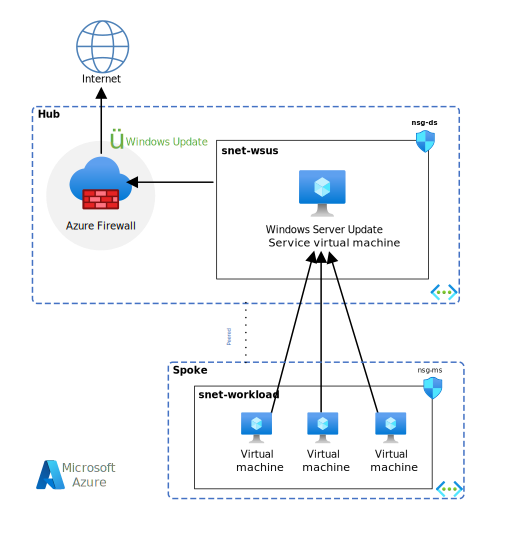

<!-- cSpell:ignore WSUS NSGs -->

If you've locked down your Azure virtual network from the internet, you can still get Windows updates without jeopardizing security and opening up access to the internet as a whole. This article contains recommendations on how you can set up a perimeter network, also called a DMZ, to host a Windows Server Update Service (WSUS) instance to securely update virtual networks without internet connectivity.

If you're using Azure Firewall, you use the `WindowsUpdate` FQDN tag in application rules to allow the required outbound network traffic through your firewall. For more information, see [FQDN tags overview](/azure/firewall/fqdn-tags) and [Plan for software updates - Configure firewalls](/intune/configmgr/sum/plan-design/plan-for-software-updates#BKMK_ConfigureFirewalls).

To implement the recommendations in this article, you should be familiar with Azure services. The following sections describe the recommended deployment design, which uses a hub-spoke configuration in a single region or multiregion configuration.

## Azure Virtual Network hub-spoke network topology

We recommend that you set up a hub-spoke model network topology by creating a perimeter network. Host the WSUS server on an Azure virtual machine that's in the hub between the internet and the virtual networks. The hub should have open ports. WSUS uses port 80 for HTTP protocol and port 443 for HTTPS protocol to obtain updates from Microsoft. The spokes are all the other virtual networks, which will communicate with the hub and not with the internet. You can accomplish this by creating a subnet, network security groups (NSGs), and Azure virtual network peering that allows WSUS traffic while blocking other internet traffic. This image illustrates an example of hub-spoke topology:



*Download a [Visio file](https://arch-center.azureedge.net/wsus-vnet.vsdx) of this architecture.*

In this image:

- **snet-wsus** is the subnet in the hub of the hub and spoke topology that contains the WSUS server.
- **nsg-ds** is a network security group rule that allows traffic for WSUS while blocking other internet traffic.
- **Windows Server Update Service virtual machine** is the Azure virtual machine that's configured to run WSUS.
- **snet-workload** is an example of a subnet in a peered spoke virtual network containing Windows virtual machines.
- **nsg-ms** is a network security group policy that allows traffic to the WSUS VM but denies other internet traffic.

You can reuse an existing server or deploy a new one that becomes the WSUS server. Your WSUS VM must meet the documented [system requirements](/windows-server/administration/windows-server-update-services/plan/plan-your-wsus-deployment#system-requirements).  As this is a security sensitive capability, you should plan on accessing this virtual machine by using just-in-time (JIT). See [Manage virtual machine access by using just-in-time](/azure/defender-for-cloud/enable-just-in-time-access).

Your network will have more than one Azure virtual network, which can be in the same region or in different regions. You need to evaluate all Windows Server VMs to see if one can be used as a WSUS server. If you have thousands of VMs to update, we recommend dedicating a Windows Server VM to the WSUS role. We also encourage that VMs don't use a WSUS server in a different region as their primary source.

If all your virtual networks are in the same region, we suggest having one WSUS for every 18,000 VMs. This suggestion is based on a combination of the VM requirements, the number of client VMs being updated, and the cost of communicating between virtual networks. For more information on WSUS capacity requirements, see [Plan your WSUS deployment](/windows-server/administration/windows-server-update-services/plan/plan-your-wsus-deployment).

You can determine the cost of these configurations by using the [Azure pricing calculator](https://azure.microsoft.com/pricing/calculator). You need to provide the specifications of your WSUS virtual machines and your network expectations; same region, across regions. For data transfer, start with 3 GB. Prices vary by region.

## Manual deployment

After you either identify the Azure virtual network to use or determine you need to create a new Windows Server instance, you need to create an NSG rule. The rule will allow internet traffic, which allows Windows Update metadata and content to sync with the WSUS server that you create. Here are the rules that you need to add:

- Inbound/outbound NSG rule to allow traffic to and from the internet on port 80 (for content).
- Inbound/outbound NSG rule to allow traffic to and from the internet on port 443 (for metadata).
- Inbound/outbound NSG rule to allow traffic from the client VMs on port 8530 (default unless configured).

## Set up WSUS

There are two approaches you can use to set up your WSUS server:

- If you manage many servers or want repeatable, hands-off deployments, automate the setup by writing your own PowerShell script. This approach configures a server to handle a typical workload with minimal administration required.
- If you need to handle thousands of clients that run many different operating systems and languages, or if you want to configure WSUS in a way that a script can't handle, set up WSUS manually. Both approaches are described later in this article.

You can also combine the two approaches by using a script to do most of the work and then using the WSUS administrative console to fine-tune the server settings.

### Set up WSUS by using an automation script

To automate this scenario, author a PowerShell script. WSUS exposes a PowerShell surface that you can use to install the role and configure synchronization, products, classifications, languages, and update approvals without using the administrative console. For the cmdlets that a script uses, see the [WSUS PowerShell reference (UpdateServices module)](/powershell/module/updateservices/).

> [!NOTE]
> An install approach that uses Windows Internal Database speeds up setup and reduces administration complexity. But if your server will support thousands of client computers, especially if you also need to support a wide range of products and languages, set up WSUS manually instead so that you can use SQL Server as the database.

Design your script and its configuration to be idempotent, so that a rerun doesn't disrupt a running server. Store your settings in a separate configuration file, such as JSON, so that operators can change values without editing the script logic. A robust script handles these responsibilities:

- Install the WSUS server role and management tools, then run the required post-installation step to set the content directory.
- Set the upstream source that the server synchronizes from, such as Microsoft Update or another WSUS server.
- Set whether update payloads are stored locally (and where) or left on the Microsoft servers.
- Select which products, update classifications, and languages are available on the server.
- Set whether the server automatically approves updates for installation or leaves them unapproved unless an administrator approves them.
- Set whether the server automatically retrieves new updates from Microsoft, and, if so, how often.
- Set whether Express update packages are used. Express update packages reduce server-to-client bandwidth at the expense of client CPU and disk usage and server-to-server bandwidth.
- Guard against unintended reconfiguration. For example, record that the script already ran and skip subsequent runs unless an override value is set, so that you avoid inadvertent changes that might disrupt server operation.

You can run your script in one of two ways:

- Run the script manually from the WSUS VM. Run it from an elevated command prompt to install and configure WSUS.

- You can use the [Custom Script Extension for Windows](/azure/virtual-machines/extensions/custom-script-windows).

  Copy your script and its configuration file to your own storage container that has private network line of sight to the WSUS VM.

  In typical VM and Azure Virtual Network configurations, the Custom Script Extension needs only the following two parameters to run the script correctly. Replace the values shown here with the URLs for your storage locations and the names of your files.

  ```bicep
  settings: {
    fileUris: [
      'https://yourstorageaccount.blob.core.windows.net/wsus/Configure-WSUSServer.ps1'
      'https://yourstorageaccount.blob.core.windows.net/container/WSUS-Config.json'
    ]
    commandToExecute: 'powershell.exe -ExecutionPolicy Unrestricted -File .\Configure-WSUSServer.ps1 -WSUSConfigJson .\WSUS-Config.json'
  }
  ```

Have your script start the initial synchronization that makes updates available to client computers, but don't require it to wait for that synchronization to complete. Depending on the products, classifications, and languages you select, the initial synchronization might take several hours. All synchronizations after that should be faster.

### Set up WSUS manually

From your WSUS VM, follow the instructions found in [Install the WSUS Server Role](/windows-server/administration/windows-server-update-services/deploy/1-install-the-wsus-server-role?tabs=server-manager)

During synchronization, WSUS determines if any new updates have been made available since the last time you synchronized. If it's your first time synchronizing WSUS, the metadata is downloaded immediately. The payload downloads only if local storage is turned on and the update is approved for at least one computer group.

> [!NOTE]
> Initial synchronization can take more than an hour. All synchronizations after that should be significantly faster.

## Configure virtual networks to communicate with WSUS

Next, set up Azure virtual network peering or global virtual network peering to communicate with the hub. We recommend that you set up a WSUS server in each region you've deployed to minimize latency.

On each Azure virtual network that's a spoke, you need to create an NSG policy that has these rules:

- An inbound/outbound NSG rule to allow traffic to the WSUS VM on port 8530 (default unless configured).
- An inbound/outbound NSG rule to deny traffic to the internet.

Next, create the Azure virtual network peering from the spoke to the hub.

## Configure client virtual machines

WSUS can be used to update any virtual machine that runs Windows. To set up clients using group policy, see [Configure client computers to receive updates from the WSUS server](/windows-server/administration/windows-server-update-services/deploy/2-configure-wsus#26-configure-client-computers-to-receive-updates-from-the-wsus-server).

If you're an administrator managing a large network, see [Configure automatic updates and update service location](/windows/deployment/update/waas-manage-updates-wsus#configure-automatic-updates-and-update-service-location) for information about how to use Group Policy settings to automatically configure clients.

## Azure Update Manager

You can use the Azure Update Manager to manage and schedule operating system updates for VMs that are syncing against WSUS. The patch status of the VM (that is, which patches are missing) is assessed based on the source that the VM is configured to sync with. If the Windows VM is configured to report to WSUS, the results might differ from what Microsoft Update shows, depending on when WSUS last synced with Microsoft Update. After you configure your WSUS environment, you can enable Update Management. For more information, see [the overview of Azure Update Manager](/azure/update-manager/overview).

## Contributors

*This article is maintained by Microsoft. It was originally written by the following contributors.*

Principal author:

- [Paul Reed](https://www.linkedin.com/in/paulreed55/) | Azure Compliance Senior Program Manager

## Next steps

- For more information on planning a deployment, see [Plan your WSUS deployment](/windows-server/administration/windows-server-update-services/plan/plan-your-wsus-deployment).
- For more information on managing WSUS, setting up a WSUS synchronization schedule, and more, see [WSUS administration](/windows-server/administration/windows-server-update-services/get-started/windows-server-update-services-wsus).

## Related resource

- [Run a Windows VM on Azure](../../reference-architectures/n-tier/windows-vm.yml)
