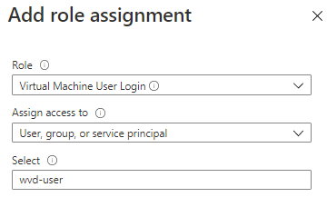

On Wednesday September the 15th 2021 we announced the general availability of Azure Active Directory domain join for Azure Virtual Desktop.
This post discusses how to set this up and troubleshooting tips.

## Let's start with some background. 
Azure Active Directory Join for the Azure Virtual Desktop session hosts has been the number one feature request from customers from day one of Windows Virtual Desktop
as it was known at launch, followed very closely by support from Microsoft Endpoint Manager - specifically Intune managing those session host Virtual machines.
Now we have launched this capability both of these are now a reality.

## Why are we doing this?
Currently AVD requires both Azure Active Directory (AAD) as well as traditional Active Directory Domain Services (AD DS). AD DS can come in one of two formats:
- Traditional AD DS from Windows server. The AD DS domain controllers can either be located on-prem and accessed over a site-to-site VPN or ExpressRoute. 
  Or they can be virtual machines located within Azure itself, or both. All AVD needs is network line of sight to a domain controller, to facilitate the VM domain join
  at deployment time and to perform the user authentication.
- Azure Active Directory Domain Services (AAD DS), which is a Microsoft managed PaaS service to provide AD DS inside of Azure. Customers do not manage the virtual
  machines for this service and was originally designed for just cloud only organisations but has had recent updates to support trust relationships to existing on-prem AD DS.
  This service has a number of limitations and hence is worth fully understanding these by reading the (AAD DS documentation here)[https://docs.microsoft.com/en-us/azure/active-directory-domain-services/] 
  
Firstly, AAD is used to authenticate users to the AVD service and present the user with a list of resources. Secondly as the session hosts are all AD DS joined 
AD DS will prompt users to sign-in to AD DS, as well as AAD. This is a standard Kerberos authentication.

You can save both the AAD credentials using the standard AAD process for this which will keep those credentials for 90 days, as well as the AD DS credentials in the local 
Credential Manager via the Windows Remote Desktop client. With both of these saved it appears to be Single Sign On (SSO) like, in that users will not be prompted for a 
password after the first authentications have completed. Caching the AD DS credentials is currently only supported in the Windows clients.

Having the ability to AAD Join (AADJ) the AVD session host VMs only to AAD obviously stops the requirement to have AD DS Domain Controllers available at all (in this scenario).
This will reduce your costs and complexity. However, AD DS may well still be required for other services that still depend on it such as applications, SMB storage services etc. 
These may well be being consumed from the AVD session hosts. However, for AVD itself, very specifically AD DS is no longer a requirement.

But that's not all, it will also introduce new modern authentication protocols such as Windows Hello for Business, Smartcards, FIDO2 etc. and provide a more modern approach for the 
future. It will also in the future provide a wide range of addtional capabilities in this space.

Thats a brief background, lets now look how to set this up.

## Configuration 
There are two or three steps, depending on your existing configuration

## Step 1: Deploy an AADJ host pool
Firstly, there are a few limitations, namely:
- AADJ is only supported on AVD ARM, AVD Classic is not supported.
- Only personal host pools are supported at this time. This is not a technical limitation in multi-session "pooled" host pools. The limitation is currently in Azure Files which will shortly be updated to 
  support AAD as a Kerberos realm, rather than AD as it does today. THe absence of this prevents FSLogix from working, which is the technology used to manange roaming user profiles 
  in a pooled hoost pool scenario
- The session hosts need to be Windows 10 Enterprise 2004 or later.

The process to deploy is the exact same process to create an (existing host pool)[https://docs.microsoft.com/en-us/azure/virtual-desktop/create-host-pools-azure-marketplace?tabs=azure-portal] with one exception.

On the Virtual Machines tab in the deployment flow, within the Domain to Join section is a new drop-down box that allows you to select either Active Directory or now the new option of Azure Active Directory:

Selecting Azure Active Directory will join all the VMs to your AAD. It also enables the option to enrol these VMs with Intune directly:

In the deployment you will now notice a new Extension called AADLoginForWindows has been installed that has achieved the AADJ and optionally the Intune enrolment if selected:

## Which AAD will these VMs join? 
What you will see is there is no option to specify a particular AAD. This is because the VMs will be automatically joined to the same AAD that the Azure subscription is also connected to. This is the same as it is today for the AVD objects such as, Host pools, Application Groups and Workspaces - they all get deployed directly into the subscription that is connected to the AAD that contains your user objects and inherits that AAD as an IDP and uses the user identities held within it. However, the session host VM's can be manually deployed in a separate subscription connected to a seperate AAD if that is required. In this scenario the VMs have no dependency on the AAD so can go into any Azure subscription. They only require line of sight to an AD DS Domain Controller in a domain that is itself synchronising user objects up to the AAD that the actual AVD objects are also connected to.

With AADJ this is no longer supported as the AAD that these session hosts are joined to is directly inherited from the subscription where this deployment is running from. So, the VMs need to be in the same subscription as all the other AVD objects.

The same is true for Intune, these VMs will automatically enrol into the Intune tenant associated with the same AAD tenant as above.

You can also add session hosts to an existing host pool and have them AADJ and Intune enrolled. You would want to only add these AADJ VMs to an AADJ host pool, rather than a standard AD host pool as you don't want to mix authentication methods within the one host pool.
So that is how you deploy a host pool where the VMs are AADJ and enrolled in Intune. Everything else from an AVD perspective looks and behaves the same.

You can see these VMs in both AAD > Devices:

They will also obviously appear in the (MEM portal)[https://endpoint.microsoft.com/#blade/Microsoft_Intune_DeviceSettings/DevicesMenu/overview] in the Devices section:

This now opens up all the capability in Intune to apply policies, distribute software etc. and manage these VMs. If you want to learn more on Intune as part of 
Microsoft Endpoint Manager then take a look at this (getting started guide.)[https://techcommunity.microsoft.com/t5/intune-customer-success/getting-started-with-microsoft-endpoint-manager/ba-p/2497614]

If the VMs are not appearing or you want to confirm enrolment, then log on locally and in a command prompt run:

DSREGCMD /status

This will show the AAD join status of the VM. 

You can also confirm AAD registrations within the Azure portal. Go to Azure Active Directory > Devices > Audit Logs and look for Register Device in the Activity column (amongst others):

Whilst on the local client, the logs are within Event Viewer in: Applications and Services Logs > Microsoft > Windows > User Device Registration > Admin

## Step 2. Enabling User access
The next step is a new step, we have to enable access to logon to the VMs. These VM's are Azure objects, the authentication mechanism is Azure AD and hence the permission to 
allow the users to login is managed via Azure RBAC.

To enable users to login on to the VMs themselves they need to be (added to the Desktop Application Group,)[https://docs.microsoft.com/en-us/azure/virtual-desktop/manage-app-groups] as per normal. However you also need to add the same AAD group as 
you have added to the AVD Desktop Application group to the "Virtual Machine User Login" RBAC role.

This role has the following Data Action permission:

This is not an (AVD specific built-in role,)[https://docs.microsoft.com/en-us/azure/virtual-desktop/rbac] but an Azure role. 

You need to decide where you assign this role.
You have three scopes you could assign it: the VM(s), the resource group that contains the VMs or the subscription.
Assigning at the VM will mean you need to do this multiple times for all the VMs you may end up with.
Assigning it at the resource group once means it will apply to all VMs in that resource group
Assigning it at the Subscription level once means users can login to all VMs in the subscription.

It may be best to set this once at the resource group as I typically see customers creating a host pool in its own resource group. This saves assigning it for every VM whilst not assigning it at the top level of the subscription.

To assign this role go to your scope i.e., the Resource Group and Select Access control (IAM)

At the top click on + Add > Add role assignment
Then in Role select Virtual Machine User Login and then in Select find your user group. This should be the same user group that is assigned to the Desktop Application Group.

This will result in:

If you do not assign this role the user will receive this error message when trying to login via the Windows client:

If using the Web client the error will look different:

## Local Admin access
If you wanted to give the user local admin access on the VM then add them to the "Virtual Machine Administrator Login" role.

This role has one additional Data permission enabling admin access:

## Step 3: Protocol and client choice
Out of the box accessing the host pool by default only works from the (Windows AVD client)[https://docs.microsoft.com/en-us/azure/virtual-desktop/user-documentation/connect-windows-7-10?toc=/azure/virtual-desktop/toc.json&bc=/azure/virtual-desktop/breadcrumb/toc.json]. 
This will be using the (Public Key User to User (PKU2U) protocol)[https://docs.microsoft.com/en-us/previous-versions/windows/it-pro/windows-server-2012-r2-and-2012/dn759411(v=ws.11)] for authentication.

This also requires that your local PC is either:

- Azure AD joined to the same Azure AD tenant as the session host.
- Hybrid Azure AD joined to the same Azure AD tenant as the session host.
- Running Windows 10 2004 or later and is also Azure AD registered to the same Azure AD tenant as the session host.

For historical reasons some customers disable the PKU2U protocol and this needs to be enabled on the session host and the local PC in this scenario, 
or you will not be able to login to the VM. To do this in the registry navigate to:

HKLM\SYSTEM\CurrentControlSet\Control\Lsa\pku2u -> confirm AllowOnlineID is set to 1

If your client computers are using Group Policy then this is the GPO to enable:

GPO path: Computer Configuration\Policies\Windows Settings\Security Settings\Local Policies\Security Options

Policy: Network security: Allow PKU2U authentication requests to this computer to use online identities

State: Enabled

If you are using any of the other AVD clients  i.e., macOS, Android, Web and the Store client or you are using pre 2004 Windows 10 then you need to enable the (RDSTLS protocol)[https://docs.microsoft.com/en-us/openspecs/windows_protocols/ms-rdpbcgr/83d1186d-cab6-4ad8-8c5f-203f95e192aa].
This is done by adding a new (custom RDP Property)[https://docs.microsoft.com/en-us/azure/virtual-desktop/customize-rdp-properties] of: targetisaadjoined:i:1. This will then be used rather than PKU2U.

This is the first set of capabilities coming within the AADJ capability - watch this space for a load of additional functionality coming in the future 
which will further improve the user experience and enable new and different scenarios with different authentication protocols and support for FSLogix user profiles
in an AAD only environment.

