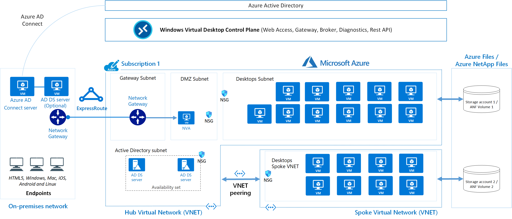

# Windows Virtual Desktop at enterprise scale

[Windows Virtual Desktop](https://azure.microsoft.com/services/virtual-desktop/) is a desktop and application virtualization service that runs on the cloud. This article helps Desktop Infrastructure Architects, Cloud Architects, Desktop Administrators, or System Administrators explore Windows Virtual Desktop and build virtual desktop infrastructure solutions at enterprise scale. Enterprise-scale solutions generally cover 1,000 virtual desktops and above.

## Relevant use cases

Most demand for enterprise virtual desktop solutions comes from:

- Security and regulation applications like financial services, healthcare, and government
- Elastic workforce needs like remote work, mergers and acquisition, short term employees, contractors, and partner access
- Specific employees like bring your own device (BYOD) and mobile users, call centers, and branch workers
- Specialized workloads like design and engineering, legacy apps, and software development test

## Architecture

## Components

[Windows Virtual Desktop](https://docs.microsoft.com/azure/virtual-desktop/overview) service architecture is similar to [Windows Server Remote Desktop Services](https://docs.microsoft.com/windows-server/remote/remote-desktop-services/welcome-to-rds). Microsoft manages the infrastructure and brokering components, while enterprise customers manage their own desktop host virtual machines (VMs), data, and clients.

### Components Microsoft manages

Microsoft manages the following Windows Virtual Desktop services as part of Azure:

- **Web Access.** The Web Access service within Window Virtual Desktop lets users access virtual desktops and remote apps through an HTML5-compatible web browser as they would with a local PC—from anywhere and any device. You can secure Web Access using multifactor authentication in Azure Active Directory. Connect with the web client https://docs.microsoft.com/en-us/azure/virtual-desktop/connect-web 
- **Gateway**. The Remote Connection Gateway service connects remote users to Windows Virtual Desktop apps and desktops from any internet-connected device that can run a Windows Virtual Desktop client. The client connects to a gateway, which then orchestrates a connection from a VM back to the same gateway.
- **Connection Broker**. The Connection Broker service manages user connections to virtual desktops and remote apps. The Connection Broker provides load balancing and reconnection to existing sessions.
- **Diagnostics**. Remote Desktop Diagnostics is an event-based aggregator that marks each user or administrator action on the Windows Virtual Desktop deployment as a success or failure. Administrators can query the event aggregation to identify failing components.
- **Extensibility components**. Windows Virtual Desktop includes several extensibility components. You can manage Windows Virtual Desktop using Windows PowerShell or with the provided REST APIs, which also enable support from third-party tools.

### Components you manage

Customers manage these components of Windows Virtual Desktop solutions:

- **Azure Virtual Network.** [Azure Virtual Network](https://azure.microsoft.com/services/virtual-network/) lets Azure resources like VMs communicate privately with each other and with the internet. By connecting Windows Virtual Desktop host pools to an Active Directory domain, you can define network topology to access virtual desktops and virtual apps from the intranet or internet, based on organizational policy. You can connect a Windows Virtual Desktop to an on-premises network using a virtual private network (VPN), or use [Azure ExpressRoute](https://azure.microsoft.com/services/expressroute/) to extend the on-premises network into the Azure cloud over a private connection.
- **Azure Active Directory**. Windows Virtual Desktop uses [Azure Active Directory (Azure AD)](https://azure.microsoft.com/services/active-directory/) for identity and access management. Azure AD integration uses Azure AD security features like conditional access, multi-factor authentication, and the [Intelligent Security Graph](https://www.microsoft.com/security/business/intelligence), and helps maintain app compatibility in domain-joined VMs.
- **Active Directory Domain Services (AD DS).** Windows Virtual Desktop VMs must domain-join an [Azure Active Directory Domain Services (AD DS)](https://azure.microsoft.com/services/active-directory-ds/) service, and the AD DS must be in sync with Azure Active Directory (Azure AD) to associate users between the two services.
- **Windows Virtual Desktop session hosts**. A host pool can run Windows 7 Enterprise, Windows 10 Enterprise, Windows 10 Enterprise Multi-session, Windows Server 2012 R2 and above, or custom Windows system images with pre-loaded apps, group policies, or other customizations. You can choose VM sizes, including GPU-enabled VMs. Each session host has a Windows Virtual Desktop host agent, which registers the VM as part of the Windows Virtual Desktop workspace or tenant. Each host pool can have one or more app groups, which are collections of remote applications or desktop sessions that users can access.
- **Windows Virtual Desktop workspace**. The Windows Virtual Desktop workspace or tenant is a management construct to manage and publish host pool resources.

### Personal and pooled desktops

Personal desktop solutions, sometimes called persistent desktops, allow users to always connect to the same specific session host. Users can typically modify their desktop experience to meet personal preferences, and save files in the desktop environment. Personal desktop solutions:

- Let users customize their desktop environment, including user-installed applications and saving files within the desktop environment.
- Allow assigning dedicated resources to a specific user, which can be helpful for some manufacturing or development use cases.

Pooled desktop solutions, also called non-persistent desktops, assign users to whichever session host is currently available, depending on the load-balancing algorithm. Because the users don't always return to the same session host each time they connect, they have limited ability to customize the desktop environment and aren't typically given administrator access.

### Windows servicing

There are several options for updating Windows Virtual Desktop desktops Deploying an updated image every month guarantees compliance and state.

- [*Microsoft Endpoint Configuration Manager (MECM)](https://docs.microsoft.com/mem/configmgr/) updates server and desktop operating systems.
- [Windows Updates for Business](https://docs.microsoft.com/windows/deployment/update/waas-manage-updates-wufb) updates desktop operating systems like Windows 10 multi-session.
- [Azure Update Management](https://docs.microsoft.com/azure/automation/automation-update-management) updates server operating systems.
- [Azure Log Analytics](https://docs.microsoft.com/azure/azure-monitor/platform/log-analytics-agent) checks compliance.
- **Deploy a new (custom) image** to session hosts every month for the latest Windows and applications updates. You can use an image from the Azure Marketplace or a [custom Azure managed image](https://docs.microsoft.com/azure/virtual-machines/windows/capture-image-resource).

## Issues and considerations

Numbers in this article are approximate, based on a variety of large customer deployments, and may change over time.

### Azure subscription limitations

The Windows Virtual Desktop service is scalable to more than 10,000 session hosts per workspace. You can address some Azure platform and Windows Virtual Desktop control plane limitations in the design phase to avoid changes in the scaling phase.

- There's a limit of 5,000 VMs per Azure subscriptions, but this limit applies to sessions only in personal host pools based on Windows 10 Enterprise single-session. Most customers use Windows 10 Enterprise multi-session, which allows more users to log on to each VM. You can increase the resources of individual session host VMs to accommodate more user sessions.
- For automated session host scaling tools, the limits are around 2,000 VMs per Azure subscription, because VM status interaction consumes more resources.
- To manage enterprise environments, you can create multiple Azure subscriptions in a hub-spoke architecture and connect them via virtual network peering, as in the preceding example architecture.
- Azure resource manager (ARM) subscription API throttling limits don't allow more than 600 Azure VM reboots per hour via the Azure portal. You can reboot all your machines at once via the operating system, which doesn't consume any Azure ARM subscription API calls. For more information about counting and troubleshooting throttling limits based on your Azure subscription, see [Troubleshoot API throttling errors](https://docs.microsoft.com/azure/virtual-machines/troubleshooting/troubleshooting-throttling-errors).
- You can currently deploy 399 VMs per Windows Virtual Desktop ARM template deployment without Availability Sets, or 200 VMs per Availability Set. You can increase the amount of VMs per deployment by switching off Availability Sets in either the ARM template or the Azure portal host pool enrollment.
- Azure VM session host name prefixes can't exceed 11 characters, due to auto-assigning of instance names and the NetBIOS limit of 15 characters per computer account.
- By default, you can deploy up to 800 instances of most resource types in a resource group. Azure Compute doesn't have this limit.

For more information about Azure subscription limitations, see [Azure subscription and service limits, quotas, and constraints](https://docs.microsoft.com/azure/azure-resource-manager/management/azure-subscription-service-limits).

### VM sizing

The following three articles lists the maximum suggested number of users per virtual central processing unit (vCPU) and the minimum VM configuration for different workloads. This helps estimate the VMs you need in your host pool.

- [Multi-session recommendations](https://docs.microsoft.com/windows-server/remote/remote-desktop-services/virtual-machine-recs?context=/azure/virtual-desktop/context/context#multi-session-recommendations)
- [Single-session recommendations](https://docs.microsoft.com/windows-server/remote/remote-desktop-services/virtual-machine-recs?context=/azure/virtual-desktop/context/context#single-session-recommendations)
- [General virtual machine recommendations](https://docs.microsoft.com/windows-server/remote/remote-desktop-services/virtual-machine-recs?context=/azure/virtual-desktop/context/context#general-virtual-machine-recommendations)

Use simulation tools to test deployments with both stress tests and real-life usage simulations. Make sure the system is responsive and resilient enough to meet user needs, and remember to vary the load sizes when testing.

### Pricing

Architect your Windows Virtual Desktop solution to realize cost savings. Here are five different options to help manage costs for enterprises:

- **Windows 10 multi-session**. By delivering a multi-session desktop experience for users that have identical compute requirements, you can let more users log onto a single VM at once, resulting in considerable cost savings.
- **Azure Hybrid Benefit**. If you have Software Assurance, you can use [Azure Hybrid Benefit for Windows Server](https://docs.microsoft.com/azure/virtual-machines/windows/hybrid-use-benefit-licensing) to save on the cost of your Azure infrastructure.
- [Azure Reserved Instances](https://azure.microsoft.com/pricing/reserved-vm-instances/) let you prepay for your VM usage and save money. Combine with the Azure Hybrid benefit for up to 80 percent savings over list prices.
- **Session host load-balancing**. When setting up session hosts, **Breadth-first** is the standard default mode, which spreads users randomly across session hosts. **Depth-first** mode fills up a  session host server with the maximum number of users before moving on to the next session host.

## Next steps

- [Windows Virtual Desktop partner integrations](https://aka.ms/wvdpartner) lists approved Windows Virtual Desktop partner providers and independent software vendors.
- Use the resources at [Windows_10_VDI_Optimize](https://github.com/TheVDIGuys/Windows_10_VDI_Optimize) to help optimize performance in a Windows 10 Enterprise Virtualized Desktop Infrastructure (VDI) environment.

