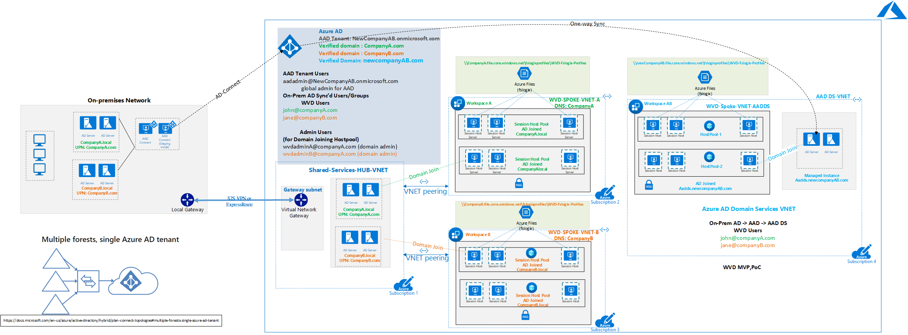
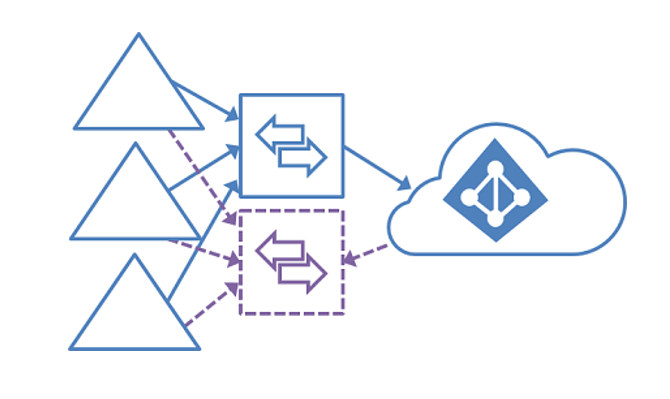

# Multiple AD Forests Architecture in Windows Virtual Desktop

Many organizations desire to leverage Windows Virtual Desktop (WVD) and have environments with multiple on-premises Active Directory forests. This article builds from the [WVD at enterprise scale Architecture](./windows-virtual-desktop.md) and helps Desktop Infrastructure Architects, Cloud Architects, Desktop Administrators, or System Administrators understand how multiple domains and WVD can be integrated based on some most common cases.

## Relevant use cases

- Mergers and acquisitions, organization re-branding and multiple on-premises identities requirements. 
- Complex Active Directory Domain Services (Multi-Forest, Multi-domains) (TBD).
- Hybrid and MVP/PoC scenarios (TBD).

## Architecture

<a href="images/WVD-two-forest-hybrid-with-VPN-to-Azure-AADDS-POC.vsdx" download>Click to Download Visio</a>

This architecture diagram shows a typical scenario that involves:

- Hybrid identity,
- Complex Active Directory Environments,
- Dependency on Legacy authentication such as Kerberos, NTLM, and LDAP, (TBD links to these)
- Domain Controllers on-premises, and
- Azure environments that still require On-premises infrastructure.

(TBD can we elaborate this architectural difference from the existing WVD article?) 

The WVD session host join domain controllers in Azure (TBD please elaborate what this means). This can design can be extended with AAD DS for POC/MVP environments. In that use case, WVD session hosts will join AAD DS domain controllers and private connectivity will not be needed.

## Components

(TBD)

## Data Flow

In the example scenario, the identity flow works as follows.

1. Two or more Active Directory Forest domains reside on-premises. For example, *companyA.local with UPN suffix companyA.com* and *companyB.local with UPN suffix CompanyB.com*. User John@companyA.com is a member of companyA.com and Jane@companyB.com is a member of companyB.com.
2. Domain controllers for both forests are located on-premises and Azure.
3. Azure AD tenant for the merged new company with the Azure AD tenant NewCompanyAB.onmicrosoft.com (TBD?)
4. Verified domains in Azure for CompanyA.com, CompanyB.com and CompanyAB.com.
5. Azure AD Connect syncs users from both CompanyA.com and CompanyB.com to Azure AD tenant (NewCompanyAB.onmicrosoft.com).
6. Session hosts join the domains CompanyA.com and CompanyB.com using the domain controllers in Azure.
7. Users can sign-in to WVD using their login the respective format user@NewCompanyA.com, user@CompanyB.com or user@NewCompanyAB.com depending on the UPN Suffix configured.

In case of extending the hybrid design to use AAD DS managed instance (common use case scenarios are POC/MVP or Domain consolidation in case of Mergers and Acquisitions ) sync all groups and users from AAD to AAD DS domain (example: aadds.newcompanyAB.com).  WVD Session Hosts join the AAD DS Domain Controllers.

## Considerations

### Azure Active Directory

In case of scenarios with users in multiple on-premises Active Directory forests, only one Azure AD Connect sync server connected to the same Azure AD Tenant is supported, except for an AD Connect in staging mode. 

Supported identity topologies:

- Multiple on-premises Active Directory forests.  
- One or more resource forest trusts all account forests.
- A full mesh topology allows users and resources to be in any forest. Commonly, there are two-way trusts between the forests.

For more details, read the [Staging server section of Azure AD Connect topologies](https://docs.microsoft.com/azure/active-directory/hybrid/plan-connect-topologies#staging-server).

## Network and Connectivity

(TBD: Can we elaborate this? Or link to another article?)

1. Landing Zone is Azure using Hub-spoke topology with shared services hub VNET for domain controllers.
1. For WVD deployments in a simple POC and Cloud born companies using AAD DS, no private connectivity (VPN or ExpressRoute) is needed. Azure AD Connect syncs the customer's AD DS with Azure AD using the internet.
1. From WVD deployments in hybrid implementations, use a virtual private connectivity using VPN or Azure ExpressRoute. WVD Sessions hosts will join the domain controller in Azure.

## Next steps

For more information, refer to these articles:

- [Azure AD Connect Topology](https://docs.microsoft.com/azure/active-directory/hybrid/plan-connect-topologies)
- [Compare different Identity options: Self-managed Active Directory Domain Services (AD DS), Azure Active Directory (Azure AD), and Azure Active Directory Domain Services (Azure AD DS)](https://docs.microsoft.com/azure/active-directory-domain-services/compare-identity-solutions)
- [Windows Virtual Desktop Documentation](https://docs.microsoft.com/azure/virtual-desktop/)
