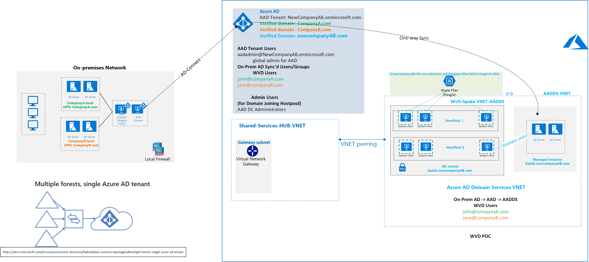
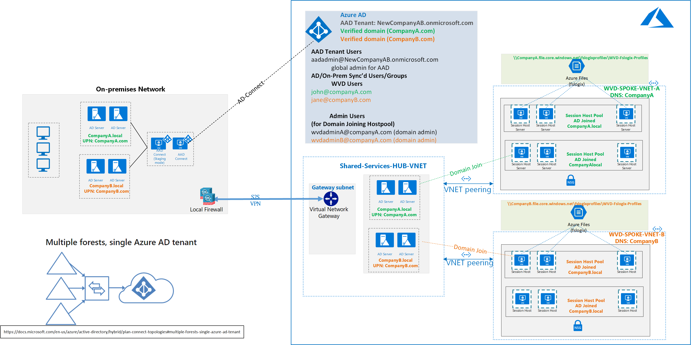

## WVD Multiple forest design with and without VPN

1) Two AD Forests, On-Prem AD Sync to Azure, AAD DS (Managed Instance) without VPN

<a href="images/WVD-two-forest-AADDS-without-VPN-to-Azure.vsdx" download>Click to Download the Visio</a>

2) Two AD Forests, On-Prem AD Sync to Azure, Hybrid Design with VPN

<a href="images/WVD-two-forest-hybrid-with-VPN-to-Azure.vsdx" download>Click to Download Visio</a>

3) Two AD Forests, On-Prem AD Sync to Azure, AAD DS (Managed Instance) with VPN

<a href="images/WVD-two-forest-hybrid-with-VPN-to-Azure-AADDS-POC.vsdx" download>Click to Download Visio</a>