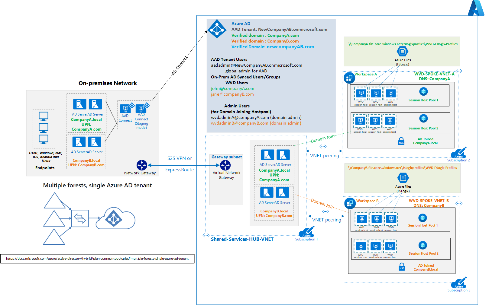

# Multiple AD forests architecture with Windows Virtual Desktop

Many organizations desire to leverage Windows Virtual Desktop (WVD) and create environments with multiple on-premises Active Directory forests. This article expands on the architecture described in the [WVD at enterprise scale article](./windows-virtual-desktop.md) and helps understand how multiple domains and WVD can be integrated using [Azure AD Connect](/azure/active-directory/hybrid/whatis-hybrid-identity) to sync users from on-premises [Active Directory Domain Services (AD DS)](/windows-server/identity/ad-ds/get-started/virtual-dc/active-directory-domain-services-overview) to [Azure Active Directory (Azure AD)](/azure/active-directory/fundamentals/active-directory-whatis).

The following are some relevant use cases for this architecture:

- Mergers and acquisitions, organization rebranding, and multiple on-premises identities.
- [Complex on-premises active directory environments (multi-forest, multi-domains, group policy (or GPO) requirements, and legacy authentication)](/azure/active-directory-domain-services/concepts-resource-forest).
- Use of on-premises GPO infrastructure with Azure WVD.

> [!NOTE]
  > Active Directory Domain Services (AD DS) is a self-managed, on-premises component in many hybrid environments, whereas Azure Active Directory Domain Services (Azure AD DS) provides managed domain services with a subset of fully-compatible traditional AD DS features such as domain join, group policy, *LDAP*, and *Kerberos*/*NTLM* authentication. Read a detailed comparison of these components in [Compare self-managed Active Directory Domain Services, Azure Active Directory, and managed Azure Active Directory Domain Services](/azure/active-directory-domain-services/compare-identity-solutions).  
  > The solution idea [Multiple WVD forests using Azure Active Directory Domain Services](./multi-forest-azure-managed.md) discusses this architecture using the cloud-managed [Azure AD DS](/azure/active-directory-domain-services/overview).

## Architecture

*Download a [Visio file][visio-download] of this architecture*

## Scenario

This architecture diagram shows a typical scenario that involves the following:

- Azure AD tenant is available for the new company named as `NewCompanyAB.onmicrosoft.com`.
- [Azure AD Connect](/azure/active-directory/hybrid/whatis-hybrid-identity) syncs users from on-premises AD DS to Azure Active Directory (Azure AD).
- Each of the company A and company B has a separate Azure subscription. They also have a [shared services subscription](/azure/cloud-adoption-framework/ready/azure-best-practices/initial-subscriptions#shared-services-subscription) referred to as the *Subscription 1* in the above diagram.
- [An Azure hub-spoke architecture](../../reference-architectures/hybrid-networking/hub-spoke.md) is implemented with a shared services hub virtual network (VNet).
- Complex hybrid on-premises Active Directory environments are present with two or more AD forests. Domains live in separate forests, each with a different [UPN suffix](/microsoft-365/enterprise/prepare-a-non-routable-domain-for-directory-synchronization?view=o365-worldwide#add-upn-suffixes-and-update-your-users-to-them). For example, *companyA.local* with the UPN suffix companyA.com, *companyB.local* with the UPN suffix CompanyB.com, and an additional UPN suffix *newcompanyAB.com*.
- Domain controllers for both forests are located on-premises and in Azure.
- Verified domains are present in Azure for CompanyA.com, CompanyB.com, and NewCompanyAB.com.
- Group Policy (GPO) and legacy authentication such as [Kerberos](/windows-server/security/kerberos/kerberos-authentication-overview), [NTLM](/windows-server/security/kerberos/ntlm-overview), and [LDAP](https://social.technet.microsoft.com/wiki/contents/articles/2980.ldap-over-ssl-ldaps-certificate.aspx) are used.
- Azure environments that still have dependency on-premises infrastructure, private connectivity ([Site-to-site VPN or Azure ExpressRoute](../../reference-architectures/hybrid-networking/index.md)) is set up between on-premises and Azure.
- The [WVD environment](/azure/virtual-desktop/environment-setup) consists of a WVD workspace for each business unit, and two host pools per workspace.
- The WVD session hosts are joined to domain controllers in Azure, that is, companyA session hosts join the companyA.local domain, and CompanyB session hosts join the CompanyB.local domain.
- Azure Storage accounts can leverage [Azure Files for FSLogix profiles](/azure/virtual-desktop/FSLogix-containers-azure-files). One account is created per company domain (that is, companyA.local and companyB.local), and joined to the corresponding domain.

## Components

This architecture uses the same [components](./windows-virtual-desktop.md#components-you-manage) as listed in [WVD at enterprise scale Architecture](./windows-virtual-desktop.md).

Additionally, the following components are also used in this architecture:

- **Azure AD connect in staging mode:** [Staging server for Azure AD Connect topologies](/azure/active-directory/hybrid/plan-connect-topologies#staging-server) provides additional redundancy for the Azure AD connect instance.

- **Azure subscriptions, WVD workspaces, and host pools:** Multiple subscriptions, WVD workspaces, and host pools can be leveraged for administration boundaries and business requirements.

## Data flow

In this architecture, the identity flow works as follows.

1. Azure AD Connect syncs users from both CompanyA.com and CompanyB.com to Azure AD tenant (NewCompanyAB.onmicrosoft.com).
2. Host pools, workspaces, and app groups are created in the respective subscriptions and spoke virtual networks.
3. Users are assigned to the app groups.
4. WVD session hosts in the host pools join the domains CompanyA.com and CompanyB.com using the domain controllers in Azure.  
5. Users sign in using either the [WVD Desktop](/azure/virtual-desktop/connect-windows-7-10#install-the-windows-desktop-client) or a [web client](/azure/virtual-desktop/connect-web) with the corresponding format: user@NewCompanyA.com, user@CompanyB.com, or user@NewCompanyAB.com, depending on the UPN suffix configured.
6. Users are presented with their respective virtual desktops or apps. For example, users in CompanyA will be presented with virtual desktops or apps in Workspace A, host pool 1 or 2.
7. FSLogix user profiles are created in Azure Files shares on the corresponding storage accounts.
8. Group Policy Objects (GPO) synced from on-premises are applied to users and WVD session hosts.

## Considerations

Keep in mind the following considerations while designing your workload based on this architecture.

### Group Policy Objects (GPO)

- To extend GPO infrastructure for WVD, the on-premises domain controllers should sync to the Azure IaaS domain controllers.
- Extending the GPO infrastructure to Azure IaaS domain controllers requires private connectivity.

### Network and connectivity

- The domain controllers are shared components, so they need to be deployed in a shared services hub VNet in this [hub-spoke architecture](../../reference-architectures/hybrid-networking/hub-spoke.md).
- WVD session hosts join the domain controller in Azure over their respective hub-spoke vNet peering.

### Azure Storage

The following design considerations apply to user profile containers, cloud cache containers, and [MSIX](/windows/msix/overview) packages:

- Both [Azure Files and NetApp files](/azure/virtual-desktop/store-FSLogix-profile#azure-platform-details) can be used in this scenario. Choose the right solution based on factors such as expected performance, cost, and so on.
- Both Azure Storage accounts and NetApp files present the same limitation of being able to join to one single AD DS at a time. In these cases, multiple Azure Storage accounts or NetApp instances will be required.

### Azure Active Directory

In scenarios with users in multiple on-premises Active Directory forests, only one Azure AD Connect sync server is connected to the Azure AD tenant. An exception to this is an AD Connect used in staging mode.

The following identity topologies are supported:

- Multiple on-premises Active Directory forests.  
- One or more resource forests trust all account forests.
- A full mesh topology allows users and resources to be in any forest. Commonly, there are two-way trusts between the forests.

For more details, read the [Staging server section of Azure AD Connect topologies](/azure/active-directory/hybrid/plan-connect-topologies#staging-server).

## Next steps

For more information, see these articles:

- [Azure AD Connect topology](/azure/active-directory/hybrid/plan-connect-topologies).
- [Windows Virtual Desktop for the enterprise article](./windows-virtual-desktop.md)
- [Compare different Identity options: Self-managed Active Directory Domain Services (AD DS), Azure Active Directory (Azure AD), and Azure Active Directory Domain Services (Azure AD DS)](/azure/active-directory-domain-services/compare-identity-solutions).
- [Solution idea Multi forest with Azure AD DS](./multi-forest-azure-managed.md).
- [Windows Virtual Desktop Documentation](/azure/virtual-desktop/).

<!-- links -->
[visio-download]: https://archcenter.blob.core.windows.net/cdn/WVD-two-forest-hybrid-Azure.vsdx