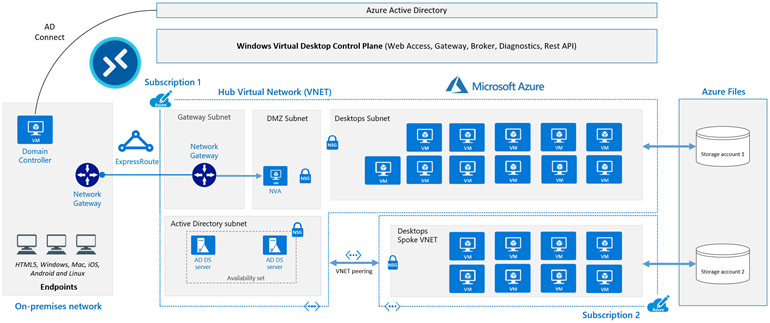
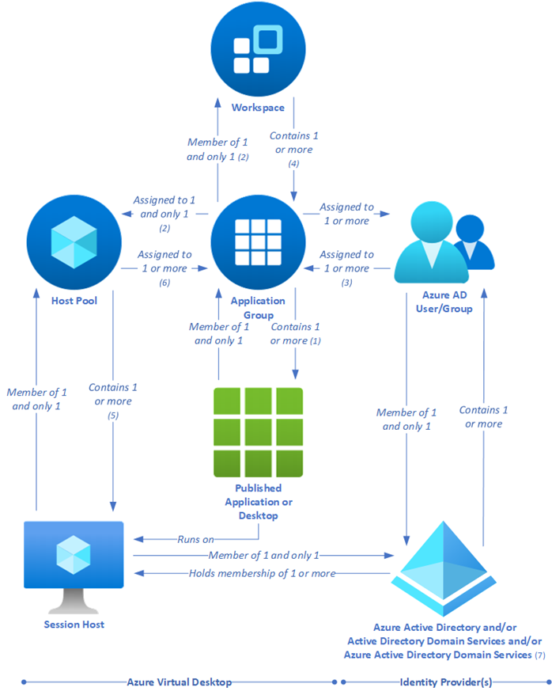

[Azure Virtual Desktop](https://azure.microsoft.com/services/virtual-desktop/) is a desktop and application virtualization service that runs in Azure. This article is intended to help desktop infrastructure architects, cloud architects, desktop administrators, and system administrators explore Azure Virtual Desktop and build virtualized desktop infrastructure (VDI) solutions at enterprise scale. Enterprise-scale solutions generally cover 1,000 or more virtual desktops.

## Architecture

A typical architectural setup for Azure Virtual Desktop is illustrated in the following diagram:

_Download a [Visio file](https://arch-center.azureedge.net/wvdatscale.vsdx) of this architecture._

### Dataflow

The diagram's dataflow elements are described here:

- The application endpoints are in a customer's on-premises network. Azure ExpressRoute extends the on-premises network into Azure, and Azure Active Directory (Azure AD) Connect integrates the customer's Active Directory Domain Services (AD DS) with Azure AD.

- The Azure Virtual Desktop control plane handles web access, gateway, broker, diagnostics, and extensibility components such as REST APIs.

- The customer manages AD DS and Azure AD, Azure subscriptions, virtual networks, [Azure Files or Azure NetApp Files](/azure/virtual-desktop/store-fslogix-profile), and the Azure Virtual Desktop host pools and workspaces.

- To increase capacity, the customer uses two Azure subscriptions in a hub-spoke architecture and connects them via virtual network peering.

For more information about FSLogix Profile Container - Azure Files and Azure NetApp Files best practices, see [FSLogix configuration examples](/fslogix/concepts-configuration-examples).

### Components

[Azure Virtual Desktop](/azure/virtual-desktop/overview) service architecture is similar to [Windows Server Remote Desktop Services](/windows-server/remote/remote-desktop-services/welcome-to-rds). Although Microsoft manages the infrastructure and brokering components, enterprise customers manage their own desktop host virtual machines (VMs), data, and clients.

#### Components that Microsoft manages

Microsoft manages the following Azure Virtual Desktop services, as part of Azure:

- **Web Access**: By using the [Web Access](/azure/virtual-desktop/connect-web) service within Azure Virtual Desktop you can access virtual desktops and remote apps through an HTML5-compatible web browser just as you would with a local PC, from anywhere and on any device. You can secure web access by using multifactor authentication in Azure Active Directory.

- **Gateway**: The Remote Connection Gateway service connects remote users to Azure Virtual Desktop apps and desktops from any internet-connected device that can run an Azure Virtual Desktop client. The client connects to a gateway, which then orchestrates a connection from a VM back to the same gateway.

- **Connection Broker**: The Connection Broker service manages user connections to virtual desktops and remote apps. Connection Broker provides load balancing and reconnection to existing sessions.

- **Diagnostics**: Remote Desktop Diagnostics is an event-based aggregator that marks each user or administrator action on the Azure Virtual Desktop deployment as a success or failure. Administrators can query the event aggregation to identify failing components.

- **Extensibility components**: Azure Virtual Desktop includes several extensibility components. You can manage Azure Virtual Desktop by using Windows PowerShell or with the provided REST APIs, which also enable support from third-party tools.

#### Components that you manage

You manage the following components of Azure Virtual Desktop solutions:

- **Azure Virtual Network**: With [Azure Virtual Network](https://azure.microsoft.com/services/virtual-network), Azure resources such as VMs can communicate privately with each other and with the internet. By connecting Azure Virtual Desktop host pools to an Active Directory domain, you can define network topology to access virtual desktops and virtual apps from the intranet or internet, based on organizational policy. You can connect an Azure Virtual Desktop instance to an on-premises network by using a virtual private network (VPN), or you can use [Azure ExpressRoute](https://azure.microsoft.com/services/expressroute) to extend the on-premises network into Azure over a private connection.

- **Azure AD**: Azure Virtual Desktop uses [Azure AD](https://azure.microsoft.com/services/active-directory) for identity and access management. Azure AD integration applies Azure AD security features, such as conditional access, multifactor authentication, and [Intelligent Security Graph](https://www.microsoft.com/security/business/intelligence), and it helps maintain app compatibility in domain-joined VMs.

- **Active Directory Domain Services (Optional)**: Azure Virtual Desktop VMs can either be domain joined to an [AD DS](https://azure.microsoft.com/services/active-directory-ds/) service or use [Azure AD join for AVD](/azure/architecture/example-scenario/wvd/azure-virtual-desktop-azure-active-directory-join) 
    - When using an AD DS domain, the domain must be in sync with Azure AD to associate users between the two services. You can use [Azure AD Connect](/azure/active-directory/hybrid/whatis-azure-ad-connect) to associate AD DS with Azure AD.
    - When using Azure AD join, review the [supported configurations](/azure/virtual-desktop/azure-ad-joined-session-hosts#supported-configurations) to ensure your scenario is supported.

- **Azure Virtual Desktop session hosts**: Session hosts are VMs that users connect to for their desktops and applications. Several versions of Windows are supported and you can create images with your applications and customizations. You can choose VM sizes, including GPU-enabled VMs. Each session host has an Azure Virtual Desktop host agent, which registers the VM as part of the Azure Virtual Desktop workspace or tenant. Each host pool can have one or more app groups, which are collections of remote applications or desktop sessions that you can access. To see which versions of Windows are supported, see [Operating systems and licenses](/azure/virtual-desktop/prerequisites#operating-systems-and-licenses).

- **Azure Virtual Desktop workspace**: The Azure Virtual Desktop workspace or tenant is a management construct for managing and publishing host pool resources.

## Scenario details

### Potential use cases

The greatest demand for enterprise virtual desktop solutions comes from:

- Security and regulation applications, such as financial services, healthcare, and government.

- Elastic workforce needs, such as remote work, mergers and acquisitions, short-term employees, contractors, and partner access.

- Specific employees, such as bring your own device (BYOD) and mobile users, call centers, and branch workers.

- Specialized workloads, such as design and engineering, legacy apps, and software development testing.

## Personal and pooled desktops

By using personal desktop solutions, sometimes called *persistent desktops*, users can always connect to the same specific session host. Users can ordinarily modify their desktop experience to meet personal preferences, and they can save files in the desktop environment. Personal desktop solutions:

- Let users customize their desktop environment, including user-installed applications, and users can save files within the desktop environment.
- Allow assigning dedicated resources to specific users, which can be helpful for some manufacturing or development use cases.

Pooled desktop solutions, also called *non-persistent desktops*, assign users to whichever session host is currently available, depending on the load-balancing algorithm. Because users don't always return to the same session host each time they connect, they have limited ability to customize the desktop environment and don't usually have administrator access.

## Windows servicing

There are several options for updating Azure Virtual Desktop instances. Deploying an updated image every month guarantees compliance and state.

- [Microsoft Endpoint Configuration Manager (MECM)](/mem/configmgr) updates server and desktop operating systems.
- [Windows Updates for Business](/windows/deployment/update/waas-manage-updates-wufb) updates desktop operating systems such as Windows 10 multi-session.
- [Azure Update Management](/azure/automation/update-management/overview) updates server operating systems.
- [Azure Log Analytics](/azure/azure-monitor/platform/log-analytics-agent) checks compliance.
- Deploy a new (custom) image to session hosts every month for the latest Windows and applications updates. You can use an image from Azure Marketplace or a [custom Azure-managed image](/azure/virtual-machines/windows/capture-image-resource).

## Relationships between key logical components

The relationships between host pools, workspaces, and other key logical components vary. They're summarized in the following diagram:

*The numbers in the following descriptions correspond to those in the preceding diagram.*

- *(1)* An application group that contains a published desktop can only contain MSIX packages mounted to the host pool (the packages will be available in the *Start* menu of the session host), it can't contain any other published resources and is called a desktop application group.
- *(2)* Application groups assigned to the same host pool must be members of the same workspace.
- *(3)* A user account can be assigned to an application group either directly or via an Azure AD group. It's possible to assign no users to an application group, but then it can't service any.
- *(4)* It's possible to have an empty workspace, but it can't service users.
- *(5)* It's possible to have an empty host pool, but it can't service users.
- *(6)* It's possible for a host pool not to have any application groups assigned to it but it can't service users.
- *(7)* Azure AD is required for Azure Virtual Desktop. This is because Azure AD user accounts and groups must always be used to assign users to Azure Virtual Desktop application groups. Azure AD is also used to authenticate users into the Azure Virtual Desktop service. Azure Virtual Desktop session hosts can also be members of an Azure AD domain, and in this situation the Azure Virtual Desktop-published applications and desktop sessions will also be launched and run (not just assigned) by using Azure AD accounts. 
    - *(7)* Alternatively, Azure Virtual Desktop session hosts can be members of an AD DS domain, and in this situation the Azure Virtual Desktop-published applications and desktop sessions will be launched and run (but not assigned) by using AD DS accounts. To reduce user and administrative overhead, AD DS can be synchronized with Azure AD through Azure AD Connect.
    - *(7)* Finally, Azure Virtual Desktop session hosts can, instead, be members of an Azure AD DS domain, and in this situation the Azure Virtual Desktop-published applications and desktop sessions will be launched and run (but not assigned) by using Azure AD DS accounts. Azure AD is automatically synchronized with Azure AD DS, one way, from Azure AD to Azure AD DS only.

| Resource | Purpose | Logical relationships |
|--- |--- |--- |
| Published desktop | A Windows desktop environment that runs on Azure Virtual Desktop session hosts and is delivered to users over the network | Member of one and only one application group *(1)* |
| Published application | A Windows application that runs on Azure Virtual Desktop session hosts and is delivered to users over the network | Member of one and only one application group |
| Application group | A logical grouping of published applications or a published desktop |  - Contains a published desktop *(1)* or one or more published applications  - Assigned to one and only one host pool *(2)*  - Member of one and only one workspace *(2)*  - One or more Azure AD user accounts or groups are assigned to it *(3)* |
| Azure AD user account/group | Identifies the users who are permitted to launch published desktops or applications | - Member of one and only one Azure Active Directory   - Assigned to one or more application groups *(3)* |
| Azure AD *(7)* | Identity provider | - Contains one or more user accounts or groups, which must be used to assign users to application groups, and can also be used to log in to the session hosts  - Can hold the memberships of the session hosts   - Can be synchronized with AD DS or Azure AD DS |
| AD DS *(7)* | Identity and directory services provider | - Contains one or more user accounts or groups, which can be used to log in to the session hosts   - Can hold the memberships of the session hosts  - Can be synchronized with Azure AD |
| Azure AD DS *(7)* | Platform as a service (PaaS)-based identity and directory services provider | - Contains one or more user accounts or groups, which can be used to log in to the session hosts  - Can hold the memberships of the session hosts  - Synchronized with Azure AD |
| Workspace | A logical grouping of application groups | Contains one or more application groups *(4)* |
| Host pool | A group of identical session hosts that serve a common purpose | - Contains one or more session hosts *(5)*  - One or more application groups are assigned to it *(6)* |  
| Session host | A virtual machine that hosts published desktops or applications | Member of one and only one host pool |

## Considerations

These considerations implement the pillars of the Azure Well-Architected Framework, which is a set of guiding tenets that can be used to improve the quality of a workload. For more information, see [Microsoft Azure Well-Architected Framework](/azure/architecture/framework).

The numbers in the following sections are approximate. They're based on a variety of large customer deployments and are subject to change over time.

Also, note that:

- You can't create more than 500 application groups per single Azure AD tenant\*.
- We recommend that you do *not* publish more than 50 applications per application group.

### Azure Virtual Desktop limitations

Azure Virtual Desktop, much like Azure, has certain service limitations that you need to be aware of. To avoid having to make changes in the scaling phase, it's a good idea to address some of these limitations during the design phase.

| Azure Virtual Desktop object | Per Parent container object | Service limit |
|--- |--- |---: |
| Workspace | Azure Active Directory tenant | 1300 |
| HostPool | Workspace | 400 |
| Application group | Azure Active Directory tenant | 500\* |
| RemoteApp | Application group | 500 |
| Role assignment | Any Azure Virtual Desktop object | 200 |
| Session host | HostPool | 10,000 |

\*If you require more than 500 application groups, submit a support ticket via the Azure portal.

- We recommend that you deploy no more than 5,000 VMs per Azure subscription per region. This recommendation applies to both personal and pooled host pools, based on Windows Enterprise single and multi-session. Most customers use Windows Enterprise multi-session, which allows multiple users to log in to each VM. You can increase the resources of individual session-host VMs to accommodate more user sessions.
- For automated session-host scaling tools, the limits are around 2,500 VMs per Azure subscription per region, because VM status interaction consumes more resources.
- To manage enterprise environments with more than 5,000 VMs per Azure subscription in the same region, you can create multiple Azure subscriptions in a hub-spoke architecture and connect them via virtual network peering, as in the preceding example architecture. You could also deploy VMs in a different region in the same subscription to increase the number of VMs.
- Azure Resource Manager (ARM) subscription API throttling limits don't allow more than 600 Azure VM reboots per hour via the Azure portal. You can reboot all your machines at once via the operating system, which doesn't consume any Azure Resource Manager subscription API calls. For more information about counting and troubleshooting throttling limits based on your Azure subscription, see [Troubleshoot API throttling errors](/azure/virtual-machines/troubleshooting/troubleshooting-throttling-errors).
- You can currently deploy 399 VMs per Azure Virtual Desktop ARM template deployment without [Availability Sets](/azure/virtual-machines/availability#availability-sets), or 200 VMs per Availability Set. You can increase the number of VMs per deployment by switching off Availability Sets in either the ARM template or the Azure portal host pool enrollment.
- Azure VM session-host name prefixes can't exceed 11 characters, due to auto-assigning of instance names and the NetBIOS limit of 15 characters per computer account.
- By default, you can deploy up to 800 instances of most resource types in a resource group. Azure Compute doesn't have this limit.

For more information about Azure subscription limitations, see [Azure subscription and service limits, quotas, and constraints](/azure/azure-resource-manager/management/azure-subscription-service-limits).

### VM sizing

[Virtual machine sizing guidelines](/windows-server/remote/remote-desktop-services/virtual-machine-recs) lists the maximum suggested number of users per virtual central processing unit (vCPU) and minimum VM configurations for different workloads. This data helps estimate the VMs you need in your host pool.

Use simulation tools to test deployments with both stress tests and real-life usage simulations. Make sure that the system is responsive and resilient enough to meet user needs, and remember to vary the load sizes when testing.

### Cost optimization

Cost optimization is about looking at ways to reduce unnecessary expenses and improve operational efficiencies. For more information, see [Overview of the cost optimization pillar](/azure/architecture/framework/cost/overview).

You can architect your Azure Virtual Desktop solution to realize cost savings. Here are five different options to help manage costs for enterprises:

- **Windows 10 multi-session**: By delivering a multi-session desktop experience for users with identical compute requirements, you can let more users log in to a single VM at once, an approach that can result in considerable cost savings.
- **Azure Hybrid Benefit**: If you have Software Assurance, you can use [Azure Hybrid Benefit for Windows Server](/azure/virtual-machines/windows/hybrid-use-benefit-licensing) to save on the cost of your Azure infrastructure.
- **Azure Reserved VM Instances**: You can prepay for your VM usage and save money. Combine [Azure Reserved VM Instances](https://azure.microsoft.com/pricing/reserved-vm-instances) with Azure Hybrid Benefit for up to 80 percent savings over list prices.
- **Session-host load-balancing**: When you're setting up session hosts, *breadth-first* mode, which spreads users randomly across the session hosts, is the standard default mode. Alternatively, you can use *depth-first* mode to fill up a session-host server with the maximum number of users before it moves on to the next session host. You can adjust this setting for maximum cost benefits.

## Deploy this scenario

Use the [ARM templates](https://github.com/Azure/RDS-Templates/tree/master/ARM-wvd-templates) to automate the deployment of your Azure Virtual Desktop environment. These ARM templates support only Azure Resource Manager's Azure Virtual Desktop objects. These ARM templates don't support Azure Virtual Desktop (classic).

## Contributors

*This article is maintained by Microsoft. It was originally written by the following contributors.*

Principal author:

 * [Tom Hickling](https://www.linkedin.com/in/tomhickling) | Senior Product Manager, Azure Virtual Desktop Engineering

 Other contributor:

  * [Nelson Del Villar](https://www.linkedin.com/in/nelsondelvillar/) | Senior Customer Engineer, Azure Core Infrastructure

## Next steps

- [Azure Virtual Desktop partner integrations](/azure/virtual-desktop/partners) lists approved Azure Virtual Desktop partner providers and independent software vendors.
- Use the [Virtual Desktop Optimization Tool](https://github.com/The-Virtual-Desktop-Team/Virtual-Desktop-Optimization-Tool) to help optimize performance in a Windows 10 Enterprise VDI (virtual desktop infrastructure) environment.
- See [Deploy Azure AD-joined virtual machines in Azure Virtual Desktop](/azure/virtual-desktop/deploy-azure-ad-joined-vm).
- Learn more about [Active Directory Domain Services](/windows-server/identity/ad-ds/active-directory-domain-services).
- [What is Azure AD Connect?](/azure/active-directory/hybrid/whatis-azure-ad-connect)

## Related resources

- For more information about multiple Active Directory forests architecture, see [Multiple Active Directory forests architecture in Azure Virtual Desktop](./multi-forest.yml).
