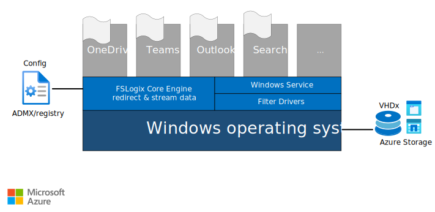

This article provides insights on designing, sizing, and implementing a Microsoft FSLogix Profile Container solution for large enterprises, as well as shows how to avoid performance problems in production. This article is an extension of the [Azure Virtual Desktop at enterprise scale](./windows-virtual-desktop.yml) article.

[FSLogix](/fslogix/) is a set of solutions that enhance, enable, and simplify non-persistent Windows computing environments. FSLogix solutions are appropriate for virtual environments in both public and private clouds. These solutions may also be used to create more portable computing sessions when using physical devices.

For combining FSLogix with Azure Virtual Desktop as a desktop virtualization solution on Azure, store your profiles on either [Azure Files](/azure/storage/files/storage-files-introduction) or [Azure NetApp Files](/azure/azure-netapp-files/azure-netapp-files-introduction) as described in [Storage options for FSLogix profile containers in Azure Virtual Desktop](/azure/virtual-desktop/store-fslogix-profile). This way you can utilize another Azure platform service that requires zero infrastructure, and simplify management of your storage environment.

## FSLogix filter driver architecture

It's common to copy a profile to and from the network, when a user signs in and out of a remote environment. Because user profiles can often be large, sign in and sign out times often became unacceptable. FSLogix Containers redirect user profiles to a network location. Profiles are placed in VHDx files and mounted at run time. Mounting and using a profile on the network eliminates delays often associated with solutions that copy files.



*Download a [Visio file](https://arch-center.azureedge.net/windows-virtual-desktop-fslogix.vsdx) of this architecture.*

The conceptual architecture diagram above shows how FSLogix works within the operating system:
* The Windows Service agent needs to be installed in the VDI image.
* Once the installation is completed, two filter drivers are injected into the operating system.
* You can then set the appropriate registry (or [ADMX](/microsoft-edge/deploy/managing-group-policy-admx-files)) entries, to place a VHDx container on a file system or [SMB](https://en.wikipedia.org/wiki/Server_Message_Block) share location (Azure Storage, as shown in the diagram above).

## Profile Container and Office Container

FSLogix [Profile Container](/fslogix/configure-profile-container-tutorial) and [Office Container](/fslogix/configure-office-container-tutorial) are the solutions provided by Microsoft to store *roaming* user profiles in Azure Virtual Desktop.

The Office Container is a subset of Profile Container. Although all of the benefits of the Office Container are also available in the Profile Container, there are times when it may be beneficial to use them together. It's important to completely understand the configuration process, especially when using them together.

Profile Container is used to redirect the full user profile. Profile Container is used in non-persistent, virtual environments, such as Virtual Desktops. When using Profile Container, the entire user profile is captured, except for data that is [excluded](/fslogix/manage-profile-content-cncpt).

There are several reasons why Profile Container and Office Container may be used together. For more information, read the comparison of [Profile Container vs. Office Container](/fslogix/profile-container-office-container-cncpt).

### Multiple profile connections

[Concurrent or multiple connections](/fslogix/configure-concurrent-multiple-connections-ht) refers to a user connected to multiple sessions, in either multiple hosts or the same host, concurrently using the same profile. This should not be confused with the term *multi-session*, which refers to an operating system that supports multiple users to connect simultaneously.

> [!NOTE]
> Concurrent or multiple connections are discouraged in Azure Virtual Desktop. The best practice is to create a different profile location for each session (as a host pool).

Be aware of the following limitations of a multiple connection deployment:

- [Microsoft OneDrive](https://www.microsoft.com/microsoft-365/onedrive/online-cloud-storage) does not support multiple connection environments using any profile-roaming technology.
- Using OneDrive with multiple profile connections may cause data loss.
- Microsoft Outlook has limited support for multiple connections.
- End users must be educated on what to expect. Using *read-only containers* result in a unique experience that a user, without proper context, may experience as data loss. Read [Concurrent Connections with Profile Container and Office Container](/fslogix/configure-concurrent-multiple-connections-ht#concurrent-connections-with-profile-container-and-office-container) for more information.

### Performance requirements

In terms of overall profile size, limitations or quotas for FSLogix depend on the storage type used for the user profile VHDx files, as well as the size limitations of the VHD/VHDx format.

Providing a good user experience requires sufficient network bandwidth to scale based on the number of users. This requirement will vary widely based on typical user activity, so you'll need to perform load testing to ensure you have enough bandwidth to support peak concurrent utilization. Latency is also a factor in user experience, as such locating storage as close to the session hosts as possible is recommended.

Additionally, the following table gives an example of how many resources an FSLogix profile needs to support each user. Requirements can vary widely depending on the user, applications, and activity on each profile, so your actual usage may vary significantly from what is listed here. The table uses an example of a single user. Use data points like these to estimate requirements for the total number of users in your environment. For example, you may need around 1,000 IOPS (input/output operations per second) for 100 users, and around 5,000 IOPS during sign-in and sign-out, if a large number of users login during a short period of time, creating a *login storm*.

|Resource              |Requirement|
|----------------------|-----------|
|Steady state IOPS     |10         |
|Sign-in/sign-out IOPS |50         |

### Storage options for FSLogix profile containers

Azure offers multiple storage solutions that you can use to store your FSLogix profile container. We recommend storing FSLogix profile containers on Azure Files or Azure NetApp Files for most customer scenarios. The article [Storage options for FSLogix profile containers in Azure Virtual Desktop](/azure/virtual-desktop/store-fslogix-profile) compares the different managed storage solutions Azure offers for Azure Virtual Desktop FSLogix user profile containers.

> [!NOTE]
> While the best practice is have the user profiles stored in Azure, you can also leverage any other storage solution you already have in place in your environment (for example **DFS Namespaces**), and that the sessions hosts can reach, to replicate the user profiles to those locations using **Cloud Cache** as explained below.

[Storage spaces direct (S2D)](/windows-server/remote/remote-desktop-services/rds-storage-spaces-direct-deployment) is supported with FSLogix and Azure Virtual Desktop as well. It's a self-managed storage solution that is out of scope for this article. Customers can get most value out of either Azure Files or Azure NetApp Files while simplifying management of Azure Virtual Desktop.

## Best practices

The following are general best practices for FSLogix profile containers.

- For optimal performance, the storage solution and the FSLogix profile container should be in the same data-center location.
- Exclude the VHD(X) files for profile containers from antivirus scanning, to avoid performance bottlenecks.
- We recommend using a separate profile container per host pool, while having two active sessions.
- [Using Cloud Cache](#using-cloud-cache), doesn't negate the diligence necessary in planning & testing connectivity requirements for bandwidth and latency to your storage solution.

### Azure Files best practices

The following list describes some important things to keep in mind when using Azure Files.

- Azure Files storage account name cannot be larger than 15 characters.
- Azure Files permissions should match permissions described in [Requirements - Profile Containers](/fslogix/fslogix-storage-config-ht).
- The storage account containing the master image must be in the same region and subscription as the virtual machines (VMs) being provisioned.
- Private link for Azure storage could be used to enable a more secure data access and to improve the network latency from your session hosts to your storage account. This is also beneficial in hybrid scenarios with ExpressRoute connectivity.
- You can pre-provision space to your Azure Files Premium share to accommodate more IOPs for your users proactively. This allows you to use more IOPs during the initial user-logins.
- Azure Files Premium tier has a built-in bursting mechanism that gives you thrice more IOPs for the first 60 minutes of a session.
- Azure Files sync can be used to replicate existing profile containers into Azure Files easily.
- With the FSLogix [ObjectSpecific](/fslogix/configure-per-user-per-group-ht) per-group setting, you can filter different Azure Files storage accounts to accommodate more users. The maximum limit of IOPs per storage account doesn't mean you cannot stack them. This applies to both personal and pooled host pool scenarios. The architecture diagram below explains in more detail.
- You're able to use multiple storage accounts in one Azure virtual network (VNet). For example, you can assign different network shares to specific groups of users in your environment using AD groups.

:::image type="content" border="false" source="./images/fslogix-files.svg" alt-text="Diagram showing Files scenario." lightbox="./images/fslogix-files.svg":::

*Download a [Visio file](https://arch-center.azureedge.net/windows-virtual-desktop-fslogix.vsdx) of this architecture.*

The table below shows you how you can further optimize your AVD environment. Detailed information of [Azure Files performance targets](/azure/storage/files/storage-files-scale-targets#file-share-and-file-scale-targets) (*Standard* and [Premium](/azure/storage/files/storage-files-planning#understanding-provisioning-for-premium-file-shares)) and [pricing](https://azure.microsoft.com/pricing/details/storage/files/) is available to help you fine-tune your file-share solution.

|Workload  |Examples                     |Recommended tier                |
|----------|-----------------------------|--------------------------------|
|Light     |Data entry                   |Less than 200 concurrent active users: Standard </br>More than 200 concurrent active users: Premium |
|Medium    |Casual users, LoB apps       |Premium file shares             |
|Heavy     |Software engineers, content creation|Premium file shares             |
|Power     |CAD, 3D, machine learning    |Premium file shares             |

### Azure NetApp Files best practices

Azure NetApp Files has been proven to be a great managed storage solution for FSLogix Profiles and Azure Virtual Desktop. The low latency and the high number of IOPs is a great mixture for enterprises at scale.

Create volumes with Standard network features [where available](/azure/azure-netapp-files/azure-netapp-files-network-topologies#supported-regions). Volumes with [Basic network features](/azure/azure-netapp-files/configure-network-features) allow up to 1000 IP connections per active VNet. These are the open connections per VM over the VNet to the share; that is, this limitation is applicable per VM and not per session. This also includes VNET Peerings. The following subsections can help you to proactively design your environment. Read [Benefits of using Azure NetApp Files with Azure Virtual Desktop](/azure/azure-netapp-files/solutions-windows-virtual-desktop) for more information.

#### Pooled scenarios

If the AVD Windows 10 Multi-session user per vCPU [recommendations](/windows-server/remote/remote-desktop-services/virtual-machine-recs) sizing for the D32as_v4 VM is calculated based on the light or medium workload, more than 120,000 users would fit within 1,000 virtual machines before approaching the 1,000 IP limit, as shown in the following figure.

:::image type="content" border="false" source="./images/fslogix-netapp-files-pooled.svg" alt-text="Diagram showing NetApp Files pooled scenario." lightbox="./images/fslogix-netapp-files-pooled.svg":::

*Download a [Visio file](https://arch-center.azureedge.net/windows-virtual-desktop-fslogix.vsdx) of this architecture.*

#### Personal scenarios

Users are mapped to specific desktop pods. Each pod has just under 1,000 virtual machines, leaving room for IP addresses propagating from the management VNet. Azure NetApp Files can easily handle 900+ personal desktops per single-session host pool. The actual number of virtual machines is equal to 1,000 minus the number of management hosts found in the Hub VNet.

:::image type="content" border="false" source="./images/fslogix-netapp-files-personal.svg" alt-text="Diagram showing NetApp Files personal scenario." lightbox="./images/fslogix-netapp-files-personal.svg":::

*Download a [Visio file](https://arch-center.azureedge.net/windows-virtual-desktop-fslogix.vsdx) of this architecture.*

## Storage permissions

The following NTFS permissions are recommended to use. For correct and secure use, user permissions must be created to allow permissions to create and use a profile, while not allowing access to other users' profiles. The Profile Container storage permissions can also be found in the article [Configure storage permissions for use with Profile Containers and Office Containers](/fslogix/fslogix-storage-config-ht).

|User Account   |Folder   |Permissions  |
|------|-----|-------|
|Users      |This Folder Only  |Modify  |
|Creator/Owner  |Subfolders and Files Only  |Modify   |
|Administrator (optional) |This Folder, Subfolders, and Files |Full Control |

## Storage exclusions

We recommend keeping native profile folder locations in the FSLogix profile container. However, it could be beneficial in some scenarios to exclude folders to be more efficient, for example, for temporary or caching data. The sections below describe the common FSLogix exclusions.

### Teams exclusions

Excluding [these items](/microsoftteams/teams-for-vdi#teams-cached-content-exclusion-list-for-non-persistent-setup) helps reduce the user caching size to further optimize your non-persistent setup. Exclude the following items from the Teams caching folder, %appdata%\Microsoft\Teams:

- Media-stack folder
- meeting-addin\Cache folder 

by using the following exclusions:

```xml
<Exclude Copy="0">AppData\Roaming\Microsoft\Teams\media-stack</Exclude>
<Exclude Copy="0">AppData\Roaming\Microsoft\Teams\meeting-addin\Cache</Exclude>
```

Check the [FSLogix exclusions](/fslogix/manage-profile-content-cncpt) documentation for more details on configuring the Teams-specific exclusions above within FSLogix Profile Container.

### Antivirus exclusions

Make sure to configure the following antivirus exclusions for FSLogix Profile Container virtual hard drives. Make sure to check the following information with your security team.

- Exclude files:

  - %ProgramFiles%\FSLogix\Apps\frxdrv.sys
  - %ProgramFiles%\FSLogix\Apps\frxdrvvt.sys
  - %ProgramFiles%\FSLogix\Apps\frxccd.sys
  - %TEMP%\\*.VHD
  - %TEMP%\\*.VHDX
  - %Windir%\TEMP\\*.VHD
  - %Windir%\TEMP\\*.VHDX
  - \\\storageaccount.file.core.windows.net\share\\*.VHD
  - \\\storageaccount.file.core.windows.net\share\\*.VHDX
  - %ProgramData%\FSLogix\Cache\\*.VHD (additional - only if you use Cloud Cache)
  - %ProgramData%\FSLogix\Cache\\*.VHDX (additional - only if you use Cloud Cache)
  - %ProgramData%\FSLogix\Proxy\\*.VHD (additional - only if you use Cloud Cache)
  - %ProgramData%\FSLogix\Proxy\\*.VHDX (additional - only if you use Cloud Cache)

- Exclude processes:

  - %ProgramFiles%\FSLogix\Apps\frxccd.exe
  - %ProgramFiles%\FSLogix\Apps\frxccds.exe
  - %ProgramFiles%\FSLogix\Apps\frxsvc.exe

#### Add exclusions for Microsoft Defender for Cloud by using PowerShell

You can use this PowerShell script to add the exclusions for Microsoft Defender for Cloud:

```powershell
  # Defender Exclusions for FSLogix
  $Cloudcache = $false             # Set for true if using cloud cache
  $StorageAcct = "storageacct"     # Storage Account Name
  $ShareName = "share"             # Storage Account's file share name

  $filelist = `
  "%ProgramFiles%\FSLogix\Apps\frxdrv.sys", `
  "%ProgramFiles%\FSLogix\Apps\frxdrvvt.sys", `
  "%ProgramFiles%\FSLogix\Apps\frxccd.sys", `
  "%TEMP%\*.VHD", `
  "%TEMP%\*.VHDX", `
  "%Windir%\TEMP\*.VHD", `
  "%Windir%\TEMP\*.VHDX", `
  "\\$Storageacct.file.core.windows.net\$ShareName\*.VHD", `
  "\\$Storageacct.file.core.windows.net\$ShareName\*.VHDX"

  $processlist = `
  "%ProgramFiles%\FSLogix\Apps\frxccd.exe", `
  "%ProgramFiles%\FSLogix\Apps\frxccds.exe", `
  "%ProgramFiles%\FSLogix\Apps\frxsvc.exe"

  Foreach($item in $filelist){
      Add-MpPreference -ExclusionPath $item}
  Foreach($item in $processlist){
      Add-MpPreference -ExclusionProcess $item}

  If ($Cloudcache){
      Add-MpPreference -ExclusionPath "%ProgramData%\FSLogix\Cache\*.VHD"
      Add-MpPreference -ExclusionPath "%ProgramData%\FSLogix\Cache\*.VHDX"
      Add-MpPreference -ExclusionPath "%ProgramData%\FSLogix\Proxy\*.VHD"
      Add-MpPreference -ExclusionPath "%ProgramData%\FSLogix\Proxy\*.VHDX"}
```

## Using Cloud Cache

[Cloud Cache](/fslogix/configure-cloud-cache-tutorial) is an add-on to FSLogix. It uses a local cache to service all reads from a redirected Profile or Office Container, after the first read. Cloud Cache also allows the use of multiple remote locations, which are all continuously updated during the user session, creating true real-time profile replication. Using Cloud Cache can insulate users from short-term loss of connectivity to remote profile containers as the local cache is able to service many profile operations. In there was a provider failure, Cloud Cache provides business continuity.

Because the local cache file will service most IO requests, the performance of the local cache file will determine the user experience. It's critical that the storage used for this file is high-performing and highly available. Any storage used for the local cache file should either be a physically attached storage, or have reliability and performance characteristics that meet or exceed a high-performing physically attached storage.

Cloud Cache is only one of many options that may be considered for business continuity when using profile containers. Cloud Cache provides real-time duplication of the user profile that will actively fail over if connectivity to a Cloud Cache provider is lost.

There are a number of considerations when implementing Cloud Cache. It should:

- provide real-time profile high availability,
- insulate users from short-term connectivity issues to remote Cloud Cache providers by servicing read/writes from local cache, and
- enable the use of Azure Page Blob storage via REST API.
- It can be an effective profile tool when configuring multi-geo environments, and
- requires high-performing and highly available host-attached (or equivalent) storage to support local cache,
- It's executed on the host, utilizing processor, memory, network, and storage resources.
- When used as a solution for high availability, Cloud Cache requires multiple, full copies of the user profile, in addition to the local cache file.

Because of the resource utilization, it may be more cost effective to consider alternate backup/disaster recovery solutions for FSLogix profile containers. Cloud Cache is generally used when one of its features provides unique value, such as real-time profile high availability. If an environment can be adequately serviced with an alternate form of backup, it's often more economical than Cloud Cache.

## Business continuity and disaster recovery (BCDR)

In an enterprise architecture, it's common to make user profiles resilient. To configure an FSLogix profile solution to be as efficient as possible, the amount of data being moved around should be reduced to the bare minimum:

- The first step to create an efficient FSLogix profile solution is the use of [OneDrive folder backup](/onedrive/redirect-known-folders) to put document-based profile folders into OneDrive. This means you can take advantage of built-in OneDrive features to protect the users' documents.

- In order to reduce the amount of data needing to be independently replicated, archived, and restored, you should also split out the Office cache data into the Microsoft 365 disk. This is because the cache data often comprises the vast majority of the profile data capacity that is used. Because the Microsoft 365 disk only contains cache data (the source for which is safely stored in the cloud), you do not need to make this data resilient. Once the documents and cache are separated from the Profile disk, you should then enact your replication archive and restore policies on this much smaller capacity disk.

- Azure Files offers the replication option of a storage account fail-over against the other region configured in your storage account redundancy plan. This is only supported for the standard storage account type using Geo-Redundant Storage (GRS). Other options to use are AzCopy or any other file copy mechanism such as *RoboCopy*.

- Azure NetApp Files offers cross-region replication. With this feature, you're able to replicate your FSLogix file share to another region over the Azure backbone.

## Backup and restore

Making regular backups of your Windows profiles could be beneficial in different situations. Scenarios where a user accidentally removes data and wants to restore, or profile and/or data corruption due to malware infections, could be an indicator to have your data safely stored on Azure.

Azure Files Premium tier integrates with Azure Backup and is supported in conjunction with FSLogix. Azure NetApp Files offers a similar snapshot mechanism to make copies of your FSLogix profile containers.

## Maintenance

As explained earlier in this article, FSLogix Profile Container works with virtual disks. The virtual hard disks are in the VHD or VHDx file format; both are supported with this tool. By default, the disks created will be in a *Dynamically Expanding* format rather than *Fixed* format. This could result in situations where the size of the disk is higher than the actual files inside the virtual disk. So it's common to do maintenance after shrinking the virtual hard disks on a schedule, for example, on a monthly basis. This can be possible with a script that can decrease the amount of your profiles. This script can be designed to work at an enterprise scale, to reduce the size of thousands of disks in the shortest time possible. It can be run from any machine in your environment. It does not need to be run from a file server hosting the disks. It does not need the Hyper-V role installed.

This tool is multi-threaded and will take advantage of multiple CPU cores on the machine from which you run the script. It's not advised running more than twice the number of threads of the available cores on your machine. You could also use the number of threads to throttle the load on your storage.

Download the tool [here](https://github.com/FSLogix/Invoke-FslShrinkDisk).

> [!NOTE]
> This script is not supported by the Microsoft product group. It's community driven. This script does not support reducing the size of a Fixed file format.

## Best practice settings for enterprises

The following settings are commonly used by our customers in their desktop virtualization environments, on top of the default settings such as Enabled and VHDLocations.

|Setting    |Value    |Reason    |
|-----------|---------|----------|
|DeleteLocalProfileWhenVHDShouldApply |1    |This setting avoids errors while logging in with an existing local profile. It removes the profile first, if any already exists.    |
|SizeInMBs    |30000    |Specifies the size of newly created VHD(X) in number of MB. Default value is 30000 MB or 30 GB.   |
|VolumeType   |VHDx    |More capabilities for PowerShell and maintenance.    |
|FlipFlopProfileDirectoryName |1    |Makes it easier to search for the specific profile container user folder on the network share.    |

To manage these registry settings at scale, group policy templates are included with the FSlogix installation package.  Guidance for using these templates can be found in the article [Use FSLogix Group Policy Templates](/fslogix/use-group-policy-templates-ht).

Note: 'FlipFlopProfileDirectoryName' is managed by the 'swap directory name components' setting if using the GPO template.

## Contributors

*This article is maintained by Microsoft. It was originally written by the following contributors.*

Principal author:

 * [Christiaan Brinkhoff](https://www.linkedin.com/in/christiaanbrinkhoff) | Principal PM and Community Lead, Windows 365

Other contributors:

  * [Sven Aelterman](https://www.linkedin.com/in/svenaelterman) | Senior Cloud Solution Architect, Education

  * [Nelson Del Villar](https://www.linkedin.com/in/nelsondelvillar/) | Senior Customer Engineer, Azure Core Infrastructure

## Next steps

Read the following articles for more information:

- [Azure Virtual Desktop documentation](/azure/virtual-desktop/overview)
- [FSLogix documentation](/fslogix/overview)
- [Storage options for FSLogix profile containers in Azure Virtual Desktop](/azure/virtual-desktop/store-fslogix-profile)
- [FSLogix profile containers and Azure Files](/azure/virtual-desktop/fslogix-containers-azure-files)
- [Azure Virtual Desktop for the enterprise](./windows-virtual-desktop.yml)

## Related resources

- [Multiregion Business Continuity and Disaster Recovery (BCDR) for Azure Virtual Desktop](/azure/architecture/example-scenario/wvd/azure-virtual-desktop-multi-region-bcdr)
- [Multiple forests with AD DS and Azure AD](/azure/architecture/example-scenario/wvd/multi-forest)
- [Deploy Esri ArcGIS Pro in Azure Virtual Desktop](/azure/architecture/example-scenario/data/esri-arcgis-azure-virtual-desktop)
- [Multiple forests with AD DS, Azure AD, and Azure AD DS](/azure/architecture/example-scenario/wvd/multi-forest-azure-managed)
- [Azure Virtual Desktop for the enterprise](/azure/architecture/example-scenario/wvd/windows-virtual-desktop)
