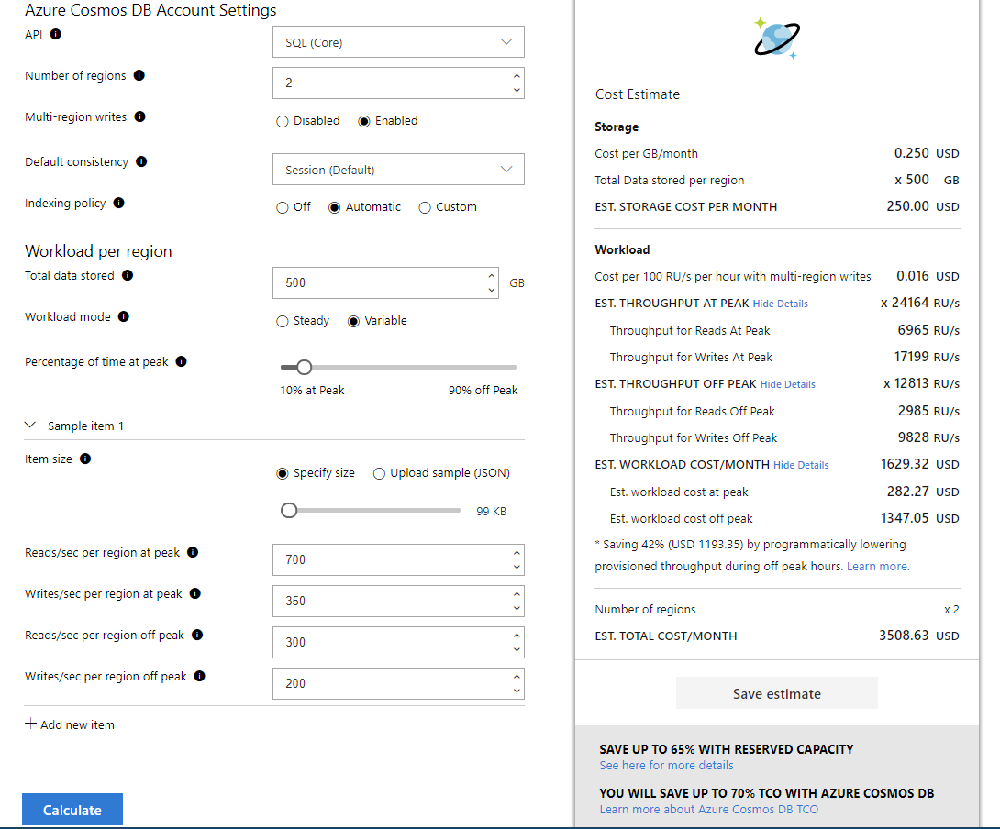
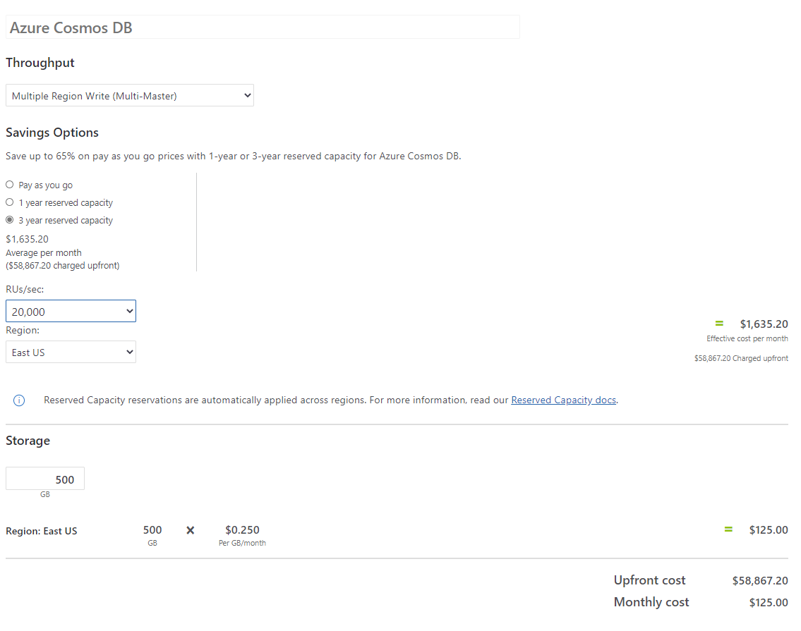

# Estimate the initial cost

It's difficult to attribute costs before deploying a workload to the cloud. If you use methods for on-premises estimation or directly map on-premises assets to cloud resources, estimate will be inaccurate. For example, if you build your own datacenter your costs may appear comparable to cloud. Most on-premises estimates don't account for costs like cooling, electricity, IT and facilities labor, security, and disaster recovery.

Here are some best practices:

- Use proof-of-concept deployments to help refine cost estimates.
- Choose the right resources that can handle the performance of the workload. For example, cheaper virtual machines may initially indicate a lower cost but can be more expensive eventually to maintain a certain performance level.
- Accurately reflect the cost associated with right storage type.
- Add hidden costs, such as networking cost for large data download.

## Migration workloads

Quantify the cost of running your business in Azure by calculating Total Cost Ownership (TCO) and the Return on Investment (ROI). Compare those metrics to existing on-premises equivalents.

It's difficult to attribute costs before migrating to the cloud.

Using on-premises calculation may not accurately reflect the cost of cloud resources. Here are some challenges:
- On-premises TCO may not accurately account for hidden expenses. These expenses include under-utilization of purchased hardware or network maintenance costs including labor and equipment failure.
- Cloud TCO may not accurately account for a drop in the organization's operational labor hours. Cloud provider's infrastructure, platform management services, and additional operational efficiencies are included in the cloud service pricing. Especially true at a smaller scale, the cloud provider's services don't result in reduction of IT labor head count.
- ROI may not accurately account for new organizational benefits because of cloud capabilities. It's hard to quantify improved collaboration, reduced time to service customers, and fast scaling with minimal or no downtime.
- ROI may not accurately account for business process re-engineering needed to fully adopt cloud benefits. In some cases, this re-engineering may not occur at all, leaving an organization in a state where new technology is used inefficiently.

Azure provides these tools to determine cost.
- [Microsoft Azure Total Cost of Ownership (TCO) Calculator](https://azure.microsoft.com/pricing/tco/calculator/) to reflect all costs.
    > For migration projects, the TCO Calculator may assist, as it pre-populates some common cost but allows you to modify the cost assumptions.
- [Azure pricing calculator](https://azure.microsoft.com/pricing/calculator) to assess cost of the services you plan to use in your solution.
- [Azure Migrate](/azure/migrate/migrate-services-overview) to evaluate your organization's current workloads in on-premises datacenters. It suggests Azure replacement solution, such virtual machine sizes based on your workload. It also provides a cost estimate.

## Example estimate for a microservices workload

Let's consider this [scenario](../../microservices/design/index.md#scenario) as an example. We'll use the [Azure Pricing calculator](https://azure.microsoft.com/pricing/calculator/) to estimate the initial cost before the workload is deployed. The cost is calculated per month or for 730 hours.

In this example, we've chosen the microservices pattern. As the container orchestrator, one of the options could be [Azure Kubernetes Service](/azure/aks/) (AKS) that manages a cluster of pods. We choose NGINX ingress controller because it's well-known controller for such workloads.

> The example is based on the current price and is subject to change. The calculation shown is for information purposes only.

### Compute

For AKS, there's no charge for cluster management.

For AKS agent nodes, there are many instance sizes and SKUs options. Our example workload is expected to follow a long running pattern and we can commit to three years. So, an instance that is eligible for [reserved instances](/azure/cost-management-billing/manage/understand-vm-reservation-charges#services-that-get-vm-reservation-discounts) would be a good choice. We can lower the cost by choosing the **3-year reserved plan**.

The workload needs two virtual machines. One is for the backend services and the other for the utility services.

The B12MS instance with 2 virtual machines is sufficient for this initial estimation. We can lower cost by choosing reserved instances.

**Estimated Total: $327.17 per month with upfront payment of $11,778.17**.

### Application gateway
For this scenario, we consider the **Standard_v2 Tier** of Azure Application Gateway because of the autoscaling capabilities and performance benefits. We also choose consumption-based pricing, which is calculated by capacity units (CU). Each capacity unit is calculated based on compute, persistent connections, or throughput. For Standard_v2 SKU - Each compute unit can handle approximately 50 connections per second with RSA 2048-bit key TLS certificate. For this workload, we estimate 10 capacity units.

**Estimated Total: $248.64 per month.**

### Load balancer

NGINX ingress controller deploys a load balancer that routes internet traffic to the ingress. Approximately 15 load balancer rules are needed. NAT rules are free. The main cost driver is the amount of data processed inbound and outbound independent of rules. We estimate traffic of 1 TB (inbound and outbound).

**Estimated Total: $96.37 per month.**

### Bandwidth

We estimate 2-TB outbound traffic. The first 5 GB/month are free in Zone 1 (Zone 1 includes North America, Europe, and Australia). Between 5 GB - 10 TB /month is charged $0.087 per GB.

**Estimated Total: $177.74 per month**

### External data source
Because the schema-on read nature of the data handled by the workload, we choose Azure Cosmos DB as the external data store. By using the [Cosmos DB capacity calculator](https://cosmos.azure.com/capacitycalculator/), we can calculate the throughput to reserve.

#### Cost variables
- For lower latency, in this scenario we enable geo-replication by using the **Multi-regions writes** feature. By default Cosmos DB uses one region for writes and the rest for reads.

- Default choices in consistency model of **Session** and indexing policy to **Automatic**.  Automatic indexing makes Cosmos DB to index all properties in all items for flexible and efficient queries. Custom indexing policy allows you to include/exclude properties from the index for lower write RU and storage size. So uploading a custom indexing policy can make you reduce costs.

- Total data store isn't a significant cost driver, here it's set to 500 GB.

- The throughput is variable indicating peaks. The percentage of time at peak is set to 10%.

- The item size is an average of 90k. By using the capacity calculator you can upload sample json files with your document's data structure, the average document's size, the number of reads/writes per second. These variables have the largest impact on cost because they're used to calculate the throughput. The throughput values are shown in the image.

Now, we use those values in the [Azure Pricing calculator](https://azure.microsoft.com/pricing/calculator/).

The average throughput based on these settings is 20,000 RUs/sec which is the minimum throughput required for a **3-year reserved capacity** plan.

Here is the total cost for three years using the reserved plan:

$1,635.20 Average per month ($58,867.20 charged upfront)

You save $700.00 by choosing the 3-year reserved capacity over the pay-as-you-go price.

### CI/CD pipelines
With Azure DevOps, **Basic Plan** is included for Visual Studio Enterprise, Professional, Test Professional, and MSDN Platforms subscribers. And no charge for adding or editing work items and bugs, viewing dashboards, backlogs, and Kanban boards for stakeholders.

Basic plan license for five users is free.

#### Additional services
For Microsoft Hosted Pipelines, the **Free** tier includes one parallel CI/CD job with 1,800 minutes (30 hours) per month. However you can select the **Paid** tier and have one CI/CD parallel job ($40.00), in this tier, each parallel CI/CD job includes unlimited minutes.

> For this stage of cost estimation, the Self Hosted Pipelines is not required because the workload doesn't have custom software that runs in your build process which isn't included in the Microsoft-hosted option.

Azure Artifacts is a service where you can create package feeds to publish and consume Maven, npm, NuGet, Python, and universal packages. Azure Artifacts is billed on a consumption basis, and is free up until 2 GB of storage. For this scenario, we estimate 56 GB in artifacts ($56.00)

Azure DevOps offers a cloud-based solution for load testing your apps. Load tests are measured and billed in virtual user minutes (VUMs). For this scenario, we estimate a 200,000 VUMs ($72.00).

**Estimated Total: $168.00 per month**
