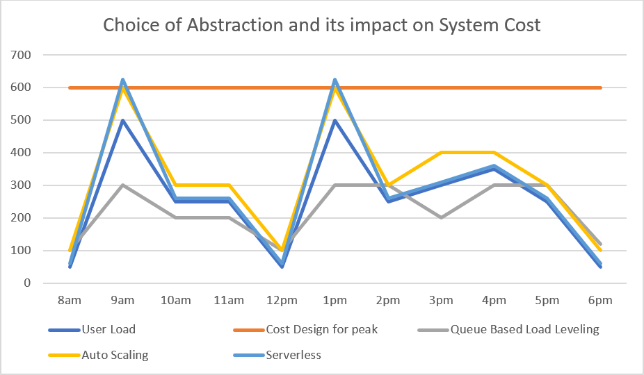

# Consumption and fixed cost models

The common pricing options for Azure services are:

- Consumption-based price - You are charged for only what you use. This model is also known as the Pay-As-You-Go rate.
- Fixed price - You provision resources and are charged for those instances whether or not they are used.

A common way to estimate cost is by considering workloads on a peak throughput. Under consistently high utilization, consumption-based pricing can be less efficient for estimating baseline costs when compared to the equivalent provisioned pricing. PaaS and serverless technologies can help you understand the economy cutoff point for consumption-based pricing.

Observe the difference between cost models based on fixed, static provisioning of services, more variable costs based on autoscaling of serverless technologies.

Start with a fixed minimum level of performance and then use architectural patterns (such as [Queue Based Load Leveling](../../patterns/queue-based-load-leveling.md)) and autoscaling of services. With this approach the peaks can be smoothed out into a more consistent flow of compute and data. This approach should temporarily extend your burst performance when the service is under sustained load. If cost is an important factor but you need to maintain service availability under burst workload use the [Throttling pattern](../../patterns/throttling.md) to maintain quality of service under load.

Compare and contrast the options and understand how to provision workloads that can potentially switch between the two models. The model will be a tradeoff between scalability and predictability. Ideally in the architecture, blend the two aspects. 
