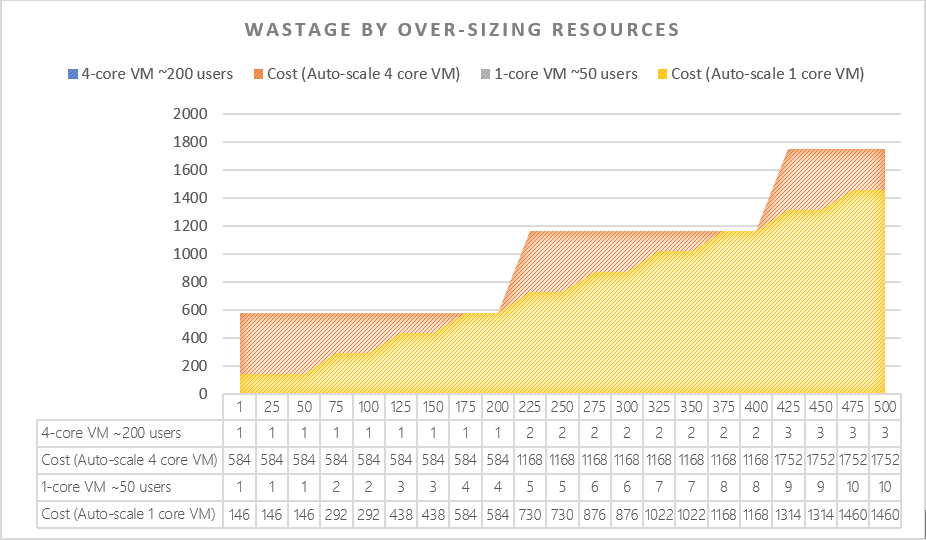

# Autoscale instances

In Azure, it's easier to grow a service with little to no downtime against downscaling a service, which usually requires deprovisioning or downtime. In general, opt for scale-out instead of scale up.

For certain application, capacity requirements may swing over time. Autoscaling policies allow for less error-prone operations and cost savings through robust automation.

## Virtual machine instances

For auto scaling, consider the choice of instance size. The size can significantly change the cost of your workload.
>  Choose smaller instances where workload is highly variable and scale out to get the desired level of performance, rather than up. This choice will enable you to make your cost calculations and estimates granular.

## Stateless applications
Many Azure services can be used to improve the application's ability to scale dynamically. Even where they may not have been originally designed to do so.

For example, many ASP.NET stateful web applications can be made stateless. Then they can be auto scaled, which results in cost benefit. You store state using [Azure Redis Cache](/azure/azure-cache-for-redis/cache-aspnet-session-state-provider), or Cosmos DB as a back-end session state store through a [Session State Provider](https://github.com/aspnet/AspNetSessionState).
