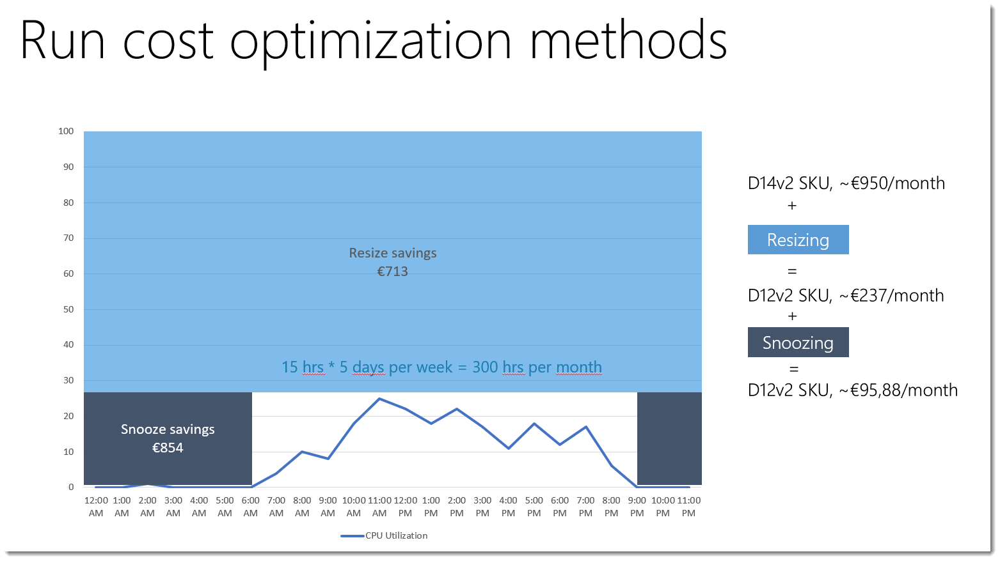

# Virtual machines

Virtual machines can be deployed in fix-sized blocks. These VMs must be adequately sized to meet capacity demand and reduce waste.

For example, look at a VM running the SAP on Azure project can show you how initially the VM was sized based on the size of existing hardware server (with cost around €1 K per month), but the real utilization of VM was not more than 25% - but simple choosing the right VM size in the cloud we can achieve 75% saving (resize saving). And by applying the snoozing you can get additional 14% of economy:

It is easy to handle cost comparison when you are well equipped and for this Microsoft provides the set of specific services and tools that help you to understand and plan costs. These include the TCO Calculator, Azure Pricing Calculator, Azure Cost Management (Cloudyn), Azure Migrate, Cosmos DB Sizing Calculator, and the Azure Site Recovery Deployment Planner.

Here are some strategies that you can use to lower cost for virtual machines.

## Resize virtual machines 
You can lower cost by managing the size and the number of VMs.
>  Determine the load by analyzing the CPU utilization to make sure that the instance is adequately utilized.

Ideally, with the right size, the current load should fit in a lower SKU of the same tier. Another way is to lower the number instances and still keep the load below a reasonable utilization. [Azure Advisor](https://portal.azure.com/#blade/Microsoft_Azure_Reservations/CreateBlade/referrer/docs)  recommends load less than 80% utilization for non-user facing workloads and 40% when user-facing workload. It also provides current and target SKU information.

You can identify underutilized machines by adjusting the CPU utilization rule on each subscription.

Resizing a virtual machine does require the machine to be shut down and restarted. There might be a period of time when it will be unavailable. Make sure you carefully time this action for minimal business impact.

## Shut down the under utilized instances
Use the **Start/stop VMs during off-hours** feature of virtual machines to minimize waste. There are many configuration options to schedule start the stop times. The feature is suitable as a low-cost automation option. For information, see [Start/stop VMs during off-hours solution in Azure Automation](/azure/automation/automation-solution-vm-management).

[Azure Advisor](https://portal.azure.com/#blade/Microsoft_Azure_Reservations/CreateBlade/referrer/docs) evaluates virtual machines based on CPU and network utilization over a time period. Then, the recommended actions are shut down or resize instances and cost saving with both actions.

## Spot VMs
Some workloads don't have a business requirement to complete a job within a period.

**Can the workload be interrupted?**
***
Spot VMs are ideal for workloads that can be interrupted, such as highly parallel batch processing jobs. These VMs take advantage of the surplus capacity in Azure at a lower cost. They're also well suited for experimental, development, and testing of large-scale solutions.

For more information, see [Use Spot VMs in Azure](/azure/virtual-machines/windows/spot-vms).

## Reserved VMs
Virtual machines are eligible for Azure Reservations. You can prepay for VM instances if you can commit to one or three years. Reserved instances are appropriate for workloads that have a long-term usage pattern.

The discount only applies to compute and not the other meters used to measure usage for VMs. The discount can be extended to other services that emit VM usage, such as Virtual machine scale sets and Container services, to name a few. For more information, see [Software costs not included with Azure Reserved VM Instances](/azure/cost-management-billing/reservations/reserved-instance-windows-software-costs) and [Services that get VM reservation discounts](/azure/virtual-machines/windows/prepay-reserved-vm-instances#services-that-get-vm-reservation-discounts).

With reserved instances, you need to determine the VM size to buy. Analyze usage data using **Reservations Consumption APIs** and follow the recommendations of [Azure portal](https://portal.azure.com/#blade/Microsoft_Azure_Reservations/CreateBlade/referrer/docs) and [Azure Advisor](https://portal.azure.com/#blade/Microsoft_Azure_Reservations/CreateBlade/referrer/docs) to determine the size.

Reservations also apply to dedicated hosts. The discount is applied to all running hosts that match the reservation scope and attributes. An important consideration is the SKU for the host. When selecting a SKU, choose the VM series and type eligible to be a dedicated host. For more information, see [Azure Dedicated Hosts pricing](https://aka.ms/ADHPricing).

For information about discounts on virtual machines, see [How the Azure reservation discount is applied to virtual machines](/azure/cost-management-billing/manage/understand-vm-reservation-charges).
