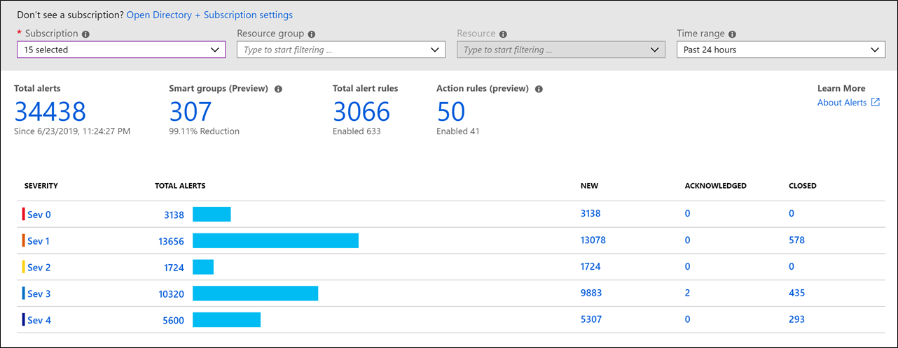

# Alerting

Alerting is the process of analyzing the monitoring and instrumentation data, and generating a notification if a significant event is detected.

Alerting helps ensure that the system remains healthy, responsive, and secure. It's an important part of any system that makes performance, availability, and privacy guarantees to the users where the data might need to be acted on immediately. An operator might need to be notified of the event that triggered the alert. Alerting can also be used to invoke system functions such as autoscaling.

Alerts from tools such as Splunk or Azure Monitor proactively notify or respond to operational states that deviate from norm. Alerts can also enable cost-awareness by watching budgets, limits, and helping workload teams scale appropriately.

Alerting depends on the following instrumentation data:

- *Security events*: If the event logs indicate that repeated authentication or authorization failures are occurring, the system might be under attack and an operator should be informed.
- *Performance metrics*: The system must quickly respond if a particular performance metric exceeds a specified threshold.
- *Availability information*: If a fault is detected, it might be necessary to quickly restart one or more subsystems, or failover to a backup resource. Repeated faults in a subsystem might indicate more serious concerns.

Operators might receive alert information by using many delivery channels such as email, a pager device, or an SMS text message. An alert might also include an indication of how critical a situation is. Many alerting systems support subscriber groups, and all operators who are members of the same group can receive the same set of alerts.

An alerting system should be customizable, and the appropriate values from the underlying instrumentation data can be provided as parameters. This approach enables an operator to filter data and focus on those thresholds or combinations of interest values. Note that in some cases, the raw instrumentation data can be provided to the alerting system. In other situations, it might be more appropriate to supply aggregated data. For example, an alert can be triggered if the CPU utilization for a node has exceeded `90%` over the past `10` minutes. The details provided to the alerting system should also include any appropriate summary and context information. This data can help reduce the possibility that false-positive events will trip an alert.

## Alert rules and actions

When configuring alerts in Azure, ensure the following items are configured:

- *Alert rule*: This rule includes the alert scope or set of resources on which to alert. The alert rule also includes an alert condition. The condition is a query of Azure monitor data and the data threshold on which to raise an alert.
- *Action group*: This group defines the action to take once an alert has been triggered.

An alert rule can be defined using many different data streams such as [metric values](/azure/azure-monitor/platform/alerts-metric-overview), [log search queries](/azure/azure-monitor/platform/alerts-unified-log), and [activity log events](/azure/azure-monitor/platform/activity-log-alerts).

For more information on alerts, reference [Overview of alerts in Microsoft Azure](/azure/azure-monitor/platform/alerts-overview).

## Alert prioritization

Prioritizing alerts with a specific severity or urgency helps operational teams in cases where multiple events require intervention at the same time. For example, alerts concerning critical system flows might require special attention. When creating an alert, ensure you establish and set the correct priority.

## Alert owners

Having well-defined owners and response playbooks per alert is vital to optimizing operational effectiveness. Alerts don't have to be only technical. For example, the budget owner should be made aware of capacity issues so that budgets can be adjusted and discussed.

## Alert response

Each Azure Monitor alert can be configured with one or more associated action groups. An action group can respond to an Azure Monitor alert in the following ways:

- Send an email, SMS message, or push notification
- Execute an Azure Function
- Execute an Azure Automation runbook
- Execute an Azure Logic App
- Send a request to a webhook endpoint

By using an Azure Monitor action group, you can raise a notification when an alert is created and respond with automated action.

For more information on using Azure Monitor action groups, reference [Create and manage action groups](/azure/azure-monitor/platform/action-groups).

## Alert dashboarding

The default Alerts page provides a summary of alerts that are created within a particular time range. It displays the total alerts for each severity, with columns that identify the total number of alerts in each state for each severity.

In addition to the default Azure Monitor alert dashboard, custom dashboards can be created using log analytics data. This dashboard can be tailored to reflect the current and past start of all alerts.

For more information on creating dashboards, reference [Create and share dashboards of Log Analytics data](/azure/azure-monitor/learn/tutorial-logs-dashboards).

## Alert integrations

Because of the flexibility provided with Azure Monitor, alerts, and action groups, integration possibilities are essentially limitless. For example, if you have a custom solution that ingests data through an incoming API, this can be engaged with an Azure Monitor action group each time an alert is raised. This flexibility allows for integration with a custom system, ITSM solutions, and other work tracking solutions. Many partner integrations are ready to use out of the box.

For information on Azure Monitor and ITSM integration, reference [IT Service Management Connector Overview](/azure/azure-monitor/platform/itsmc-overview).

## Next steps

Return to the operational excellence overview.

> [!div class="nextstepaction"]
> [Operational Excellence Overview](./overview.md)
