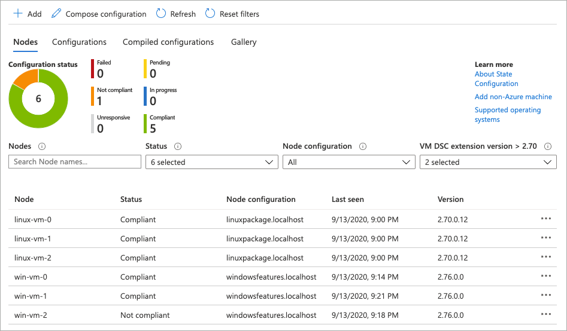

# Configure infrastructure

When working with Azure, many services can be created and configured programmatically using automation or infrastructure as code tooling. These tools access Azure through the exposed REST APIs or what we refer to as the [Azure control plane](/azure/azure-resource-manager/management/control-plane-and-data-plane#control-plane). For example, an Azure Network Security Group can be deployed, and security group rules created using an Azure Resource Manager template. The Network Security Group and its configuration are exposed through the Azure control plane and natively accessible.

Other configurations, such as installing software on a virtual machine, adding data to a database, or starting pods in an Azure Kubernetes Service cluster cannot be accessed through the Azure control plane. These actions require a different set of configuration tools. We consider these configurations as being on the [Azure data plane](/azure/azure-resource-manager/management/control-plane-and-data-plane#data-plane) side, or not exposed through Azure REST APIs. These data plane enables tools to use agents, networking, or other access methods to provide resource-specific configuration options.

For example, when deploying a set of virtual machined to Azure, you may also want to install and configure a web server, stage content, and then make the content available on the internet. Furthermore, if the virtual machine configuration changes and no longer aligns with the configuration definition, you may want a configuration management system to remediate the configuration. Many options are available for these data plane configurations. This document details several and provides links for in-depth information.

## Bootstrap automation

When deploying to Azure, you may need to run post-deployment virtual machine configuration or run other arbitrary code to bootstrap the deployed Azure resources. Several options are available for these bootstrapping tasks and are detailed in the following sections of this document.

### Azure VM extensions

Azure virtual machine extensions are small packages that run post-deployment configuration and automation on Azure virtual machines. Several extensions are available for many different configuration tasks, such as running scripts, configuring antimalware solutions, and configuring logging solutions. These extensions can be installed and run on virtual machines using an ARM template, the Azure CLI, Azure PowerShell module, or the Azure portal. Each Azure VM has a VM Agent installed, and this agent manages the lifecycle of the extension.

A typical VM extension use case would be to use a custom script extension to install software, run commands, and perform configurations on a virtual machine or virtual machine scale set. The custom script extension uses the Azure virtual machine agent to download and execute a script. The custom script extensions can be configured to run as part of infrastructure as code deployments such that the VM is created, and then the script extension is run on the VM. Extensions can also be run outside of an Azure deployment using the Azure CLI, PowerShell module, or the Azure portal.

In the following example, the Azure CLI is used to deploy a custom script extension to an existing virtual machine, which installs a Nginx webserver.

```
az vm extension set \
  --resource-group myResourceGroup \
  --vm-name myVM --name customScript \
  --publisher Microsoft.Azure.Extensions \
  --settings '{"commandToExecute": "apt-get install -y nginx"}'
```

**Learn more**

Use the included code sample to deploy a virtual machine and configure a web server on that machine with the custom script extension.

- [Documentation: Azure virtual machine extensions](/azure/virtual-machines/extensions/overview)
- [Code Samples: Configure VM with script extension during Azure deployment](/samples/mspnp/samples/azure-well-architected-framework-sample-custom-script-extension/)

### cloud-init

cloud-init is a known industry tool for configuring Linux virtual machines on first boot. Much like the Azure custom script extension, cloud-init allows you to install packages and run commands on Linux virtual machines. cloud-init can be used for things like software installation, system configurations, and content staging. Azure includes many cloud-init enable Marketplace virtual machine images across many of the most well-known Linux distributions. For a full list, see [cloud-init support for virtual machines in Azure](/azure/virtual-machines/linux/using-cloud-init).

To use cloud-init, create a text file named *cloud-init.txt* and enter your cloud-init configuration. In this example, the Nginx package is added to the cloud-init configuration.

```yaml
#cloud-config
package_upgrade: true
packages:
  - nginx
```

Create a resource group for the virtual machine.

```azurecli
az group create --name myResourceGroupAutomate --location eastus
```

Create the virtual machine, specifying the *--custom-data* property with the cloud-inti configuration name.

```azurecli
az vm create \
    --resource-group myResourceGroupAutomate \
    --name myAutomatedVM \
    --image UbuntuLTS \
    --admin-username azureuser \
    --generate-ssh-keys \
    --custom-data cloud-init.txt
```

 On boot, cloud-init will use the systems native package management tool to install Nginx.

**Learn more**

- [Documentation: cloud-init support for virtual machines in Azure](/azure/virtual-machines/linux/using-cloud-init#canonical)

### Azure deployment script resource

When performing Azure deployments, you may need to run arbitrary code for bootstrapping things like managing user accounts, Kubernetes pods, or querying data from a non-Azure system. Because none of these operations are accessible through the Azure control plane, some other mechanism is required for performing this automation. To run arbitrary code with an Azure deployment, check out the `Microsoft.Resources/deploymentScripts` Azure resource.

The deployment script resource behaves similar to any other Azure resource:

- Can be used in an ARM template.
- Contain ARM template dependencies on other resources.
- Consume input, produce output.
- Use a user-assigned managed identity for authentication.

When deployed, the deployment script runs PowerShell or Azure CLI commands and scripts. Script execution and logging can be observed in the Azure portal or with the Azure CLI and PowerShell module. Many options can be configured like environment variables for the execution environment, timeout options, and what to do with the resource after a script failure.

The following example shows an ARM template snippet with the deployment script resource configured to run a PowerShell script.

```json
{
    "type": "Microsoft.Resources/deploymentScripts",
    "apiVersion": "2019-10-01-preview",
    "name": "runPowerShellScript",
    "location": "[resourceGroup().location]",
    "kind": "AzurePowerShell",
    "identity": {
        "type": "UserAssigned",
        "userAssignedIdentities": {"[parameters('identity')]": {}}
    },
    "properties": {
        "forceUpdateTag": "1",
        "azPowerShellVersion": "3.0",
        "arguments": "[concat('-sqlServer ', parameters('sqlServer'))]",
        "primaryScriptUri": "[variables('script')]",
        "timeout": "PT30M",
        "cleanupPreference": "OnSuccess",
        "retentionInterval": "P1D"
    }
}
```

**Learn more**

- [Documentation: Use deployment scripts in templates](/azure/azure-resource-manager/templates/deployment-script-template)

## Configuration Management

Configuration management tools can be used to configure and manage the ongoing configuration and state of Azure virtual machines. Three popular options are Azure Automation State Configuration, Chef, and Puppet.

### Azure Automation State Configuration

Azure Automation State Configuration is a configuration management solution built on top of PowerShell Desired State Configuration (DSC). State configuration works with Azure virtual machines, on-premises machines, and machines in a cloud other than Azure. Using state configuration, you can import PowerShell DSC resources and assign them to many virtual from a central location. Once each endpoint has evaluated and / or applied the desired state, state compliance is reported to Azure and can be seen on a built-in dashboard.

The following example uses PowerShell DSC to ensure the NGINX has been installed on Linux systems.

```powershell
configuration linuxpackage {

    Import-DSCResource -Module nx

    Node "localhost" {
        nxPackage nginx {
            Name = "nginx"
            Ensure = "Present"
        }
    }
}
```

Once imported into Azure State Configuration and assigned to nodes, the state configuration dashboard provides compliance results.



**Learn more**

Use the included code sample to deploy Azure Automation State Configuration and several Azure virtual machines. The virtual machines are also onboarded to state configuration, and a configuration applied.

- [Documentation: Get started with Azure Automation State Configuration](/azure/automation/automation-dsc-overview)
- [Example Scenario: Azure Automation State Configuration](../../example-scenario/state-configuration/state-configuration.yml)

### Chef

Chef is an automation platform that helps define how your infrastructure is configured, deployed, and managed. Additional components included Chef Habitat for application lifecycle automation rather than the infrastructure and Chef InSpec that helps automate compliance with security and policy requirements. Chef Clients are installed on target machines, with one or more central Chef Servers that store and manage the configurations.

**Learn more**

- [Documentation: An Overview of Chef](https://docs.chef.io/chef_overview.html)

### Puppet

Puppet is an enterprise-ready automation platform that handles the application delivery and deployment process. Agents are installed on target machines to allow Puppet Master to run manifests that define the desired configuration of the Azure infrastructure and virtual machines. Puppet can integrate with other solutions such as Jenkins and GitHub for an improved DevOps workflow.

**Learn more**

- [Documentation: How Puppet works](https://puppet.com/products/how-puppet-works)

## Next steps

> [!div class="nextstepaction"]
> [Automate operational tasks](./automation-tasks.md)
