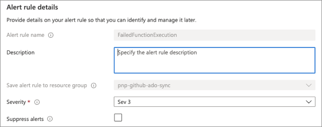

# Alerting for operations

Alerting is the process of generating notifications when a significant event is detected after analyzing instrumentation data. It's an important part of any system that makes performance, availability, and privacy guarantees to the users where an action is required immediately.

To ensure that the system remains healthy, responsive, and secure, it's highly recommended that you set alerts so that operators can respond to them in a timely manner. An alert can contain enough contextual information to help you quickly get started on diagnostic activities. Alerting can be used to invoke remediation functions such as autoscaling. Alerts can also enable cost-awareness by watching budgets and limits.

## Best practices

- Define a process for alert response that identifies the accountable owners and actions.
- Configure alerts for a well-defined scope (resource types and resource groups) and adjust the verbosity to minimize noise. 
- Use an automated alerting solution, such as Splunk or Azure Monitor, instead of having people actively look for issues.
- Take advantage of alerts to operationalize remediation processes. For example, automatically create tickets to track issues and resolutions.
- Track the health of Azure services in regions, communication about outages, planned maintenance activities, and other health advisories.

## Alert use cases

Here are some common situations for which you might want to set alerts and associated actions:

- **Security events**&mdash;If the event logs indicate that repeated authentication or authorization failures are occurring, the system might be under attack and an operator should be informed.
- **Performance metrics**&mdash;If a particular performance metric exceeds a specified threshold, the system must quickly respond. 
- **Availability information**&mdash;If a fault is detected, it might be necessary to quickly restart one or more subsystems, or failover to a backup resource. Repeated faults in a subsystem might indicate more serious concerns.
- **Cost and usage information**&mdash;If usage or cost exceeds the allocated budget, it might be necessary to raise cost awareness to the department with notification that spending has reached a fixed threshold of the quota.

## Application alerts

An alerting system should allow customizing alerts. The appropriate values from the underlying instrumentation data can be provided to the alerting system as parameters. This approach enables an operator to filter data and focus on those thresholds or combinations of interest values. 

In some cases, the raw instrumentation data can be provided. In other situations, it might be more appropriate to supply aggregated data. For example, an alert can be triggered if the CPU utilization for a node has exceeded `90%` over the past `10` minutes. The details provided to the alerting system should also include any appropriate summary and context information. This data can help reduce the possibility that false-positive events will trip an alert.

## Resource health alerts

**Have health alerts been created to respond to resource-level events?**
***

Health alerts should be configured for specific resource groups and resource types, and should be adjusted to maximize signal to noise ratios. For example, only send a notification when a resource becomes unhealthy as per the defined requirements of the application health model or due to an Azure platform-initiated event. 

Consider transient issues when setting an appropriate threshold for resource unavailability, such as configuring an alert for a virtual machine with a threshold of 1 minute for unavailability before an alert is triggered.

[Azure Resource Health](/azure/service-health/resource-health-overview) provides information about the health of individual resources such as a specific virtual machine instance, and is useful when diagnosing unavailable resources.

You can also view resource health in Azure Monitor. Alerts can be defined by using many different data streams such as [metric values](/azure/azure-monitor/platform/alerts-metric-overview), [log search queries](/azure/azure-monitor/platform/alerts-unified-log), and [activity log events](/azure/azure-monitor/platform/activity-log-alerts).

## Service health alerts

**Have alerts been created to get notified about the health of Azure services?**
***

Get a view into the health of Azure services and regions, communications about outages, planned maintenance activities, and other health advisories.

Consider configuring [Azure Service Health](/azure/service-health/overview) alerts to operationalize Service Health events. These alerts can provide useful information in interpreting issues that you might have detected through the resource health alerts. You can use Service Health events to decide the best way to respond operationally.

However, Service Health alerts aren't effective in detecting issues because of the associated latencies. There's a 5 minute Service Level Objectives (SLOs) for automated issues, but many issues require manual interpretation for root cause analysis.

## Process considerations

Alerts proactively notify and in cases even respond to operational states that deviate from the norm. When such an event occurs, an alert is triggered to notify the accountable teams. 

**Are specific owners and processes defined for each alert type?**
***

Having well-defined owners and response playbooks per alert is vital to optimizing operational effectiveness. Alerts can be set for non-technical notifications. For example, a budget owner should be made aware of capacity issues so that budgets can be adjusted and discussed.

**Are push notifications enabled to inform responsible parties of alerts in real time?**
***

Instead of having teams actively monitor the systems and dashboard, send reliable alert notifications to the owners. 

The operators might receive alert information by using many delivery channels such as email, text message, a pager device, or push notifications to a mobile app. Many alerting systems support subscriber groups, and all operators who are members of the same group can receive the same set of alerts.

In Azure Monitor, alerts use action groups to notify the owners. 

**Are Azure notifications sent to subscriptions owners received and routed to relevant technical stakeholders?**
***

Subscription notification emails can contain important service notifications or security alerts. Make sure that subscription notification emails are routed to the relevant technical stakeholders.

**Is alerting integrated with an IT Service Management (ITSM) system?**
***

ITSM systems can help define workflows. You can use those systems to document issues, notify and assign responsible parties, and track issues. For example, operational alerts from the application could be integrated to automatically create new tickets to track resolution.

Azure Monitor supports integrations with third-party ITSM systems. For example, if you have a custom solution that ingests data through an incoming API, this can be engaged with an Azure Monitor action group each time an alert is raised. Many partner integrations are ready to use out of the box.

For information on Azure Monitor and ITSM integration, reference [IT Service Management Connector Overview](/azure/azure-monitor/platform/itsmc-overview).

## Alert prioritization

All alerts being treated the same is going to reduce the efficacy of notifications.  

**Are operational events prioritized based on business impact?**
***

When defining alerts, analyze the potential business impact and prioritize accordingly. Prioritizing alerts helps operational teams in cases where multiple events require intervention at the same time. For example, alerts concerning critical system flows might require special attention. When creating an alert, ensure you establish and set the correct priority.

One way of specifying the priority is by using a severity level that indicates how critical a situation is. This image shows this case in Azure Monitor.

## Next steps

Return to the operational excellence overview.

> [!div class="nextstepaction"]
> [Use case: Health monitoring](./health-monitoring.md)

## Related links

- [Overview of alerts in Microsoft Azure](/azure/azure-monitor/platform/alerts-overview)
- [Create and manage action groups](/azure/azure-monitor/platform/action-groups)