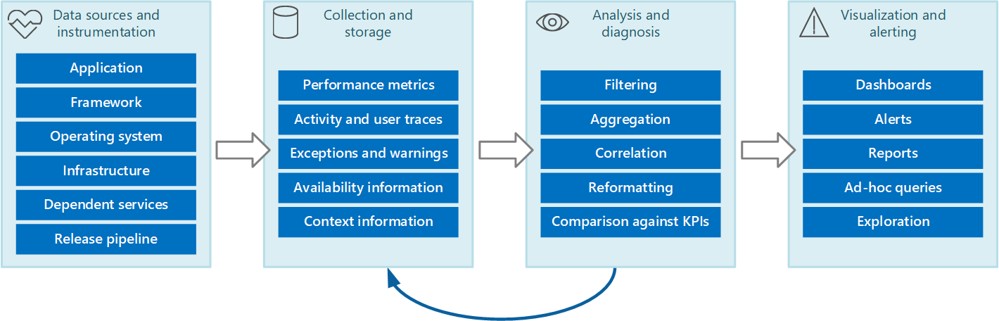

# Monitoring workloads

Monitoring a workload and the infrastructure in which it runs, should not be processed or analyzed in isolation. Build a pipeline that gives you holistic observability of the system. 

This article describes the stages of a common pipeline design.

## 1. Data sources and instrumentation

Monitoring data from many sources:
    
- **Application code**&mdash;Developers add trace messages in application code to track the flow of control. For example, recording the entry and exit times can be useful. An entry to a method in the application can emit a trace message that specifies the name of the method, the current time, the value of each parameter, and any other pertinent information.

- **Application frameworks**&mdash;Many applications use libraries and frameworks to perform common tasks such as accessing a data store or communicating over a network. The frameworks emit trace messages and raw diagnostic information, such as transaction rates and data transmission successes and failures can be important information for debugging issues.

- **Dependent services**&mdash;The application will access external services such as a web server or database management system to complete business operations. Even a single business operation can result in multiple point-to-point calls among all services. The services might publish their own trace information, logs, and performance counters. Examples include SQL Server Dynamic Management Views for tracking operations performed against a SQL Server database, and IIS trace logs for recording requests made to a web server.

- **Release pipeline**&mdash;As the components of a system are modified and new versions are deployed, it's important to be able to attribute issues, events, and metrics to each version. This way problems with a specific version of a component can be tracked quickly and rectified.

> [!NOTE]
> As a workload owner, you may not be monitoring infrastructure metrics actively. However, this information can indicate systemic issues. Consider the underlying infrastructure and components on which your system runs. Virtual machines, virtual networks, and storage services can all be sources of important infrastructure-level performance counters and other diagnostic data.
>
> Another important source is the operating system where the application runs. It can be a source of low-level system-wide information, such as performance counters that indicate I/O rates, memory utilization, and CPU usage. Operating system errors (such as the failure to open a file correctly) might also be reported.
    
> [!div class="nextstepaction"]
> [More information: Sources of monitoring data](monitor-data-sources.md)

### Instrumentation

Instrumentation is a process of generating diagnostics data in the data sources. The captured data can help you assess performance, diagnose problems, and make decisions. In the simplest case of a single  application, it can be a log of trace messages. 

In complex scenarios, there might be a need to _correlate instrumentation data_ from several sources with sufficient context so that the data can be mapped it to an action. For example, at the framework level, a task might be identified by a thread ID. Within an application, the same work might be associated with the user ID for the user who is performing that task.

> [!div class="nextstepaction"]
> [More information: Instrumentation best practices](monitor-instrument.md)
    
## 2. Collection and storage

At this stage, the information generated by instrumentation is collected and transformed so that it's easy to consume and then saved to a reliable storage. The choices for the data collection and storage technologies will depend on some factors:

- Do you need to analyze data quickly (hot path) or it can be stored for later analysis (warm, cold path)?
- Do you want the data collection tier to retrieve data actively (pull model) or wait for the data to arrive (push model)?
- Do you want to consolidate data from various sources before writing to storage?
- Do you need to archive the data?

> [!div class="nextstepaction"]
> [More information: Data collection and storage considerations](monitor-collection-data-storage.md)

## 3. Analysis and diagnosis

The analysis and diagnosis stage takes the collected raw data and produces information that can be used to determine the state of the system. This information is useful in deciding remediation actions. In certain cases, the results can be fed back into the instrumentation and collection stages. 

> [!div class="nextstepaction"]
> [More information: Analyzing data](monitor-analysis.md)

## 4. Visualization and alerting

The purpose of visualization is to present  information in near real time by using a series of dashboards. Also, you can view historical data through reports, graphs, and charts to identify long-term trends. 

> [!div class="nextstepaction"]
> [More information: Visualizing data](monitor-visualize-data.md)
    
### Alerting
    
If information indicates that the key indicators are likely to exceed acceptable bounds, you can trigger alerts to raise awareness. It can trigger an automated process that attempts to take corrective actions, such as autoscaling.

> [!div class="nextstepaction"]
> [More information: Alerting](monitor-alerts.md)

## Next steps

> [!div class="nextstepaction"]
> [More information: Sources of monitoring data](monitor-data-sources.md)

