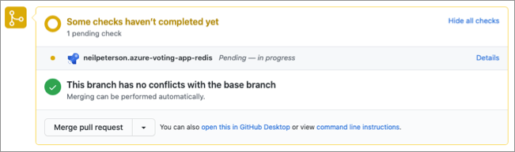
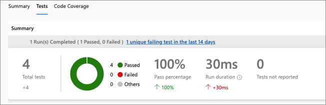

# Release Engineering: Continuous integration

As code is developed, updated, or even removed, having a friction-free and safe method to integrate these changes into the main code branch is paramount to enabling developers to provide value fast. As a developer, making small code changes, pushing these to a code repository, and getting almost instantaneous feedback on the quality, test coverage, and introduced bugs allows you to work faster, with more confidence, and less risk. Continuous integration (CI) is a practice where source control systems and software deployment pipelines are integrated to provide automated build, test, and feedback mechanisms for software development teams.

Continuous integration is about ensuring that software is ready for deployment but does not include the deployment itself. This article covers the basics of continuous integration and offers links and examples for more in-depth content.

## Continuous integration

Continuous integration is a software development practice under which developers integrate software updates into a source control system on a regular cadence. The continuous integration process starts when an engineer creates a pull request signaling to the CI system that code changes are ready to be integrated. Ideally, integration validates the code against several baselines and tests and provides quick feedback to the requesting engineer on the status of these tests. Assuming baseline checks and testing have gone well, the integration process produces and stages assets such as compiled code and container images that will eventually deploy the updated software.

As a software engineer, continuous integration can help you deliver quality software more quickly by performing the following:

- Run automated tests against the code, providing early detection of breaking changes.
- Run code analysis to ensure code standards, quality, and configuration.
- Run compliance and security checks ensuring no known vulnerabilities.
- Run acceptance or functional tested to ensure that the software operates as expected.
- To provide quick feedback on detected issues.
- Where applicable, produce deployable assets or packages that include the updated code.

To achieve continuous integration, use software solutions to manage, integrate, and automate the process. A common practice is to use a continuous integration pipeline, detailed in this article's next section.

## Continuous integration pipelines

A continuous integration pipeline involves a piece of software, in many cases, cloud-hosted, that provides a platform for running automated tests, compliance scans, reporting, and all additional components that make up the continuous integration process. In most cases, the pipeline software is attached to source control such that when pull requests are created or software is merged into a specific branch, and the continuous integration pipeline is run. Source control integration also provides the opportunity for providing CI feedback directly on the pull request.

Many solutions provide continuous integration pipeline capabilities. This article touches on both Azure Pipelines and GitHub actions and provides links to find more information.

**Learn more**

To learn how to create a continuous integration pipeline, see these articles:

- [Azure DevOps: Create your first pipeline](/azure/devops/pipelines/create-first-pipeline?preserve-view=true&view=azure-devops)
- [GitHub Actions: Setting up continuous integration using workflow templates](https://docs.github.com/en/free-pro-team@latest/actions/guides/setting-up-continuous-integration-using-workflow-templates)

### Source Control Integration

The integration of your continuous integration pipeline with your source control system is key to enabling fast, self-service, and friction-free code contributions. Source control integration enables these things:

- As pull requests are created, the CI pipeline is run, including all tests, security assessments, and other checks.
- CI test results are provided to the pull request initiator directly in the pull request, allowing for almost real-time feedback on quality.
- Another popular practice is building small reports or badges that can be presented in source control to make visible the current builds states

The following image shows the integration between GitHub and an Azure DevOps pipeline. In this example, a pull request has been created, which in turn has triggered an Azure DevOps pipeline. The pipeline status can be seen directly in the pull request.



#### Test Integration

A key element of continuous integration is the continual building and testing of code as code contributions are created. Testing pull requests as they are created gives quick feedback that the commit  has not introduced breaking changes. The advantage is that the tests that are run by the continuous integration pipeline can be the same tests run during test-driven development.

The following code snippet shows a test step from an Azure DevOps pipeline. There are two actions occurring:

- The first task is using a popular Python testing framework to run CI tests. These tests reside in source control alongside the Python code. The test results are output to a file named _test-results.xml_.
- The second task consumes the test results and publishing them to the Azure DevOps pipeline as an integrated report.

```yaml
- script: |
    pip3 install pytest
    pytest azure-vote/azure-vote/tests/ --junitxml=junit/test-results.xml
    continueOnError: true

- task: PublishTestResults@2
    displayName: 'Publish Test Results'
    inputs:
    testResultsFormat: 'JUnit'
    testResultsFiles: '**/test-results.xml'
    failTaskOnFailedTests: true
    testRunTitle: 'Python $(python.version)'
```

The following image shows the test results as seen in the Azure DevOps portal.



#### Failed tests

Failed tests should temporarily block a deployment and lead to a deeper analysis of what has happened and to either a refinement of the test or an improvement of the change that caused the test to fail.

#### CI Result Badges

Many developers like to show that they're keeping their code quality high by displaying a status badge in their repo. The following image shows an Azure Pipelines badge as displayed on the Readme file for an open-source project on GitHub.


**Learn more**

To learn how to display badges in your repositories, see these articles:

- [Add an Azure Pipeline status badge to your repository](/azure/devops/pipelines/create-first-pipeline?preserve-view=true&tabs=java%2ctfs-2018-2%2cbrowser&view=azure-devops#add-a-status-badge-to-your-repository).
- [Add a GitHub workflow status badge to your repository](https://docs.github.com/en/free-pro-team@latest/actions/managing-workflow-runs/adding-a-workflow-status-badge).

## Next steps

> [!div class="nextstepaction"]
> [Release Engineering: Release testing](./release-engineering-testing.md)
