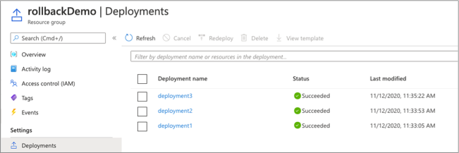
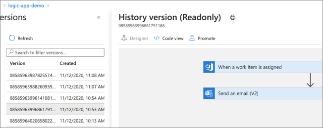

# Release Engineering: Rollback

In some cases, a new software deployment can harm or degrade the functionality of a software system. When building your solutions, it is essential to anticipate deployment issues, architect solutions that provide mechanisms for fixing problematic deployments. Rolling back a deployment involves reverting the deployment to a known good state. Rollback can be accomplished in many different ways. Several Azure services support native mechanisms for rolling back to a previous state. Several of these services are detailed in this article.

## Web Apps

## Azure Kubernetes Service

## Azure Resource Manager (ARM) deployments

When deploying Azure infrastructure and solutons with Azure Resoure Manager (ARM) tempaltes a deployment record is created.

For more information, see [Rollback on error to successful deployment](https://docs.microsoft.com/azure/azure-resource-manager/templates/rollback-on-error)

## Logic apps

When making changes to an Azure logic application a new version of the application is created. Azure maintins a history of versions and can revert or promote any previous version. To do so, in the Azure portal, select your logic app > **Versions**. On the versions pane, previous versions can be selected and the application can be inspectd both in code view and the visual designer view. Select the version that you would like to revert to, and click the **Promote** option and then **Save**.

For more information, see [Manage logic apps in the Azure portal](https://docs.microsoft.com/azure/logic-apps/manage-logic-apps-with-azure-portal)

