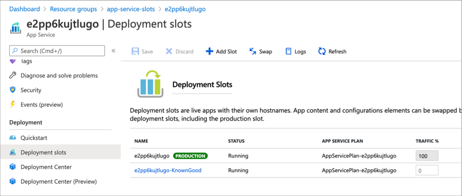

# Release Engineering: Rollback

In some cases, a new software deployment can harm or degrade the functionality of a software system. When building your solutions, it is essential to anticipate deployment issues and to architect solutions that provide mechanisms for fixing problematic deployments. Rolling back a deployment involves reverting the deployment to a known good state. Rollback can be accomplished in many different ways. Several Azure services support native mechanisms for rolling back to a previous state. Some of these services are detailed in this article.

## Azure App Service

When deploying an application to Azure App Service, consider utilizing deployment slots. Deployment slots are running instances of the application, each with a separate hostname, and can be used to stage and test applications before promoting to a production slot. A deployment slot can be created to hold the last known good instance of your application. In the event of an issue or problematic deployment, the production slot can be swapped with the know good slot to bring the application back to a known good state. 



If you would like to experience out Azure App Service deployment slots, try out this 15-minute hands-on solution experience.

> [!div class="nextstepaction"]
> [Azure App Service Deployment Slots](https://nam06.safelinks.protection.outlook.com/?url=https%3A%2F%2Freview.docs.microsoft.com%2Fen-us%2Fazure%2Farchitecture%2Fexample-scenario%2Ftest-drive%2Fappservice-slots%3Fbranch%3Dpr-en-us-2043&data=04%7C01%7CNeil.Peterson%40microsoft.com%7C50e0c256018b4a420b6c08d88a541d7c%7C72f988bf86f141af91ab2d7cd011db47%7C1%7C0%7C637411441173881460%7CUnknown%7CTWFpbGZsb3d8eyJWIjoiMC4wLjAwMDAiLCJQIjoiV2luMzIiLCJBTiI6Ik1haWwiLCJXVCI6Mn0%3D%7C1000&sdata=8sV%2FeZEkH9MDYxtCl7MTl5zRKTTAMXndpWir9l3%2BcKE%3D&reserved=0)

For more information on using Azure App Service deployment slots, see [Set up staging environments in Azure App Service](https://docs.microsoft.com/azure/app-service/deploy-staging-slots)

## Azure Kubernetes Service (AKS)

A Kubernetes deployment defines the desired state for a particular workload running in the cluster. For example, a deployment may declare that a workload consists of 3 replicas of a specific pod that should be running at all times. The deployment object creates a ReplicaSet and the associate Pods. When updating a workload, the deployment itself can be revised, which will generally roll out a new container image to the deployment pods. Assuming multiple replicas of the pods exist, this rollout can happen in a controlled and staged manner such that no downtime occurs.

If a deployment introduces breaking changes or unintentional results, it can be reverted to an earlier state.

In this case, a deployment named _demorollback_ contains three replicas of a pod.

```azurecli
$ kubectl get deployments

NAME           READY   UP-TO-DATE   AVAILABLE   AGE
demorollback   3/3     3            3           28s
```

As the deployment is updated, deployment history is retained.

```azurecli
$ kubectl rollout history deployment demorollback

deployment.apps/demorollback 
REVISION  CHANGE-CAUSE
1         <none>
2         <none>
```

If an updated deployment has introduced issues, the `kubectl rollout undo` command can be used to revert to a previous deployment revision.

```azurecli
$ kubectl rollout undo deploy demorollback --to-revision=1

deployment.apps/demorollback rolled back
  Volumes:      <none>
```

**Learn more**

For more information, see [Kubernetes Deployments](https://kubernetes.io/docs/concepts/workloads/controllers/deployment/)

## Azure Resource Manager (ARM) deployments

A deployment record is created when deploying Azure infrastructure and solutions with Azure Resource Manager (ARM) templates. When creating a new deployment, you can provide a previously known good deployment so that if the current deployment fails, the previous know good deployment is redeployed. There are several considerations and caveats when using this functionality. See the documentation linked below for these details.

:::image type="content" source="../_images/devops/arm-deployments.png" alt-text="Image showing Azure Resource Manager Deployments in the Azure portal." lightbox="../_images/devops/arm-deployments-full.png":::

For more information, see [Rollback on an error to successful deployment](https://docs.microsoft.com/azure/azure-resource-manager/templates/rollback-on-error)

## Logic apps

When making changes to an Azure logic application, a new version of the application is created. Azure maintains a history of versions and can revert or promote any previous version. To do so, in the Azure portal, select your logic app > **Versions**. Previous versions can be selected on the versions pane, and the application can be inspected both in the code view and the visual designer view. Select the version you would like to revert to, and click the **Promote** option and then **Save**.

:::image type="content" source="../_images/devops/revert-logic-app.png" alt-text="Image showing Azure logic application version history." lightbox="../_images/devops/revert-logic-app-full.png":::

**Learn more**

For more information, see [Manage logic apps in the Azure portal](https://docs.microsoft.com/azure/logic-apps/manage-logic-apps-with-azure-portal)
