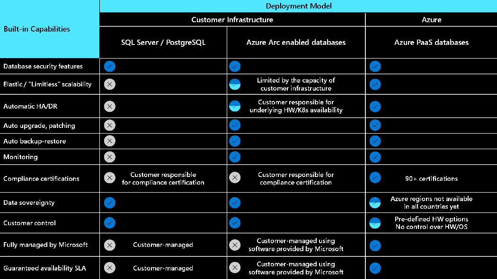

# Operational excellence in a hybrid workload

Operational excellence consists of the operations processes that keep a system running in production. Applications must be designed with DevOps principles in mind, and deployments must be reliable and predictable. Use monitoring tools to verify that your application is running correctly and to gather custom business telemetry that will tell you whether your application is being used as intended.

Use *Azure Arc enabled infrastructure* to add support for cloud [Operational Excellence](../devops/overview.md) practices and tools to any environment. Be sure to utilize reference architectures and other resources from this section that illustrate applying these principles in hybrid and multicloud scenarios. The architectures referenced here can also be found in the Azure Architecture Center, [Hybrid and Multicloud](../../browse/index.yml?azure_categories=hybrid) category.

## Build cloud native apps anywhere, at scale

To keep your systems running, many workload teams have architected and designed applications where components are distributed across public cloud services, private clouds, data centers, and edge locations. With Azure Arc enabled Kubernetes, you can accelerate development by using best in class application services with standardized deployment, configuration, security, and observability. One of the primary benefits of Azure Arc is facilitating implementation of DevOps principles that apply established development practices to operations. This results in improved agility, without jeopardizing the stability of IT environment.

- Centrally code and deploy applications confidently to any Kubernetes distribution in any location.
- Centrally manage and delegate access for DevOps roles and responsibilities.
- Reduce errors with consistent configuration and policy-driven deployment and operations for applications and Kubernetes clusters.
- Delegate access for DevOps roles and responsibilities through Azure RBAC.
- Reduce errors with consistent policy driven deployment and operations through GitHub and Azure Policy.

## Connect Kubernetes clusters to Azure and start deploying using a GitOps model

GitOps relies on a Git repository to host files that contain the configuration representing the expected state of a resource. An agent running on the cluster monitors the state of the repository and, when there is a change on the repository, the agent pulls the changed files to the cluster and applies the new configuration.

In the context of Azure Arc enabled Kubernetes clusters, a Git repository hosts a configuration of a Kubernetes cluster, including its resources such as pods and deployments. A pod or a set of pods running on the cluster polls the status of the repository and, once it detects a change, it pulls and applies the new configuration to the cluster.

Azure Arc enabled Kubernetes clusters rely on Flux, an open-source GitOps deployment tool to implement the pods responsible for tracking changes to the Git repository you designate and applying them to the local cluster. In addition, the containerized Flux operator also periodically reviews the existing cluster configuration to ensure that it matches the one residing in the Git repository. If there is a configuration drift, the Flux agent remediates it by reapplying the desired configuration.

Each association between an Azure Arc enabled Kubernetes cluster configuration and the corresponding GitOps repository resides in Azure, as part of the Azure Resource Manager resource representing the Azure Arc enabled Kubernetes clusters. You can configure that association via traditional Azure management interfaces, such as the Azure portal or Azure CLI. Alternatively, you can use Azure Policy to automate this process, allowing you to apply it consistently to all resources in an entire subscription or individual resource groups you designate.

## Modernize applications anywhere with Azure Kubernetes Service on Azure Stack HCI

If you are looking for a fully managed Kubernetes solution on-premises in your datacenters and/or edge locations, AKS on Azure Stack HCI is a great option. Azure Kubernetes Service on Azure Stack HCI is an on-premises implementation of Azure Kubernetes Service (AKS), which automates running containerized applications at scale. Azure Kubernetes Service is now in preview on Azure Stack HCI and Windows Server 2019 Datacenter, making it quicker to get started hosting Linux and Windows containers in your datacenter.

AKS clusters on Azure Stack HCI can be connected to Azure Arc for centralized management. Once connected, you can deploy your applications and Azure data services to these clusters and extend Azure services such as Azure Monitor, Azure Policy and Microsoft Defender for Cloud.

### Azure Stack HCI use cases

- **Modernize your high-performance workloads and containerized applications**

  - Use Azure Stack HCI to enable automated deployment, scaling and management of containerized applications by running a Kubernetes cluster on your hyperconverged infrastructure.
  - Deploy AKS on Azure Stack HCI using Windows Admin Center or PowerShell.

- **Deploy and manage workloads in remote and branch sites**

  - Use Azure Stack HCI to deploy your container-built edge workloads, and essential business applications in highly available virtual machines (VMs).
  - Bring efficient application development and deployment to remote locations at the right price by leveraging switchless deployment and 2 node clusters.
  - Get a global view of your system's health using Azure Monitor.

- **Upgrade your infrastructure for remote work using VDI**

  - Bring desktops on-premises for low latency and data sovereignty enabling remote work using a brokerage service like Microsoft Remote Desktop Services. With Azure Stack HCI you can scale your resources in a simple predictable way. Provide a secure way to deliver desktop services to a wide range of devices without allowing users to store data locally or upload data from those local devices.

## Resources and architectures related to Operational Excellence

The introduction of cloud computing had a significant impact on how software is developed, delivered, and run. With *Azure Arc enabled infrastructure* and Azure Arc components like [Azure Arc enabled Kubernetes](/azure/azure-arc/kubernetes/overview) and [Azure Arc enabled data services](/azure/azure-arc/data/overview) it becomes possible to design cloud native applications with a consistent set of principles and tooling across public cloud, private cloud, and the edge.

Click the following links for architecture details and diagrams that enable application design and DevOps practices consistent with [Operational excellence principles](../devops/principles.md).

### Application design

- [Azure Arc hybrid management and deployment for Kubernetes clusters](../../hybrid/arc-hybrid-kubernetes.yml)
- [Run containers in a hybrid environment](../../hybrid/hybrid-containers.yml)
- [Managing K8 clusters outside of Azure with Azure Arc](https://azure.microsoft.com/resources/videos/kubernetes-app-management-with-azure-arc)
- [Optimize administration of SQL Server instances in on-premises and multi-cloud environments by leveraging Azure Arc](../../hybrid/azure-arc-sql-server.yml)
- [Azure Data Studio dashboards](/azure/azure-arc/data/azure-data-studio-dashboards)
- [microsoft/azure_arc: Azure Arc environments bootstrapping for everyone](https://github.com/microsoft/azure_arc) (in github.com)
- [All Azure Architecture Center Hybrid and Multicloud Architectures](../../browse/index.yml?azure_categories=hybrid)

### Monitoring

- [Enable monitoring of Azure Arc enabled Kubernetes cluster](/azure/azure-monitor/insights/container-insights-enable-arc-enabled-clusters)
- [Azure Monitor for containers overview](/azure/azure-monitor/insights/container-insights-overview)

### Application performance management

- [Hybrid availability and performance monitoring](../../hybrid/hybrid-perf-monitoring.yml)

## Manage data anywhere

## Next steps

> [!div class="nextstepaction"]
> [Performance Efficiency](./hybrid-performance-efficiency.md)
