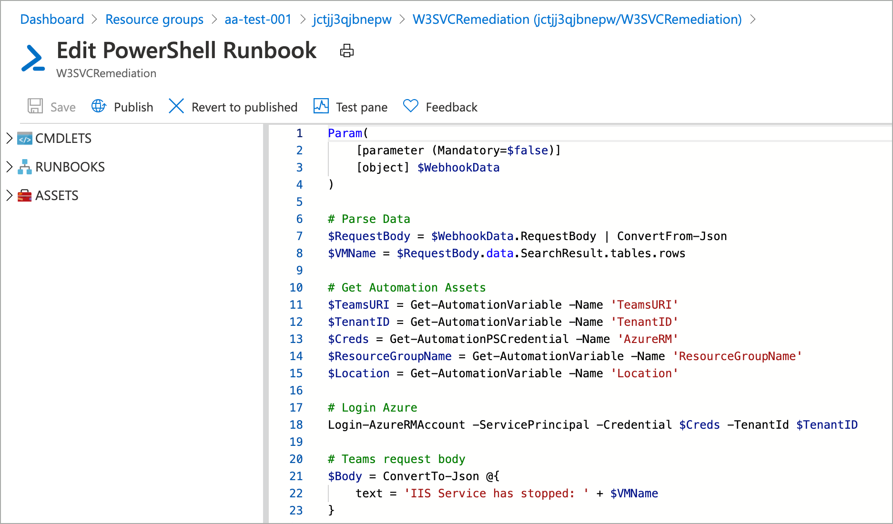

# Automate operational tasks

Operational tasks can include any action or activity you may perform while managing systems, system access, and processes. Some examples include rebooting servers, creating accounts, and shipping logs to a data store. These tasks may occur on a schedule, as a response to an event or monitoring alert, or ad-hock based on external factors. Like many other activities related to managing computer systems, these activities are often performed manually, which takes time, and is error-prone.

Many of these operational tasks can and should be automated. Using scripting technologies and related solutions, you can shift effort from manually performing operational tasks towards building automation for these tasks. In doing so, you achieve so much:

- Increase time to perform an action
- Reduce risk in performing the action
- Automated response to events and alerts
- Increased human capacity for further innovation

When working in Azure, you have many options for automating operational tasks; this document details some of the more popular.

## Azure Functions 

Azure Functions allow you to run code without managing the underlying infrastructure on where the code is run. Azure functions provide a cost-effective, scalable, and event-driven platform for building applications and running operational tasks. Azure functions support running code written in C#, Java, JavaScript, Python, and PowerShell.

When creating an Azure Function, a hosting plan is selected. These hosting plans control how a function app is scaled, resource availability, and availability of advanced features such as virtual network connectivity and start up time. The hosting plan also influences the cost. 

- Consumption - default hosting plan, pay only function execution time, configurable timeout period, automatic scale
- Premium - faster start, VNet connectivity, unlimited execution duration, premium instance sizes, more predictable pricing
- App Service Plan - functions run on dedicated virtual machines and can use custom images

For full details on consumption plans, see [Azure Functions scale and hosting](https://docs.microsoft.com/azure/azure-functions/functions-scale).

Azure Functions provide event-driven automation; each function has a trigger associated with it. These triggers are what run the functions. Common triggers include:

- **HTTP / Webhook** - function is run when an HTTP request is received
- **Queue** - function is run when a new message arrives in a message queue
- **Blob storage** - function is run when a new blob is created in a storage container
- **Timer** - function is run on a schedule

Example triggers seen in the Azure portal when creating a new function.

Once an event has occurred that initiates a function, you may also want to consume data from this event or another source. Once a function has been completed, you may want to publish or push data to an Azure service such as a storage blob. Input and output is achieved using input and output bindings. For more information about triggers and bindings, see [Azure Functions triggers and binding concepts](https://docs.microsoft.com/azure/azure-functions/functions-triggers-bindings)

Both PowerShell and Python are common languages for automating everyday operational tasks. Because Azure Functions supports both of these languages, it is an excellent platform for hosting, running, and auditing automated operational tasks. For example, let's assume that you would like to build a solution to facilitate self-service account creation. An Azure PowerShell function could be used to create the account in Azure Active Directory. An HTTP trigger can be used to initiate the function, and an input binding configured to pull the account details from the HTTP request body. The only remaining piece would a solution that consumes the account details and creates the HTTP requests against the function.

**Learn more**

- [Docs: Azure Functions PowerShell developer guide](https://docs.microsoft.com/azure/azure-functions/functions-reference-powershell)
- [Code Sample: Function ARM template (PowerShell)](https://docs.microsoft.com/samples/browse/?terms=arm%20templates)
- [Code Sample: Function ARM template (Python)](https://docs.microsoft.com/samples/browse/?terms=arm%20templates)

## Azure Automation

PowerShell and Python are popular programming languages for automating operational tasks. Using these languages, performing operations like restarting services, moving logs between data stores, and scaling infrastructure to meet demand can be expressed in code and executed on demand. Alone, these languages do not offer a platform for centralized management, version control, or execution history. The languages also lack a native mechanism for responding to events like monitoring driven alerts. To provide these capibilities, an automation platform is needed.

Azure Automation provides an Azure-hosted platform for hosting and running PowerShell and Python code across Azure, non-Azure cloud, and on-premises environments. PowerShell and Python code is stored in an Azure Automation Runbook, which has the following attributes:

- Execute runbooks on demand, on a schedule, or through a webhook
- Execution history and logging
- Integrated secrets store
- Source Control integration

As seen in the following image, Azure Automation provides a portal experience for managing Azure Automation Runbooks. Use the included code sample (ARM template) to deploy an Azure automation account, automation runbook, and explore Azure Automation for yourself.

**Learn more**

- [Docs: What is Azure Automation](https://docs.microsoft.com/azure/automation/automation-intro)
- [Code Sample: Azure Automation example](https://docs.microsoft.com/samples/browse/?terms=arm%20templates)

## Logic apps

#### Next steps