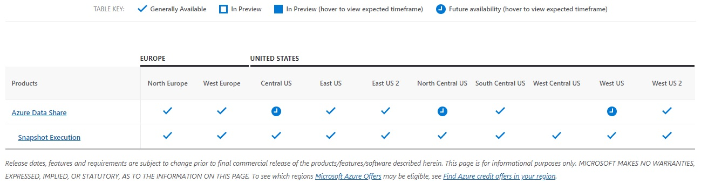
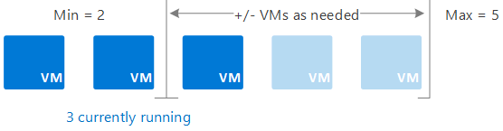

# Design for scaling

*Scalability* is the ability of a system to handle increased load. Services covered by [Azure Autoscale](https://azure.microsoft.com/features/autoscale) can scale automatically to match demand to accommodate workload. These services scale out to ensure capacity during workload peaks and return to normal automatically when the peak drops.

To achieve performance efficiency, consider how your application design scales and implement PaaS offerings that have built-in scaling operations.

Two main ways an application can scale include *vertical scaling* and *horizontal scaling*. Vertical scaling (scaling *up*) increases the capacity of a resource, for example, by using a larger virtual machine (VM) size. Horizontal scaling (scaling *out*) adds new instances of a resource, such as VMs or database replicas.

Horizontal scaling has significant advantages over vertical scaling, such as:

- *True cloud scale*: Applications are designed to run on hundreds or even thousands of nodes, reaching scales that aren't possible on a single node.
- *Horizontal scale is elastic*: You can add more instances if load increases, or remove instances during quieter periods.
- Scaling out can be triggered automatically, either on a schedule or in response to changes in load.
- Scaling out may be cheaper than scaling up. Running several small VMs can cost less than a single large VM.
- Horizontal scaling can also improve resiliency, by adding redundancy. If an instance goes down, the application keeps running.

An advantage of vertical scaling is that you can do it without making any changes to the application. But at some point, you'll hit a limit, where you can't scale up anymore. At that point, any further scaling must be horizontal.

Horizontal scale must be designed into the system. For example, you can scale out VMs by placing them behind a load balancer. But each VM in the pool must handle any client request, so the application must be stateless or store state externally (say, in a distributed cache). Managed PaaS services often have horizontal scaling and autoscaling built in. The ease of scaling these services is a major advantage of using PaaS services.

Just adding more instances doesn't mean an application will scale, however. It might push the bottleneck somewhere else. For example, if you scale a web front end to handle more client requests, that might trigger lock contentions in the database. You'd want to consider other measures, such as optimistic concurrency or data partitioning, to enable more throughput to the database.

Always conduct performance and load testing to find these potential bottlenecks. The stateful parts of a system, such as databases, are the most common cause of bottlenecks, and require careful design to scale horizontally. Resolving one bottleneck may reveal other bottlenecks elsewhere.

Use the [Performance efficiency checklist](performance-efficiency.md) to review your design from a scalability standpoint.

In the cloud, the ability to take advantage of scalability depends on your infrastructure and services. Platforms, such as Kubernetes, were built with scaling in mind. Virtual machines may not scale as easily although scale operations are possible. With virtual machines, you may want to plan ahead to avoid scaling infrastructure in the future to meet demand. Another option is to select a different platform such as Azure virtual machines scale sets.

When using scalability, you can predict the current average and peak times for your workload. Payment plan options allow you to manage this prediction. You pay either per minute or per-hour depending on the service for a chosen time period.

## Plan for growth

Planning for growth starts with understanding your current workloads, which can help you anticipate scale needs based on predictive usage scenarios. An example of a predictive usage scenario is an e-commerce site that recognizes that its infrastructure should scale appropriately for an expected high volume of holiday traffic.

Perform load tests and stress tests to determine the necessary infrastructure to support the predicted spikes in workloads. A good plan includes incorporating a buffer to accommodate for random spikes.

For more information on how to determine the upper and maximum limits of an application's capacity, reference [Performance testing](./performance-test.md) in the [performance efficiency](overview.md) pillar.

Another critical component of planning for scale is to make sure the region that hosts your application supports the necessary capacity required to accommodate load increase. If you're using a multiregion architecture, make sure the secondary regions can also support the increase. A region can offer the product, but may not support the predicted load increase without the necessary SKUs (Stock Keeping Units) so you need to verify capacity.

To verify your region and available SKUs, first select the product and regions in [Products available by region](https://azure.microsoft.com/global-infrastructure/services/).

Then, check the SKUs available in the Azure portal.

### Add scale units

For each resource, know the upper scaling limits, and use [sharding](/azure/azure-sql/database/elastic-scale-introduction#sharding) or decomposition to go beyond those limits. Design the application so that it's easily scaled by adding one or more scale units, such as by using the [Deployment Stamps pattern](../../patterns/deployment-stamp.md). Determine the scale units for the system for well-defined sets of resources.

The next step might be to use built-in scaling features or tools to understand which resources need to scale concurrently with other resources. For example, adding X number of front-end VMs might require Y number of extra queues and Z number of storage accounts to handle the extra workload. So a scale unit could consist of X VM instances, Y queues, and Z storage accounts.

## Use Autoscaling to manage load increases and decreases

Autoscaling enables you to run the right amount of resources to handle the load of your app. It adds resources (called scaling out) to handle an increase in load such as seasonal workloads. Autoscaling saves money by removing idle resources (called scaling in) during a decrease in load such as nights and weekends for some corporate apps.

You automatically scale between the minimum and maximum number of instances to run, and add, or remove VMs automatically based on a set of rules.

For more information, see [Autoscaling](../../best-practices/auto-scaling.md).

### Understand scale targets

Scale operations (horizontal - changing the number of identical instances, vertical - switching to more/less powerful instances) can be fast, but usually take time to complete. It's important to understand how this delay affects the application under load and if degraded performance is acceptable.

For more information, reference [Best practices for Autoscale](/azure/azure-monitor/platform/autoscale-best-practices#choose-the-thresholds-carefully-for-all-metric-types).

## Take advantage of platform autoscaling features

Here's how you can benefit from autoscaling features:

- Use built-in autoscaling features when possible rather than custom or third-party mechanisms.
- Use scheduled scaling rules where possible to ensure that resources are available.
- Add reactive autoscaling to the rules where appropriate to cope with unexpected changes in demand.

> [!NOTE]
> If your application is explicitly designed to handle the termination of some of its instances, ensure you use autoscaling to scale down and scale in resources no longer necessary for the given load to reduce operational costs.

For more information, reference [Autoscaling](../../best-practices/auto-scaling.md).

## Autoscale CPU or memory-intensive applications

CPU or memory-intensive applications require scaling up to a larger machine SKU with more CPU or memory. Once you've reduced the demand for CPU or memory, instances can revert back to the original instance.

For example, you may have an application that processes images, videos, or music. Given the process and requirements, it may make sense to scale up a server by adding CPU or memory to quickly process the large media file. While scaling *out* allows the system to process more files simultaneously, it won't impact processing speed of each individual file.

## Autoscale with Azure compute services

Autoscaling works by collecting metrics for the resource (CPU and memory usage), and the application (requests queued and requests per second). Rules can then be created to add and remove instances depending on how the rule evaluates. An [App Services](/azure/app-service/overview-hosting-plans#how-does-my-app-run-and-scale) app plan allows autoscale rules to be set for scale-out/scale-in and scale-up/scale-down. Scaling also applies to [Azure Automation](/azure/automation/automation-intro).

:::image type="icon" source="../_images/github.png" border="false"::: The [Application Service autoscaling](https://github.com/mspnp/samples/tree/master/PerformanceEfficiency/AppServiceAutoscalingSample) sample shows how to create an Azure App Service plan, which includes an Azure App Service.

[Azure Kubernetes Service](/azure/aks/intro-kubernetes) (AKS) offers two levels of autoscale:

- **Horizontal autoscale**: Can be enabled on service containers to add more or fewer pod instances within the cluster.
- **Cluster autoscale**: Can be enabled on the agent VM instances running an agent node-pool to add more or remove VM instances dynamically.

Other Azure services include the following services:

- [**Azure Service Fabric**](/azure/service-fabric/service-fabric-overview): Virtual machine scale sets offer autoscale capabilities for true IaaS scenarios.
- [**Azure App Gateway**](/azure/application-gateway/overview) and [**Azure API Management**](/azure/api-management/api-management-key-concepts): PaaS offerings for ingress services that enable autoscale.
- [**Azure Functions**](/azure/azure-functions/functions-overview), [**Azure Logic Apps**](/azure/logic-apps/logic-apps-overview), and [**App Services**](/azure/app-service/overview): Serverless pay-per-use consumption modeling that inherently provides autoscaling capabilities.
- [**Azure SQL Database**](/archive/blogs/sqlserverstorageengine/azure-sql-database-scalability): PaaS platform to change performance characteristics of a database on the fly and assign more resources when needed or release the resources when they aren't needed. Allows [scaling up/down](/archive/blogs/sqlserverstorageengine/azure-sql-database-scalability#scaling-updown), [read scale-out](/archive/blogs/sqlserverstorageengine/azure-sql-database-scalability#read-scale-out), and [global scale-out/sharding](/archive/blogs/sqlserverstorageengine/azure-sql-database-scalability#global-scale-outsharding) capabilities.

Each service documents its autoscale capabilities. Review [Autoscale overview](/azure/azure-monitor/platform/autoscale-overview) for a general discussion on Azure platform autoscale.

> [!NOTE]
> If your application doesn't have built-in ability to autoscale, or isn't configured to scale out automatically as load increases, it's possible that your application's services will fail if they become saturated with user requests. Reference [Azure Automation](/azure/virtual-desktop/set-up-scaling-script) for possible solutions.

## Next steps

> [!div class="nextstepaction"]
> [Plan for capacity](./design-capacity.md)
