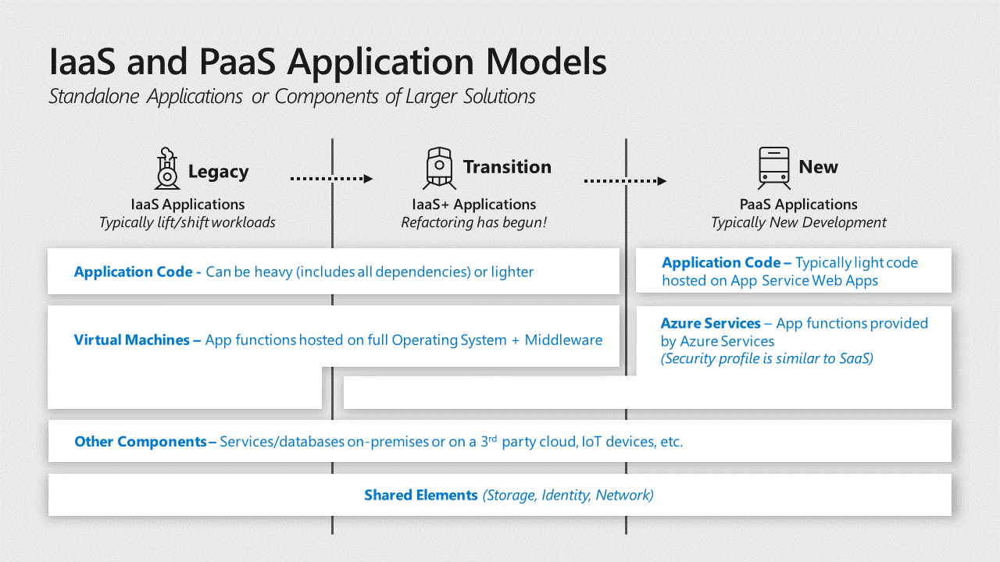

# app-design

Applications and the data associated with them ultimately act as the primary
store of business value on a cloud platform. While the platform components like
identity and storage are critical elements of the security environment,
applications play an outsize role in risks to the business because:

-   **Business Processes** are encapsulated and executed by applications and
    services need to be available and provided with high integrity

-   **Business Data** is stored and processed by application workloads and
    requires high assurances of confidentiality, integrity, and availability.

This section focuses on applications written by your organization or by others
on behalf of your organization vs. SaaS or commercially available applications
installed on IaaS VMs.

Modern cloud platforms like Azure can host both legacy and modern generations of
applications

-   **Legacy** applications are hosted on Infrastructure as a Service (IaaS)
    virtual machines that typically include all dependencies including OS,
    middleware, and other components.

-   **Modern** Platform as a Service (PaaS) applications don’t require the
    application owner to manage and secure the underlying server operating
    systems (OSes) and are sometimes fully 'Serverless' and built primarily
    using functions as a service.

    **Notes:** Popular forms of modern applications are application code hosted
    on Azure App Services and containerized applications (though containers can
    also be hosted on IaaS VMs or on-premises as well).

-   **Hybrid** – While hybrid applications can take many forms, the most common
    is an &quot;IaaS plus&quot; state where legacy applications are transitioning to a
    modern architecture with modern services replacing legacy components or
    being added a legacy application.

Securing an application requires security assurances for three different
component types:

-   **Application Code** – This is the logic that defines the custom application
    that you write. The security of this code is the application owners’
    responsibility in all generations of application architecture including any
    open-source snippets or components included in the code. Securing the code
    requires identifying and mitigating risks from the design and implementation
    of the application as well as assessing supply chain risk of included
    components. Note that the evolution of applications into [microservices
    architectures](/azure/service-fabric/service-fabric-overview-microservices)
    will break various aspects of application code into smaller services vs. a
    single monolithic codebase.

-   **Application Services** – These are the various standardized components
    that the application uses such as databases, identity providers, event hubs,
    IoT device management, and so on. For cloud services this is a shared
    responsibility:

    -   **Cloud Provider -** The security of the underlying service is the
        responsibility of the cloud provider

    -   **Application Owner** - The application owner is responsible for
        security implications of the configuration and operation of the service
        instance(s) used by the application including any data stored and
        processed on the service.

-   **Application Hosting Platform** – This is the computing environment where
    the application actually executes and runs. In an enterprise with
    applications hosted on premises, in Azure and in third-party clouds like
    Amazon Web Services (AWS), this could take many forms with significant
    variations on who is responsible for security:

    -   **Legacy Applications** typically require a full operating system (and
        any middleware) hosted on physical or virtualized hardware. The virtual
        hardware can be hosted on premises or on Infrastructure as a Service
        (IaaS) VMs. This operating system and installed middleware/other
        components are operated and secured by the application owner or their
        infrastructure team(s).  
        The responsibility for the physical hardware and OS virtualization
        components (virtualization hosts, operating systems, and management
        services) varies:

        -   **On premises** - The application owner or their organization is
            responsible for maintenance and security.

        -   **IaaS** – The cloud provider is responsible for maintenance and
            security of the underlying infrastructure and the application
            owner’s organization is responsible for the VM configuration,
            operating system, and any components installed on it.

    -   **Modern Applications** are hosted on Platform as a Service (PaaS)
        environments such as an Azure application service. In most application
        service types, the underlying operating system is abstracted from the
        application owner and secured by the cloud provider. Application owners
        are responsible for the security of the application service
        configurations that are provided to them.

    -   **Containers** are an application packaging mechanism in which
        applications are abstracted from the environment in which they run.
        These containerized applications fit into either the legacy or modern
        models above depending on whether they are run on a container service by
        the cloud provider (Modern Applications) or on a server managed by the
        organization (on premises or in IaaS). See the [container security
        section](#follow-best-practices-for-container-security) below for more details.<!-- Distributed denial-of-service protection -->
[!include[234e0781-2cb6-43c2-a21e-b8e6270d3e72](../../../includes/aar_guidance/234e0781-2cb6-43c2-a21e-b8e6270d3e72.md)]

<!-- Role-based access controls (RBAC) -->
[!include[6bb71142-3759-443a-8cc6-9b78cb88e175](../../../includes/aar_guidance/6bb71142-3759-443a-8cc6-9b78cb88e175.md)]

<!-- Secret management -->
[!include[63ed4f9d-7227-4c4d-96eb-ce9bedc9d6f9](../../../includes/aar_guidance/63ed4f9d-7227-4c4d-96eb-ce9bedc9d6f9.md)]

<!-- Keys in source code -->
[!include[0846d834-ff2c-4c6a-91f7-5f1a9920d59b](../../../includes/aar_guidance/0846d834-ff2c-4c6a-91f7-5f1a9920d59b.md)]

<!-- Infosec team -->
[!include[d950321f-21b9-4b8d-b6ed-18dc1cf43912](../../../includes/aar_guidance/d950321f-21b9-4b8d-b6ed-18dc1cf43912.md)]

<!-- Seperation of duties -->
[!include[e566ca8d-b98f-4c81-93df-1985f2082814](../../../includes/aar_guidance/e566ca8d-b98f-4c81-93df-1985f2082814.md)]

