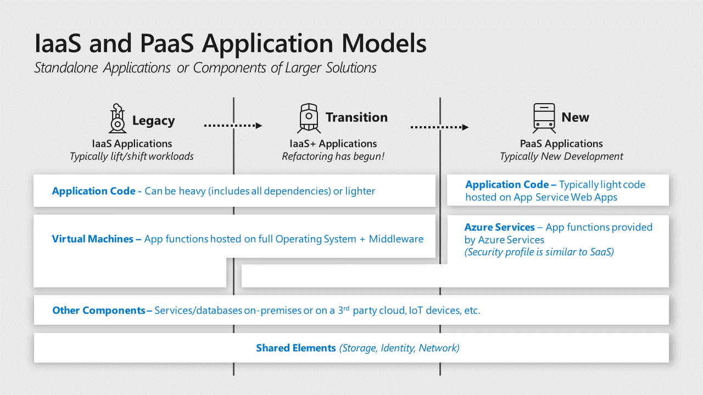
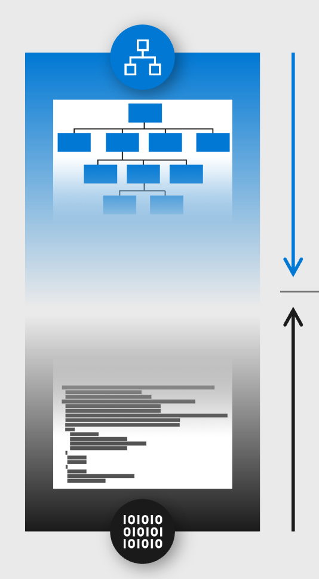

# Applications and services

Applications and the data associated with them ultimately act as the primary
store of business value on a cloud platform. While the platform components like
identity and storage are critical elements of the security environment,
applications play an outsize role in risks to the business because:

-   **Business Processes** are encapsulated and executed by applications and
    services need to be available and provided with high integrity

-   **Business Data** is stored and processed by application workloads and
    requires high assurances of confidentiality, integrity, and availability.

This section focuses on applications written by your organization or by others
on behalf of your organization vs. SaaS or commercially available applications
installed on IaaS VMs.

Modern cloud platforms like Azure can host both legacy and modern generations of
applications

-   **Legacy** applications are hosted on Infrastructure as a Service (IaaS)
    virtual machines that typically include all dependencies including OS,
    middleware, and other components.

-   **Modern** Platform as a Service (PaaS) applications don’t require the
    application owner to manage and secure the underlying server operating
    systems (OSes) and are sometimes fully “Serverless” and built primarily
    using functions as a service.

    **Notes:** Popular forms of modern applications are application code hosted
    on Azure App Services and containerized applications (though containers can
    also be hosted on IaaS VMs or on-premises as well).

-   **Hybrid** – While hybrid applications can take many forms, the most common
    is an “IaaS plus” state where legacy applications are transitioning to a
    modern architecture with modern services replacing legacy components or
    being added a legacy application.

Securing an application requires security assurances for three different
component types:

-   **Application Code** – This is the logic that defines the custom application
    that you write. The security of this code is the application owners’
    responsibility in all generations of application architecture including any
    open-source snippets or components included in the code. Securing the code
    requires identifying and mitigating risks from the design and implementation
    of the application as well as assessing supply chain risk of included
    components. Note that the evolution of applications into [microservices
    architectures](https://docs.microsoft.com/azure/service-fabric/service-fabric-overview-microservices)
    will break various aspects of application code into smaller services vs. a
    single monolithic codebase.

-   **Application Services** – These are the various standardized components
    that the application uses such as databases, identity providers, event hubs,
    IoT device management, and so on. For cloud services this is a shared
    responsibility:

    -   **Cloud Provider -** The security of the underlying service is the
        responsibility of the cloud provider

    -   **Application Owner** - The application owner is responsible for
        security implications of the configuration and operation of the service
        instance(s) used by the application including any data stored and
        processed on the service.

-   **Application Hosting Platform** – This is the computing environment where
    the application actually executes and runs. In an enterprise with
    applications hosted on premises, in Azure and in third-party clouds like
    Amazon Web Services (AWS), this could take many forms with significant
    variations on who is responsible for security:

    -   **Legacy Applications** typically require a full operating system (and
        any middleware) hosted on physical or virtualized hardware. The virtual
        hardware can be hosted on premises or on Infrastructure as a Service
        (IaaS) VMs. This operating system and installed middleware/other
        components are operated and secured by the application owner or their
        infrastructure team(s).  
        The responsibility for the physical hardware and OS virtualization
        components (virtualization hosts, operating systems, and management
        services) varies:

        -   **On premises** - The application owner or their organization is
            responsible for maintenance and security.

        -   **IaaS** – The cloud provider is responsible for maintenance and
            security of the underlying infrastructure and the application
            owner’s organization is responsible for the VM configuration,
            operating system, and any components installed on it.

    -   **Modern Applications** are hosted on Platform as a Service (PaaS)
        environments such as an Azure application service. In most application
        service types, the underlying operating system is abstracted from the
        application owner and secured by the cloud provider. Application owners
        are responsible for the security of the application service
        configurations that are provided to them.

    -   **Containers** are an application packaging mechanism in which
        applications are abstracted from the environment in which they run.
        These containerized applications fit into either the legacy or modern
        models above depending on whether they are run on a container service by
        the cloud provider (Modern Applications) or on a server managed by the
        organization (on premises or in IaaS). See the [container security
        section](#follow-best-practices-for-container-security) below for more details.

## Identify and classify business critical applications

Ensure you have identified and classified the applications in your portfolio
that are critical to business functions.

Enterprise organizations typically have a large application portfolio, so
prioritizing where to invest time and effort into manual and resource-intensive
tasks like threat modeling can increase the effectiveness of your security
program.

Identify applications that have a high potential impact and/or a high potential
exposure to risk.

-   **High potential impact** – Identify application that would a significant
    impact on the business if compromised. This could take the form of one or
    more of:

    -   **Business critical data** – Applications that process or store
        information, which would cause significant negative business or mission
        impact if an assurance of confidentiality, integrity, or availability is
        lost.

    -   **Regulated data** – Applications that handle monetary instruments and
        sensitive personal information regulated by standards. For example, payment card
        industry (PCI) and Health Information Portability and Accountability Act (HIPAA).

    -   **Business critical availability** – Applications whose functionality is
        critical to organizations business mission such as production lines
        generating revenue, devices, or services critical to life and safety, and
        other critical functions.

    -   **Significant Access** – Applications which have access to systems with
        a high potential impact through technical means such as

        -   *Stored Credentials* or keys/certificates that grant access to the
            data/service

        -   *Permissions* granted via access control lists or other means

-   **High exposure to attacks** – Applications that are easily accessible to
    attackers such as web applications on the open internet. Legacy applications
    can also be higher exposure as attackers and penetration testers
    frequently target them because they know these legacy applications often
    have vulnerabilities that are difficult to fix.

## Adopt the DevOps approach 

Organizations should shift from a ‘Waterfall’ development cycle to DevOps
lifecycle of continuous integration, continuous delivery (CI/CD) for
applications as fast as is practical. DevOps is the union of people, processes,
and tools that enable continuous delivery of value to end users. The
contraction of Dev and Ops refers to combining the development and operations
disciplines into multi-disciplinary teams that work together with shared and
efficient practices and tools.

The DevOps model increases the organization’s ability to rapidly address
security concerns without waiting for a longer planning and testing cycle of a
waterfall model.

## Follow DevOps security guidance

Organizations should leverage guidance and automation for securing applications
on the cloud rather than starting from zero.

Using resources and lessons learned by external organizations that are early
adopters of these models can accelerate the improvement of an organization’s
security posture with less expenditure of effort and resources.

-   Microsoft has released a toolkit for Secure DevOps on Azure –  
    <https://azsk.azurewebsites.net/>

-   Organization for Web App Security Project (OWASP) has published guidance
    DevOps Pipeline security  
    <https://www.owasp.org/index.php/OWASP_AppSec_Pipeline#tab=Main>

## Use Cloud services instead of custom implementations

Developers should use services available from your cloud provider for
well-established functions like databases, encryption, identity directory, and
authentication instead of writing custom versions of them.

These services provide better security, reliability, and efficiency because
cloud providers operate and secure them with dedicated teams with deep expertise
in those areas. Using these services also frees your developer resources from
reinventing the proverbial wheel so that they can focus development time on your
unique requirements for your business. This practice should be followed to avoid
risk during new application development as well as to reduce risk in existing
applications either during planned update cycle or with a security-focused
application update.

Several capabilities that should be prioritized first because of potential
security impact:

-   **Identity** – User directories and other authentication functions are
    complex to develop and critically important to security assurances. Avoid
    using homegrown authentication solutions and favor mature capabilities like
    Azure Active Directory ([Azure
    AD](https://docs.microsoft.com/azure/active-directory/)), [Azure AD
    B2B](https://docs.microsoft.com/azure/active-directory/b2b/), [Azure
    AD B2C](https://docs.microsoft.com/azure/active-directory-b2c/), or
    third-party solutions to authenticate and grant permission to users, partners,
    customers, applications, services, and other entities.

-   **Data Protection** – Developers should use established capabilities from
    cloud providers such as native encryption in cloud services to encrypt and
    protect data. The security world is littered with examples of failed
    attempts to protect data or passwords that didn’t stand up to real world
    attacks. If direct use of cryptography is required, developers should call
    well-established cryptographic algorithms and not attempt to invent their
    own.

-   **Key management** – Ideally use identity for authentication rather than
    directly handling keys (see [Prefer Identity Authentication over Keys](#prefer-identity-authentication-over-keys)).
    For situations where accessing services that require access to keys,
    leverage a key management service like [Azure Key
    Vault](https://docs.microsoft.com/azure/key-vault/) or AWS [Key
    Management Service](https://aws.amazon.com/kms/) to manage and secure these
    keys rather than attempting to safely handle keys in application code. You
    can use [CredScan](https://secdevtools.azurewebsites.net/helpcredscan.html)
    to discover potentially exposed keys in your application code.

-   **Application Configurations** – Inconsistent configurations for
    applications can create security Risks. Azure App Configuration provides a
    service to centrally manage application settings and feature flags, which
    helps mitigate this risk.

## Use Native Security capabilities in application services

Use native security capabilities built into cloud services instead of adding
external security components (for data encryption, network traffic filtering,
threat detection, and other functions).

Native security controls are maintained and supported by the service provider,
eliminating or reducing effort required to integrate external security tooling
and update those integrations over time. Cloud services evolve rapidly, which
greatly increases the burden of maintaining an external tool and increases risk
of losing security visibility and protections from these tools if the tool
doesn’t keep up with the cloud service.

-   List of Azure Services  
    <https://azure.microsoft.com/services/>

-   Native security capabilities of each service  
    <https://docs.microsoft.com/azure/security/common-security-attributes>

## Prefer Identity Authentication over Keys

Always authenticate with identity services rather than cryptographic keys when
available.

Managing keys securely with application code is difficult and regularly leads to
mistakes like accidentally publishing sensitive access keys to code repositories
like GitHub. Identity systems offer secure and usable experience for access
control with built-in sophisticated mechanisms for key rotation, monitoring for
anomalies, and more. Most organizations also have skilled teams dedicated to
managing identity systems and few (if any) people actively managing key security
systems.

For services that offer the Azure AD authentication like [Azure
Storage](https://docs.microsoft.com/azure/storage/common/storage-security-attributes),
[Azure App
Service](https://docs.microsoft.com/azure/app-service/app-service-security-attributes),
[Azure
Backup](https://docs.microsoft.com/azure/backup/backup-security-attributes),
use it for authentication and authorization. To further simplify using
identities for developers, you can also take advantage of [managed
identities](https://docs.microsoft.com/azure/active-directory/managed-identities-azure-resources/)
to assign identities to resources like VMs and App Services so that developers
don’t have to manage identities within the application.

## Bottom-up approach to reduce security bug volume and impact

Reduce the count and potential severity of security bugs in your application by
implementing security practices and tools during the development lifecycle.

Security bugs can result in an application disclosing confidential data,
allowing criminals to alter data/records, or the data/application becoming
unavailable for use by customers and employees. Applications will always have
some logic errors that can result in security risk, so it is important to
discover, evaluate, and correct them to avoid damage to the organization’s
reputation, revenue, or margins. It is easier and cheaper to resolve these
earlier in the development lifecycle than it is to correct them after
application has completed testing, is in production use, or has been breached
frequently called “shift left” or “push left” principle.

Mitigating application risk is achieved by integrating security practices and
tools into the development lifecycle, often called a secure development
lifecycle (SDL or SDLC). Microsoft has published a number of recommendations in
a whitepaper entitled [Develop Secure Apps on
Azure](https://docs.microsoft.com/azure/security/abstract-develop-secure-apps)
based on Microsoft’s [Security Development
Lifecycle](https://www.microsoft.com/SDL) to mitigate common risks with input
and output validation, perform fuzz testing, attack surface reviews, and more.

## Top-down approach through threat modeling

Perform threat modeling on your business-critical applications to discover and
mitigate potential risks to your organization.

Threat modeling identifies risks to the application itself as well as risks
that application may pose to your enterprise particularly when evaluating
individual applications in a larger system.

Threat modeling can be used at any stage of application development or
production, but it is uniquely effective for the design stages of new
functionality because no real-world data yet exists for that application.

Because threat modeling is a skill intensive exercise, we recommend taking
measures to minimize time investment while maximizing security value:

1.  **Prioritize by risk** - Apply threat modeling first to business-critical
    applications that would have an outsize impact on the business if
    compromised

2.  **Limit Scope -** Perform threat modeling in progressive stages of detail
    to quickly identify quick wins and actionable mitigations before spending a
    lot of manual effort:

    1.  **Start with simple questions** method (See [Simple questions method](#simple-questions-method)) documented below to quickly get insight into risks and whether
        basic protections are in place

    2.  **Progressively evaluate Application Design** – as resource and
        expertise are available, move to a more advanced analysis using the
        STRIDE method [Advanced threat modeling techniques](#top-down-approach-through-threat-modeling) or
        another similar one already used by your team. Start with the
        architecture level design and progressively increase detail as time and
        resources allow:

        1.  **System level design** – includes applications and how they
            interact with each other

        2.  **Application level** – includes components of the application and
            how they interact with each other

        3.  **Component level** – includes how the individual component is
            composed and how each element of it interacts with each other

3.  **Align with Development lifecycle –** Optimize your efforts by aligning
    threat modeling activities with your application development lifecycles.

    1.  **Waterfall** – ensure major projects should include threat modeling
        during the design process and during significant updates to the
        application.

    2.  **DevOps** –Trigger threat modeling activities at a frequency that adds
        security value without over-burdening the development teams. Good
        integration points are during the introduction of significant features
        or changes to the application and a regular recurring calendar schedule
        for example, every quarter for business-critical applications.

    3.  **Legacy applications –** These applications typically lack support,
        source code access, and/or expertise in the organization, so perform
        threat modeling on a best effort basis with what application
        knowledge/expertise you have available.

### Simple questions method 

>   This simple questioning method is designed to get security professionals and
>   developers started on threat modelling before moving on to a more advanced
>   method like STRIDE or OWASP’s method (see, [Top-down approach through threat modeling](#top-down-approach-through-threat-modeling)).

>   For each application or component, ask and answer these questions

-   Are you authenticating connections using Azure AD, TLS (with mutual
    authentication), or another modern security protocol approved by your
    security team? This protects against unauthorized access to the application
    and data

    -   Between users and the application (if applicable)

    -   Between different application components and services (if applicable)

-   Do you limit which accounts have access to write or modify data in the
    application to only those required to do so? This reduces risk of
    unauthorized data tampering/alteration

-   Is the application activity logged and fed into a Security Information and
    Event Management (SIEM) via Azure Monitor or a similar solution? This helps
    the security team detect attacks and quickly investigate them.

-   Is business-critical data protected with encryption that has been approved
    by the security team? This helps protect against unauthorized copying of
    data while at rest.

-   Is inbound and outbound network traffic encrypted using TLS? This helps
    protect against unauthorized copying of data while in transit.

-   Is the application protected against Distributed Denial of Service (DDoS)
    attacks using services like Azure DDoS protection, Akamai, or similar? This
    protects against attacks designed to overload the application so it can’t be
    used

-   Does the application store any sign in credentials or keys to access other
    applications, databases, or services? This helps identify whether an attack
    can use your application to attack other systems.

-   Do the application controls allow you to fulfill security and privacy
    requirements for the localities you operate in? (This helps protect user’s private data and avoid compliance fines)

>   **Important:** Security is a complex topic and the potential risks are
>   limited only by the imagination of smart motivated attackers. These
>   questions are designed to help identify readily discoverable gaps that are
>   easily exploited by attackers. As you develop comfort and competencies with
>   this method, you can look to grow your ability to threat model by
>   progressing to advanced threat modelling techniques.

### Advanced threat modeling techniques

>   A more comprehensive threat model can identify more potential risks, two
>   popular techniques are STRIDE and OWASP

-   **Microsoft** Security Development Lifecycle has documented a process of
    threat modeling in and released a free tool to assist with this process

    -   This method evaluates application components and
        connections/relationships against potential risks, which map to the
        STRIDE mnemonic:

        -   Spoofing

        -   Tampering

        -   Repudiation

        -   Information Disclosure

        -   Denial of Service

        -   Privilege Elevation

    -   This method can be applied to any level of the design from the high
        level architectural specific application components.

-   **OWASP –** The Open Web Application Security Project (OWASP) has documented
    a threat modeling approach for applications, which refers to STRIDE and
    other methods
    <https://www.owasp.org/index.php/Application_Threat_Modeling>

## Use Web Application Firewalls

Web application firewalls (WAFs) mitigate the risk of an attacker being able to
exploit commonly seen security vulnerabilities for applications. While not
perfect, WAFs provide a basic minimum level of security for web applications.

WAFs are an important mitigation as attackers target web applications for an
ingress point into an organization similar to a client endpoint. WAFs are
appropriate for both

-   Organizations without a strong application security program as it’s a
    critical safety measure(much like a parachute in a plane. Note that this
    shouldn’t be the only planned safety mechanism to reduce the volume and
    severity of security bugs in your applications. For details, see [Reduce security bug volume and impact](#bottom-up-approach-to-reduce-security-bug-volume-and-impact).

-   Organizations who have invested in application security as WAFs provide a
    valuable additional defense in-depth mitigation. WAFs in this case act as a
    final safety mechanism in case a security bug was missed by security
    practices in the development lifecycle.

Microsoft includes WAF capabilities in [Azure Application
Gateway](https://azure.microsoft.com/services/application-gateway/) and
many vendors offer these capabilities as standalone security appliances or as
part of next generation firewalls.

## Follow best practices for container security

Applications hosted in containers should follow general application best
practices as well as some specific guidelines to manage this new application
architecture type

Containerized applications face the same risks as any application and also adds
new requirements to securely the hosting and management of the containerized
applications.

Application containers architectures introduced a new layer of abstraction and
management tooling (typically Kubernetes) that have increased developer
productivity and adoption of DevOps principles.

While this is an emerging space that is evolving rapidly, several key lessons
learned and best practices have become clear:

-   **Use a Kubernetes managed service instead of installing and managing
    Kubernetes**  
    Kubernetes is a very complex system and still has a number of default
    settings that are not secure and few Kubernetes security experts in the
    marketplace. While this has been improving in recent years with each
    release, there are still a lot of risks that have to be mitigated.

-   **Validate container + container supply chain**  
    Just as you should validate the security of any open-source code added to
    your applications, you should also validate containers you add to your
    applications.

    -   Ensure that the practices applied to building the container are
        validated against your security standards like application of security
        updates, scanning for unwanted code like backdoors and illicit crypto
        coin miners, scanning for security vulnerabilities, and application of
        secure development practices.

    -   Regularly scan containers for known risks in the container registry,
        before use, or during use.

-   **Set up registry of known good containers**  
    This allows developers in your organization to use containers validated by
    security rapidly with low friction. Additionally, build a process for
    developer to request and rapidly get security validation of new containers
    to encourage developers to use this process vs. working around it.

-   **Don’t run containers as root or administrator unless explicitly
    required**  
    Early versions of containers required root privileges (which makes attacks
    easier), but this is no longer required with current versions.

-   **Monitor containers**  
    Ensure you deploy security monitoring tools that are container aware to
    monitor for anomalous behavior and enable investigation of incidents.
