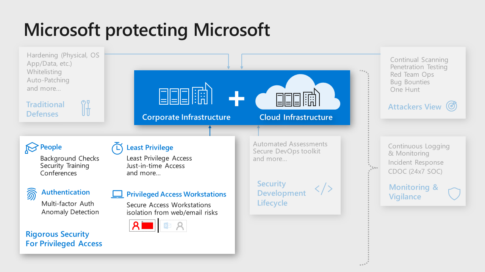

# Administration

Administration is the practice of monitoring, maintaining, and operating
Information Technology (IT) systems to meet service levels that the business
requires. Administration introduces some of the highest impact security risks
because performing these tasks requires privileged access to a very broad set
of these systems and applications. Attackers know that gaining access to an
account with administrative privileges can get them access to most or all of the
data they would target, making the security of administration one of the most
critical security areas.

As an example, Microsoft makes significant investments in protection and
training of administrators for our cloud systems and IT systems:

Microsoft’s recommended core strategy for administrative privileges is to use
the available controls to reduce risk

**Reduce risk exposure (scope and time) –** The principle of least privilege
    is best accomplished with modern controls that provide privileges on demand.
    This help to limit risk by limiting administrative privileges exposure by:

-  **Scope** – *Just Enough Access (JEA)* provides only the required
        privileges for the administrative operation required (vs. having direct
        and immediate privileges to many or all systems at a time, which is
        almost never required).

-  **Time** – *Just in Time (JIT)* approaches provided the required
        privileged as they are needed.

-  **Mitigate the remaining risks** – Use a combination of preventive and
        detective controls to reduce risks such as isolating administrator
        accounts from the most common risks phishing and general web browsing,
        simplifying and optimizing their workflow, increasing assurance of
        authentication decisions, and identifying anomalies from normal baseline
        behavior that can be blocked or investigated.

Microsoft has captured and documented best practices for protecting
administrative accounts and published prioritized roadmaps for protecting privileged
access that can be used as references for prioritizing mitigations for
accounts with privileged access.

-   [Securing Privileged Access (SPA) roadmap for administrators of on premises
    Active Directory](https://aka.ms/SPARoadmap)

-   [Guidance for securing administrators of Azure Active Directory](https://aka.ms/securitysteps)

## Minimize number of critical impact admins

Grant the fewest number of accounts to privileges that can have a critical
business impact

Each admin account represents potential attack surface that an attacker can
target, so minimizing the number of accounts with that privilege helps limit the
overall organizational risk. Experience has taught us that membership of these
privileged groups grows naturally over time as people change roles if membership
not actively limited and managed.

We recommend an approach that reduces this attack surface risk while ensuring
business continuity in case something happens to an administrator:

-   Assign at least two accounts to the privileged group for business continuity

-   When two or more accounts are required, provide justification for each
    member including the original two

-   Regularly review membership & justification for each group member

## Managed accounts for admins

Ensure all critical impact admins in are managed by enterprise directory to
follow organizational policy enforcement.

Consumer accounts such as  Microsoft accounts like \@Hotmail.com,
\@live.com, \@outlook.com, don’t offer sufficient security visibility and
control to ensure the organization’s policies and any regulatory requirements
are being followed. Because Azure deployments often start small and informally
before growing into enterprise-managed tenants, some consumer accounts remain as
administrative accounts long afterward for example, original Azure project managers,
creating blind spots, and potential risks.

## Separate accounts for admins

Ensure all critical impact admins have a separate account for administrative
tasks (vs the account they use for email, web browsing, and other productivity
tasks).

Phishing and web browser attacks represent the most common attack vectors to
compromise accounts, including administrative accounts.

Create a separate administrative account for all users that have a role
requiring critical privileges. For these administrative accounts, block
productivity tools like Office 365 email (remove license). If possible, block
arbitrary web browsing (with proxy and/or application controls) while allowing
exceptions for browsing to the Azure portal and other sites required for
administrative tasks.

## No standing access / Just in Time privileges

Avoid providing permanent “standing” access for any critical impact accounts

Permanent privileges increase business risk by increasing the time an attacker
can use the account to do damage. Temporary privileges force attackers targeting
an account to either work within the limited times the admin is already using
the account or to initiate privilege elevation (which increases their chance of
being detected and removed from the environment).

Grant privileges required only as required using one of these methods:

-   **Just in Time -** Enable Azure AD Privileged Identity Management (PIM) or a
    third party solution to require following an approval workflow to obtain
    privileges for critical impact accounts

-   **Break glass –** For rarely used accounts, follow an emergency access
    process to gain access to the accounts. This is preferred for privileges
    that have little need for regular operational usage like members of global
    admin accounts.

## Emergency access or ‘Break Glass’ accounts

Ensure you have a mechanism for obtaining administrative access in case of an
emergency

While rare, sometimes extreme circumstances arise where all normal means of
administrative access are unavailable.

We recommend following the instructions at [Managing emergency access administrative accounts in Azure AD](https://docs.microsoft.com/azure/active-directory/users-groups-roles/directory-emergency-access)
and ensure that security operations monitor these accounts carefully.

## Admin workstation security

Ensure critical impact admins use a workstation with elevated security
protections and monitoring

Attack vectors that use browsing and email like phishing are cheap and common.
Isolating critical impact admins from these risks will significantly lower your
risk of a major incident where one of these accounts is compromised and used to
materially damage your business or mission.

Choose level of admin workstation security based on the options available at
<https://aka.ms/securedworkstation>

-   **Highly Secure Productivity Device (Enhanced Security Workstation or
    Specialized Workstation)**  
    You can start this security journey for critical impact admins by providing
    them with a higher security workstation that still allows for general
    browsing and productivity tasks. Using this as an interim step helps ease
    the transition to fully isolated workstations for both the critical impact
    admins as well as the IT staff supporting these users and their
    workstations.

-   **Privileged Access Workstation (Specialized Workstation or Secured
    Workstation)**  
    These configurations represent the ideal security state for critical impact
    admins as they heavily restrict access to phishing, browser, and
    productivity application attack vectors. These workstations don’t allow
    general internet browsing, only allow browser access to Azure portal and
    other administrative sites.

## Critical impact admin dependencies – Account/Workstation

Carefully choose the on-premises security dependencies for critical impact
accounts and their workstations

To contain the risk from a major incident on-premises spilling over to become a
major compromise of cloud assets, you must eliminate or minimize the means of
control that on premises resources have to critical impact accounts in the
cloud. As an example, attackers who compromise the on premises Active Directory
can access and compromise cloud-based assets that rely on those accounts like
resources in Azure, Amazon Web Services (AWS), ServiceNow, and so on. Attackers
can also use workstations joined to those on premises domains to gain access to
accounts and services managed from them.

Choose the level of isolation from on premises means of control also known as
security dependencies for critical impact accounts

-   **User Accounts** – Choose where to host the critical impact accounts

    -   Native Azure AD Accounts -*Create Native Azure AD Accounts that are
        not synchronized with on-premises active directory

    -   Synchronize from On Premises Active Directory (Not Recommended see [Don’t synchronize on-premises admin accounts to cloud identity providers](/azure/architecture/security/identity#dont-synchronize-on-premises-admin-accounts-to-cloud-identity-providers))- Leverage existing accounts hosted in the on premises active
        directory.

-   **Workstations** – Choose how you will manage and secure the workstations
    used by critical admin accounts:

    -  Native Cloud Management & Security (Recommended) - Join workstations
        to Azure AD & Manage/Patch them with Intune or other cloud services.
        Protect and Monitor with Windows Microsoft Defender ATP or another cloud
        service not managed by on premises based accounts.

    -   Manage with Existing Systems - Join existing AD domain & leverage
        existing management/security.

This is related to the [Don’t synchronize on-premises admin accounts to cloud identity providers](/azure/architecture/security/identity#dont-synchronize-on-premises-admin-accounts-to-cloud-identity-providers) to
cloud identity providers guidance in the administration section that mitigates
the inverse risk of pivoting from cloud assets to on-premises assets

## Passwordless Or multi-factor authentication for admins

Require all critical impact admins to use passwordless authentication or
multi-factor authentication (MFA).

Attack methods have evolved to the point where passwords alone cannot reliably
protect an account. This is well documented in a [Microsoft Ignite Session](https://channel9.msdn.com/events/Ignite/Microsoft-Ignite-Orlando-2017/BRK3016).

Administrative accounts and all critical accounts should use one of the
following methods of authentication. These capabilities are listed in preference
order by highest cost/difficulty to attack (strongest/preferred options) to
lowest cost/difficult to attack:

-   **Passwordless (such as Windows Hello)**  
    <https://aka.ms/HelloForBusiness>

-   **Passwordless (Authenticator App)**  
    <https://docs.microsoft.com/azure/active-directory/authentication/howto-authentication-phone-sign-in>

-   **Multifactor Authentication**  
    <https://docs.microsoft.com/azure/active-directory/authentication/howto-mfa-userstates>

Note that SMS Text Message based MFA has become very inexpensive for attackers
to bypass, so we recommend you avoid relying on it. This option is still
stronger than passwords alone, but is much weaker than other MFA options

## Enforce conditional access for admins - Zero Trust

Authentication for all admins and other critical impact accounts should include
measurement and enforcement of key security attributes to support a Zero Trust
strategy.

Attackers compromising Azure Admin accounts can cause significant harm.
Conditional Access can significantly reduce that risk by enforcing security
hygiene before allowing access to Azure management.

Configure [Conditional Access policy for Azure management](https://docs.microsoft.com/azure/role-based-access-control/conditional-access-azure-management)
that meets your organization’s risk appetite and operational needs.

-   Require Multifactor Authentication and/or connection from designated work
    network

-   Require Device **integrity with Microsoft Defender ATP** (Strong Assurance)

## Avoid granular and custom permissions

Avoid permissions that specifically reference individual resources or users

Specific permissions create unneeded complexity and confusion as they don’t
carry the intention to new similar resources. This then accumulates into a
complex legacy configuration that is difficult to maintain or change without
fear of “breaking something” – negatively impacting both security and solution
agility.

Instead of assigning specific resource-specific permissions, use either

-   Management Groups for enterprise-wide permissions

-   Resource groups for permissions within subscriptions

Instead of granting permissions to specific users, assign access to groups in
Azure AD. If there isn’t an appropriate group, work with the identity team to
create one. This allows you to add and remove group members externally to Azure
and ensure permissions are current, while also allowing the group to be used for
other purposes such as mailing lists.

## Use built-in roles

Use built-in roles for assigning permissions where possible.

Customization leads to complexity that increases confusion and makes automation
more complex, challenging, and fragile. These factors all negatively impact
security

We recommend that you evaluate the [built-in roles](https://docs.microsoft.com/azure/active-directory/role-based-access-built-in-roles)
designed to cover most normal scenarios. [Custom roles](https://docs.microsoft.com/azure/active-directory/role-based-access-control-custom-roles)
are a powerful and sometimes useful capability, but they should be reserved for
cases when built in roles won’t work.

## Establish lifecycle management for critical impact accounts

Ensure you have a process for disabling or deleting administrative accounts when
admin personnel leave the organization (or leave administrative positions)

See [Regularly review critical access](/azure/architecture/security/governance#regularly-review-critical-access) for more details.

## Attack simulation for critical impact accounts

Regularly simulate attacks against administrative users with current attack
techniques to educate and empower them.

People are a critical part of your defense, especially your personnel with
access to critical impact accounts. Ensuring these users (and ideally all users)
have the knowledge and skills to avoid and resist attacks will reduce your
overall organizational risk.

You can use [Office 365 Attack Simulation](https://docs.microsoft.com/office365/securitycompliance/attack-simulator)
capabilities or any number of third party offerings.