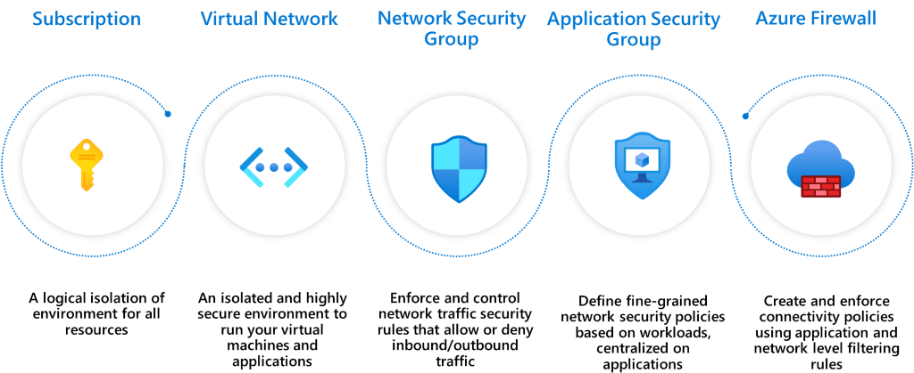
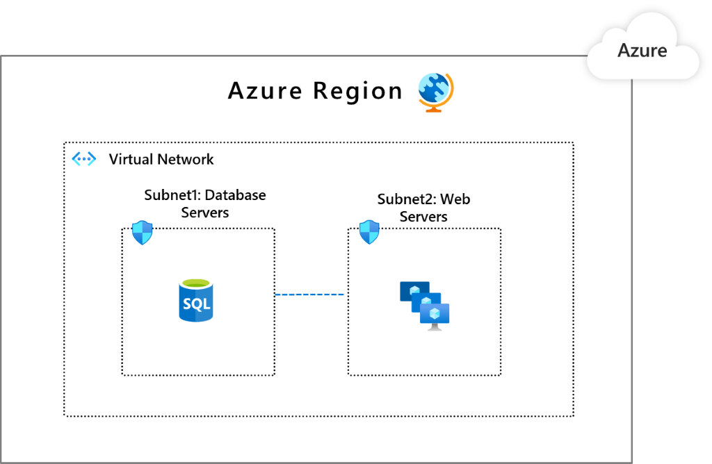
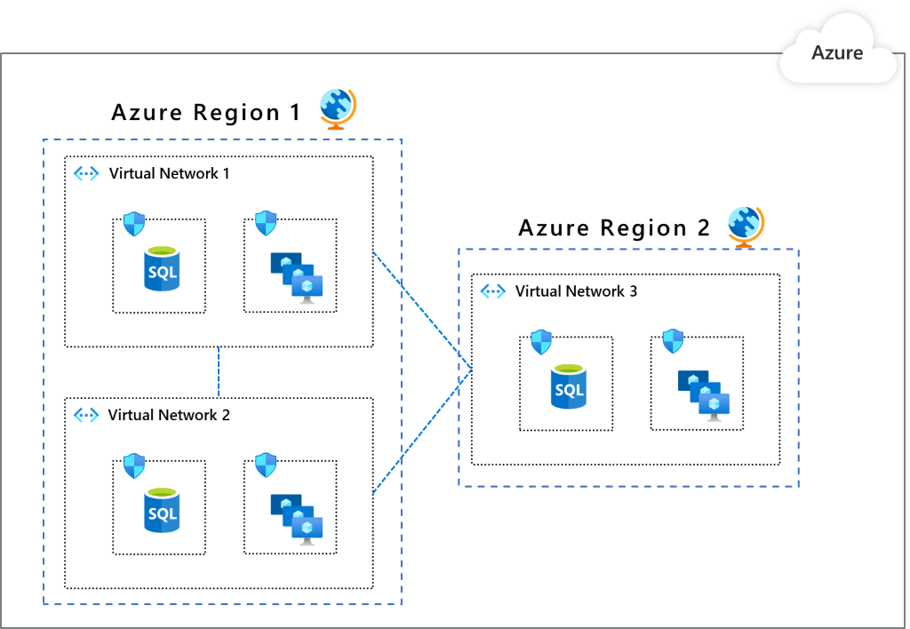
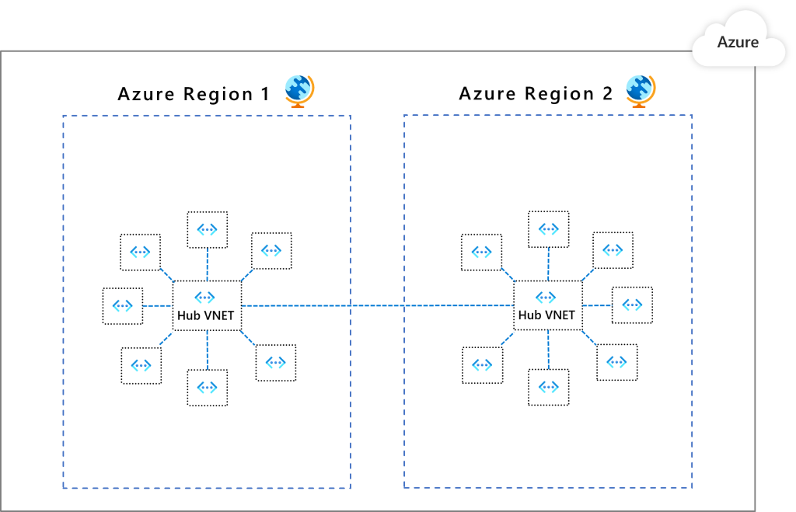

# Implement network segmentation patterns on Azure

A unified enterprise segmentation strategy guides technical teams to consistently segment access using networking, applications, identity, and any other access controls.  Create segmentation in your network footprint by defining perimeters. The main reasons for segmentation are:

- The ability to group related assets that are a part of (or support) workload operations.
- Isolation of resources.
- Governance policies set by the organization.

_Assume compromise_ is the recommended cybersecurity mindset and the ability to contain an attacker is vital in protecting information systems. Model an attacker able to achieve a foothold at various points within the workload and establish controls to mitigate further expansion.

Network controls can secure interactions between perimeters. This approach can strengthen the security posture and contain risks in a breach because the controls can detect, contain, and stop attackers from gaining access to an entire workload.

Containment of attack vectors within an environment is critical. However, to be effective in cloud environments, traditional approaches may prove inadequate and security organizations may need to evolve their methods.

Traditional segmentation approaches typically fail to achieve their goals as they have not been developed in a method to align with business use cases and application workloads. Often this results in overwhelming complexity requiring broad firewall exceptions.

An evolving emerging best practice recommendation is to adopt a Zero Trust strategy based on user, device, and application identities. In contrast to network access controls that are based on elements such as source and destination IP address, protocols, and port numbers, Zero Trust enforces and validates access control at _access time_. This avoids the need to play a prediction game for an entire deployment, network, or subnet — only the destination resource needs to provide the necessary access controls.

- Azure Network Security Groups can be used for basic layer 3 and 4 access controls between Azure Virtual Networks, their subnets, and the internet.
- Azure Web Application Firewall and the Azure Firewall can be used for more advanced network access controls that require application layer support.
- Local Admin Password Solution (LAPS) or a third-party Privileged Access Management can set strong local admin passwords and just-in-time access to them.

**How does the organization implement network segmentation?**
***
This article highlights some Azure networking features that create segments and restrict access to individual services.

> [!IMPORTANT]
>
> Align your network segmentation strategy with the enterprise segmentation model. This will reduce confusion and  challenges with different technical teams (networking, identity, applications, and so on). Each team should not develop their own segmentation and delegation models that don't align with each other.

## Key points

- Create software-defined perimeters in your networking footprint and secure communication paths between them.
- Establish a complete zero trust segmentation strategy.
- Align technical teams in the enterprise on micro segmentation strategies for legacy applications.
- Azure Virtual Networks (VNets) are created in private address spaces. By default, no traffic is allowed between any two VNets. Open paths only when it's really needed.
- Use Network Security Groups (NSG) to secure communication between resources within a VNet.
- Use Application Security Groups (ASGs) to define traffic rules for the underlying VMs that run the workload.
- Use Azure Firewall to filter traffic flowing between cloud resources, the internet, and on-premise.
- Place resources in a single VNet, if you don't need to operate in multiple regions.
- If you need to be in multiple regions, have multiple VNets that are connected through peering.
- For advanced configurations, use a hub-spoke topology. A VNet is designated as a hub in a given region for all the other VNets as spokes in that region.

## What is segmentation?

You can create software-defined perimeters in your networking footprint by using the various Azure services and features. When a workload (or parts of a given workload) is placed into separate segments, you can control traffic from/to those segments to secure communication paths. If a segment is compromised, you will be able to better contain the impact and prevent it from laterally spreading through the rest of your network. This strategy aligns with the key principle of [Zero Trust model published by Microsoft](https://www.microsoft.com/security/blog/2019/10/23/perimeter-based-network-defense-transform-zero-trust-model/) that aims to bring world class security thinking to your organization.

## Suggested actions

Create a risk containment strategy that blends proven approaches including:

- Existing network security controls and practices
- Native security controls available in Azure
- Zero trust approaches

## Learn more

For information about creating a segmentation strategy, see [Enterprise segmentation strategy](/azure/architecture/framework/security/design-segmentation).

## Azure features for segmentation

When you operate on Azure, you have many segmentation options.

1. [Subscription](/azure/cost-management-billing/manage/create-subscription): A high-level construct, which provides platform powered separation between entities. It's intended to carve out boundaries between large organizations within a company and communication between resources in different subscriptions needs to be explicitly provisioned.

2. [Virtual Network (VNets)](/azure/virtual-network/virtual-networks-overview): Created within a subscription in private address spaces. They provide network level containment of resources with no traffic allowed by default between any two virtual networks. Like subscriptions, any communication between virtual networks needs to be explicitly provisioned.

3. [Network Security Groups (NSG)](/azure/virtual-network/security-overview): An access control mechanisms for controlling traffic between resources within a virtual network and also with external networks, such as the internet, other virtual networks. NSGs can take your segmentation strategy to a granular level by creating perimeters for a subnet, a VM, or a group of VMs. For information about possible operations with subnets in Azure, see [Subnets (Azure Virtual Networks)](/rest/api/virtualnetwork/subnets).

4. [Application Security Groups (ASGs)](/azure/virtual-network/application-security-groups): Similar to NSGs but are referenced with an application context. It allows you to group a set of VMs under an application tag and define traffic rules that are then applied to each of the underlying VMs.

5. [Azure Firewall](/azure/firewall/): A cloud native stateful Firewall as a service, which can be deployed in your VNet or in [Azure Virtual WAN](/azure/virtual-wan/virtual-wan-about) hub deployments for filtering traffic flowing between cloud resources, the internet, and on-premise. You create rules or policies (using Azure Firewall or [Azure Firewall Manager](/azure/firewall-manager/overview)) specifying allow/deny traffic using layer 3 to layer 7 controls. You can also filter traffic going to the internet using both Azure Firewall and third parties by directing some or all traffic through third-party security providers for advanced filtering & user protection.

## Segmentation patterns

Here are some common patterns for segmenting a workload in Azure from a networking perspective. Each  pattern provides a different type of isolation and connectivity. Choose a pattern based on your organization's needs.

## Pattern 1: Single VNet

All the components of the workload reside in a single VNet. This pattern is appropriate you are operating in a single region because a VNet cannot span multiple regions.

Common ways for securing segments, such as subnets or application groups, are by using NSGs and ASGs. You can also use a Network Virtualized Appliance (NVAs) from Azure Marketplace or Azure Firewall to enforce and secure this segmentation.

In this image, Subnet1 has the database workload. Subnet2 has the web workloads. You can configure NSGs that allow Subnet1 to only communicate with Subnet2 and Subnet2 can only communicate with the internet.

Consider a use case where you have multiple workloads that are placed in separate subnets. You can place controls that will allow one workload to communicate to the backend of another workload.

## Pattern 2: Multiple VNets that communicate through with peering

The resources are spread or replicated in multiple VNets. The VNets can communicate through peering. This pattern is appropriate when you need to group applications into separate VNets. Or, you need multiple Azure regions.  One benefit is the built-in segmentation because you have to explicitly peer one VNet to another. Virtual network peering is not transitive. You can further segment within a VNet by using NSGs and ASGs as shown in pattern 1.

## Pattern 3: Multiple VNets in a hub and spoke model

A VNet is designated as a _hub_ in a given region for all the other VNets as _spokes_ in that region. The hub and its spokes are connected through peering.  All traffic passes through the hub that can act as a gateway to other hubs in different regions. In this pattern, the security controls are set up at the hubs so that they get to segment and govern the traffic in between other VNets in a scalable way. One benefit of this pattern is, as your network topology grows, the security posture overhead does not grow (except when you expand to new regions).

The recommended native option is Azure Firewall. This option  works across both VNets and subscriptions to govern traffic flows using layer 3 to layer 7 controls. You can define your communication rules and apply them consistently. Here are some examples:

- VNet 1 cannot communicate with VNet 2, but it can communicate VNet 3.
- VNet 1 cannot access public internet except for *.github.com.

With Azure Firewall Manager preview, you can centrally manage policies across multiple Azure Firewalls and enable DevOps teams to further customize local policies.

> [!TIP]
> Here are some resources that illustrate provisioning of  resources in a hub and spoke topology:
>
>  [GitHub: Hub and Spoke Topology Sandbox](https://azure.microsoft.com/resources/templates/hub-and-spoke-sandbox/).
>
> The design considerations are described in [Hub-spoke network topology in Azure](../../reference-architectures/hybrid-networking/hub-spoke.yml).

## Pattern comparison

|Considerations | Pattern 1 | Pattern 2 | Pattern 3
|--|--|--|--|
|**Connectivity/routing: how each segment communicates to each other** | System routing provides default connectivity to any workload in any subnet. | Same as a pattern 1. | No default connectivity between spoke networks. A layer 3 router, such as the Azure Firewall, in the hub is required to enable connectivity. |
|**Network level traffic filtering**| Traffic is allowed by default. Use NSG, ASG to filter traffic. | Same as a pattern 1. | Traffic between spoke virtual networks is denied by default. Open selected paths to allow traffic through Azure Firewall configuration. |
|**Centralized logging**| NSG, ASG logs for the virtual network. | Aggregate NSG, ASG logs across all virtual networks. | Azure Firewall logs all accepted/denied traffic sent through the hub. View the logs in Azure Monitor. |
|**Unintended open public endpoints**| DevOps can accidentally open a public endpoint through incorrect NSG, ASG rules. | Same as a pattern 1. |Accidentally opened public endpoint in a spoke will not enable access because the return packet will get dropped through stateful firewall (asymmetric routing). |
**Application level protection** | NSG or ASG provides network layer support only.  | Same as a pattern 1. | Azure Firewall supports FQDN filtering for HTTP/S and MSSQL for outbound traffic and across virtual networks. |

## Next step

> [!div class="nextstepaction"]
> [Secure network connectivity](design-network-connectivity.md)

## Related links

- For information about setting up peering, see [Virtual network peering](/azure/virtual-network/virtual-network-peering-overview).

- For best practices about using Azure Firewall in various configurations, see [Azure Firewall Architecture Guide](../../example-scenario/firewalls/index.yml).

- For information about different access policies and control flow within a VNet, see [Azure Virtual Network Subnet](/azure/virtual-network/virtual-network-manage-subnet)

> Back to the main article: [Network security](design-network.md)
