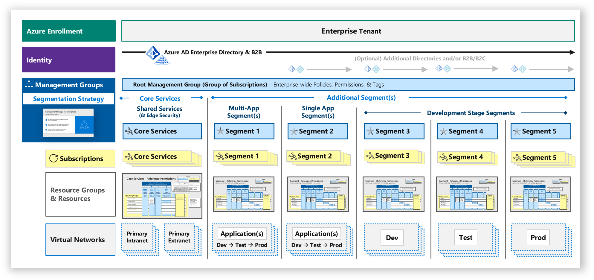
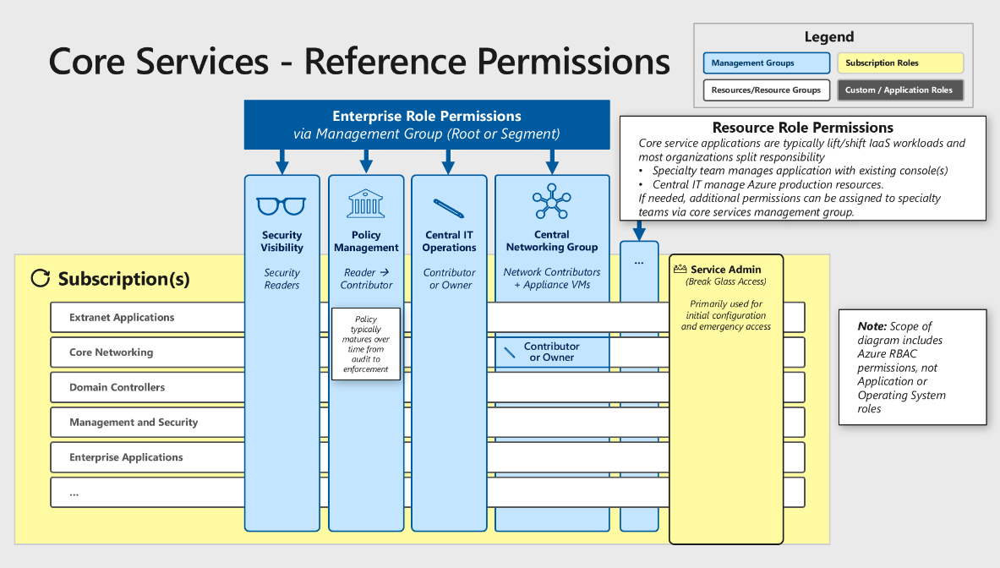
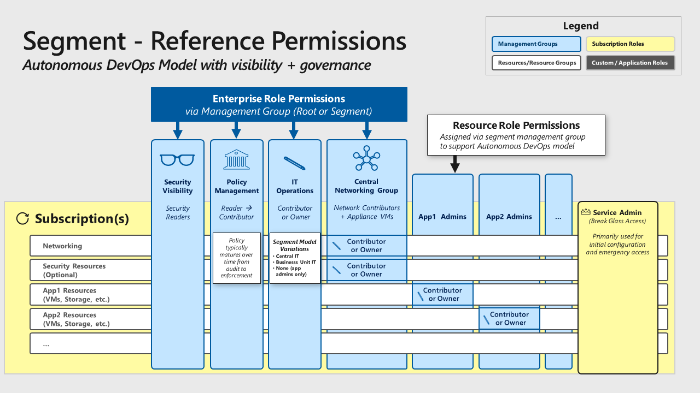

# Governance, risk, and compliance

Organizations of all sizes are constrained by their available resources;
financial, people, and time. To achieve an effective return on investment (ROI)
organizations must prioritize where they will invest. Implementation of security
across the organization is also constrained by this, so to achieve an
appropriate ROI on security the organization needs to first understand and
define its security priorities.

**Governance** – How is the organization’s security going to be monitored,
audited, and reported? Design and implementation of security controls within
an organization is only the beginning of the story. How does the
organization know that things are actually working? Are they improving? Are
there new requirements? Is there mandatory reporting? Similar to compliance
there may be external industry, government or regulatory standards that need
to be considered.

**Risk** – What types of risks does the organization face while trying to
protect identifiable information, Intellectual Property
(IP), financial information? Who may be interested or could leverage this
information if stolen, including external and internal threats as well as
unintentional or malicious? A commonly forgotten but extremely important
consideration within risk is addressing Disaster Recovery and Business
Continuity.

**Compliance** – Are there specific industry, government, or regulatory requirements that dictate or provide recommendation on criteria that your organization’s security controls must meet? Examples of such standards, organizations, controls, and legislation are [ISO27001]( https://www.iso.org/isoiec-27001-information-security.html), [NIST]( https://www.nist.gov/), [PCI-DSS]( https://www.pcicomplianceguide.org/faq/).

The collective role of organization(s) is to manage the security standards of
the organization through their lifecycle:

-   **Define** - Set organizational standards and policies for practices,
    technologies, and configurations based on internal factors (organizational
    culture, risk appetite, asset valuation, business initiatives, etc.) and
    external factors (benchmarks, regulatory standards, threat environment, and
    more)

-   **Improve** – Continually push these standards incrementally forward towards
    the ideal state to ensure continual risk reduction.

-   **Sustain** – Ensure the security posture doesn’t degrade naturally over
    time by instituting auditing and monitoring compliance with organizational
    standards.

## Prioritize security best practices investments

Security best practices are ideally applied proactively and completely to all
systems as you build your cloud program, but this isn’t reality for most
enterprise organizations. Business goals, project constraints, and other factors
often cause organizations to balance security risk against other risks and apply
a subset of best practices at any given point.

We recommend applying as many as of the best practices as early as possible, and
then working to retrofit any gaps over time as you mature your security program.
We recommend evaluating the following considerations when prioritizing which to
follow first:

-   **High business impact and highly exposed systems –** These include systems
    with direct intrinsic value as well as the systems that provide attackers a
    path to them. For more information, see [Identify and classify business critical applications](/azure/architecture/security/applications-services#identify-and-classify-business-critical-applications).

-   **Easiest to implement Mitigations**– Identify quick wins by prioritizing
    the best practices, which your organization can execute quickly because you
    already have the required skills, tools, and knowledge to do it (for example,
    implementing a Web App Firewall (WAF) to protect a legacy application).  
    Be careful not to exclusively use (or overuse) this short-term
    prioritization method. Doing so can increase your risk by preventing your
    program from growing and leaving critical risks exposed for extended
    periods.

Microsoft has provided some prioritized lists of security initiatives to help
organizations start with these decisions based on our experience with threats
and mitigation initiatives in our own environments and across our customers. See
[Module
4a](https://docs.microsoft.com/office365/securitycompliance/ciso-workshop-module-4a)
of the [Microsoft CISO Workshop](https://aka.ms/cisoworkshop)

## Manage connected tenants

Ensure your security organization is aware of all enrollments and associated
subscriptions connected to your existing environment (via ExpressRoute or
Site-Site VPN) and monitoring as part of the overall enterprise.

These azure resources are part of your enterprise environment and security
organizations require visibility into them. Security organizations need this
access to assess risk and to identify whether organizational policies and
applicable regulatory requirements are being followed.

Ensure all Azure environments that connect to your production
environment/network apply your organization’s policy and IT governance controls
for security. You can discover existing connected tenants using a
[tool](https://aka.ms/magicbutton) provided by Microsoft. Guidance on permissions
you may assign to security is in the [Assign privileges for managing the
environment](#assign-privileges-for-managing-the-environment) section.

## Clear lines of responsibility 

Designate the parties responsible for specific functions in Azure

Clearly documenting and sharing the contacts responsible for each of these
functions will create consistency and facilitate communication. Based on our
experience with many cloud adoption projects, this will avoid confusion that can
lead to human and automation errors that create security risk.

Designate groups (or individual roles) that will be responsible for these key
functions:

|Group or individual role| Responsibility|
|---|---|
| **Network Security**                 | *Typically existing network security team.* Configuration and maintenance of Azure Firewall, Network Virtual Appliances (and associated routing), WAFs, NSGs, ASGs, etc. |
| **Network Management**               | *Typically existing network operations team.* Enterprise-wide virtual network and subnet allocation. |
| **Server Endpoint Security**         | *Typically IT operations, security, or jointly.* Monitor and remediate server security (patching, configuration, endpoint security, etc.). |
| **Incident Monitoring and Response** | *Typically security operations team.* Investigate and remediate security incidents in Security Information and Event Management (SIEM) or source console.|
| **Policy Management**                | *Typically GRC team + Architecture.* Set Direction for use of Role Based Access Control (RBAC), Azure Security Center, Administrator protection strategy, and Azure Policy to govern Azure resources. |
| **Identity Security and Standards**  | *Typically Security Team + Identity Team jointly.* Set direction for Azure AD directories, PIM/PAM usage, MFA, password/synchronization configuration, Application Identity Standards. |

## Enterprise segmentation strategy

Identify groups of resources that can be isolated from other parts of the
enterprise to contain (and detect) adversary movement within your enterprise.
This unified enterprise segmentation strategy will guide all technical teams to
consistently segment access using networking, applications, identity, and any
other access controls.

A clear and simple segmentation strategy helps contain risk while enabling
productivity and business operations.

An enterprise segmentation strategy is defined higher than a traditional
*“network segmentation”* security strategy. Traditional segmentation approaches for on premises environments frequently failed to achieve
their goals because they were developed “bottom-up” by different technical teams
and were not aligned well with business use cases and application workloads.
This resulted in overwhelming complexity that generates support issues and often
undermines the original purpose with broad network firewall exceptions.

Creating a unified enterprise segmentation strategy enables to guide all
technical teams stakeholders (IT, Security, Applications, etc.) Business Units
that is built around the business risks and needs will increase alignment to and
understand and support sustainability of the security containment promises.
This clarity and alignment will also reduce s the risk of human errors and
automation failures that can lead to security vulnerabilities, operational
downtime, or both.

While network micro-segmentation also offers promise to reduce risk (discussed
more in [Network Security and Containment](/azure/architecture/security/network-security-containment) section), it doesn’t eliminate the
need to align technical teams. Micro segmentation should be considered after to
and plans to ensure the ensuring technical teams are aligned so you can avoid a
recurrence of the internal conflicts that plagued and confusion of the
on-premises network generation segmentation strategies.

Here are Microsoft's recommendations for prioritizing initiatives on containment and
segmentation (based on Zero Trust principles). These recommendations are listed in priority
order by highest importance.

-  Ensure alignment of technical teams to a single enterprise segmentation
    strategy.

-  Invest in broadening containment by establishing a modern perimeter based on
    zero trust principles focused on identity, device, applications, and other
    signals (to overcome limitation of network controls to protect new resources
    and attack types).

-  Bolster network controls for legacy applications by exploring micro
    segmentation strategies.

A good enterprise segmentation strategy meets these criteria:

-   **Enables Operations** – Minimizes operation friction by aligning to
    business practices and applications

-   **Contains Risk** - Adds cost and friction to attackers by

    -   Isolating sensitive workloads from compromise of other assets

    -   Isolating high exposure systems from being used as a pivot to other
        systems

-   **Monitored** – Security Operations should monitor for potential violations
    of the integrity of the segments (account usage, unexpected traffic, etc.)

## Security team visibility

Provide security teams read-only access to the security aspects of all technical
resources in their purview

Security organizations require visibility into the technical environment to
perform their duties of assessing and reporting on organizational risk. Without
this visibility, security will have to rely on information provided from groups
operating the environment who have a potential conflict of interest (and other
priorities).

Note that security teams may separately be granted additional privileges if
they have operational responsibilities or a requirement to enforce
compliance on Azure resources.

For example in Azure, assign security teams to the **Security Readers**
permission that provides access to measure security risk (without providing
access to the data itself)

For enterprise security groups with broad responsibility for security of Azure,
you can assign this permission using:

-   *Root management group* – for teams responsible for assessing and reporting
    risk on all resources

-   *Segment management group(s)* – for teams with limited scope of
    responsibility (typically required because of organizational boundaries or
    regulatory requirements)

Because security will have broad access to the environment (and visibility into
potentially exploitable vulnerabilities), you should consider them critical
impact accounts and apply the same protections as administrators. The [Administration](/azure/architecture/security/critical-impact-accounts)
section details these controls for Azure.

## Assign privileges for managing the environment 

Grant roles with operational responsibilities in Azure the appropriate
permissions based on a clearly documented strategy built from the principle of
least privilege and your operational needs.

Providing clear guidance that follows a reference model will reduce risk because
by increasing it provides clarity for your technical teams implementing these
permissions. This clarity makes it easier to detect and correct human errors
like overpermissioning, reducing your overall risk.

Microsoft recommends starting from these Microsoft reference models and adapting to your organization.

### Core Services Reference Permissions
This segment hosts shared services
utilized across the organization. These shared services typically include
Active Directory Domain Services, DNS/DHCP, System Management Tools hosted
on Azure Infrastructure as a Service (IaaS) virtual machines.

**Security Visibility across all resources** – For security teams, grant
read-only access to security attributes for all technical environments. This
access level is needed to assess risk factors, identify potential
mitigations, and advise organizational stakeholders who accept the risk. See
[Security Team Visibility](#security-team-visibility) for more details.

**Policy management across some or all resources** – To monitor and enforce
compliance with external (or internal) regulations, standards, and security
policy, assign appropriate permission to those roles. The roles and
permissions you choose will depend on the organizational culture and
expectations of the policy program. See [Microsoft Cloud Adoption Framework for Azure](/azure/architecture/cloud-adoption/governance/security-baseline/index).

**Central IT operations across all resources** – Grant permissions to the
central IT department (often the infrastructure team) to create, modify, and
delete resources like virtual machines and storage.

**Central networking group across network resources** – To ensure consistency
and avoid technical conflicts, assign network resource responsibilities to a
single central networking organization. These resources should include
virtual networks, subnets, Network Security Groups (NSG), and the virtual
machines hosting virtual network appliances. See [Centralize Network Management And Security](/azure/architecture/security/network-security-containment#centralize-network-management-and-security) for more details

**Resource Role Permissions** – For most core services, administrative
privileges required to manage them are granted via the application itself
(Active Directory, DNS/DHCP, System Management Tools, etc.), so no
additional Azure resource permissions are required. If your organizational
model requires these teams to manage their own VMs, storage, or other Azure
resources, you can assign these permissions to those roles.

**Service admin (Break Glass Account)** – Use the service admin role only for
emergencies (and initial setup if required). Do not use this role for daily
tasks. See [Emergency Access (‘Break Glass’ Accounts)](/azure/architecture/security/critical-impact-accounts#emergency-access-or-break-glass-accounts) for more details.

### Segment reference permissions

This segment permission design provides
consistency while allowing flexibility to accommodate the range of
organizational models from a single centralized IT group to mostly
independent IT and DevOps teams.

**Security visibility across all resources** – For security teams, grant
read-only access to security attributes for all technical environments. This
access level is needed to assess risk factors, identify potential
mitigations, and advise organizational stakeholders who accept the risk. See
[Security Team Visibility](#security-team-visibility).

**Policy management across some or all resources** – To monitor and enforce
compliance with external (or internal) regulations, standards, and security
policy assign appropriate permission to those roles. The roles and
permissions you choose will depend on the organizational culture and
expectations of the policy program. See [Microsoft Cloud Adoption Framework for Azure](/azure/architecture/cloud-adoption/governance/security-baseline/index).

**IT Operations across all resources** – Grant permission to create, modify,
and delete resources. The purpose of the segment (and resulting permissions)
will depend on your organization structure.

-   Segments with resources managed by a centralized IT organization can grant
    the central IT department (often the infrastructure team) permission to
    modify these resources.

-   Segments managed by independent business units or functions (such as a Human
    Resources IT Team) can grant those teams permission to all resources in the
    segment.

-   Segments with autonomous DevOps teams don’t need to grant permissions across
    all resources because the resource role (below) grants permissions to
    application teams. For emergencies, use the service admin account
    (break-glass account).

**Central networking group across network resources** – To ensure consistency
and avoid technical conflicts, assign network resource responsibilities to a
single central networking organization. These resources should include
virtual networks, subnets, Network Security Groups (NSG), and the virtual
machines hosting virtual network appliances. See [Centralize Network Management And Security](/azure/architecture/security/network-security-containment#centralize-network-management-and-security).

**Resource Role Permissions** – Segments with autonomous DevOps teams will
manage the resources associated with each application. The actual roles and
their permissions depend on the application size and complexity, the
application team size and complexity, and the culture of the organization
and application team.

**Service Admin (Break Glass Account)** – Use the service admin role only for emergencies (and initial setup if required). Do not use this role for daily tasks. See [Emergency Access (‘Break Glass’ Accounts)](/azure/architecture/security/critical-impact-accounts#emergency-access-or-break-glass-accounts) for more details.

### Permission Guidance and Tips

-   To drive consistency and ensure application to future subscriptions,
    permissions should be assigned at management group for the segment rather
    than the individual subscriptions. See [Avoid Granular and Custom Permissions](/azure/architecture/security/critical-impact-accounts#avoid-granular-and-custom-permissions) for more details.

-   You should first review the built-in roles to see if one is applicable
    before creating a custom role to grant the appropriate permissions to VMs
    and other objects. See [Use Built in Roles](/azure/architecture/security/critical-impact-accounts#use-built-in-roles) for more details

-   **Security managers** group membership may be appropriate for smaller
    teams/organizations where security teams have extensive operational
    responsibilities.

## Establish segmentation with management groups

Structure management groups into a simple design that guides the enterprise
segmentation model.

Management groups offer the ability to consistently and efficiently manage resources (including multiple subscriptions as needed). However, because of their flexibility, it's possible to create an overly complex design. Complexity creates confusion
and negatively impacts both operations and security (as illustrated by overly
complex Organizational Unit (OU) and Group Policy Object (GPO) designs for
Active Directory).

Microsoft recommends aligning the top level of management groups (MGs) into a
simple [enterprise segmentation strategy](/azure/architecture/security/governance#enterprise-segmentation-strategy) limited to 1 or 2 levels. 

## Use root management group carefully

Use the Root Management Group (MG) for enterprise consistency, but test changes
carefully to minimize risk of operational disruption.

The root management group enables you to ensure consistency across the enterprise by applying policies, permissions, and tags across all subscriptions.
Care must be taken when planning and implementing assignments to the root
management group because this can affect every resource on Azure and potentially
cause downtime or other negative impacts on productivity in the event of errors
or unanticipated effects.

Root management group guidance:

-   **Plan Carefully** - Select enterprise-wide elements to the root management
    group that have a clear requirement to be applied across every resource
    and/or low impact.

    Good candidates include:

    -   **Regulatory requirements** with clear business risk/impact (for example,
        restrictions related to data sovereignty).

    -   **Near-zero potential negative impact** on operations such as policy
        with audit effect, Tag assignment, RBAC permissions assignments that
        have been carefully reviewed.

-   **Test First -** Carefully test all enterprise-wide changes on the root
    management group before applying (policy, tags, RBAC model, etc.) using a

    -   **Test Lab -** Representative lab tenant or lab segment in production
        tenant.

    -   **Production Pilot -** Segment MG or Designated subset in
        subscription(s) / MG.

-   **Validate Changes** – to ensure they have the desired effect.

## Virtual Machine (VM) security updates and strong passwords

Ensure policy and processes enable (and require) rapid application of security
updates to virtual machines.

Attackers constantly scan public cloud IP ranges for open management ports and
attempt “easy” attacks like common passwords and unpatched vulnerabilities.

Enable [Azure Security Center](https://docs.microsoft.com/azure/security-center/security-center-apply-system-updates)
to identify missing security updates & apply them.

[Local Admin Password Solution (LAPS)](https://www.microsoft.com/download/details.aspx?id=46899) or a third party Privileged Access Management can set strong local admin passwords and just in time access to them.

## Remove Virtual Machine (VM) direct internet connectivity

Ensure policy and processes require restricting and monitoring direct internet
connectivity by virtual machines

Attackers constantly scan public cloud IP ranges for open management ports and
attempt “easy” attacks like common passwords and known unpatched vulnerabilities

This can be accomplished with one or more methods in Azure:

-   **Enterprise-wide prevention** - Prevent inadvertent exposure with an
    enterprise network and permission model such as the reference model
    described throughout this guidance. This significantly reduces the risk of
    accidental VM internet exposure by

    -   Ensuring that network traffic is routed through approved egress points
        by default

    -   Exceptions (for example, add a public IP address to a resource) must go through
        a centralized group (which can carefully evaluate exception requests to
        ensure appropriate controls are applied)

-   **Identify and Remediate** exposed VMs using the [Azure Security
    Center](https://docs.microsoft.com/azure/security-center/security-center-install-endpoint-protection)
    network visualization to quickly identify internet exposed resources.

-   **Restrict management ports** (RDP, SSH) using [Just in Time
    access](https://docs.microsoft.com/azure/security-center/security-center-just-in-time)
    in Azure Security Center

## Assign incident notification contact

Ensure a security contact receives Azure incident notifications from Microsoft
typically a notification that your resource is compromised and/or attacking
another customer.

This enables your security operations team to rapidly respond to potential
security risks and remediate them.

Ensure administrator contact information in the Azure enrollment portal includes
contact information that will notify security operations (directly or rapidly
via an internal process)

## Regularly review critical access

Regularly review roles that are assigned privileges with a business-critical impact. 

Set up a recurring review pattern to ensure that accounts are removed from permissions as roles change.
You can conduct the review manually or through an automated process by using tools such as [Azure AD access reviews](/azure/active-directory/governance/create-access-review).

## Discover and remediate common risks 

Identity well known risks for your Azure tenants, remediate those risks, and
track your progress using Secure Score.

Identifying and remediating common security hygiene risks significantly reduces
overall risk to your organization by increasing cost to attackers. When you
remove cheap and well-established attack vectors, attackers are forced to
acquire and use advanced or untested attack methods.

[Azure Secure Score](https://docs.microsoft.com/azure/security-center/security-center-secure-score)
in Azure Security Center monitors the security posture of machines, networks,
storage and data services, and applications to discover potential security
issues (internet connected VMs, or missing security updates, missing endpoint
protection or encryption, deviations from baseline security configurations,
missing Web Application Firewall (WAF), and more). You should enable this
capability (no additional cost), review the findings, and follow the included
[recommendations](https://docs.microsoft.com/azure/security-center/security-center-recommendations)
to plan and execute technical remediations starting with the highest priority
items.

As you address risks, track progress and prioritize ongoing investments in your
governance and risk reduction programs.

## Increase automation with Azure Blueprints

Use Azure’s native automation capabilities to increase consistency, compliance,
and deployment speed for workloads.

Automation of deployment and maintenance tasks reduces security and compliance
risk by limiting opportunity to introduce human errors during manual tasks. This
will also allow both IT Operations teams and security teams to shift their focus
from repeated manual tasks to higher value tasks like enabling developers and
business initiatives, protecting information, and so on.

Utilize the Azure Blueprint service to rapidly and consistently deploy
application environments that are compliant with your organization’s policies
and external regulations. [Azure Blueprint Service](https://docs.microsoft.com/azure/governance/blueprints/)
automates deployment of environments including RBAC roles, policies, resources
(VM/Net/Storage/etc.), and more. Azure Blueprints builds on Microsoft’s
significant investment into the Azure Resource Manager to standardize
resource deployment in Azure and enable resource deployment and governance based
on a desired-state approach. You can use built in configurations in Azure
Blueprint, make your own, or just use Resource Manager scripts for smaller scope.

Several [Security and Compliance Blueprints](https://servicetrust.microsoft.com/ViewPage/BlueprintOverview) [samples](https://docs.microsoft.com/azure/governance/blueprints/samples/)
are available to use as a starting template.

## Evaluate security using benchmarks

Use an industry standard benchmark to evaluate your organizations current
security posture.

Benchmarking allows you to improve your security program by learning from
external organizations. Benchmarking lets you know how your current security
state compares to that of other organizations, providing both external
validation for successful elements of your current system as well as identifying
gaps that serve as opportunities to enrich your team’s overall security
strategy. Even if your security program isn’t tied to a specific benchmark or
regulatory standard, you will benefit from understanding the documented ideal
states by those outside and inside of your industry.

-   As an example, the Center for Internet Security (CIS) has created security
    benchmarks for Azure that map to the CIS Control Framework. Another
    reference example is the MITRE ATT&CK™ framework that defines the various
    adversary tactics and techniques based on real-world observations. These
    external references control mappings help you to understand any gaps between
    your current strategy what you have and what other experts in the industry.

## Audit and enforce policy compliance

Ensure that the security team is auditing the environment to report on
compliance with the security policy of the organization. Security teams may also
enforce compliance with these policies.

Organizations of all sizes will have security compliance requirements. Industry,
government, and internal corporate security policies all need to be audited and
enforced. Policy monitoring is critical to check that initial configurations are
correct and that it continues to be compliant over time.

In Azure, you can take advantage of Azure Policy to create and manage policies
that enforce compliance. Like Azure Blueprints, Azure Policies are built on the
underlying Azure Resource Manager capabilities in the Azure platform (and
Azure Policy can also be assigned via Azure Blueprints).

For more information on how to do this in Azure, please review **Tutorial: Create and manage policies to enforce compliance**.

## Monitor identity Risk

Monitor identity related risk events for warning on potentially compromised
identities and remediate those risks.

Most security incidents take place after an attacker initially gains access
using a stolen identity. These identities can often start with low privileges,
but the attackers then use that identity to traverse laterally and gain access
to more privileged identities. This repeats as needed until the attacker
controls access to the ultimate target data or systems.

Azure Active Directory uses adaptive machine learning algorithms, heuristics,
and known compromised credentials (username/password pairs) to detect suspicious
actions that are related to your user accounts. These username/password pairs
come from monitoring public and dark web sites (where attackers often dump
compromised passwords) and by working with security researchers, law
enforcement, Security teams at Microsoft, and others.

There are two places where you review reported risk events:

-   **Azure AD reporting** - Risk events are part of Azure AD's security
    reports. For more information, see the [users at risk security
    report](https://docs.microsoft.com/azure/active-directory/reports-monitoring/concept-user-at-risk) and
    the [risky sign-ins security
    report](https://docs.microsoft.com/azure/active-directory/reports-monitoring/concept-risky-sign-ins).

-   **Azure AD Identity Protection** - Risk events are also part of the
    reporting capabilities of [Azure Active Directory Identity
    Protection](https://docs.microsoft.com/azure/active-directory/active-directory-identityprotection).

In addition, you can use the [Identity Protection risk events API](https://developer.microsoft.com/graph/docs/api-reference/beta/resources/identityriskevent) to
gain programmatic access to security detections using Microsoft Graph.

Remediate these risks by manually addressing each reported account or by setting
up a [user risk policy](https://docs.microsoft.com/azure/active-directory/identity-protection/howto-user-risk-policy)
to require a password change for these high risk events.

## Penetration testing

Use Penetration Testing to validate security defenses.

Real world validation of security defenses is critical to validate your defense
strategy and implementation. This can be accomplished by a penetration test
(simulates a one time attack) or a red team program (simulates a persistent
threat actor targeting your environment).

Follow the [guidance published by Microsoft](https://technet.microsoft.com/mt784683) for planning and executing simulated
attacks.

## Discover & replace insecure protocols

Discover and disable the use of legacy insecure protocols SMBv1, LM/NTLMv1,
wDigest, Unsigned LDAP Binds, and Weak ciphers in Kerberos.

Authentication protocols are a critical foundation of nearly all security
assurances. These older versions can be exploited by attackers with access to
your network and are often used extensively on legacy systems on Infrastructure
as a Service (IaaS).

Here are ways to reduce your risk:

-  **Discover** protocol usage by reviewing logs with Azure Sentinel’s Insecure
    Protocol Dashboard or third party tools

-  Restrict or Disable use of these protocols by following guidance for
    [SMB](https://support.microsoft.com/help/2696547/detect-enable-disable-smbv1-smbv2-smbv3-in-windows-and-windows-server),
    [NTLM](https://docs.microsoft.com/windows/security/threat-protection/security-policy-settings/network-security-restrict-ntlm-ntlm-authentication-in-this-domain),
    [WDigest](https://support.microsoft.com/help/2871997/microsoft-security-advisory-update-to-improve-credentials-protection-a)

We recommend implementing changes using pilot or other testing method to
mitigate risk of operational interruption.

## Elevated security capabilities

Consider whether to utilize specialized security capabilities in your enterprise
architecture.

These measures have the potential to enhance security and meet regulatory
requirements, but can introduce complexity that may negatively impact your
operations and efficiency.

We recommend careful consideration and judicious use of these security measures
as required:

-   **Dedicated Hardware Security Modules (HSMs)**  
    [Dedicated Hardware Security Modules (HSMs) may help meet regulatory or
    security requirements](https://docs.microsoft.com/azure/dedicated-hsm/).

-   **Confidential Computing**  
    [Confidential Computing may help meet regulatory or security requirements](https://azure.microsoft.com/blog/azure-confidential-computing/).
