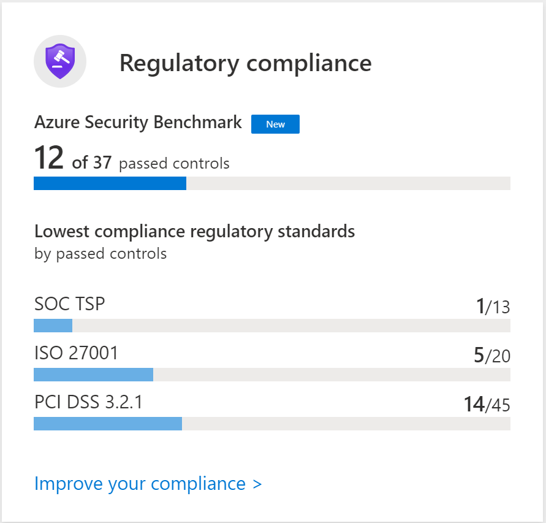

# Security audits 

To make sure that the security posture doesn't degrade over time, have regular auditing that checks compliance with organizational standards. Enable, acquire, and store audit logs for Azure services.

## Key points
> [!div class="checklist"]
> - Improve secure score in Azure Security Center.
> - Use an industry standard benchmark to evaluate your organizations current security posture.
> - Perform regular internal and external compliance audits, including regulatory compliance attestations.
> - Review the policy requirements.
> - Use [Azure Governance Visualizer](https://github.com/microsoft/CloudAdoptionFramework/tree/master/govern/AzureGovernanceVisualizer) for a holistic overview of your technical Azure Governance implementation.

## Evaluate using standard benchmarks

**Do you evaluate the security posture of this workload using standard benchmarks?**
***

Compliance is important for several reasons. Aside from signifying levels of standards, like `ISO 27001` and others, noncompliance with regulatory guidelines may bring sanctions and penalties. Regularly review roles that have high privileges. Set up a recurring review pattern to ensure that accounts are removed from permissions as roles change. Consider auditing at least twice a year.

As people in the organization and on the project change, make sure that only the right people have access to the application infrastructure. Auditing and reviewing the access control reduces the attack vector to the application.

Azure control plane depends on Azure AD. You can conduct the review manually or through an automated process by using tools such as [Azure AD access reviews](/azure/active-directory/governance/create-access-review). These reviews are often centrally performed often as part of internal or external audit activities.

### Suggested action

Use Azure Defender (Azure Security Center) to continuously assess and monitor your compliance score.

### Learn more

[Assess your regulatory compliance](/azure/security-center/security-center-compliance-dashboard#assess-your-regulatory-compliance)

## Audit regulatory compliance

**Have you established a monitoring and assessment solution for compliance?**
***
Continuously assess and monitor the compliance status of your workload. Azure Security Center provides a regulatory compliance dashboard that shows the current security state of workload against controls mandated by the standard governments or industry organizations and Azure Security Benchmark. Keep your resources in compliance with those standards. Security Center tracks many standards. You can set the standards by management groups in a subscription.  

Consider using [Azure Access Reviews](/azure/active-directory/governance/access-reviews-overview) or [Entitlement Management](/azure/active-directory/governance/entitlement-management-overview) to periodically review access to the workload.

For Azure, use Azure Policy to create and manage policies that enforce compliance.  Azure Policies are built on the Azure Resource Manager capabilities.  Azure Policy can also be assigned through Azure Blueprints. 

For more information, see [Tutorial: Create and manage policies to enforce compliance](/azure/governance/policy/tutorials/create-and-manage).

Here's an example management group that is tracking compliance to the Payment Card Industry (PCI) standard.

:::image type="content" source="./images/regulatory-compliance-pci.png" alt-text="Example compliance monitoring" border ="true":::

**Do you have internal and external audits for this workload?**
***

A workload should be audited internally, external, or both with the goal of discovering security gaps. Make sure that the gaps are addressed through updates. 

Auditing is important for workloads that follow a standard. Aside from signifying levels of standards, noncompliance with regulatory guidelines may bring sanctions and penalties.

Perform regulatory compliance attestation. Attestations are done by an independent party that examines if the workload is in compliance with a standard. 

## Review critical access

**Is access to the control plane and data plane of the application periodically reviewed?**
***

Regularly review roles that have high privileges. Set up a recurring review pattern to ensure that accounts are removed from permissions as roles change. Consider auditing at least twice a year.

As people in the organization and on the project change, make sure that only the right people, have access to the application infrastructure and just enough privileges to complete the task. Auditing and reviewing the access control reduces the attack vector to the application. 

Azure control plane depends on Azure AD. You can conduct the review manually or through an automated process by using tools such as [Azure AD access reviews](/azure/active-directory/governance/create-access-review). These reviews are often centrally performed often as part of internal or external audit activities. 

## Check policy compliance

Make sure that the security team is auditing the environment to report on compliance with the security policy of the organization. Security teams may also enforce compliance with these policies. 

Enforce and audit industry, government, and internal corporate security policies. Policy monitoring checks that initial configurations are correct and that it continues to be compliant over time. 

For Azure, use Azure Policy to create and manage policies that enforce compliance. Azure Policies are built on the Azure Resource Manager capabilities. Azure Policy can also be assigned through Azure Blueprints. 
For more information, see [Tutorial: Create and manage policies to enforce compliance](/azure/governance/policy/tutorials/create-and-manage).

## Capture critical data

[Azure Governance Visualizer](https://github.com/microsoft/CloudAdoptionFramework/tree/master/govern/AzureGovernanceVisualizer) captures data from the most relevant Azure governance capabilities such as Azure Policy, Azure role-based access control (Azure RBAC), and Azure Blueprints. The visualizer PowerShell script iterates through an Azure tenant's management group hierarchy down to the subscription level. From the collected data, the visualizer shows your hierarchy map, creates a tenant summary, and builds granular scope insights about your management groups and subscriptions.

## Next steps
> [!div class="nextstepaction"]
> [Remediate security risks in Azure Security Center](monitor-logs-alerts.md)

## Related links

- [Secure score in Azure Security Center](/azure/security-center/secure-score-security-controls) allows you view all the security vulnerabilities into a single score.

- [Tutorial: Improve your regulatory compliance](/azure/security-center/security-center-compliance-dashboard) describes a step-by-step process to evaluate regulatory requirements in Azure Security Center.