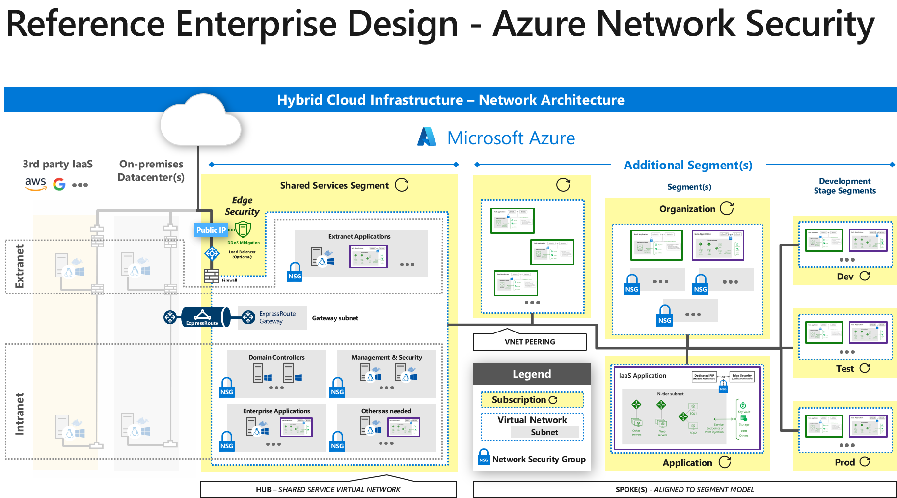

# Network security and containment

Network security has been the traditional lynchpin of enterprise security
efforts. However, cloud computing has increased the requirement for network
perimeters to be more porous and many attackers have mastered the art of attacks
on identity system elements (which nearly always bypass network controls). These
factors have increased the need to focus primarily on identity-based access
controls to protect resources rather than network-based access controls.

These do diminish the role of network security controls, but do not eliminate it
entirely. While network security is no longer the primary focus for securing
cloud-based assets, it is still a top priority for the large portfolio of legacy
assets (which were built with the assumption that a network firewall-based
perimeter was in place). Many attackers still employ scanning and exploit
methods across public cloud provider IP ranges, successfully penetrating
defenses for those who don’t follow basic network security hygiene. Network
security controls also provide a defense-in-depth element to your strategy that
help protect, detect, contain, and eject attackers who make their way into your
cloud deployments.

In the category of network security and containment, we have the following best
practice recommendations:

-   Align network segmentation with overall strategy

-   Centralize network management and security

-   Build a network containment strategy

-   Define an internet edge strategy

## Centralize network management and security

Centralize the organizational responsibility for management and security of core
networking functions such as cross-premises links, virtual networking,
subnetting, and IP address schemes as well as network security elements such as
virtual network appliances, encryption of cloud virtual network activity and
cross-premises traffic, network-based access controls, and other traditional
network security components.

When you centralize network management and security you reduce the potential for
inconsistent strategies that can create potential attacker exploitable security
risks. Because all divisions of the IT and development organizations do not have
the same level of network management and security knowledge and sophistication,
organizations benefit from leveraging a centralized network team’s expertise and
tooling.

[Azure Security Center](https://docs.microsoft.com/azure/security-center/security-center-network-recommendations)
can be used to help centralize the management of network security.

## Align network segmentation with enterprise segmentation strategy

Align your network segmentation model with the enterprise segmentation model for
your organization (defined in Governance, Risk, and Compliance section).

This will reduce confusion and resulting challenges with different technical
teams (networking, identity, applications, etc.) each developing their own
segmentation and delegation models that don’t align with each other. This leads
to a straightforward and unified security strategy, which helps reduce the
number of errors due to human error and inability to increase reliability
through automation.

Please compare images in [Network security and containment](/azure/architecture/security/governance#enterprise-segmentation-strategy).

## Evolve security beyond network controls

Ensure technical controls can effectively prevent, detect, and respond to
threats outside the networks you control.

As organizations shift to modern architectures, many services and components
required for applications will be accessed over the internet or on cloud
provider networks, often by mobile and other devices off the network.
Traditional network controls based on a *“trusted intranet”* approach will not
be able to effectively provide security assurances for these applications. This
shifting landscape is captured well by principles documented by the [Jericho
Forum](https://en.wikipedia.org/wiki/Jericho_Forum) and ‘Zero Trust’ approaches.

Build a risk containment strategy based on a combination of network controls and
application, identity, and other control types.

-   Ensure that resource grouping and administrative privileges align to the
    segmentation model (see figure XXXX)

-   Ensure you are designing security controls that identify and allow expected
    traffic, access requests, and other application communications between
    segments. Monitor communications between segments to identify on any
    unexpected communications so you can investigate whether to set alerts or
    block traffic to mitigate risk of adversaries crossing segmentation
    boundaries.

## Build a security containment strategy

Create a risk containment strategy that blends proven approaches including:

-   Existing network security controls and practices

-   Native security controls available in Azure

-   Zero trust approaches

Containment of attack vectors within an environment is critical. However, in
order to be effective in cloud environments, traditional approaches may prove
inadequate and security organizations need to evolve their methods.

-   Consistency of controls across on-premises and cloud infrastructure is
    important, but defenses are more effective and manageable when leveraging
    native capabilities provided by a cloud service provider, dynamic
    just-in-time (JIT) approaches, and integrated identity and password
    controls, such as those recommended by zero trust/continuous validation
    approaches.

-   A network security best practice is to make sure there are network access
    controls between network constructs. These constructs can represent virtual
    networks, or subnets within those virtual networks. This works to protect
    and contain East-West traffic within your cloud network infrastructure.

-   An important network security design decision is to use or not use
    host-based firewalls. Host-based firewalls support a comprehensive defense
    in-depth strategy. However, to be of most use they require significant
    management overhead. If your organization has found them effective in
    helping you protect and discover threats in the past, you might consider
    using them for your cloud-based assets. If you discover that they have not
    added significant value, discontinue their use and explore native solutions
    on your cloud service provider’s platform that deliver similar value.

An evolving emerging best practice recommendation is to adopt a Zero Trust
strategy based on user, device, and application identities. In contrast to
network access controls that are based on elements such as source and
destination IP address, protocols, and port numbers, Zero Trust enforces and
validates access control at “access time”. This avoids the need to play a
prediction game for an entire deployment, network, or subnet – only the
destination resource needs to provide the necessary access controls.

-   Azure Network Security Groups can be used for basic layer 3 & 4 access
    controls between Azure Virtual Networks, their subnets, and the Internet.

-   Azure Web Application Firewall and the Azure Firewall can be used for more
    advanced network access controls that require application layer support.

-   Local Admin Password Solution (LAPS) or a third-party Privileged Access
    Management can set strong local admin passwords and just in time access to
    them

Additionally, third parties offer microsegmentation approaches that may enhance
your network controls by applying zero trust principles to networks you control
with legacy assets on them.

## Define an internet edge strategy

Choose whether to use native cloud service provider controls or virtual network
appliances for internet edge security.

Internet edge traffic (sometimes referred to as “North-South” traffic)
represents network connectivity between your assets in the cloud and the
Internet. Legacy workloads require protection from Internet endpoints because
they were built with the assumption that an internet firewall protected them
against these attacks. An Internet edge strategy is intended to mitigate as many
attacks from the internet as is reasonable to detect or block.

There are two primary choices that can provide Internet edge security controls
and monitoring:

-   Cloud Service Provider Native Controls ([Azure
    Firewall](https://azure.microsoft.com/services/azure-firewall/) + [Web
    Application Firewall
    (WAF)](https://docs.microsoft.com/azure/application-gateway/waf-overview))

-   Partner Virtual Network Appliances (Firewall and WAF Vendors available in
    [Azure
    Marketplace](https://azuremarketplace.microsoft.com/marketplace/))

-   Cloud service provider native controls typically offer basic security that
    is good enough for common attacks, such as the OWASP Top 10.

-   In contrast, cloud service provider partner capabilities often provide much
    more advanced features that can protect against sophisticated (but often
    uncommon) attacks. Partner solutions consistently cost more than native
    controls. In addition, configuration of partner solutions can be very
    complex and more fragile than native controls because they do not integrate
    with cloud’s fabric controllers.

The decision to use native versus partner controls should be based on your
organization’s experience and requirements. If the features of the advanced
firewall solutions don’t provide sufficient return on investment, you may
consider using the native capabilities that are designed to be easy to configure
and scale.

## Discontinue legacy network security technology

Discontinue the use of signature-based Network Intrusion Detection/Network
Intrusion Prevention (NIDS/NIPS) Systems and Network Data Leakage/Loss
Prevention (DLP).

The major cloud service providers already filter for malformed packets and
common network layer attacks, so there’s no need for a NIDS/NIPS solution to
detect those. In addition, traditional NIDS/NIPS solutions are typically driven
by signature-based approaches (which are considered outdated) and are easily
evaded by attackers and typically produce a high rate of false positives.

Network-based DLP is decreasingly effective at identifying both inadvertent and
deliberate data loss. The reason for this is that most modern protocols and
attackers use network-level encryption for inbound and outbound communications.
The only viable workaround for this is “SSL-bridging” which provides an
“authorized man-in-the-middle” that terminates and then reestablishes encrypted
network connections. The SSL-bridging approach has fallen out of favor because
of the level of trust required for the partner running the solution and the
technologies that are being used.

Based on this rationale, we offer an all-up recommendation that you discontinue
use of these legacy network security technologies. However, if your
organizational experience is that these technologies have had a palpable impact
on preventing and detecting real attacks, you can consider porting them to your
cloud environment.

## Design virtual network subnet security 

Design virtual networks and subnets for growth.

Most organizations end up adding more resources to their networks than they
initially planned for. When this happens, IP addressing and subnetting schemes
need to be refactored to accommodate the extra resources. This is a
labor-intensive process. There is limited security value in creating a very
large number of small subnets and then trying to map network access controls
(such as security groups) to each of them.

We recommend that you plan your subnets based on common roles and functions that
use common protocols for those roles and functions. This allows you to add
resources to the subnet without needing to make changes to security groups that
enforce network level access controls.

Do not use *“all open*” rules for inbound and outbound traffic to and from
subnets. Use a *network “least privilege*” approach and only allow relevant
protocols. This will decrease your overall network attack surface on the subnet.

All open rules (allowing inbound/outbound to and from 0.0.0.0-255.255.255.255)
provide a false sense of security since such a rule enforces no security at all.

However, the exception to this is if you want to use security groups only for
network logging. We do not recommend this, but it is an option if you have
another network access control solution in place.

[Azure Virtual Network subnets](https://docs.microsoft.com/office365/enterprise/designing-networking-for-microsoft-azure-iaas) can be designed in this way.

## Mitigate DDoS attacks

Enable Distributed Denial of Service (DDoS) mitigations for all
business-critical web application and services.

DDoS attacks are prevalent and are easily carried out by unsophisticated
attackers. There are even “DDoS as a service” options on the dark net. DDoS
attacks can be very debilitating and completely block access to your services
and even take down the services, depending on the type of DDoS attack.

The major cloud service providers offer DDoS protection of services of varying
effectiveness and capacity. The cloud service providers typically provide two
DDoS protection options:

-   DDoS protection at the cloud network fabric level – all customers of the
    cloud service provider benefit from these protections. The protection is usually focused at the network (layer 3) level.

-   DDoS protection at higher levels that profile your services – this kind of
    protection will baseline your deployments and then use machine learning
    techniques to detect anomalous traffic and proactively protect based on
    their protection before there is service degradation

We recommend that you adopt the advance protection for any services where
downtime will have negative impact on the business.

An example of advanced DDoS protection is the [Azure DDoS Protection
Service](https://docs.microsoft.com/azure/virtual-network/ddos-protection-overview).

## Decide upon an internet ingress/egress policy

Choose to route traffic destined for the Internet through on-premises security
devices or allow Internet connectivity through cloud-based network security
devices.

Routing Internet traffic through on-premises network security devices is also
known as “forced tunneling”. In a forced tunneling scenario, all connectivity to
the Internet is forced back to on-premises network security devices through a
cross-premises WAN link. The goal is to provide network security teams greater
security and visibility for Internet traffic. Even when your resources in the
cloud try to respond to incoming requests from the Internet, the responses will
be forced through on-premises network security devices.

Alternately, forced tunneling fits a *“datacenter expansion”* paradigm and can
work well for a quick proof of concept, but scales poorly because of the
increased traffic load, latency, and cost.

The recommended approach for production enterprise use is to allow cloud
resources to initiate and respond to Internet request directly through cloud
network security devices defined by your [internet edge strategy](#define-an-internet-edge-strategy).

The direct Internet approach fits the Nth datacenter paradigm (for example, Azure
datacenters are a natural part of my enterprise). This approach scales much
better for an enterprise deployment as it removes hops that add load, latency,
and cost.

We recommend that you avoid [forced
tunneling](https://docs.microsoft.com/azure/vpn-gateway/vpn-gateway-about-forced-tunneling)
for the reasons noted above.

## Enable enhanced network visibility

You should enable enhanced network visibility by integrating network logs into a
Security information and event management (SIEM) like Azure Sentinel or a third
partner solution such as Splunk, QRadar, or ArcSight ESM.

Integrating logs from your network devices, and even raw network traffic itself,
will provide you greater visibility over potential security threats flowing over
the wire. This log information can be integrated in advanced SIEM solutions or
other analytics platforms. The modern machine learning based analytics platforms support ingestion of extremely large amounts of information and can analyze
large datasets very quickly. In addition, these solutions can be tuned to
significantly reduce false positive alerts.

Examples of network logs that provide visibility include:

-   Security group logs – [flow logs](https://docs.microsoft.com/azure/network-watcher/network-watcher-nsg-flow-logging-portal)
    and diagnostic logs

-   [Web application firewall logs](https://docs.microsoft.com/azure/application-gateway/application-gateway-diagnostics)

-   [Virtual network taps](https://docs.microsoft.com/azure/virtual-network/virtual-network-tap-overview)
    and their equivalents

-   [Azure Network Watcher](https://docs.microsoft.com/azure/network-watcher/network-watcher-monitoring-overview)