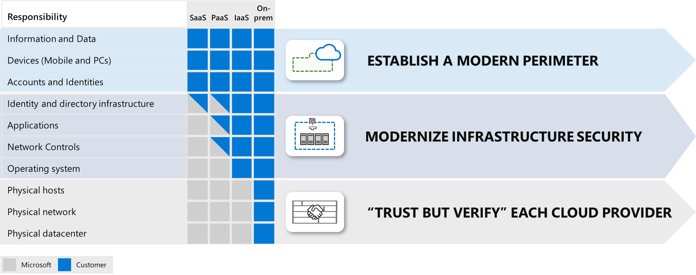

# Role of security when building in the cloud

Security is one of the most important aspects of any architecture. Security
provides confidentiality, integrity, and availability assurances against
deliberate attacks and abuse of your valuable data and systems. Losing these
assurances can negatively impact your business operations and revenue, as well
as your organization’s reputation in the marketplace. These security assurances
also serve as a foundation for privacy assurances, which are not in scope of
this document. In this article, we’ll discuss key architectural considerations
and principles for security and how they apply to Azure.

Information Security has always been a complex subject that evolves quickly with
the creative ideas and implementations of attackers and security researchers.
Historically, security vulnerabilities started with identifying and exploiting
common programming errors and unexpected edge cases, but the attack surface that
an attacker may explore and exploit has now expanded well beyond that. Attackers
are now freely exploiting vulnerabilities in system configurations, operational
practices, and the social habits of the systems’ users. As systems’ complexity,
connectedness, and the variety of users increase, attackers have more
opportunities to identify unprotected edge cases and to “hack” systems into
doing things they were not designed to do.

One overarching lesson this history teaches us is that the security of complex
systems depends on understanding the:

-   Business context,

-   Social context, and

-   Technical context.

Understanding an IT solution as it interacts with its surrounding environment
holds the key to preventing unauthorized activity and to identifying anomalous
behavior that may represent a security risk. Another key success factor is
adopting a mindset of assuming failure of security controls so that you design
compensating controls that limit risk and damage in the event a primary control
fails. Assuming failures is sometimes referred to as “assume breach” or “assume
compromise” and is closely related to the “Zero Trust” approach of continuously
validating security assurances. The “Zero Trust” approach is described in the [Security Design Principles](/azure/architecture/security/security-principles) section in more detail.

Cloud architectures can help simplify the complex task of securing an enterprise
estate through specialization and shared responsibilities:

**Specialization -** Instead of hundreds of thousands of organizations
individually developing deep expertise on managing and securing common
elements like datacenter physical security, firmware patching, and
hypervisor configuration, specialist teams at cloud providers can develop
advanced capabilities to operate and secure the systems on behalf of these
organizations. The economies of scale allow cloud provider specialist teams
to invest in optimization of management and security that far exceeds the
ability of most organizations.  
Cloud providers must be compliant with the same IT regulatory requirements
as the aggregate of all their customers and must develop expertise to defend
against the aggregate set of adversaries attacking their customers. As a
consequence, the default security posture of applications deployed to the
cloud is frequently much better than that of applications hosted
on-premises.

**Shared Responsibility Model -** As computing environments move from
customer-controlled datacenters to the cloud, the responsibility of
security also shifts. Security of the operational environment is now a
concern shared by both cloud providers and customers. By shifting these
responsibilities to a cloud service like Azure, organizations can reduce
focus on activities that aren't core business competencies. Depending on the
specific technology choices, some security protections will be built into
the particular service, while addressing others will remain the customer’s
responsibility. To ensure that the proper security controls are provided, a
careful evaluation of the services and technology choices becomes necessary.

**Shared Responsibility and Key Strategies**

After reading this document, you will be equipped with key insights on how to
improve the security posture of your architecture.

As part of your architecture design, you should consider all relevant areas that
affect the success of your application. While this article is concerned
primarily with security principles, you should also prioritize other
requirements of a well-designed system including your applications’
availability, scalability, costs, and operational characteristics (trading off
one over the other as necessary). It is important to note that consistently
sacrificing security for gains in the other areas is not advisable as security
risks tend to increase dynamically over time.

This results in three key strategies

-   **Establish a Modern Perimeter** – for the elements that your organization
    controls to ensure you have a consistent set of controls (a perimeter)
    between those assets and the threats to them. This should be designed based
    on intercepting authentication requests for the resources (identity
    controls) vs. the traditional approach of intercepting network traffic on
    enterprise networks, which isn’t feasible for enterprise assets outside the
    network.  
    More on this and how it relates to Zero Trust and Enterprise Segmentation
    are in the [Governance, Risk, and Compliance](/azure/architecture/security/governance#enterprise-segmentation-strategy) and [Network Security & Containment](/azure/architecture/security/network-security-containment#align-network-segmentation-with-enterprise-segmentation-strategy) sections.

-   **Modernize Infrastructure Security** – for operating systems and middleware
    elements that are required by legacy applications; take advantage of cloud
    technology to reduce security risk to the organization. For example, knowing
    whether all servers in a physical datacenter are updated with security
    patches has always been extremely challenging because of discoverability.
    Software defined datacenters allow easy and rapid discovery of all
    resources, enabling technology like Azure Security Center to quickly and
    accurately measure the patch state of all servers and remediate them.

-   **“Trust but Verify” each cloud provider** – for the elements, which are
    under the control of the cloud provider. You should ensure the security
    practices and regulatory compliance of each cloud provider (large and small)
    meet your requirements.