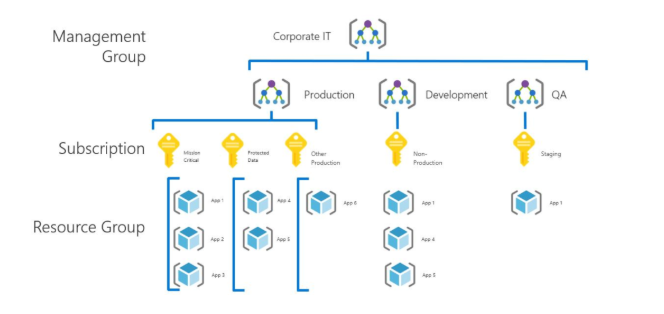
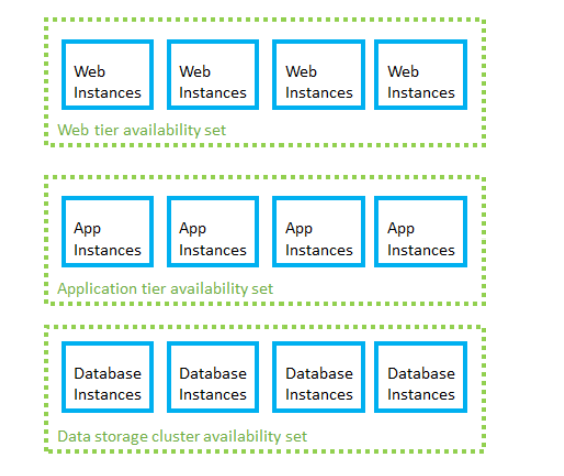
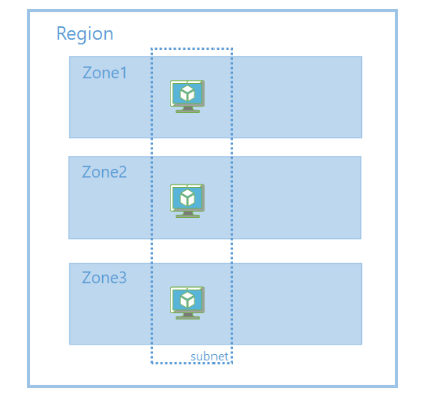
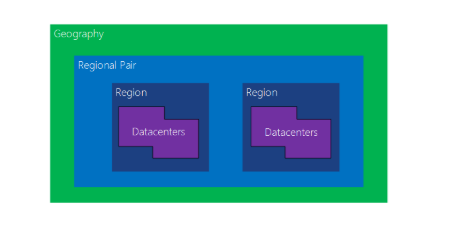

# Azure for Google Cloud Professionals

This article helps Google Cloud experts understand the basics of Microsoft Azure accounts, platform, and services. It also covers key similarities and differences between the Google Cloud and Azure platforms. (Note that Google Cloud was previously called Google Cloud Platform (GCP).)

You'll learn:

- How accounts and resources are organized in Azure.
- How available solutions are structured in Azure.
- How the major Azure services differ from Google Cloud services.

Azure and Google Cloud built their capabilities independently over time so that each has important implementation and design differences.

## Azure for Google Cloud overview

Like Google Cloud, Microsoft Azure is built around a core set of compute, storage, database, and networking services. In many cases, both platforms offer a basic equivalence between the products and services they offer. Both Google Cloud and Azure allow you to build highly available solutions based on Linux or Windows hosts. So, if you're used to development using Linux and OSS technology, both platforms can do the job.

While the capabilities of both platforms are similar, the resources that provide those capabilities are often organized differently. Exact one-to-one relationships between the services required to build a solution are not always clear. In other cases, a particular service might be offered on one platform, but not the other.

## Managing accounts and subscription

Azure has a hierarchy of Management group and subscriptions and resource groups to manage resources effectively. This is similar to the Folders and Project hierarchy for resources in Google Cloud.

Azure levels of management scope

- **Management groups:** These groups are containers that help you manage access, policy, and compliance for multiple subscriptions. All subscriptions in a management group automatically inherit the conditions applied to the management group.
- **Subscriptions:** A subscription logically associates user accounts and the resources that were created by those user accounts. Each subscription has limits or quotas on the amount of resources you can create and use. Organizations can use subscriptions to manage costs and the resources that are created by users, teams, or projects.
- **Resource groups:** A resource group is a logical container into which Azure resources like web apps, databases, and storage accounts are deployed and managed.
- **Resources:** Resources are instances of services that you create, like virtual machines, storage, or SQL databases.

Azure services can be purchased using several pricing options, depending on your organization's size and needs. See the [pricing overview](https://azure.microsoft.com/pricing) page for details.

[Azure subscriptions](/azure/virtual-machines/linux/infrastructure-example) are a grouping of resources with an assigned owner responsible for billing and permissions management.

A Google Cloud *project* is conceptually similar to the Azure subscription, in terms of billing, quotas, and limits. However, from a functional perspective, a Google Cloud project is more like a resource group in Azure. It's a logical unit that cloud resources are deployed to.

Note that unlike in Google Cloud, there is no maximum number of Azure subscriptions. Each Azure subscription is linked to a single Azure Active Directory (Azure AD) tenant (an *account*, in Google Cloud terms). An Azure AD tenant can contain an unlimited number of subscriptions, whereas Google Cloud has a default limit of 30 projects per account.

Subscriptions are assigned three types of administrator accounts:

- **Account Administrator**. The subscription owner and the account billed for the resources used in the subscription. The account administrator can only be changed by transferring ownership of the subscription.
- **Service Administrator**. This account has rights to create and manage resources in the subscription but is not responsible for billing. By default, the account administrator and service administrator are assigned to the same account. The account administrator can assign a separate user to the service administrator account for managing the technical and operational aspects of a subscription. Only one service administrator is assigned per subscription.
- **Co-administrator**. There can be multiple co-administrator accounts assigned to a subscription. Co-administrators cannot change the service administrator, but otherwise have full control over subscription resources and users.

For fine-grained access management to Azure resources, you can use Azure role-based access control ([Azure RBAC](/azure/role-based-access-control/rbac-and-directory-admin-roles)), which includes over 70 built-in roles. You can also create your own custom roles.

Below the subscription level user roles and individual permissions can also be assigned to specific resources. In Azure, all user accounts are associated with either a Microsoft Account or Organizational Account (an account managed through Azure AD).

Subscriptions have default service quotas and limits. For a full list of these limits, see [Azure subscription and service limits, quotas, and constraints](/azure/azure-subscription-service-limits). These limits can be increased up to the maximum by [filing a support request in the management portal](/archive/blogs/girishp/increasing-core-quota-limits-in-azure).

### See also

- [How to add or change Azure administrator roles](/azure/billing/billing-add-change-azure-subscription-administrator)
- [How to download your Azure billing invoice and daily usage data](/azure/billing/billing-download-azure-invoice-daily-usage-date)

## Resource management

The term "resource" in Azure means any compute instance, storage object, networking device, or other entity you can create or configure within the platform.

Azure resources are deployed and managed using one of two models: [Azure Resource Manager](/azure/azure-resource-manager/resource-group-overview), or the older Azure [classic deployment model](/azure/azure-resource-manager/resource-manager-deployment-model). Any new resources are created using the Resource Manager model.

### Resource groups

Azure additionally has an entity called "resource groups" that organize resources such as VMs, storage, and virtual networking devices. An Azure resource is always associated with one resource group. A resource created in one resource group can be moved to another group but can only be in one resource group at a time. For more information, see [Move Azure resources across resource groups, subscriptions, or regions](/azure/azure-resource-manager/management/move-resources-overview). Resource groups are the fundamental grouping used by Azure Resource Manager.

Resources can also be organized using [tags](/azure/azure-resource-manager/resource-group-using-tags). Tags are key-value pairs that allow you to group resources across your subscription irrespective of resource group membership.

### Management interfaces

Azure offers several ways to manage your resources:

- [Web interface](/azure/azure-resource-manager/resource-group-portal). The Azure portal provides a full web-based management interface for Azure resources.
- [REST API](/rest/api). The Azure Resource Manager REST API provides programmatic access to most of the features available in the Azure portal.
- [Command Line](/azure/azure-resource-manager/cli-azure-resource-manager). The Azure CLI provides a command-line interface capable of creating and managing Azure resources. The Azure CLI is available for [Windows, Linux, and macOS](/cli/azure).
- [PowerShell](/azure/azure-resource-manager/powershell-azure-resource-manager). The Azure modules for PowerShell allow you to execute automated management tasks using a script. PowerShell is available for [Windows, Linux, and macOS](https://github.com/PowerShell/PowerShell).
- [Templates](/azure/azure-resource-manager/resource-group-authoring-templates). Azure Resource Manager templates provide JSON template-based resource management capabilities.
- [SDK](https://azure.microsoft.com/downloads). The SDKs are a collection of libraries that allows users to programmatically manage and interact with Azure services.

In each of these interfaces, the resource group is central to how Azure resources get created, deployed, or modified.

In addition, many third-party management tools like [Hashicorp's Terraform](https://www.terraform.io/docs/providers/azurerm) and [Netflix Spinnaker](https://www.spinnaker.io/), are also available on Azure.

### See also

- [Azure resource group guidelines](/azure/azure-resource-manager/resource-group-overview#resource-groups)

## Regions and Availability Zones

Failures can vary in the scope of their impact. Some hardware failures, such as a failed disk, may affect a single host machine. A failed network switch could affect a whole server rack. Less common are failures that disrupt a whole datacenter, such as loss of power in a datacenter. In rare situations, an entire region could become unavailable.

One of the main ways to make an application resilient is through redundancy. However, you need to plan for this redundancy when you design the application. Also, the level of redundancy that you need depends on your business requirements. Not every application needs redundancy across regions to guard against a regional outage. In general, a tradeoff exists between greater redundancy and reliability versus higher cost and complexity.

In Google Cloud, a region has two or more Availability Zones. An Availability Zone corresponds with a physically isolated datacenter in the geographic region. Azure has numerous features for providing application redundancy at every level of potential failure, including **availability sets** , **availability zones** , and **paired regions**.

The following table summarizes each option.

| | **Availability Set** | **Availability Zone** | **Paired region** |
| --- | --- | --- | --- |
| **Scope of failure** | Rack | Datacenter | Region |
| **Request routing** | Load Balancer | Cross-zone Load Balancer | Traffic Manager |
| **Network latency** | Very low | Low | Mid to high |
| **Virtual networking** | VNet | VNet | Cross-region VNet peering |

### **Availability sets**

To protect against localized hardware failures, such as a disk or network switch failing, deploy two or more VMs in an availability set. An availability set consists of two or more _fault domains_ that share a common power source and network switch. VMs in an availability set are distributed across the fault domains, so if a hardware failure affects one fault domain, network traffic can still be routed the VMs in the other fault domains. For more information about Availability Sets, see [Manage the availability of Windows virtual machines in Azure](/azure/virtual-machines/windows/manage-availability).

When VM instances are added to availability sets, they are also assigned an [update domain](/azure/virtual-machines/linux/manage-availability). An update domain is a group of VMs that are set for planned maintenance events at the same time. Distributing VMs across multiple update domains ensures that planned update and patching events affect only a subset of these VMs at any given time.

Availability sets should be organized by the instance's role in your application to ensure one instance in each role is operational. For example, in a three-tier web application, create separate availability sets for the front-end, application, and data tiers.

Availability sets

### Availability Zones

Like Google Cloud, Azure regions can have Availability zones. An [Availability Zone](/azure/availability-zones/az-overview) is a physically separate zone within an Azure region. Each Availability Zone has a distinct power source, network, and cooling. Deploying VMs across availability zones helps to protect an application against datacenter-wide failures.

Zone redundant VM deployment on Azure

For more information, see [Build solutions for high availability using Availability Zones](../high-availability/building-solutions-for-high-availability.yml).

### Paired regions

To protect an application against a regional outage, you can deploy the application across multiple regions, using [Azure Traffic Manager](/azure/traffic-manager) to distribute internet traffic to the different regions. Each Azure region is paired with another region. Together, these form a [regional pair](/azure/best-practices-availability-paired-regions). With the exception of Brazil South, regional pairs are located within the same geography in order to meet data residency requirements for tax and law enforcement jurisdiction purposes.

Unlike Availability Zones, which are physically separate datacenters but may be in relatively nearby geographic areas, paired regions are typically separated by at least 300 miles. This design ensures that large-scale disasters only affect one of the regions in the pair. Neighboring pairs can be set to sync database and storage service data, and are configured so that platform updates are rolled out to only one region in the pair at a time.

Azure [geo-redundant storage](/azure/storage/common/storage-redundancy-grs) is automatically backed up to the appropriate paired region. For all other resources, creating a fully redundant solution using paired regions means creating a full copy of your solution in both regions.

Region Pairs in Azure

### See also

- [Regions for virtual machines in Azure](/azure/virtual-machines/linux/regions)
- [Availability options for virtual machines in Azure](/azure/virtual-machines/linux/availability)
- [High availability for Azure applications](../example-scenario/infrastructure/multi-tier-app-disaster-recovery.yml)
- [Failure and disaster recovery for Azure applications](/azure/architecture/framework/resiliency/backup-and-recovery)
- [Planned maintenance for Linux virtual machines in Azure](/azure/virtual-machines/linux/maintenance-and-updates)

## Services

For a listing of how services map between platforms, see [Google Cloud to Azure services](./services.md) comparison.

Not all Azure products and services are available in all regions. Consult the [Products by Region](https://azure.microsoft.com/global-infrastructure/services) page for details. You can find the uptime guarantees and downtime credit policies for each Azure product or service on the [Service Level Agreements](https://azure.microsoft.com/support/legal/sla) page.

## Next steps

- [Get started with Azure](https://azure.microsoft.com/get-started)
- [Azure Reference Architectures](../browse/index.yml)
