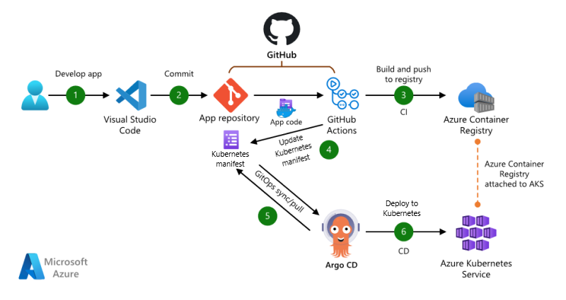

GitOps is an operating model for cloud-native applications that stores application and declarative infrastructure code in Git to be used as the source of truth for automated continuous delivery. With GitOps, you describe the desired state of your entire system in a git repository, and a GitOps operator deploys it to your environment, which is often a Kubernetes cluster. For more information on GitOps for Kubernetes on Azure, visit [GitOps for Azure Kubernetes Service](/azure/architecture/example-scenario/gitops-aks/gitops-blueprint-aks) or [CI/CD and GitOps disciplines with Azure Arc-enabled Kubernetes](/azure/cloud-adoption-framework/scenarios/hybrid/arc-enabled-kubernetes/eslz-arc-kubernetes-cicd-gitops-disciplines).

The example scenario in this article is applicable to businesses that want to modernize end-to-end application development by using containers, continuous integration (CI) for build, and GitOps for continuous deployment (CD). In this scenario, a [Flask app](/azure/app-service/quickstart-python) is used as an example. This web app consists of a front-end written using Python and the Flask framework.

> [!NOTE]
> You can use any containerized app with this scenario. For example, you could use the [Azure voting app](/samples/azure-samples/aks-voting-app/aks-voting-app).

## Architecture

The following options explore push-based and pull-based CI/CD approaches.

### Option 1: Push-based CI/CD

*Push-based architecture with GitHub Actions for CI and CD.*

*Download a [Visio file](https://arch-center.azureedge.net/cicd-gitops-github-actions-aks-push.vsdx) of this architecture.*

#### Dataflow

This scenario covers a push-based DevOps pipeline for a two-tier web application, with a front-end web component and a back-end that uses Redis. This pipeline uses GitHub Actions for build and deployment. The data flows through the scenario as follows:

1. The app code is developed.
2. The app code is committed to a GitHub git repository.
3. GitHub Actions builds a container image from the app code and pushes the container image to Azure Container Registry.
4. A GitHub Actions job deploys, or pushes, the app to the Azure Kubernetes Service (AKS) cluster using kubectl deployment of the Kubernetes manifest files.

### Option 2: Pull-based CI/CD (GitOps)

*Pull-based architecture with GitHub Actions for CI and Argo CD for CD.*

*Download a [Visio file](https://arch-center.azureedge.net/cicd-gitops-github-actions-aks-pull.vsdx) of this architecture.*

#### Dataflow

This scenario covers a pull-based DevOps pipeline for a two-tier web application, with a front-end web component and a back-end that uses Redis. This pipeline uses GitHub Actions for build. For deployment, it uses Argo CD as a GitOps operator to pull/sync the app. The data flows through the scenario as follows:

1. The app code is developed.
2. The app code is committed to a GitHub repository.
3. GitHub Actions builds a container image from the app code and pushes the container image to Azure Container Registry.
4. GitHub Actions updates a Kubernetes manifest deployment file with the current image version based on the version number of the container image in the Azure Container Registry.
5. Argo CD syncs with, or pulls from, the Git repository.
6. Argo CD deploys the app to the AKS cluster.

### Components

- [GitHub Actions](https://github.com/features/actions) is an automation solution that can integrate with Azure services for continuous integration (CI). In this scenario, GitHub Actions orchestrates the creation of new container images based on commits to source control, pushes those images to Azure Container Registry, then updates the Kubernetes manifest files in the GitHub repository.
- [Azure Kubernetes Service (AKS)](https://azure.microsoft.com/products/kubernetes-service) is a managed Kubernetes platform that lets you deploy and manage containerized applications without container orchestration expertise. As a hosted Kubernetes service, Azure handles critical tasks like health monitoring and maintenance for you.
- [Azure Container Registry](https://azure.microsoft.com/products/container-registry) stores and manages container images that are used by the AKS cluster. Images are securely stored, and can be replicated to other regions by the Azure platform to speed up deployment times.
- [GitHub](https://github.com) is a web-based source control system that runs on Git and is used by developers to store and version their application code. In this scenario, GitHub is used to store the source code in a Git repository, then GitHub Actions is used to perform build and push of the container image to Azure Container Registry in the push-based approach.
- [Argo CD](https://argoproj.github.io/cd) is an open-source GitOps operator that integrates with GitHub and AKS. Argo CD supports continuous deployment (CD). Flux could have been used for this purpose, but Argo CD showcases how an app team might choose a separate tool for their specific application lifecycle concerns, compared with using the same tool that the cluster operators use for cluster management.
- [Azure Monitor](https://azure.microsoft.com/services/monitor) helps you track performance, maintain security, and identify trends. Metrics obtained by Azure Monitor can be used by other resources and tools, such as [Grafana](https://grafana.com).

### Alternatives

- [Azure Pipelines](https://azure.microsoft.com/products/devops/pipelines) helps you implement a CI/DC and test pipeline for any app.
- [Jenkins](https://jenkins.io) is an open-source automation server that can integrate with Azure services for CI/CD.
- [Flux](https://fluxcd.io) can be utilized as the GitOps operator. It can perform the same tasks as Argo CD and works the same way with AKS.

## Scenario details

In this scenario, the automated build and deployment of your app uses several technologies. The code is developed in [VS Code](https://code.visualstudio.com) and stored in a GitHub repository. GitHub Actions is used to build the app as a container, then push the container image to an Azure Container Registry. GitHub Actions is used to update the necessary Kubernetes manifest deployment file, also stored in the Git repository, while the GitOps operator Argo CD picks up the Kubernetes manifest files from there and deploys the app to the AKS cluster.

Other examples include providing an automated development environment, validating new code commits, and pushing new deployments into staging or production environments. Traditionally, businesses had to manually build and compile applications and updates, and maintain a large, monolithic code base. With a modern approach to application development that uses CI and GitOps for CD, you can quickly build, test, and deploy services. This modern approach lets you release applications and updates to your customers faster, and respond to changing business demands in a more agile manner.

By using Azure and GitHub services such as AKS, Container Registry, GitHub, and GitHub Actions, companies can use the latest application development techniques and tools to simplify the process of implementing high availability. Also, by using open-source technologies, such as Flux or Argo CD for GitOps, companies simplify the deployment and enforce the desired state of applications.

### Potential use cases

Other relevant use cases include:

- Modernize application development practices by adopting a microservice, container-based approach.
- Speed up application development and deployment lifecycles.
- Automate deployments to test or acceptance environments for validation.
- Ensure configurations and desired state of application.
- Automate cluster lifecycle management.

### CI/CD options

This document showcases the use of GitOps for a modern approach to handling continuous deployment in a CI/CD pipeline. However, every organization is different. When deploying applications to Kubernetes clusters through automated delivery pipelines, it's important to understand the various ways it can be done.

The two most common CI/CD options for deploying an application to an AKS cluster are push-based and pull-based. The push option utilizes GitHub Actions for continuous deployment and the pull option utilizes GitOps for continuous deployment.

#### Option 1: Push-based architecture with GitHub Actions for CI and CD

In this approach, code starts with the CI part of the pipeline working its way to changes being pushed as deployments to the Kubernetes cluster. The deployments are based on a trigger. There are various triggers that can start the deployment, for example, commits to the repository or a trigger from another CI pipeline. With this approach, the pipeline system has access to the Kubernetes cluster. The push-based module is the most common model used today by CI/CD tools.

Reasons to use a push-based approach:

- **Flexibility**: Most GitOps operators currently only run in Kubernetes. If your organization wants to deploy applications to anything other than Kubernetes, you'll need to push the application to that environment via other CI/CD tooling such as with GitHub Actions.

- **Efficiency**: A standardized approach to deploying your cloud native and traditional applications is more efficient. Currently, GitOps is best suited for cloud-native applications that run on Kubernetes.

- **Simplicity**: Push-based CI/CD is well-known among the broadest set of engineers in many organizations. A push-based approach might be simpler than a mix of push-based and pull-based CI/CD approaches.

- **Structure**: Current repository structure used for your application might not be well suited for GitOps, meaning that significant planning and restructuring would be required to fit for GitOps.

#### Option 2: Pull-based architecture with GitHub Actions for CI and GitOps operator Argo CD for CD

This approach centers around applying any changes from inside a Kubernetes cluster. The Kubernetes cluster includes an operator that scans a git repository for the desired state of the cluster, picking up and applying any changes that need to be made. In this model, no external client has admin-level credentials to the Kubernetes cluster. The pull-model isn't new but hasn't been widely used by CI/CD tools. Recently, with the introduction of GitOps, the pull-model has been gaining adoption. Many organizations have been utilizing GitOps to facilitate continuous deployment in their CD/CD pipelines.

Reasons to use a pull-based approach:

- **Consistency**: With GitOps, an operator compares the state of your Kubernetes clusters with the desired state of your configuration and applications in a git repository. If there's any drift to the configuration or applications, the GitOps operator brings the Kubernetes cluster back to the desired state automatically.

- **Security**: A pull-based approach to CI/CD with GitOps allows you to shift security credentials to your Kubernetes cluster, which reduces the security and risk surface by removing credentials from being stored in your external CI tooling. You'll also be able to reduce allowed inbound connections and limit admin-level access to your Kubernetes clusters.

- **Versioning**: Since GitOps utilizes a git repository as the source of truth, your continuous deployment inherently has versioning, rollback, and audit capabilities.

- **Multi-tenancy**: A pull-based approach with GitOps is well suited for distributed teams and or multi-tenancy. With GitOps, you can utilize separate git repositories, separate access rights, and distribute deployments across different namespaces.

- **Cloud native**: More applications are being modernized or built to be cloud-native. For any organization that has most of its applications running in Kubernetes, utilizing a GitOps operator for continuous deployment is simpler and more efficient than a traditional push-based approach to CI/CD.

## Considerations

These considerations implement the pillars of the Azure Well-Architected Framework, which is a set of guiding tenets that can be used to improve the quality of a workload. For more information, see [Microsoft Azure Well-Architected Framework](/azure/architecture/framework).

### Reliability

Reliability ensures your application can meet the commitments you make to your customers. For more information, see [Overview of the reliability pillar](/azure/architecture/framework/resiliency/overview).

To monitor your application performance and report on issues, this scenario utilizes Azure Monitor. It lets you monitor and troubleshoot performance issues that might require code updates, which can then be deployed with the CI/CD pipeline.

As part of the AKS cluster, a load balancer distributes application traffic to one or more containers or pods that run your application. This approach to running containerized applications in Kubernetes provides a highly available infrastructure for your customers.

> [!NOTE]
> This article doesn't directly address CI/CD pipeline high availability. For more information, visit [High availability for GitHub Actions](https://docs.github.com/en/enterprise-server@3.4/admin/github-actions/advanced-configuration-and-troubleshooting/high-availability-for-github-actions) and [Argo CD Declarative GitOps CD for Kubernetes](https://argo-cd.readthedocs.io/en/stable/operator-manual/high_availability).

Resiliency components are built into Kubernetes. These components monitor and restart containers, or pods, if there's an issue. When multiple Kubernetes nodes are combined, your application can tolerate a pod or node being unavailable.

For general guidance on designing resilient solutions, see [Designing reliable Azure applications](/azure/architecture/framework/resiliency/app-design).

### Security

Security provides assurances against deliberate attacks and the abuse of your valuable data and systems. For more information, see [Overview of the security pillar](/azure/architecture/framework/security/overview).

For separation of credentials and permissions, this scenario uses a dedicated Azure Active Directory (Azure AD) service principal. The credentials for this service principal are stored as a secure credential object in GitHub, as GitHub Actions Secrets, so that they're not directly exposed and visible within scripts or the build pipeline.

For general guidance on securing applications on AKS clusters, see [Security concepts for applications and clusters in AKS](/azure/aks/concepts-security).

For separation of concerns, the guidance is to separate the compute that runs the business application from the CD agents, or GitOps operator, by running the business application and the GitOps operator in separate namespaces on the Kubernetes cluster. For further separation of concerns, the GitOps operator can be run on a Kubernetes cluster that's dedicated to the GitOps instance separate from the production Kubernetes cluster that runs the business application.

> [!NOTE]
> This article doesn't directly address how to secure a CI/CD pipeline. For information on securing a CI/CD pipeline, see [Secure DevOps for AKS](/azure/architecture/solution-ideas/articles/secure-devops-for-kubernetes).

### Performance efficiency

Performance efficiency is the ability of your workload to scale to meet the demands placed on it by users in an efficient manner. For more information, see [Performance efficiency pillar overview](/azure/architecture/framework/scalability/overview).

AKS lets you scale the number of cluster nodes to meet the demands of your applications. As your application grows, you can scale up the number of Kubernetes nodes that run your service.

With GitHub Actions, the cloud provider automatically scales the number of runners. If self-hosted runners are used, the host of the runner would be responsible to scale them as needed.

For other scalability topics, see the [performance efficiency checklist](/azure/architecture/framework/scalability/performance-efficiency).

## Deploy this scenario

Follow the steps in the [AKS-baseline-automation reference implementation](https://github.com/Azure/aks-baseline-automation/tree/main/workloads/docs) to deploy the scenario. The reference implementation repository has guided walk-throughs for both the [push-based CI/CD](https://github.com/Azure/aks-baseline-automation/blob/main/workloads/docs/app-flask-push-dockerbuild.md) scenario and the [pull-based CI/CD (GitOps)](https://github.com/Azure/aks-baseline-automation/blob/main/workloads/docs/app-flask-pull-gitops.md) scenario.

## Contributors

*This article is maintained by Microsoft. It was originally written by the following contributors.* 

Principal authors:

- [Steve Buchanan](https://www.linkedin.com/in/steveabuchanan) | Principal Program Manager

Other contributors:

- [Ayobami Ayodeji](https://www.linkedin.com/in/ayobamiayodeji) | Senior Program Manager
- [Bahram Rushenas](https://www.linkedin.com/in/bahram-rushenas-306b9b3) | Senior Architect

*To see non-public LinkedIn profiles, sign in to LinkedIn.*

## Next steps

This scenario used Azure Container Registry and AKS to store and run a container-based application. Azure Container Apps or Azure Container Instances can also be used to run container-based applications, without having to provision any orchestration components. For more information, see [Azure Container Instances overview](/azure/container-instances/container-instances-overview) and [Azure Container Apps overview](/azure/container-apps/overview).

Product documentation:

- [Azure Kubernetes Service](/azure/aks/intro-kubernetes)
- [Azure Monitor overview](/azure/azure-monitor/overview)
- [Linux virtual machines in Azure](/azure/virtual-machines/linux/overview)
- [Private Docker container registries in Azure](/azure/container-registry/container-registry-intro)
- [Security concepts for applications and clusters in AKS](/azure/aks/concepts-security)
- [AKS landing zone accelerator](/azure/cloud-adoption-framework/scenarios/app-platform/aks/landing-zone-accelerator)

Microsoft Learn modules:

- [Build a containerized web application with Docker](/learn/modules/intro-to-containers)
- [Deploy a containerized application on Azure Kubernetes Service](/learn/modules/aks-deploy-container-app)
- [Implement Azure Kubernetes Service (AKS)](/learn/modules/implement-azure-kubernetes-service)
- [Monitor the usage, performance, and availability of resources with Azure Monitor](/learn/paths/monitor-usage-performance-availability-resources-azure-monitor)

## Related resources

- [Baseline architecture for an AKS cluster](/azure/architecture/reference-architectures/containers/aks/baseline-aks)
- [GitOps blueprint for Azure Kubernetes Service](/azure/architecture/example-scenario/gitops-aks/gitops-blueprint-aks)
- [CI/CD for microservices architectures](/azure/architecture/microservices/ci-cd)
- [CI/CD pipeline for container-based workloads](/azure/architecture/guide/aks/aks-cicd-github-actions-and-gitops)
- [Build a CI/CD pipeline for microservices on Kubernetes](/azure/architecture/microservices/ci-cd-kubernetes)
- [Secure DevOps for AKS](/azure/architecture/solution-ideas/articles/secure-devops-for-kubernetes)
- [Advanced AKS microservices architecture](/azure/architecture/reference-architectures/containers/aks-microservices/aks-microservices-advanced)
