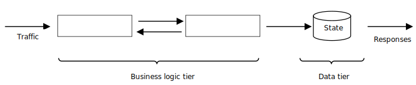
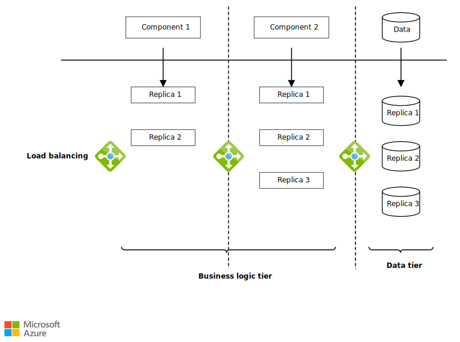
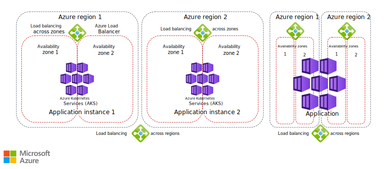

This guide discusses high availability (HA) for multitier application deployment in Azure Kubernetes Service (AKS) clusters. The article describes Kubernetes HA mechanisms and constructs, and it provides a checklist and guidelines to identify and eliminate single points of HA failure.

There are two fundamental tasks for implementing HA for AKS applications.

- Identify all single points of failure in the application.
- Eliminate the single points of failure.

Eliminating single points of failure requires an HA solution.

## The four HA pillars

Four HA pillars appear in every highly available system:

- **Redundancy**
- **Monitoring**
- **Recovery**
- **Checkpointing**

Consider a multitiered AKS application, where traffic arrives to the business logic tier, the data tier preserves state, and the application returns responses to users.

### Identify single points of failure

To identify single points of failure, start by determining the critical path between client requests and the components that serve those requests. Any component on this path that isn't managed according to the four HA pillars, or three pillars if it's a stateless component without checkpointing, is a single point of failure. Even a replicated component is considered a single point of failure if it isn't monitored, because its failure goes silently undetected.

### Eliminate single points of failure

To eliminate single points of failure, deploy your application to replicate critical path components, and employ load balancers, monitoring, and recovery mechanisms. Kubernetes can handle all these activities.

*Download a [Visio file](https://arch-center.azureedge.net/replicas.vsdx) of this diagram.*

In a replicated application:

- You replicate the business tier components with various numbers of replicas per component, depending on their performance and workload.
- You also replicate the data tier behind a load balancer.

Kubernetes offers several constructs and mechanisms, such as load balancing and liveness probes, that help implement the HA pillars. The following checklist and discussion divide these constructs and mechanisms into categories that map to the four HA pillars.

## The Kubernetes HA checklist

Other than state management, Kubernetes does an exceptional job of maintaining application HA. The HA checklist lists common configurations that you can use to optimize Kubernetes HA management. To use the checklist, evaluate your Kubernetes deployment against the following mechanisms and constructs, and implement any that are missing.

|HA pillar|Solution|
|---------|--------|
|Redundancy|☐ Kubernetes controller type ☐ Number of replicas ☐ Scheduling anti-affinity|
|Monitoring|☐ Liveness probes ☐ Readiness probes ☐ Startup probes|
|Recovery|☐ Service type ☐ Leader election ☐ Restart policy ☐ Pre-stop hooks|
|Checkpointing|☐ Persistent volume claims ☐ Persistent volumes|

### Redundancy

Redundancy mitigates having a single point of failure. You need redundancy across all tiers of an application. To achieve redundancy, you replicate a component of a given tier with one or more identical replicas.

- **Controller type**, configuration `kind: Deployment`. Kubernetes offers several controllers that can manage the lifecycle of your application's pod. The most popular controller is the `Deployment`. Other controllers include the `Statefulset`, which comes in handy when it's important to maintain pod identity after a recovery. Other controllers such as `Replicasets` don't offer the same useful functionality, such as rollbacks, that the deployment offers.

- **Number of replicas**, configuration `spec.replicas`. Setting the number of replicas to only one is a deliberate decision to use a cold standby model. Cold standby means that when a failure happens, a new instance starts from scratch, which affects availability. This model might work for components with low-volume workloads, but consider replicating stateless, high-volume components.

  By specifying the resource request limits, `spec.containers[].resources`, you can add [horizontal pod autoscaling (HPA)](https://kubernetes.io/docs/tasks/run-application/horizontal-pod-autoscale), which causes Kubernetes to automatically scale up or down the number of replicas based on resource utilization thresholds that you define. HPA helps avoid cases where a surge in load prevents your application from serving requests due to overload.

- **Scheduling anti-affinity**, configuration `spec.affinity.podAntiAffinity`. A typical production-level Kubernetes cluster has nodes spread across multiple [availability zones](/azure/aks/availability-zones), expressed using a `topologyKey`. Pods of the same deployment should have preferred or soft anti-affinity with each other. This configuration ensures that the pods schedule on nodes in different availability zones.

  An AKS cluster can have [multiple node pools](/azure/aks/use-multiple-node-pools), each with different [virtual machines scale set sizes and specs](/azure/aks/quotas-skus-regions). For example, you can host your database pods on nodes with fast solid-state drives (SSDs), and host your machine learning pods on [nodes with graphics processing units (GPUs)](/azure/virtual-machines/sizes-gpu).

### Monitoring

Without monitoring, redundancy can become ineffective. You need a constant monitoring mechanism to ensure that the workload reaches a healthy replica.

- **Liveness probes**, configuration `spec.containers.livenessProbe`, monitor the health of your pods. If a container crashes or exits, Kubernetes can detect it. When liveness fails, Kubernetes restarts the container.

- **Readiness probes**, configuration `spec.containers.readinessProbe`, determine whether to send traffic to the pod. If any pods of a deployment aren't ready, they won't be part of the endpoints of the Kubernetes service abstracting the deployment, and therefore won't be useful. It's important to carefully set the readiness probes, because they don't trigger a restart, but are used to isolate the pods from receiving traffic until they're ready.

- **Startup probes**, configuration `spec.containers.startupProbe`, mainly prevent false positives for readiness and liveness in slow-starting applications. Once the startup probe has succeeded, the liveness probe kicks in.

Azure offers [deeper insights](/azure/azure-monitor/containers/container-insights-analyze#analyze-nodes-controllers-and-container-health) that allow you to set alerts based on your cluster health.

### Recovery

The main purpose of monitoring is to trigger recovery when it detects a failure. A recovery process involves three phases:

1. **Isolate and redirect:** Make sure the faulty replica isn't receiving traffic, and direct its workload to healthy replicas.
2. **Repair:** Restart the faulty replica, which can repair transient errors.
3. **Rejoin:** After repair, if monitoring deems the replica healthy, rejoin the replica to other replicas in handling the workload.

- **Service type**, configuration `spec.type`. Exposing your pods through a service can be classified under redundancy as well as recovery. However, in some cases, you might have a single-replica deployment. There are still benefits for exposing the pods through a service, even though there's no load balancing.

  The main advantage of the service is that domain name service (DNS) entries automatically update with the Kubernetes service endpoints. A pod that has containers with failing readiness probes won't receive traffic through AKS. Although the load balancing ability of Kubernetes cluster IP services is rudimentary, you can couple a headless service with ingress or other service mesh solutions to better balance load distribution.

  How external traffic reaches your AKS cluster is outside the scope of Kubernetes. You can handle external traffic with services such as [Azure Application Gateway](https://azure.microsoft.com/services/application-gateway/#overview).

- **Leader election**. Some components are best deployed as singletons. The scheduler is such a component, because two active schedulers can conflict. Having a singleton exposes the application to cold standby issues. To enable warm standby of a pod, you can use leader election, where only one pod, the leader, handles requests.

- **Restart policy**, configuration `spec.restartPolicy`. The restart policy applies to all containers in the pod. There should be valid justification for setting this attribute to `Never`. Some containers contact a license server each time they start, and you might want to avoid the added costs of excessive restarts.

- **Pre-stop hooks**, configuration `spec.containers.lifecycle.preStop`. Pre-stop hooks run before a `SIGTERM` signal is sent to the container. A pre-stop script can be as simple as a 30-second sleep command.

  For example, when an application managed by an HPA is scaling down, in-progress requests might be abruptly terminated unless the application has a `SIGTERM` handler that completes serving requests before exiting. A pre-stop hook removes the pod endpoint, and therefore the DNS entry, from the service endpoint. While the pre-stop hook is running, no new requests can be sent to the pod. The pre-stop hook allows the pod to finish processing its in-progress requests without receiving new ones. Pre-stop hooks are a simple way to minimize dropped requests without modifying application code.

### Checkpointing

Modern applications have many stateless components, but entirely stateless applications are still rare. Most applications checkpoint their state in the data layer. Kubernetes intentionally doesn't provide any mechanism to handle application state. State management is a complex task that isn't part of container management.

You can persist application state in three levels:

- The **data records level** stores the data in a database. Each database record can replicate across multiple database instances. Database records are the dominant form of state persistence, especially in managed cloud databases like [Azure Cosmos DB](https://azure.microsoft.com/services/cosmos-db/#overview).

- The **file system level** typically replicates data files, such as write-ahead logging (WAL) files. Most cloud providers offer plugins for their solutions, such as [Azure Files](https://azure.microsoft.com/products/storage/files).

- The **disk level** persists data at the block level, which provides flexibility to define the file system to use, as in [Azure Disk Storage](https://azure.microsoft.com/products/storage/disks).

Kubernetes [volumes, persistent volumes, and persistent volume claims](https://kubernetes.io/docs/concepts/storage/persistent-volumes) can persist the state of the application at the file system or disk level. The most common pattern to store state is still the data records level.

## HA and DR

In both HA and disaster recovery (DR), the choices of network topology and [load balancing solutions](../technology-choices/load-balancing-overview.yml) are important.

However, DR requires [multiregion service deployment](/azure/availability-zones/az-overview#regions) at the entire service level, with load balancing solutions between Azure regions. The application is either spread across multiple regions, or an entire application instance is deployed in each region. The choice depends on application type, application architecture, and latency tolerance between components.

Instead of using multiple regions, HA benefits from [multizone deployments](/azure/availability-zones/az-overview#availability-zones) within Azure regions. The following diagram illustrates the difference between availability zones and regions for HA and DR.

*Download a [Visio file](https://arch-center.azureedge.net/load-balancing.vsdx) of this architecture.*

This guide focused on HA at the application level within one AKS cluster. For more information about DR in AKS multicluster deployments, see [AKS baseline for multiregion clusters](../../reference-architectures/containers/aks-multi-region/aks-multi-cluster.yml).

## Other considerations

- To maintain application HA, make sure your Kubernetes control plane, including the API server and controller manager, is highly available. Consider using an [AKS Uptime SLA](/azure/aks/uptime-sla) to ensure HA.

- A resource consolidation strategy directly contravenes the HA redundancy pillar. Therefore, you should carefully analyze the cost of redundancy. The [Azure pricing calculator](https://azure.microsoft.com/pricing/calculator) can help.

- The highly available Microsoft service [Project Bonsai: AI for engineers](https://www.microsoft.com/ai/autonomous-systems-project-bonsai-how-it-works) is an example of project design that exemplifies HA principles. This project motivated the Kubernetes HA constructs checklist and this guide.

## Contributors

*This article is maintained by Microsoft. It was originally written by the following contributors.*

Principal author:

- [Ali Kanso](https://www.linkedin.com/in/ali-kanso-phd) | Principal Software Engineer

Other contributors:

- [Karthik Sankara Subramanian](https://www.linkedin.com/in/karthik-sankara-subramanian-b9955916) | Software Engineer II
- [Kinshuman Patra](https://www.linkedin.com/in/kinshuman-patra-5268a87) | Partner Group Engineering Manager
- [Ayobami Ayodeji](https://www.linkedin.com/in/ayobamiayodeji) | Senior Program Manager
- [Oscar L Pla Alvarez](https://www.linkedin.com/in/oscarpla) | Domain Solution Architect

*To see non-public LinkedIn profiles, sign in to LinkedIn.*

## Next steps

- [High availability Kubernetes cluster pattern](/hybrid/app-solutions/pattern-highly-available-kubernetes)
- [Regions and availability zones](/azure/availability-zones/az-overview)
- [Quotas, virtual machine size restrictions, and region availability in Azure Kubernetes Service (AKS)](/azure/aks/quotas-skus-regions)
- [Orchestrating microservices and multi-container applications for high scalability and availability](/dotnet/architecture/containerized-lifecycle/design-develop-containerized-apps/orchestrate-high-scalability-availability)
- [Azure Kubernetes Service (AKS) cluster architecture and operations](/training/paths/aks-cluster-architecture)

## Related resources

- [AKS baseline for multiregion clusters](../../reference-architectures/containers/aks-multi-region/aks-multi-cluster.yml)
- [Microservices architecture on Azure Kubernetes Service](../../reference-architectures/containers/aks-microservices/aks-microservices.yml)
- [Azure Well-Architected Framework review - Azure Kubernetes Service (AKS)](/azure/architecture/framework/services/compute/azure-kubernetes-service/azure-kubernetes-service)
