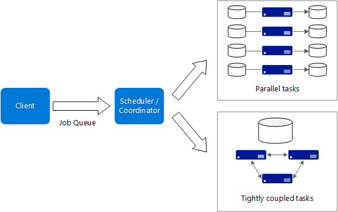

# Big compute architecture style

The term *big compute* describes large-scale workloads that require a large number of cores, often numbering in the hundreds or thousands. Scenarios include image rendering, fluid dynamics, financial risk modeling, oil exploration, drug design, and engineering stress analysis, among others.

Here are some typical characteristics of big compute applications:

- The work can be split into discrete tasks, which can be run across many cores simultaneously.
- Each task is finite. It takes some input, does some processing, and produces output. The entire application runs for a finite amount of time (minutes to days). A common pattern is to provision a large number of cores in a burst, and then spin down to zero once the application completes.
- The application does not need to stay up 24/7. However, the system must handle node failures or application crashes.
- For some applications, tasks are independent and can run in parallel. In other cases, tasks are tightly coupled, meaning they must interact or exchange intermediate results. In that case, consider using high-speed networking technologies such as InfiniBand and remote direct memory access (RDMA).
- Depending on your workload, you might use compute-intensive VM sizes (H16r, H16mr, and A9).

## When to use this architecture

- Computationally intensive operations such as simulation and number crunching.
- Simulations that are computationally intensive and must be split across CPUs in multiple computers (10-1000s).
- Simulations that require too much memory for one computer, and must be split across multiple computers.
- Long-running computations that would take too long to complete on a single computer.
- Smaller computations that must be run 100s or 1000s of times, such as Monte Carlo simulations.

## Benefits

- High performance with "[embarrassingly parallel][embarrassingly-parallel]" processing.
- Can harness hundreds or thousands of computer cores to solve large problems faster.
- Access to specialized high-performance hardware, with dedicated high-speed InfiniBand networks.
- You can provision VMs as needed to do work, and then tear them down.

## Challenges

- Managing the VM infrastructure.
- Managing the volume of number crunching
- Provisioning thousands of cores in a timely manner.
- For tightly coupled tasks, adding more cores can have diminishing returns. You may need to experiment to find the optimum number of cores.

## Big compute using Azure Batch

[Azure Batch][batch] is a managed service for running large-scale high-performance computing (HPC) applications.

Using Azure Batch, you configure a VM pool, and upload the applications and data files. Then the Batch service provisions the VMs, assign tasks to the VMs, runs the tasks, and monitors the progress. Batch can automatically scale out the VMs in response to the workload. Batch also provides job scheduling.

## Big compute running on Virtual Machines

You can use [Microsoft HPC Pack][hpc-pack] to administer a cluster of VMs, and schedule and monitor HPC jobs. With this approach, you must provision and manage the VMs and network infrastructure. Consider this approach if you have existing HPC workloads and want to move some or all it to Azure. You can move the entire HPC cluster to Azure, or you can keep your HPC cluster on-premises but use Azure for burst capacity. For more information, see [Batch and HPC solutions for large-scale computing workloads][batch-hpc-solutions].

### HPC Pack deployed to Azure

In this scenario, the HPC cluster is created entirely within Azure.

The head node provides management and job scheduling services to the cluster. For tightly coupled tasks, use an RDMA network that provides very high bandwidth, low latency communication between VMs. For more information, see [Deploy an HPC Pack 2016 cluster in Azure][deploy-hpc-azure].

### Burst an HPC cluster to Azure

In this scenario, an organization is running HPC Pack on-premises, and uses Azure VMs for burst capacity. The cluster head node is on-premises. ExpressRoute or VPN Gateway connects the on-premises network to the Azure VNet.

<!-- links -->

[batch]: /azure/batch/
[batch-hpc-solutions]: /azure/batch/batch-hpc-solutions
[deploy-hpc-azure]: /azure/virtual-machines/windows/hpcpack-2016-cluster
[embarrassingly-parallel]: https://en.wikipedia.org/wiki/Embarrassingly_parallel
[hpc-pack]: https://technet.microsoft.com/library/cc514029
