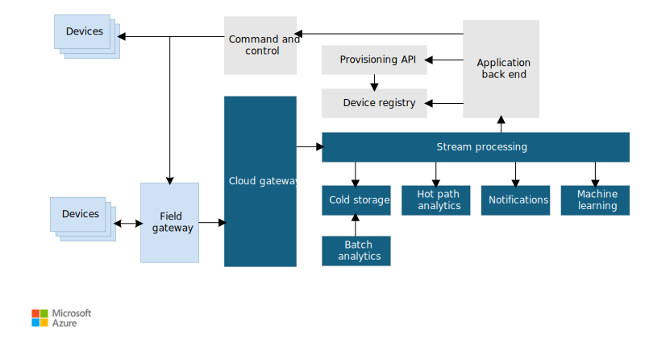

A big data architecture is designed to handle the ingestion, processing, and analysis of data that is too large or complex for traditional database systems.

Big data solutions typically involve one or more of the following types of workload:

- Batch processing of big data sources at rest.
- Real-time processing of big data in motion.
- Interactive exploration of big data.
- Predictive analytics and machine learning.

Most big data architectures include some or all of the following components:

- **Data sources**: Big data solutions can start with one or more data sources. Examples include:

  - Data stores, such as relational databases.
  - Files produced by applications, such as web server log files and api responses. 
  - Real-time data sources, such as streaming devices, webhooks, or applications upstream of the relational database. 

- **Data storage**: Data for batch processing operations is typically stored in a distributed file store that can hold high volumes of large files in various formats. This kind of store is often called a *data lake*. Options for implementing this storage include Azure Data Lake Store or Microsoft Fabric Onelake.

- **Batch processing**: When data needs to be prepared for analysis and made available for reports to show what has happened historically, batch processing is useful. Usually these jobs involve reading source files, processing them, and writing the output to new files. Options include using dataflows, data pipelines in Microsoft Fabric.

- **Real time processing**: If the solution includes real-time sources, the architecture must include a way to capture and store real-time messages for stream processing. Data can stay in motion from the time that it is generated to cleaned, transformed, and acted on operationally or analytically. Many solutions need to support scale-out processing, reliable delivery, and other message queuing semantics. Options include Microsoft Fabric Real Time Intelligence Eventstreams, Azure Event Hubs, Azure IoT Hubs, and Kafka.

- **Analytical data store**: Many big data solutions prepare data for analysis and then serve the processed data in a structured format that can be queried using analytical tools. Depending on your scenario above, the analytical data store used to serve these queries can be an Eventhouse in Microsoft Fabric to process data in motion and the stream is processed in flight, or it could be a dimensional data warehouse, as seen in most traditional business intelligence (BI) solutions or a lakehouse (Bronze, Silver, and Gold). Microsoft Fabric provides you all options - eventhouse, warehouse and lakehouse - which can be queried using SQL and Spark respectively. Use the [Fabric data store decision guide](/fabric/fundamentals/decision-guide-data-store) to help guide your decision.

- **Analysis and reporting**: One of the goals data solutions should be to provide insights into the data through analysis and reporting. To empower users to analyze the data, the architecture may include a data modeling layer, such as a multidimensional OLAP cube or tabular data model in Azure Analysis Services. It might also support self-service BI, using the modeling and visualization technologies in Microsoft Power BI or Microsoft Excel. Analysis and reporting can also take the form of interactive data exploration by data scientists or data analysts. For these scenarios, Microsoft Fabric provides you with tools like notebooks where the user can either choose SQL or a programming language of their choice.

- **Actions and alerting** Another goal of a big data solution should be to provide operational insights into the current state of the business process. The architecture should include an action system layer, which takes real time streams of data as it is being processed and detects exceptions and anomalies that are occuring within the organization. Rather than a user checking a report, these alerting systems can be used to proactively notify and indicate to users and leadership that anomalous activities are occuring. Microsoft Fabric Real Time Intelligence Activator Alerts is a good example of this.

- **Orchestration**: Big data solutions can consist of repeated data processing operations, encapsulated in workflows, that transform source data, move data between multiple sources and sinks, load the processed data into an analytical data store, or push the results straight to a report or dashboard. To automate these workflows, you can use an orchestration technology such Azure Data Factory or Microsoft Fabric pipelines.

Microsoft includes many services that can be used in a big data architecture. They fall roughly into two categories:

- SaaS services, such as Microsoft Fabric
- Managed services such as Azure Data Lake Store, Azure Stream Analytics, Azure Event Hubs, Azure IoT Hub, and Azure Data Factory, Azure SQL Db, Azure Cosmos DB
  
## When to use this architecture

Consider this architecture style when you need to:

- Act on data in real time as data is being generated
- Store and process data in volumes too large for a traditional database.
- Transform unstructured data for analysis and reporting
- Use Azure Machine Learning or Azure AI services.

## Benefits

- **Technology choices**. Microsoft Fabric provides many of these services to you in a SaaS interface, pre-wiring the various components together. This makes it much easier to build end to end data solutions. You can also mix and match Azure managed services to capitalize on existing skills or technology investments.
- **Performance through parallelism**. Big data solutions take advantage of parallelism, enabling high-performance solutions that scale to large volumes of data.
- **Elastic scale**. All of the components in the big data architecture support scale-out provisioning, so that you can adjust your solution to small or large workloads, and pay only for the resources that you use.
- **Interoperability with existing solutions**. The components of the big data architecture are also used for IoT processing and enterprise BI solutions, enabling you to create an integrated solution across data workloads.

## Challenges

- **Skillset**. Some big data technologies are highly specialized, and use frameworks and languages that are not typical of more general application architectures. On the other hand, big data technologies are evolving new APIs that build on more established languages.
- **Security**. Big data solutions usually rely on storing all static data in a centralized data lake. Securing access to this data can be challenging, especially when the data must be ingested and consumed by multiple applications and platforms.

## Best practices

- **Leverage parallelism**. Most big data processing technologies distribute the workload across multiple processing units. This requires that static data files are created and stored in a splittable format. Distributed file systems such as HDFS can optimize read and write performance, and the actual processing is performed by multiple cluster nodes in parallel, which reduces overall job times. Use of splitable data format is highly recommended such as Parquet.

- **Partition data**. Batch processing usually happens on a recurring schedule &mdash; for example, weekly or monthly. Partition data files, and data structures such as tables, based on temporal periods that match the processing schedule. That simplifies data ingestion and job scheduling, and makes it easier to troubleshoot failures. Also, partitioning tables can significantly improve query performance.

- **Apply schema-on-read semantics**. Using a data lake lets you combine storage for files in multiple formats, whether structured, semi-structured, or unstructured. Use *schema-on-read* semantics, which project a schema onto the data when the data is processing, not when the data is stored. This builds flexibility into the solution, and prevents bottlenecks during data ingestion caused by data validation and type checking.

- **Process batch data on arrival**. Traditional BI solutions often use an extract, transform, and load (ETL) process to move data into a data warehouse. With larger volumes data, and a greater variety of formats, big data solutions generally use variations of ETL, such as extract, load, and transform (ELT).

  
- **Process streaming data in flight** In the case of streaming solutions, transform the payload while the data is being transmitted. Because you are dealing with much smaller packets over the network, it is much easier to transform these smaller rows sets during generation. Land the transformed stream in an engine optimized for event based data, such as Microsoft Fabric Real Time Intelligence Eventhouse, making the data immediately available for action. 

- **Balance utilization and time costs**. For batch processing jobs, it's important to consider two factors: The per-unit cost of the compute nodes, and the per-minute cost of using those nodes to complete the job. For example, a batch job may take eight hours with four cluster nodes. However, it might turn out that the job uses all four nodes only during the first two hours, and after that, only two nodes are required. In that case, running the entire job on two nodes would increase the total job time, but would not double it, so the total cost would be less. In some business scenarios, a longer processing time may be preferable to the higher cost of using underutilized cluster resources.

- **Separate resources**. Whenever possible, aim to separate resources based on the workloads to avoid scenarios like one workload using all the resources while other is waiting.

- **Orchestrate data ingestion**. In some cases, existing business applications may write data files for batch processing directly into Azure storage blob containers, where they can be consumed by downstream services like Microsoft Fabric. However, you will often need to orchestrate the ingestion of data from on-premises or external data sources into the data lake. Use an orchestration workflow or pipeline, such as those supported by Azure Data Factory or Microsoft Fabric, to achieve this in a predictable and centrally manageable fashion.

- **Scrub sensitive data early**. The data ingestion workflow should scrub sensitive data early in the process, to avoid storing it in the data lake.

## IoT architecture

Internet of Things (IoT) is a specialized subset of big data solutions. The following diagram shows a possible logical architecture for IoT. The diagram emphasizes the event-streaming components of the architecture.

The **cloud gateway** ingests device events at the cloud boundary, using a reliable, low latency messaging system.

Devices might send events directly to the cloud gateway, or through a **field gateway**. A field gateway is a specialized device or software, usually colocated with the devices, that receives events and forwards them to the cloud gateway. The field gateway might also preprocess the raw device events, performing functions such as filtering, aggregation, or protocol transformation.

After ingestion, events go through one or more **stream processors** that can route the data to perform analytics, take action and other processing.

The following are some common types of processing.

- Data is loaded into an event based data store such as Microsoft Fabric Real Time Intelligence Eventhouse to contextualize the IoT device with metadata, such as the building location, device information, etc.

- Analyzing the event stream in real time to detect anomalies, recognize patterns over rolling time windows, or trigger alerts when a specific condition occurs in the stream.

- Handling special types of non-telemetry messages from devices, such as notifications and alarms.

- Machine learning.

The boxes that are shaded gray show components of an IoT system that are not directly related to event streaming, but are included here for completeness.

- The **device registry** is a database of the provisioned devices, including the device IDs and usually device metadata, such as location.

- The **provisioning API** is a common external interface for provisioning and registering new devices.

- Some IoT solutions allow **command and control messages** to be sent to devices.

> This section has presented a very high-level view of IoT, and there are many subtleties and challenges to consider. For more details, see [IoT architectures](/azure/architecture/browse/?azure_categories=iot).

## Next steps

- Learn more about [big data architectures](../../databases/guide/big-data-architectures.md).
- Learn more about [IoT architectures](/azure/architecture/browse/?azure_categories=iot).

 <!-- links -->

[iot-ref-arch]: https://azure.microsoft.com/updates/microsoft-azure-iot-reference-architecture-available
