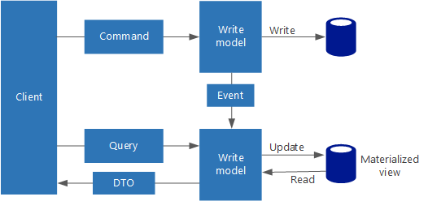

# CQRS architecture style

Command and Query Responsibility Segregation (CQRS) is an architectural style that separates read operations from write operations. 

In traditional architectures, the same data model is used to query and update a database. That's simple and works well for basic CRUD operations. In more complex applications, however, this approach can become unwieldy. For example, on the read side, the application may perform many different queries, returning DTOs with different shapes. Object mapping can become complicated. On the write side, the model may implement complex validation and business logic. As a result, you can end up with an overly complex model that does too much.

Another potential problem is that read and write workloads are often asymmetrical, with very different performance and scale requirements. 

CQRS addresses these problems by separating reads and writes into separate models, using **commands** to update data, and **queries** to read data.

- Commands should be task-based, rather than data-centric. ("Book hotel room," not "set ReservationStatus to Reserved.") Commands may be placed on a queue for asynchronous processing, rather than being processed synchronously.

- Queries never modify the database. A query returns a DTO that does not encapsulate any domain knowledge.

For greater isolation, you can physically separate the read data from the write data. In that case, the read database can use its own data schema that is optimized for queries. For example, it can store a [materialized view][materialized-view] of the data, in order to avoid complex joins or complex O/RM mappings. It might even use a different type of data store. For example, the write database might be relational, while the read database is a key-value store.

If separate read and write databases are used, they must be kept in sync. Typically this is accomplished by  having the write model publish an event whenever it updates the database. Updating the database and publishing the event must occur in a single transaction. 

Some implementations of CQRS use the [Event Sourcing pattern][event-sourcing]. With this pattern, application state is stored as a sequence of events. Each event represents a set of changes to the data. The current state is constructed by replaying the events. In a CQRS context, one benefit of Event Sourcing is that the same events can be used to notify other components &mdash; in particular, to notify the read model. The read model uses the events to create a snapshot of the current state, which is more efficient for queries. However, Event Sourcing adds complexity to the design.

## When to use this architecture

Consider CQRS for collaborative domains where many users access the same data, especially when the read and write workloads are asymmetrical.

Apply CQRS only to those subsystems where there is clear value in separating reads and writes. Otherwise, you are creating additional complexity for no benefit.

## Benefits

- **Simpler models**. Most of the transactional business logic goes into the write model. The read model is relatively simple and lightweight.
- **Security**. It's easier to ensure that only the right domain entities are performing writes on the data.
- **Separation of read and write workloads** This allows each workload to be scaled independently, and may result in fewer lock contentions.
- **Simpler queries**. By storing a materialized view in the read database, the application can avoid complex joins when querying.

## Challenges

- **Complexity**. The basic idea of CQRS is simple. But it can lead to a more complex application design, especially if they include the Event Sourcing pattern.

- **Messaging**. Although CQRS does not require messaging, it's common to use messaging to process commands and publish update events. In that case, the application must handle message failures or duplicate messages. 

- **Eventual consistency**. If you separate the read and write databases, the read data may be stale. 

## Additional considerations

- CQRS is not a top-level architecture that applies to an entire system. Instead, it is applied to a subsystem of a larger architecture. 

- Consider using the Event Sourcing pattern to avoid update conflicts.

- Consider using the Materialized View pattern for the read model, to optimize the schema for queries.

## CQRS in Microservices

CQRS can be especially useful in a [microservices architecture][microservices]. One of the principles of microservices is that a service cannot directly access another service's data store.

In the following diagram, Service A writes to a data store, and Service B keeps a materialized view of the data. Service A publishes an event whenever it writes to the data store. Service B subscribes to the event.

<!-- links -->

[event-sourcing]: ../../patterns/event-sourcing.md
[materialized-view]: ../../patterns/materialized-view.md
[microservices]: ./microservices.md