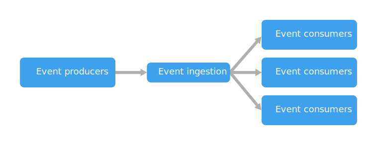

An event-driven architecture consists of **event producers** that generate a stream of events, and **event consumers** that listen for the events.

Events are delivered in near real time, so consumers can respond immediately to events as they occur. Producers are decoupled from consumers &mdash; a producer doesn't know which consumers are listening. Consumers are also decoupled from each other, and every consumer sees all of the events. This differs from a [Competing Consumers][competing-consumers] pattern, where consumers pull messages from a queue and a message is processed just once (assuming no errors). In some systems, such as IoT, events must be ingested at very high volumes.

An event driven architecture can use a [publish/subscribe](/azure/architecture/patterns/publisher-subscriber) (also called _pub/sub_) model or an event stream model.

- **Pub/sub**: The messaging infrastructure keeps track of subscriptions. When an event is published, it sends the event to each subscriber. After an event is received, it cannot be replayed, and new subscribers do not see the event.

- **Event streaming**: Events are written to a log. Events are strictly ordered (within a partition) and durable. Clients don't subscribe to the stream, instead a client can read from any part of the stream. The client is responsible for advancing its position in the stream. That means a client can join at any time, and can replay events.

On the consumer side, there are some common variations:

- **Simple event processing**. An event immediately triggers an action in the consumer. For example, you could use Azure Functions with a Service Bus trigger, so that a function executes whenever a message is published to a Service Bus topic.

- **Complex event processing**. A consumer processes a series of events, looking for patterns in the event data, using a technology such as Azure Stream Analytics. For example, you could aggregate readings from an embedded device over a time window, and generate a notification if the moving average crosses a certain threshold.

- **Event stream processing**. Use a data streaming platform, such as Azure IoT Hub or Apache Kafka, as a pipeline to ingest events and feed them to stream processors. The stream processors act to process or transform the stream. There may be multiple stream processors for different subsystems of the application. This approach is a good fit for IoT workloads.

The source of the events may be external to the system, such as physical devices in an IoT solution. In that case, the system must be able to ingest the data at the volume and throughput that is required by the data source.

In the logical diagram above, each type of consumer is shown as a single box. In practice, it's common to have multiple instances of a consumer, to avoid having the consumer become a single point of failure in system. Multiple instances might also be necessary to handle the volume and frequency of events. Also, a single consumer might process events on multiple threads. This can create challenges if events must be processed in order or require exactly-once semantics. See [Minimize Coordination][minimize-coordination].

## When to use this architecture

- Multiple subsystems must process the same events.
- Real-time processing with minimum time lag.
- Complex event processing, such as pattern matching or aggregation over time windows.
- High volume and high velocity of data, such as IoT.

## Benefits

- Producers and consumers are decoupled.
- No point-to-point integrations. It's easy to add new consumers to the system.
- Consumers can respond to events immediately as they arrive.
- Highly scalable and distributed.
- Subsystems have independent views of the event stream.

## Challenges

- Guaranteed delivery. In some systems, especially in IoT scenarios, it's crucial to guarantee that events are delivered.
- Processing events in order or exactly once. Each consumer type typically runs in multiple instances, for resiliency and scalability. This can create a challenge if the events must be processed in order (within a consumer type), or if the processing logic is not idempotent.

### Additional considerations

- The amount of data to include in an event can be a significant consideration that affects both performance and cost. Putting all the relevant information needed for processing in the event itself can simplify the processing code and save additional lookups. Putting the minimal amount of information in an event, like just a couple of identifiers, will reduce transport time and cost, but requires the processing code to look up any additional information it needs. For more information on this, take a look at [this blog post](https://particular.net/blog/putting-your-events-on-a-diet).

 <!-- links -->

[competing-consumers]: ../../patterns/competing-consumers.yml
[minimize-coordination]: ../design-principles/minimize-coordination.yml
