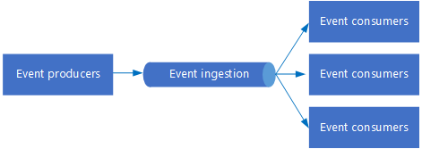

# Event-driven architecture style

In an event driven architecture, application behavior is driven by asynchronous events, using a publish-subscribe (pub-sub) model. In some systems, such as IoT, events must be ingested at very high volumes.

At its heart, an event-driven architecture consists of event producers and event consumers. Producers generate events, and consumers listen for them. Producers are decoupled from consumers &mdash; a producer doesn't know which consumers are listening. The events go to all of the consumers, which process them independently from each other. (This differs from a [competing consumers][competing-consumers] pattern.) Events are delivered in near real time, so consumers can respond immediately to events as they occur.

An event driven architecture can use a publish/subscribe ("pub/sub") model, or an event stream model. 

- **Pub/sub**: The messaging infrastructure keeps track of subscriptions. When an event is published, it sends the event to each subscriber. After an event is received, it cannot be replayed, and new subscribers do not see the event. 

- **Event streaming**: Events are written to a log. Events are strictly ordered (within a partition) and durable. Clients don't "subscribe" to the stream, instead a client can read from any part of the stream. The client is responsible for advancing it's position in the stream. That means a client can join at any time, and can replay events.

On the consumer side, there are some common variations:

- **Simple event processing**. An event immediately triggers an action in the consumer. For example, you could use Azure Functions with a Service Bus trigger, so that a function executes whenever a message is published to a Service Bus topic.

- **Complex event processing**. A consumer processes a series of events, looking for patterns in the event data, using a technology such as Azure Stream Analytics or Apache Storm. For example, you could aggregate readings from an embedded device over a time window, and generate a notification if the moving average crosses a certain threshold. 

- **Event stream processing**. Use a data streaming platform, such as Azure IoT Hub or Apache Kafka, as a pipeline to ingest events and feed them to stream processors. The stream processors act to process or transform the stream. There may be multiple stream processors for different subsystems of the application. This approach is a good fit for IoT workloads.

The source of the events may be external to the system, such as physical devices in an IoT solution. In that case, the system must be able to ingest the data at the volume and throughput that is required by the data source.

In the logical diagram above, each type of consumer is shown as a single box. In practice, it's common to have multiple instances of a consumer, to avoid having the consumer become a single point of failure in system. Multiple instances might also be necessary  to handle the volume and frequency of events. Also, a single consumer might process events on multiple threads. This can create challenges if events must be processed in order, or require exactly-once semantics. See [Minimize Coordination][minimize-coordination]. 

## When to use this architecture

- Multiple subsystems must process the same events. 
- Real-time processing with minimum time lag.
- Complex event processing, such as pattern matching or aggregation over time windows.
- High volume and high velocity of data, such as IoT.

## Benefits

- Producers and consumers are decoupled.
- No point-to point-integrations. It's easy to add new consumers to the system.
- Consumers can respond to events immediately as they arrive. 
- Highly scalable and distributed. 
- Subsystems have independent views of the event stream.

## Challenges

- Guaranteed delivery. In some systems, especially in IoT scenarios, it's crucial to guarantee that events are delivered.
- Processing events in order. 
- Exactly-once processing.

## IoT architecture

Event driven architectures are central to IoT solutions. The following diagram shows a possible logical architecture for IoT. The diagram emphasizes the event-streaming components of the architecture.

The **cloud gateway** ingests device events at the cloud boundary, using a reliable, low latency messaging system.

Devices might send events directly to the cloud gateway, or through a **field gateway**. A field gateway is a specialized device or software, usually co-located with the devices, that receives events and forwards them to the cloud gateway. The field gateway might also pre-process the raw device events, performing functions such as filtering, aggregation, or protocol transformation.

After ingestion, events go through one ore more **stream processors** that can route the data (for example, to storage) or perform analytics and other processing.

The following are some common types of processing. (This list is certainly not exhaustive.)

- Writing event data to cold storage, for archiving or batch analytics.

- Hot path analytics: Analyzing the event stream in (near) real time, to detect anomalies, recognize patterns over rolling time windows, or trigger alerts when a specific condition occurs in the stream. 

- Handling special types of non-telemetry messages from devices, such as notifications and alarms. 

- Machine learning.

The boxes that are shaded gray show components of an IoT system that are not directly related to event streaming, but are included here for completeness.

- The **device registry** is a database of the provisioned devices, including the device IDs and usually device metadata, such as location.

- The **provisioning API** is a common external interface for provisioning and registering new devices.

- Some IoT solutions allow **command and control messages** to be sent to devices.

> This section has presented a very high-level view of IoT, and there are many subtleties and challenges to consider. For a more detailed reference architecture and discussion, see the [Microsoft Azure IoT Reference Architecture][iot-ref-arch] (PDF download).

 <!-- links -->

[competing-consumers]: ../../patterns/competing-consumers.md
[iot-ref-arch]: https://azure.microsoft.com/en-us/updates/microsoft-azure-iot-reference-architecture-available/
[minimize-coordination]: ../design-principles/minimize-coordination.md

