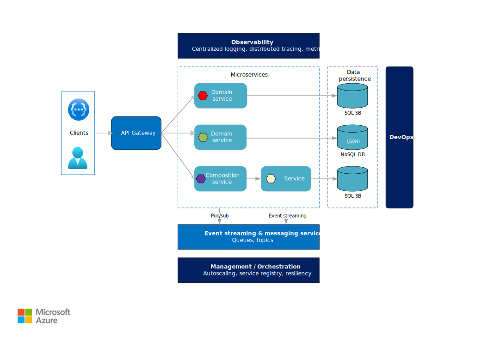

# Microservices architecture style

A microservices architecture consists of a collection of small, autonomous services. Each service is self-contained and should implement a single business capability.

In some ways, microservices are the natural evolution of service oriented architectures (SOA), but there are differences between microservices and SOA. Here are some defining characteristics of a microservice:

- In a microservices architecture, services are small, independent, and loosely coupled.

- Each service is a separate codebase, which can be managed by a small development team.

- Services can be deployed independently. A team can update an existing service without rebuilding and redeploying the entire application.

- Services are responsible for persisting their own data or external state. This differs from the traditional model, where a separate data layer handles data persistence.

- Services communicate with each other by using well-defined APIs. Internal implementation details of each service are hidden from other services.

- Services don't need to share the same technology stack, libraries, or frameworks.

Besides for the services themselves, some other components appear in a typical microservices architecture:

**Management**. The management component is responsible for placing services on nodes, identifying failures, rebalancing services across nodes, and so forth.

**Service Discovery**. Maintains a list of services and which nodes they are located on. Enables service lookup to find the endpoint for a service.

**API Gateway**. The API gateway is the entry point for clients. Clients don't call services directly. Instead, they call the API gateway, which forwards the call to the appropriate services on the back end. The API gateway might aggregate the responses from several services and return the aggregated response.

The advantages of using an API gateway include:

- It decouples clients from services. Services can be versioned or refactored without needing to update all of the clients.

- Services can use messaging protocols that are not web friendly, such as AMQP.

- The API Gateway can perform other cross-cutting functions such as authentication, logging, SSL termination, and load balancing.

## When to use this architecture

Consider this architecture style for:

- Large applications that require a high release velocity.

- Complex applications that need to be highly scalable.

- Applications with rich domains or many subdomains.

- An organization that consists of small development teams.

## Benefits

- **Independent deployments**. You can update a service without redeploying the entire application, and roll back or roll forward an update if something goes wrong. Bug fixes and feature releases are more manageable and less risky.

- **Independent development**. A single development team can build, test, and deploy a service. The result is continuous innovation and a faster release cadence.

- **Small, focused teams**. Teams can focus on one service. The smaller scope of each service makes the code base easier to understand, and it's easier for new team members to ramp up.

- **Fault isolation**. If a service goes down, it won't take out the entire application. However, that doesn't mean you get resiliency for free. You still need to follow resiliency best practices and design patterns. See [Designing reliable Azure applications][resiliency-overview].

- **Mixed technology stacks**. Teams can pick the technology that best fits their service.

- **Granular scaling**. Services can be scaled independently. At the same time, the higher density of services per VM means that VM resources are fully utilized. Using placement constraints, a services can be matched to a VM profile (high CPU, high memory, and so on).

## Challenges

- **Complexity**. A microservices application has more moving parts than the equivalent monolithic application. Each service is simpler, but the entire system as a whole is more complex.

- **Development and test**. Developing against service dependencies requires a different approach. Existing tools are not necessarily designed to work with service dependencies. Refactoring across service boundaries can be difficult. It is also challenging to test service dependencies, especially when the application is evolving quickly.

- **Lack of governance**. The decentralized approach to building microservices has advantages, but it can also lead to problems. You may end up with so many different languages and frameworks that the application becomes hard to maintain. It may be useful to put some project-wide standards in place, without overly restricting teams' flexibility. This especially applies to cross-cutting functionality such as logging.

- **Network congestion and latency**. The use of many small, granular services can result in more interservice communication. Also, if the chain of service dependencies gets too long (service A calls B, which calls C...), the additional latency can become a problem. You will need to design APIs carefully. Avoid overly chatty APIs, think about serialization formats, and look for places to use asynchronous communication patterns.

- **Data integrity**. With each microservice responsible for its own data persistence. As a result, data consistency can be a challenge. Embrace eventual consistency where possible.

- **Management**. To be successful with microservices requires a mature DevOps culture. Correlated logging across services can be challenging. Typically, logging must correlate multiple service calls for a single user operation.

- **Versioning**. Updates to a service must not break services that depend on it. Multiple services could be updated at any given time, so without careful design, you might have problems with backward or forward compatibility.

- **Skillset**. Microservices are highly distributed systems. Carefully evaluate whether the team has the skills and experience to be successful.

## Best practices

- Model services around the business domain.

- Decentralize everything. Individual teams are responsible for designing and building services. Avoid sharing code or data schemas.

- Data storage should be private to the service that owns the data. Use the best storage for each service and data type.

- Services communicate through well-designed APIs. Avoid leaking implementation details. APIs should model the domain, not the internal implementation of the service.

- Avoid coupling between services. Causes of coupling include shared database schemas and rigid communication protocols.

- Offload cross-cutting concerns, such as authentication and SSL termination, to the gateway.

- Keep domain knowledge out of the gateway. The gateway should handle and route client requests without any knowledge of the business rules or domain logic. Otherwise, the gateway becomes a dependency and can cause coupling between services.

- Services should have loose coupling and high functional cohesion. Functions that are likely to change together should be packaged and deployed together. If they reside in separate services, those services end up being tightly coupled, because a change in one service will require updating the other service. Overly chatty communication between two services may be a symptom of tight coupling and low cohesion.

- Isolate failures. Use resiliency strategies to prevent failures within a service from cascading. See [Resiliency patterns][resiliency-patterns] and [Designing reliable applications][resiliency-overview].

## Next steps

For detailed guidance about building a microservices architecture on Azure, see [Designing, building, and operating microservices on Azure](../../microservices/index.md).

<!-- links -->

[resiliency-overview]: ../../reliability/index.md
[resiliency-patterns]: ../../patterns/category/resiliency.md
