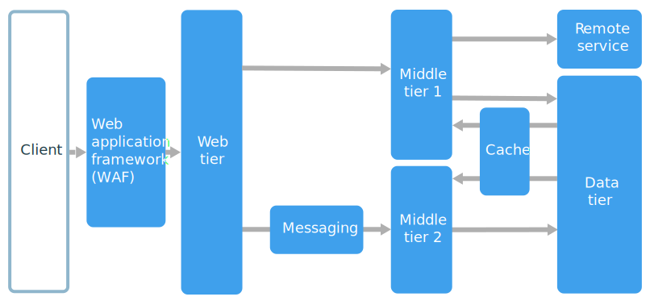

An N-tier architecture divides an application into **logical layers** and **physical tiers**.

Layers are a way to separate responsibilities and manage dependencies. Each layer has a specific responsibility. A higher layer can use services in a lower layer, but not the other way around.

Tiers are physically separated, running on separate machines. A tier can call to another tier directly, or use asynchronous messaging (message queue). Although each layer might be hosted in its own tier, that's not required. Several layers might be hosted on the same tier. Physically separating the tiers improves scalability and resiliency, but also adds latency from the additional network communication.

A traditional three-tier application has a presentation tier, a middle tier, and a database tier. The middle tier is optional. More complex applications can have more than three tiers. The diagram above shows an application with two middle tiers, encapsulating different areas of functionality.

An N-tier application can have a **closed layer architecture** or an **open layer architecture**:

- In a closed layer architecture, a layer can only call the next layer immediately down.
- In an open layer architecture, a layer can call any of the layers below it.

A closed layer architecture limits the dependencies between layers. However, it might create unnecessary network traffic, if one layer simply passes requests along to the next layer.

## When to use this architecture

N-tier architectures are typically implemented as infrastructure-as-service (IaaS) applications, with each tier running on a separate set of VMs. However, an N-tier application doesn't need to be pure IaaS. Often, it's advantageous to use managed services for some parts of the architecture, particularly caching, messaging, and data storage.

Consider an N-tier architecture for:

- Simple web applications.
- Migrating an on-premises application to Azure with minimal refactoring.
- Unified development of on-premises and cloud applications.

N-tier architectures are very common in traditional on-premises applications, so it's a natural fit for migrating existing workloads to Azure.

## Benefits

- Portability between cloud and on-premises, and between cloud platforms.
- Less learning curve for most developers.
- Natural evolution from the traditional application model.
- Open to heterogeneous environment (Windows/Linux)

## Challenges

- It's easy to end up with a middle tier that just does CRUD operations on the database, adding extra latency without doing any useful work.
- Monolithic design prevents independent deployment of features.
- Managing an IaaS application is more work than an application that uses only managed services.
- It can be difficult to manage network security in a large system.

## Best practices

- Use autoscaling to handle changes in load. See [Autoscaling best practices][autoscaling].
- Use [asynchronous messaging](/azure/service-bus-messaging/service-bus-async-messaging) to decouple tiers.
- Cache semistatic data. See [Caching best practices][caching].
- Configure the database tier for high availability, using a solution such as [SQL Server Always On availability groups][sql-always-on].
- Place a web application firewall (WAF) between the front end and the Internet.
- Place each tier in its own subnet, and use subnets as a security boundary.
- Restrict access to the data tier, by allowing requests only from the middle tier(s).

## N-tier architecture on virtual machines

This section describes a recommended N-tier architecture running on VMs.

Each tier consists of two or more VMs, placed in an availability set or virtual machine scale set. Multiple VMs provide resiliency in case one VM fails. Load balancers are used to distribute requests across the VMs in a tier. A tier can be scaled horizontally by adding more VMs to the pool.

Each tier is also placed inside its own subnet, meaning their internal IP addresses fall within the same address range. That makes it easy to apply network security group rules and route tables to individual tiers.

The web and business tiers are stateless. Any VM can handle any request for that tier. The data tier should consist of a replicated database. For Windows, we recommend SQL Server, using Always On availability groups for high availability. For Linux, choose a database that supports replication, such as Apache Cassandra.

Network security groups restrict access to each tier. For example, the database tier only allows access from the business tier.

> [!NOTE]
> The layer labeled "Business Tier" in our reference diagram is a moniker to the business logic tier. Likewise, we also call the presentation tier the "Web Tier." In our example, this is a web application, though multi-tier architectures can be used for other topologies as well (like desktop apps).  Name your tiers what works best for your team to communicate the intent of that logical and/or physical tier in your application - you could even express that naming in resources you choose to represent that tier (e.g. vmss-appName-business-layer).

For more information about running N-tier applications on Azure:

- [N-tier application with Apache Cassandra][n-tier-linux]
- [Windows N-tier application on Azure with SQL Server][n-tier-windows-SQL]
- [Microsoft Learn module: Tour the N-tier architecture style](/training/modules/n-tier-architecture/)
- [Azure Bastion](/azure/bastion/bastion-overview)

### Additional considerations

- N-tier architectures are not restricted to three tiers. For more complex applications, it is common to have more tiers. In that case, consider using layer-7 routing to route requests to a particular tier.

- Tiers are the boundary of scalability, reliability, and security. Consider having separate tiers for services with different requirements in those areas.

- Use virtual machine scale sets for autoscaling.

- Look for places in the architecture where you can use a managed service without significant refactoring. In particular, look at caching, messaging, storage, and databases.

- For higher security, place a network DMZ in front of the application. The DMZ includes network virtual appliances (NVAs) that implement security functionality such as firewalls and packet inspection. For more information, see [Network DMZ reference architecture][dmz].

- For high availability, place two or more NVAs in an availability set, with an external load balancer to distribute Internet requests across the instances. For more information, see [Deploy highly available network virtual appliances][ha-nva].

- Do not allow direct RDP or SSH access to VMs that are running application code. Instead, operators should log into a jumpbox, also called a bastion host. This is a VM on the network that administrators use to connect to the other VMs. The jumpbox has a network security group that allows RDP or SSH only from approved public IP addresses.

- You can extend the Azure virtual network to your on-premises network using a site-to-site virtual private network (VPN) or Azure ExpressRoute. For more information, see [Hybrid network reference architecture][hybrid-network].

- If your organization uses Active Directory to manage identity, you may want to extend your Active Directory environment to the Azure VNet. For more information, see [Identity management reference architecture][identity].

- If you need higher availability than the Azure SLA for VMs provides, replicate the application across two regions and use Azure Traffic Manager for failover. For more information, see [Run Windows VMs in multiple regions][multiregion-windows] or [Run Linux VMs in multiple regions][multiregion-linux].

[autoscaling]: ../../best-practices/auto-scaling.md
[caching]: ../../best-practices/caching.yml
[dmz]: ../../reference-architectures/dmz/secure-vnet-dmz.yml
[ha-nva]: ../../reference-architectures/dmz/nva-ha.yml
[hybrid-network]: ../../reference-architectures/hybrid-networking/index.yml
[identity]: ../../reference-architectures/identity/index.yml
[multiregion-linux]: ../../reference-architectures/n-tier/n-tier-cassandra.yml
[multiregion-windows]: ../../reference-architectures/n-tier/multi-region-sql-server.yml
[n-tier-linux]: ../../reference-architectures/n-tier/n-tier-cassandra.yml
[n-tier-windows-SQL]: ../../reference-architectures/n-tier/n-tier-sql-server.yml
[sql-always-on]: /sql/database-engine/availability-groups/windows/always-on-availability-groups-sql-server
