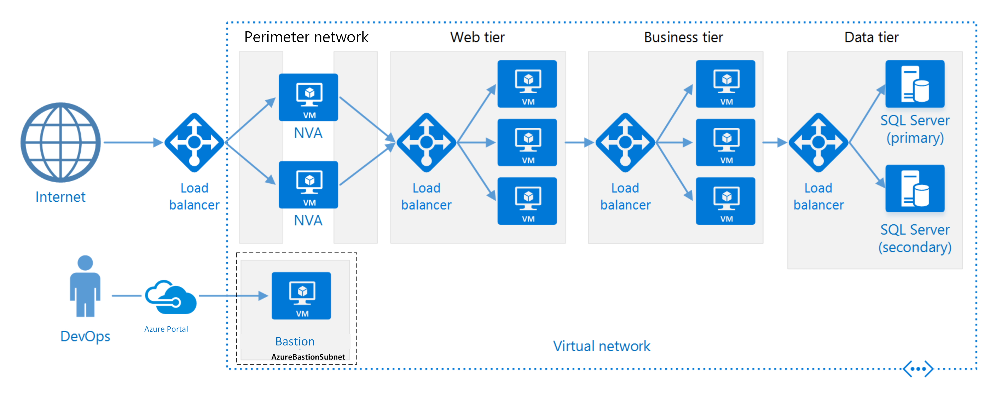

An N-tier architecture divides an application into **logical layers** and **physical tiers**.

Layers are a way to separate responsibilities and manage dependencies. Each layer has a specific responsibility. A higher layer can use services in a lower layer, but not the other way around.

Tiers are physically separated, running on separate machines. Contractually, the tier can have their communication models be strict or relaxed. In the strict model, a request must go through adjacent tiers, one by one, and can't skip any tier in between. For example, from the web application firewall to the web tier, then to middle tier 1, and so on. In contrast, in the relaxed approach, the request might skip some tiers if it's necessary. The strict approach has greater latency and overhead, and the relaxed approach has more couplings and subsequently it's more difficult to change. You can also combine both approaches in the same system.

A tier can call to another tier directly, or use [Asynchronous messaging patterns](/azure/service-bus-messaging/service-bus-async-messaging) through a message queue. Although each layer might be hosted in its own tier, it's not required. Several layers might be hosted on the same tier. Physically separating the tiers improves scalability and resiliency, but also adds latency from the extra network communication.

A traditional three-tier application has a presentation tier, a middle tier, and a database tier. The middle tier is optional. More complex applications can have more than three tiers. The diagram above shows an application with two middle tiers, encapsulating different areas of functionality.

An N-tier application can have a **closed layer architecture** or an **open layer architecture**:

- In a closed layer architecture, a layer can only call the next layer immediately down.
- In an open layer architecture, a layer can call any of the layers below it.

A closed layer architecture limits the dependencies between layers. However, it might create unnecessary network traffic, if one layer simply passes requests along to the next layer.

## When to use this architecture

Consider an N-tier architecture when:

- Architectural requirements are still evolving.
- Migrating an on-premises application to Azure with minimal changes.
- Developing applications that span both on-premises and cloud environments.

N-tier architectures are common in traditional on-premises systems, making them a natural fit for transitioning existing workloads to Azure.

N-tier architectures can be effectively implemented using managed services, which offer scalability, reliability, and reduced operational overhead or virtual machines. These workloads often benefit from also using managed solutions for key components such as caching, messaging, and data storage.

## Benefits

- Portable across cloud and on-premises, and between cloud platforms.
- Requires less learning curve for most developers.
- Costs relatively little by not rearchitecting the solution.
- Follows natural evolution from the traditional application model.
- Supports heterogeneous environment (Windows/Linux).

## Challenges

- It's easy to end up with a middle tier that just performs basic CRUD operations, adding latency and complexity without delivering meaningful value.
- Monolithic design prevents independent deployment of features.
- It can be difficult to manage network security in a large system.
- Testing and monitoring become more difficult when user requests and data move through multiple tiers.

## Best practices

- Use autoscaling to handle changes in load. See [Autoscaling best practices][autoscaling].
- Use [asynchronous messaging](/azure/service-bus-messaging/service-bus-async-messaging) to decouple tiers.
- Data that doesn't change often should be cached. See [Caching best practices][caching].
- Configure the database tier for high availability, using a solution such as [SQL Server Always On availability groups][sql-always-on].
- Place a web application firewall (WAF) between the front end and the Internet.
- Place each tier in its own subnet, and use subnets as a security boundary.
- Restrict access to the data tier, by allowing requests from a middle tier only.

## N-tier architecture on virtual machines

This section describes an N-tier architecture running on VMs.

> [!NOTE]
> Using VMs to host an N-teir architecture might be of particular interest if you're migrating an existing application to Azure with minimal refactoring. Otherwise, consider using [managed services to implement the architecture](/azure/app-service/tutorial-secure-ntier-app), such as Azure App Service or Azure Container Apps.

Each tier consists of a Virtual Machine Scale Set with two or more VMs. Multiple VMs provide resiliency in case one VM fails. Load balancers are used to distribute requests across the VMs in a tier. A tier can be scaled horizontally by adding more VMs to the pool.

Each tier is also placed inside its own subnet, meaning their internal IP addresses fall within the same address range. That makes it easy to apply network security group rules and route tables to individual tiers.

The web and business tiers are stateless. Any VM can handle any request for that tier. The data tier should consist of a replicated database. Where possible, you'd use a managed database, but VM hosted databases are possible as well. For Windows, we recommend [SQL Server](/azure/azure-sql/virtual-machines/), using Always On availability groups for high availability. For Linux, choose a database that supports replication, such as Apache Cassandra.

Network security groups restrict access to each tier. For example, the database tier only allows access from the business tier.

> [!NOTE]
> The layer labeled "Business Tier" in our reference diagram is a moniker to the business logic tier. Likewise, we also call the presentation tier the "Web Tier." Although our example is a web application, multi-tier architectures can also be used for other topologies, like desktop apps. Use clear, descriptive names for your tiers that your team understands. You can also use these names in your Azure resources, for example, `vmss-appname-business-tier`.

### Additional considerations

- N-tier architectures aren't restricted to three tiers. For more complex applications, it's common to have more tiers. In that case, consider using layer-7 routing to route requests to a particular tier.

- Tiers are the boundary of scalability, reliability, and security. Consider having separate tiers for services with different requirements in those areas.

- Use virtual machine scale sets for [autoscaling][autoscaling].

- Look for places in the architecture where you can use a managed service without significant refactoring. In particular, look at caching, messaging, storage, and databases.

- For higher security, place a perimeter network, also called a DMZ, in front of the application. The DMZ includes network virtual appliances (NVAs) that implement security functionality such as firewalls and packet inspection. For more information, see [Implement a secure hybrid network](/azure/architecture/reference-architectures/dmz/secure-vnet-dmz).

- For high availability, use two or more NVAs in a Virtual Machine Scale Set, with an external load balancer to distribute Internet requests across the instances. For more information, see [Deploy highly available network virtual appliances][ha-nva].

- Don't allow direct RDP or SSH access to VMs that are running application code. Instead, use Azure Bastion to securely connect to virtual machines via private IP address. It provides RDP/SSH connectivity to your virtual machines. For more information, see [Azure Bastion overview](/azure/bastion/bastion-overview).

- You can extend the Azure virtual network to your on-premises network using a site-to-site virtual private network (VPN) or Azure ExpressRoute. For more information, see [Hybrid network reference architecture][hybrid-network].

### Next step

- [Create a secure n-tier app in Azure App Service](/azure/app-service/tutorial-secure-ntier-app)

### Related resource

- More information on messaging in an [N-tier architecture style on Azure](https://docs.particular.net/architecture/azure/n-tier)

[autoscaling]: ../../best-practices/auto-scaling.md
[caching]: ../../best-practices/caching.yml
[ha-nva]: ../../networking/guide/network-virtual-appliance-high-availability.md
[hybrid-network]: ../../reference-architectures/hybrid-networking/index.yml
[sql-always-on]: /sql/database-engine/availability-groups/windows/always-on-availability-groups-sql-server
