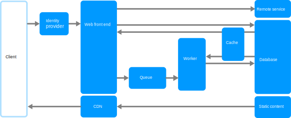

The core components of this architecture are a **web front end** that serves client requests, and a **worker** that performs resource-intensive tasks, long-running workflows, or batch jobs.  The web front end communicates with the worker through a **message queue**.

Other components that are commonly incorporated into this architecture include:

- One or more databases.
- A cache to store values from the database for quick reads.
- CDN to serve static content
- Remote services, such as email or SMS service. Often these features are provided by third parties.
- Identity provider for authentication.

The web and worker are both stateless. Session state can be stored in a distributed cache. Any long-running work is done asynchronously by the worker. The worker can be triggered by messages on the queue, or run on a schedule for batch processing. The worker is an optional component. If there are no long-running operations, the worker can be omitted.

The front end might consist of a web API. On the client side, the web API can be consumed by a single-page application that makes AJAX calls, or by a native client application.

## When to use this architecture

The Web-Queue-Worker architecture is typically implemented using managed compute services, either Azure App Service or Azure Cloud Services.

Consider this architecture style for:

- Applications with a relatively simple domain.
- Applications with some long-running workflows or batch operations.
- When you want to use managed services, rather than infrastructure as a service (IaaS).

## Benefits

- Relatively simple architecture that is easy to understand.
- Easy to deploy and manage.
- Clear separation of concerns.
- The front end is decoupled from the worker using asynchronous messaging.
- The front end and the worker can be scaled independently.

## Challenges

- Without careful design, the front end and the worker can become large, monolithic components that are difficult to maintain and update.
- There may be hidden dependencies, if the front end and worker share data schemas or code modules.

## Best practices

- Expose a well-designed API to the client. See [API design best practices][api-design].
- Autoscale to handle changes in load. See [Autoscaling best practices][autoscaling].
- Cache semi-static data. See [Caching best practices][caching].
- Use a CDN to host static content. See [CDN best practices][cdn].
- Use polyglot persistence when appropriate. See [Use the best data store for the job][polyglot].
- Partition data to improve scalability, reduce contention, and optimize performance. See [Data partitioning best practices][data-partition].

## Web-Queue-Worker on Azure App Service

This section describes a recommended Web-Queue-Worker architecture that uses Azure App Service.

*Download a [Visio file](https://arch-center.azureedge.net/web-queue-worker.vsdx) of this architecture.*

### Workflow

- The front end is implemented as an [Azure App Service](/azure/app-service/overview) web app, and the worker is implemented as an [Azure Functions](/azure/azure-functions/functions-overview) app. The web app and the function app are both associated with an App Service plan that provides the VM instances.

- You can use either [Azure Service Bus](/azure/service-bus-messaging/service-bus-messaging-overview) or [Azure Storage queues](/azure/storage/queues/storage-queues-introduction) for the message queue. (The diagram shows an Azure Storage queue.)

- [Azure Cache for Redis](/azure/azure-cache-for-redis/cache-overview) stores session state and other data that needs low latency access.

- [Azure CDN](/azure/cdn/cdn-overview) is used to cache static content such as images, CSS, or HTML.

- For storage, choose the storage technologies that best fit the needs of the application. You might use multiple storage technologies (polyglot persistence). To illustrate this idea, the diagram shows [Azure SQL Database](/azure/azure-sql/azure-sql-iaas-vs-paas-what-is-overview) and [Azure Cosmos DB](/azure/cosmos-db/introduction).

For more information, see the [App Service web application reference architecture][scalable-web-app] and how to [build message-driven business applications with NServiceBus and Azure Service Bus](/azure/service-bus-messaging/build-message-driven-apps-nservicebus).

### Other considerations

- Not every transaction has to go through the queue and worker to storage. The web front end can perform simple read/write operations directly. Workers are designed for resource-intensive tasks or long-running workflows. In some cases, you might not need a worker at all.

- Use the built-in autoscale feature of App Service to scale out the number of VM instances. If the load on the application follows predictable patterns, use schedule-based autoscale. If the load is unpredictable, use metrics-based autoscaling rules.

- Consider putting the web app and the function app into separate App Service plans. That way, they can be scaled independently.

- Use separate App Service plans for production and testing. Otherwise, if you use the same plan for production and testing, it means your tests are running on your production VMs.

- Use deployment slots to manage deployments. This method lets you deploy an updated version to a staging slot, then swap over to the new version. It also lets you swap back to the previous version, if there was a problem with the update.

## Related resources

- [RESTful web API design](/azure/architecture/best-practices/api-design)
- [Autoscaling](/azure/architecture/best-practices/auto-scaling)
- [Caching guidance](/azure/architecture/best-practices/caching)
- [CDN guidance](/azure/architecture/best-practices/cdn)
- [Data partitioning guidance](/azure/architecture/best-practices/data-partitioning)
- [Use the best data store for your data](/azure/architecture/guide/design-principles/use-best-data-store)
- [Scalable web application](/azure/architecture/reference-architectures/app-service-web-app/scalable-web-app)
- [Queue-Based Load Leveling pattern](/azure/architecture/patterns/queue-based-load-leveling)

<!-- links -->

[api-design]: ../../best-practices/api-design.md
[autoscaling]: ../../best-practices/auto-scaling.md
[caching]: ../../best-practices/caching.yml
[cdn]: ../../best-practices/cdn.yml
[data-partition]: ../../best-practices/data-partitioning.yml
[polyglot]: /azure/architecture/guide/design-principles/use-best-data-store
[scalable-web-app]: ../../web-apps/app-service/architectures/baseline-zone-redundant.yml
