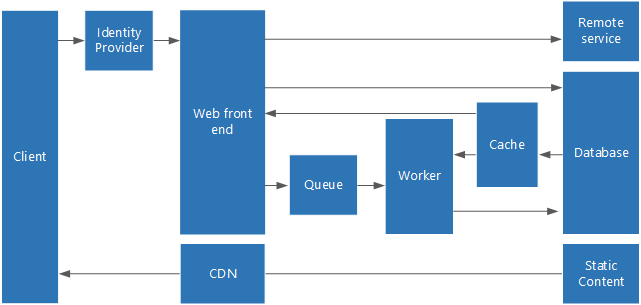
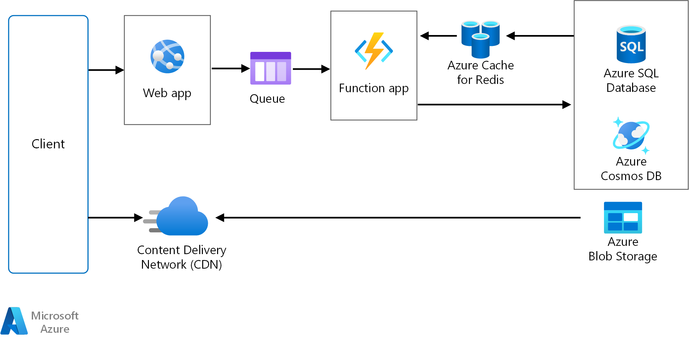

# Web-Queue-Worker architecture style

The core components of this architecture are a **web front end** that serves client requests, and a **worker** that performs resource-intensive tasks, long-running workflows, or batch jobs.  The web front end communicates with the worker through a **message queue**.  

Other components that are commonly incorporated into this architecture include:

- One or more databases. 
- A cache to store values from the database for quick reads.
- CDN to serve static content
- Remote services, such as email or SMS service. Often these are provided by third parties.
- Identity provider for authentication.

The web and worker are both stateless. Session state can be stored in a distributed cache. Any long-running work is done asynchronously by the worker. The worker can be triggered by messages on the queue, or run on a schedule for batch processing. The worker is an optional component. If there are no long-running operations, the worker can be omitted.  

The front end might consist of a web API. On the client side, the web API can be consumed by a single page application (SPA) that makes AJAX calls, or by a native client application.

## When to use this architecture

The web-queue-worker architecture is typically implemented using managed compute services, either Azure App Service or Azure Cloud Services. 

Consider this architectural style for:

- Applications with a relatively simple domain 
- Applications with some long-running workflows or batch operations.
- When you want to use managed services, rather than IaaS.

## Benefits:

- Relatively simple architecture that is easy to understand.
- Easy to deploy and manage.
- Clear separation of concerns.
- The front end is decoupled from the worker using asynchronous messaging.
- The front end and the worker can be scaled independently.

## Challenges

- Without careful design, the front end and the worker can become large, monolithic components that are difficult to maintain and update.
- There may be hidden dependencies, if the front end and worker share data schemas or code modules. 

## Web-queue-worker on Azure App Service

This section describes a recommended web-queue-worker architecture that uses Azure App Service.

The front end is implemented as an Azure App Service web app, and the worker is implemented as a WebJob. The web app and the WebJob are both associated with an App Service plan, which provides the VM instances. 

You can use either Azure Service Bus or Azure Storage queues for the message queue. (The diagram shows an Azure Storage queue.)

Azure Redis Cache stores session state and other data that needs low latency access.

Azure CDN is used to cache static content such as images, CSS, HTML.

For storage, choose the storage technologies that best fit the needs of the application. You might use multiple storage technologies (polyglot persistence). To illustrate this idea, the diagram shows Azure SQL Database and DocumentDB.  

### Additional considerations

- Use the built-in autoscale feature of App Service to scale out the number of VM instances. If the load on the application follows predictable patterns, use schedule-based autoscale. If the load is unpredictable, use metrics-based autoscaling rules.      

- Consider putting the web app and the WebJob into separate App Service plans. That way, they are hosted on separate VM instances and can be scaled independently. 

- Use separate App Service plans for production and testing. Otherwise, if you use the same plan for production and testing, it means your tests are running on your production VMs.

- Use deployment slots to manage deployments. This gives you the ability to deploy an upgrade and then swap over to the upgraded version. It also lets you swap back to, if there was a problem 

