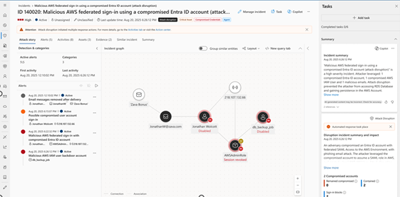

This guide describes how Microsoft security solutions provide a Zero Trust, defense-in-depth controls that can be extended to AWS to eliminate blind spots and ensure consistent visibility, enforcement, and protection.

#placeholder update

This diagram summarizes how AWS installations can benefit from key Microsoft security components:

:::image source="./media/aws-azure-security-solutions-architecture.png" alt-text="Architecture diagram that shows the benefits of implementing Azure security for AWS." border="false" lightbox="./media/aws-azure-security-solutions-architecture.png":::

*Download a [PowerPoint file](https://arch-center.azureedge.net/1985346_aws-azure-security-solutions-architecture.pptx) of this diagram.*

## Microsoft Entra

Microsoft Entra ID is a comprehensive, cloud-based centralized identity and access management solution that can help secure and protect AWS accounts and environments.  Microsoft Entra ID provides strong SSO authentication to almost any app or platform that follows common web authentication standards, including AWS. AWS accounts that support critical workloads and highly sensitive information need strong identity protection and access control. Microsoft Entra ensures access to AWS resources is _“verified explicitly”_ every time and _“least privilege”_ is maintained. AWS identity management is enhanced when you combine it with Microsoft Entra ID.

AWS organizations that use Microsoft Entra ID for Microsoft 365 or hybrid cloud identity and access protection can quickly and easily deploy Microsoft Entra ID for AWS accounts, often without incurring additional costs. 

Microsoft Entra ID provides several capabilities for direct integration with AWS:

- __Centralized Identities__: Entra federation with AWS IAM Identity Center enforces “never trust, always verify” for AWS access. Entra ID allows enhanced security, improved user experience, centralized access control, and SSO across legacy, traditional, and modern authentication solutions.

- __Lifecycle Automation:__ With SSO in place, automate lifecycle management with integrated HR workflows. Design AWS role mappings with group memberships that are mapped to AWS roles for authorization.

- __Enforce Strong Authentication:__ Powerful Conditional Access features to enforce zero trust principle of verify explicitly to AWS logins. Require strong authentication with Microsoft Entra multifactor authentication or integration with several third-party solutions from [Microsoft Intelligent Security Association](https://www.microsoft.com/security/business/intelligent-security-association) partners.  For example, you can require MFA every time, Entra will “challenge” or reject login attempts as per policy _before_ the user ever touches AWS. This significantly reduces the risk of account takeover. Entra ID can also enable enforcement of several other factors such as risk, network location, device compliance – ensuring only managed, healthy devices can access the AWS.

- __Identity Protection:__ Improved protection against identity-based attacks via real-time detection, continuous risk assessment, and remediation of risky sign-ins and unusual user behavior. Additionally, Entra Identity Protection with conditional access policies can detect if an account had suspicious activities (e.g. leaked credentials on the dark web) and automatically impose tighter controls or disable it.

- __Privileged Identity Management (PIM):__ enables just-in-time and least privileges to govern administrative access to AWS roles.  Reduce standing access and limit exposure to attacks. Instead of giving a user a permanent AWS admin access key, assign them to an Entra group that corresponds to an AWS admin role; with PIM, that group membership can be “eligible” and only active when the user needs it. Entra PIM will log and require approval for activations.  You can expand PIM to any delegated permission by controlling access to custom groups that you create for access to AWS roles.

- __Identity Governance:__ Extend Entra governance features to AWS. Provide self-service governance using Entra ID Access Packages that are time bound to handle AWS access requests with approval workflows. Conduct periodic access reviews to remove excess or standing access to reduce risk. Access recertification also help simplify reporting and prove regulatory compliance.

- __Workload identities:__ Leverage Entra workload identity federation for AWS to issue short-lived tokens that AWS trusts for API access – eliminating the need for static AWS access keys. This approach tightly integrates Entra ID with AWS IAM roles, so Azure-based workloads can seamlessly assume AWS roles resulting in no long-lived credentials to leak, every access is verified in real-time, and identities are governed centrally. By using Entra as the identity plane for AWS, you achieve a __unified identity security stance across multi-cloud__ – users have one identity, one strong authentication policy, and one place to be de-provisioned if they leave, thereby closing gaps that siloed accounts would create.  For more information and detailed instructions, see [Microsoft Entra identity and access management for AWS](/azure/architecture/reference-architectures/aws/aws-azure-ad-security). 

### Microsoft Defender for Cloud Apps

Defender for Cloud Apps provides enhanced protection for Software as a Service (SaaS) applications. Defender for Cloud Apps adds a dynamic layer of security on user activities and data in cloud applications. It provides the following features to help you monitor and protect your cloud app data:

- __Fundamental Cloud Access Security Broker functionality__ including shadow IT discovery, visibility into cloud app usage, enhanced protection against app-based threats from anywhere in the cloud, and information protection and compliance assessments.

- __SaaS Security Posture Management features__ that enable security teams to improve the organization's security posture.

- __Advanced threat protection__ as part of the Microsoft extended detection and response solution, enables powerful correlation of signal and visibility across the full cyberattack chain of advanced attacks.

- __App-to-app protection__ which extends the core threat scenarios to OAuth-enabled apps that have permissions and privileges to critical data and resources.

Connecting AWS to Defender for Cloud Apps helps you secure your assets and detect potential threats by monitoring administrative and sign-in activities. You get notifications of possible brute force attacks, malicious use of privileged user accounts, unusual deletions of VMs, and publicly exposed storage buckets. Defender for Cloud Apps helps protect AWS environments from abuse of cloud resources, compromised accounts and insider threats, data leakage, and resource misconfiguration and insufficient access control. It enforces Zero Trust at the session/application level: even after a user is authenticated to AWS and continues to monitor and validate their actions.

By connecting AWS to Defender for Cloud Apps, you gain:

- __Visibility into activities:__ A consolidated activity log of user and admin actions in AWS. This log is presented in Defender for Cloud Apps where you can filter and search across all cloud apps. For example, you can query “Show me all AWS console activities by user X in the last 24 hours” easily. This is useful for investigations and to feed anomaly detection.

- __Anomaly detection policies:__ Defender for Cloud Apps continually monitors your users' activities and uses UEBA and machine learning to learn and understand the typical behavior of your users and trigger alerts on any deviations to [detect cloud threats, compromised accounts, malicious insiders, and ransomware](/defender-cloud-apps/best-practices). Some examples of anomalies include:

  - Impossible travel: User logs into AWS from say the US and then 30 minutes later from Russia – impossible given the distance. This indicates account compromise, triggering an alert.
  
  - Activity from a risky IP or anonymous proxy: If a user normally comes from a known IP range and suddenly is active from a TOR node is flagged.
  
  - Unusual administrative activity: e.g., deletion of an unusual number of VMs or changing logging settings that the user never touched before.
  
  - Mass download or deletion: If someone tries to download a large number of objects from S3 or delete many resources in a short span – possible sabotage or cleanup actions by an attacker. Each anomaly that triggers generates an alert in Defender for Cloud Apps catching activities that signature-based detections miss
  
- __Policy enforcement and governance:__ Beyond just detecting and alerting, Defener for Cloud Apps lets you set policies to take action. For instance, you can define a policy: “Alert and suspend user if they delete more than 5 EC2 instances within 10 minutes” or “If any S3 bucket is made public, notify the security team and optionally revert the ACL”. In fact, it includes file policies like detecting if an S3 bucket becomes publicly accessible, and activity policies for critical changes (IAM changes, Network ACL changes, etc.). Many of these are available as template policies which you can simply enable. For governance, MCAS can automatically remediate via API. Example actions are below and these automated actions enforce security in near real-time, often mitigating issues faster than a human admin could respond.

  - Suspend user: disable the Entra ID user which in turn blocks access to AWS via federation identity.
  
  - Require re-authentication: sign the user out of AWS and force them to log in again via Entra ID requiring MFA if a session is deemed risky.
  
  - Notify user: Pop-up or email a user that what they did is against policy, e.g. “You have violated policy by downloading 1000 records from S3” – a gentle nudge for insiders or a marker for accidental policy violations.
  
  - Make S3 bucket private: Through AWS API, Defender for Cloud Apps can remove public access from an S3 bucket if a policy triggers.
  
  - Remove collaborator: If someone shared an S3 bucket with an external account for example, Defender for Cloud Apps could remove that external collaborator automatically.
  
- __Session control (real-time intervention):__ One powerful feature of Defender for Cloud Apps is Conditional Access App Control. With AWS, you can route user traffic through Defender for Cloud Apps and Entra ID Conditional Access to actively block or monitor specific actions in real time. For example, if a user tries to download files from AWS on an unmanaged device, session control can prevent the download or replace the file with a sanitized message. Similarly, it can apply Purview DLP policies to data exfiltration attempts – e.g., block copying of secret keys or certain patterns via the console.

For more information on how to connect AWS environments to Defender for Cloud Apps, see [Protect your Amazon Web Services environment](/defender-cloud-apps/protect-aws).

### Microsoft Defender for Cloud

Misconfigurations or vulnerabilities in cloud resources can open the door for attackers. Microsoft Defender for Cloud is a Cloud-Native Application Protection Platform (CNAPP) that provides Continuous Security Posture Management (CSPM) and Cloud Workload Protection Platform (CWPP) for your AWS environment, it continuously scans for weaknesses and recommends fixes with defense-in-depth controls and brings multi-cloud visibility with posture across Azure, AWS, and GCP in a unified view.

Defender for Cloud provides the following capabilities:

- Cloud Security Posture Management (CSPM) is a configuration hygiene layer that surfaces actions that you can take to help prevent breaches. By reducing misconfigurations, you shrink the attack surface available to adversaries.

- A Cloud Workload Protection Platform (CWPP) provides protection for servers, containers, storage, databases, dev ops, AI, and other workloads.

Defender for Cloud native AWS support provides several benefits:

-  __Cloud Security Posture Management (CSPM):__ When you connect AWS accounts to Defender for Cloud, it immediately begins assessing those AWS resources against known best practices and benchmarks. Microsoft has a unified framework called the Microsoft Cloud Security Benchmark (MCSB) that includes controls for AWS as well. For example, it will check if your S3 buckets are public, if IAM users have MFA enabled, if security groups are overly permissive, if EKS clusters have the Kubernetes dashboard exposed, and so on. Each finding is reported as a Recommendation in the Azure portal, contributing to a Secure Score for your AWS environment. This gives a quantifiable measure of your AWS compliance/posture. 

  -  __Foundational CSPM__ – provides unified asset inventory, recommendations on how to best harden your AWS resources and remediate misconfigurations with workflow automation. It also provides rich visualization and reporting and offers the foundational multicloud CSPM capabilities for free.
  
  -  __Defender CSPM__ - provides advanced posture management capabilities and agentless workload insights including critical assets.
  
    -  __Cloud Security Graph & Risk Prioritization - exposure__ based on AWS resource metadata, IAM roles, policies, and network and builds exploitability context across AWS services (EC2, S3, IAM, VPC) and correlates with identities and permissions.
    
    - __Attack Path Analysis (APA) -__ Detects multi-step attack chains in AWS (e.g., public EC2 → IAM role escalation → S3 bucket access) and visualizes paths and provides “break-the-path” remediation for AWS-specific misconfigurations.
    
    -  __Cloud Security Explorer -__ Query AWS posture using graph-based filters (e.g., “internet-exposed EC2 with attached IAM role granting S3 write”.
    
    - __Identity & Permission Exposure -__ Evaluates AWS IAM roles, policies, and effective permissions. Highlights toxic combinations (e.g., overly permissive roles + public exposure).
    
    - __Data Security Posture Management (DSPM)__ - Scans AWS S3 buckets and AWS RDS databases (Aurora, PostgreSQL, MySQL, MariaDB, SQL Server, Oracle SE2) useing built-in classification rules.
    
    - __Multi-Cloud Attack Path Correlation -__ Correlates AWS identities and resources with Azure/GCP for cross-cloud exploit chains. 
    
    -  __Governance & Compliance__ - tools to assess your [security compliance](/azure/defender-for-cloud/review-security-recommendations) with a wide range of benchmarks, regulatory standards. Microsoft provides built-in policies for AWS covering standards like AWS Foundational Security Best Practices Standard and PCI-DSS and any custom security policies required in your organization, industry, or region to track AWS compliance state.
    
- __Cloud Workload Platform Protection (CWPP):__ In addition to posture management, Defender for Cloud offers workload protection plans for various AWS workloads:

  - __Servers (VMs on EC2):__ When you enable _Defender for Servers_ for an AWS account, any EC2 instances you have (running Windows or Linux) will be onboarded for advanced threat protection. This includes an integrated license to Microsoft Defender for Endpoint (MDE) for those VMs. Once onboarded, the VM gets industry-leading EDR capabilities: file integrity monitoring, malware scanning, behavior monitoring, and vulnerability assessment. The vulnerability scanner will report OS and software vulnerabilities on AWS VMs into Defender for Cloud, and MDE will report any endpoint threats (like ransomware behavior or suspicious process executions). All that information surfaces as security alerts in Defender for Cloud.  For more information see [Defender for Servers](/azure/defender-for-cloud/supported-machines-endpoint-solutions-clouds-servers?tabs=features-multicloud).
  
  -  __Containers (AWS EKS and more):__ Defender for Containers can protect Kubernetes clusters running on AWS (EKS). This works by deploying Azure Arc-enabled Kubernetes agents to the cluster and then Defender’s extension. It then provides capabilities such as image vulnerability scanning for container images, runtime threat detection for clusters (detecting suspicious process executions in containers, crypto-mining, etc.), and Kubernetes policy compliance It even monitors the Kubernetes control plane logs for suspicious events. For more information see [Defender for Containers](/azure/defender-for-cloud/defender-for-containers-aws-overview).
  
  - __Databases:__ Defender for Cloud supports SQL servers running on AWS EC2 and AWS RDS Custom. It provides capabilities for vulnerability assessment scanning (checking for misconfigurations or missing patches) and advanced threat protection for SQL (which detects anomalous queries, SQL injection attempts, etc.) and surfaces the alerts. For more information [Defender for SQL](/azure/defender-for-cloud/defender-for-sql-usage).
  
Defender for Cloud brings the “secure by design” philosophy to AWS through environment hardening, vulnerability management, and threat detection in one solution. For more information about protecting workloads in AWS, see [Connect your AWS account](/azure/defender-for-cloud/quickstart-onboard-aws) and [Assign regulatory compliance standards in Microsoft Defender for Cloud](/azure/defender-for-cloud/update-regulatory-compliance-packages). 

### Microsoft Purview

Data is ultimately what attackers seek to steal or what we must protect for compliance. In a multi-cloud environment, data can reside anywhere – in Azure SQL, on-prem files, or in AWS S3 buckets and databases. Microsoft Purview provides a unified data governance solution that helps answer “What data do we have in AWS, where is it, and how sensitive is it?” This is crucial for a defense-in-depth approach because it informs the protective measures needed at the data layer (encryption, DLP, access controls) and allows you to enforce Zero Trust for data. It’s also key for regulatory compliance – ensuring that AWS data repositories meet the same compliance standards as Azure or on-prem, through consistent classification and reporting.

- __Multi-cloud data discovery__: Purview’s multi-cloud scanning connectors extend its discovery capabilities to AWS. For instance, an AWS S3 bucket can be registered as a data source in Purview and scan can be performed. The scanner will read object metadata and content and use Purview’s built-in classification rules (over 200 out-of-the-box detectors for things like credit card numbers, SSNs, API keys, etc.) to identify sensitive information within those objects. It does not copy the data out; it only retrieves metadata and classification results, which are stored in Purview’s Data Map. The scan provides the information for example: “Bucket: s3://my-finance-data/ – contains 3 files classified as Privacy/Personal Data, detected UK National Insurance Numbers”.   Similarly, Purview can scan Amazon RDS databases like RDS for PostgreSQL or SQL Server. It will connect and run queries to get schemas and sample data for classification.

-  __Data Catalog and Governance:__ All discovered AWS data assets get onboarded into the Purview Data Catalog, sitting alongside your other data assets. This means data stewards and compliance officers can use a single portal to search for instance, “customer data” and find results whether that’s in an Azure Data Lake or an AWS bucket. Business glossary terms and sensitivity labels can be uniformly applied. This consistency is crucial for compliance to demonstrate to auditors that all personal data across clouds is inventoried and labeled.

- __Risk management:__ Knowing what sensitive data is in AWS allows targeted security measures: e.g., if Purview finds credit card numbers in an S3 bucket, they could be encrypted or moved. Or you could set up a Defender for Cloud Apps policy to monitor access to that bucket more closely. Purview scans can be run on a schedule to detect changes. It essentially gives you continuous Data Security Posture Management (DSPM) – highlighting places where sensitive data lives in AWS and whether proper controls are enabled.

- __Integration with broader security:__ Purview surfaces the sensitive data identified in Defender for Cloud and Defender for Cloud Apps to provide additional context for posture management and addressing alerts.

- __Compliance reporting:__ For frameworks like GDPR, CCPA, etc., Purview Compliance Manager can generate reports of where personal data is stored, including AWS locations. This makes answering Data Subject Requests or doing impact assessments easier. Instead of manually searching AWS for data, you query Purview as your inventory. Regulatory Compliance: If your AWS data falls under PCI, Purview helps ensure you know all locations of cardholder data so you can put proper segmentations.

By using Purview for AWS, you extend your data governance umbrella across clouds. It ensures that even at the deepest layer – the data itself – you have insight and control and provides the evidence for compliance that you are identifying and securing sensitive data regardless of where it resides. It also helps drive informed decision-making to apply other controls. For more information see - [Amazon S3 Multicloud Scanning Connector for Microsoft Purview](/purview/register-scan-amazon-s3)

### Microsoft Sentinel

Microsoft Sentinel is a scalable, cloud-native Security Information and Event Management (SIEM) and SOAR platform. Microsoft Sentinel supports ingesting and analyzing logs from any source – on-premises, Azure, Microsoft 365, third-party SaaS, and Amazon Web Services (AWS). Sentinel provides advanced threat detection, investigation, proactive hunting, and automated response capabilities. In the context of AWS, Sentinel can collect a broad array of AWS security data, store it in its analytics and run cloud-scale queries and machine learning to detect malicious patterns. It aligns with Zero Trust by continuously monitoring and analyzing telemetry (assuming breach) and can automate response actions to contain incidents rapidly.

- __Unified visibility and analytics:__ Sentinel is cloud-native and designed to aggregate data from any source – on-prem systems, Azure, M365, third-party SaaS, and AWS. Sentinel supports a range of AWS logs; you can use Microsoft published __AWS Sentinel Solution__ (available in Content Hub) that includes predefined analytics rules and workbooks and pull AWS service logs into Microsoft Sentinel. The connector can ingest logs from the following AWS services by pulling them from an S3 bucket:

  - After ingestion, you can enable analytical rules – e.g., alert if “Root user usage” occurs (since in AWS root account usage is rare and high risk), or if “GuardDuty: CryptoCurrency Mining” finding is ingested, escalate to incident. There are also machine learning-based anomalies that Sentinel can detect across all logs.·
  
  - By bringing AWS logs into Sentinel, you enable cross-platform correlation. For example, Sentinel can correlate an AWS CloudTrail event (like an IAM user created) with an Azure AD log (the same user just logged in from a Tor IP) and an Office 365 event (the user downloaded a bunch of files) to flag a multi-stage attack spanning systems. This unified view is a huge advantage in multi-cloud operations, ensuring that your SOC isn’t blind to half of the environment. Many AWS customers using Microsoft 365 choose Sentinel so they can correlate O365 and Azure AD signals with AWS logs in one place, something neither platform’s native tools alone can do.
  
|Service|Data source|
|-|-|
|[Amazon Virtual Private Cloud (VPC)](https://docs.aws.amazon.com/vpc/latest/userguide/what-is-amazon-vpc.html) | [VPC Flow Logs](https://docs.aws.amazon.com/vpc/latest/userguide/flow-logs.html)|
| [Amazon GuardDuty](https://docs.aws.amazon.com/guardduty/latest/ug/what-is-guardduty.html) | [GuardDuty findings](https://docs.aws.amazon.com/guardduty/latest/ug/guardduty_findings.html)|
|[AWS CloudTrail](https://docs.aws.amazon.com/awscloudtrail/latest/userguide/cloudtrail-user-guide.html) | [Management](https://docs.aws.amazon.com/awscloudtrail/latest/userguide/logging-management-events-with-cloudtrail.html) and [data](https://docs.aws.amazon.com/awscloudtrail/latest/userguide/logging-data-events-with-cloudtrail.html) events|
|[AWS CloudWatch](https://docs.aws.amazon.com/AmazonCloudWatch/latest/monitoring/WhatIsCloudWatch.html) | [CloudWatch Logs](https://docs.aws.amazon.com/AmazonCloudWatch/latest/logs/WhatIsCloudWatchLogs.html)|

-  __Leverage threat intelligence__: Sentinel can integrate threat intel (TI) feeds. You can match AWS logs (say, source IPs in CloudTrail or DNS queries from AWS if you ingest DNS logs) against known malicious indicators. If a match occurs (AWS resource communicating with a known bad IP), raise an alert. This cross-check adds another layer of defense (threat intel layer). 

- __Detection and hunting:__ Once logs are in Sentinel, analysts can use __KQL (Kusto Query Language)__ to query AWS data alongside other logs. For instance, one could search for any AWS API calls by a user that also had failed Entra ID logins – a hypothetical query across two data types. Sentinel’s built-in rule templates for AWS cover scenarios like:

  - __Exfiltration patterns__: sudden spikes in outgoing traffic in VPC Flow Logs after a new IAM access key creation (could indicate a stolen key being used to mass-download data and exfiltrate).
  
  - __Persistence or Privilege Escalation__: creation of an IAM user or access key by an unusual source, or changes to security group rules (opening ports that are normally closed).
  
  - __Brute force__: multiple failed login attempts to the AWS Console or to an EC2 instance (from CloudTrail events for AWS console login failures or analyzing authentication logs on Linux).
  
  - __Response automation:__ Sentinel is a SIEM+SOAR platform which means you can trigger Playbooks (Logic Apps) on AWS alerts. For example, if Sentinel gets an alert of “Critical GuardDuty finding: EC2 instance credential exfiltration,” you could have a playbook that automatically calls AWS APIs (using Azure’s AWS connectors or via an AWS Lambda) to isolate that EC2 instance (e.g., by modifying its security group or shutting it down). Another playbook could disable an IAM user in AWS if suspicious activity is detected. This automation ability is crucial for reacting quickly – bridging back to defense-in-depth,
  
By responding to incidents from Sentinel, you ensure a uniform, orchestrated approach – e.g., a single incident might involve disabling a user in Entra ID and locking their AWS API keys; Sentinel playbooks and its incident timeline can coordinate both.

For more information on how to install and configure the AWS connector in Microsoft Sentinel, see [Connect Microsoft Sentinel to Amazon Web Services to ingest AWS service log data](/azure/sentinel/connect-aws?tabs=s3)

### Microsoft Defender XDR

Microsoft Defender XDR is a unified enterprise defense suite that provides integrated protection against sophisticated cyberattacks. It coordinates detection, prevention, investigation, and response across endpoints, identities, email, and applications, ensuring comprehensive security for organizations. This solution centralizes threat tooling and utilizes advanced technologies like machine learning and threat intelligence to enhance security operations.

Automatic attack disruption is an autonomous response capability in Microsoft Defender XDR designed to stop active cyberattacks in real time with minimal human intervention. This capability aims to limit the impact of attacks by automatically isolating compromised assets and preventing lateral movement within the network. Key features of automatic disruption include:

- __Real-time Containment:__ The feature automatically identifies and contains compromised user accounts, endpoints, session and token disruption, threat infrastructure, application as soon as a threat is detected, providing immediate protection against further exploitation.

- __Enhanced Security for Critical Infrastructure:__ Updates to the automatic attack disruption capabilities have improved security for essential services like Active Directory, DNS, and DHCP servers, allowing for selective isolation of critical assets while maintaining service availability. 

- __Cross Platform Detection:__ The automatic attack disruption feature works in conjunction with other Microsoft Defender products and extends beyond XDR, incorporating data from AWS, Proofpoint and Okta when brought in through Sentinel. By leveraging millions of signals from Microsoft Threat Intelligence, this feature uses AI to detect sophisticated threats like phishing, business email compromise, and identity compromise across federated accounts and cloud boundaries.

- __Visibility and Control:__ Even though the actions are automatic, the SOC remains in full control and informed. Defender XDR clearly tags and highlights incidents where attack disruption was triggered. Analysts can click in to see exactly what was done: which users were disabled, which devices contained, etc., via Action Center. Every automated action is logged and can be undone with a single click if needed and provides the ability to define exclusions. These safeguards, along with the high precision, are meant to balance speed with safety.

#### Automatic Disruption for AWS

Automatic attack disruption reduces dwell time and minimizing business impact. Integrating telemetry from AWS, Proofpoint, and Okta, security teams can transition from reactive detection to proactive, cross-platform protection, ensuring cohesive defense and lowering operational complexity. For more Information see - [Automatic attack disruption in Microsoft Defender XDR](/defender-xdr/automatic-attack-disruption)

### Microsoft Security Copilot

Microsoft Security Copilot is a generative AI-powered security assistant that works across Microsoft’s security stack to help organizations defend multi-cloud environments including AWS at machine speed. It integrates with tools like Microsoft Defender for Cloud, Microsoft Sentinel, and Entra ID to draw on their data and capabilities, layering intelligent analysis and automation on top of your AWS security controls.

- __AI-Augmented Threat Detection:__ Security Copilot excels at correlating signals and spotting complex attack patterns that span multiple systems. Security Copilot’s Dynamic Threat Detection Agent can identify an ongoing AWS attack. For instance,  if a threat actor uses a compromised Entra ID account to federate into an AWS admin role and start exfiltrating data, Security Copilot can correlate unusual sign-in behavior from Entra ID  with AWS API activity (via Sentinel) and generate a proactive alert before the intruder fully completes a single sign-on, effectively stopping the attack in real-time to catch multi-stage attacks in AWS that would evade siloed alerts.

 

·       __Rapid Incident Investigation:__ When an AWS-related incident occurs, Security Copilot can drastically speed up analysis by combing through AWS CloudTrail events, config changes, network logs, and more (as ingested by Sentinel/Defender) and present a natural language summary of what happened – e.g., _“User X (privileged) from IP Y created an access key and downloaded data from S3 bucket Z at 3:45 AM”_.  Analysts can ask follow-up questions in plain English (“_Which S3 buckets were accessed by that user?_”) and Copilot will dynamically query the data to answer. This reduces the time and skill needed to interpret AWS logs or pivot across consoles. Junior analysts can investigate complex AWS scenarios without deep KQL or AWS knowledge – Security Copilot translates their intent into the technical queries.

 

·       __Step-by-Step Response Guidance:__ For confirmed threats or risks in AWS, Security Copilot provides actionable response steps grounded in Microsoft’s best practices and any playbooks your organization has provided, it will outline containment and remediation measures. For example, if an EC2 instance is compromised, Security Copilot might recommend steps like “isolate VM by removing from load balancers and security groups, then trigger instance snapshot for forensics” followed by “rotate any exposed IAM credentials”.

 

·       __Automated Remediation & Scripting:__ Beyond guidance, Security Copilot can assist with the actual fixes. It can generate PowerShell, CLI commands, or Terraform snippets to remediate issues in AWS. For instance, if a policy violation is detected (like an S3 bucket made public), Copilot might produce an AWS CLI command to revoke public access or a Terraform code change to enforce the correct setting. This capability saves time.

 

_Please Note: Any AI generated scripts should be reviewed before execution, but it provides a solid starting point._

- __Natural Language Threat Hunting:__ Security Copilot allows analysts to hunt for threats in AWS using plain language. Instead of writing complex queries, an analyst can prompt Security Copilot with requests like _“Identify any anomalous AWS console logins outside business hours this week”._ This lowers the barrier for proactive threat hunting in AWS and empowers broader use of your AWS security data,

Security Copilot acts as a force-multiplier for your SOC when dealing with AWS incidents. By deeply integrating with Defender for Cloud and Sentinel, it breaks down multi-cloud data silos and accelerates detection, accelerates investigation, and accelerates response. For more information, see - [Microsoft Security Copilot](/copilot/security/microsoft-security-copilot)

### Recommendations

Use the Microsoft security solutions and basic AWS security recommendations to protect AWS accounts.

#### Basic AWS account security

For information about basic security hygiene for AWS accounts and resources, review the AWS security guidance at [Best practices for securing AWS accounts and resources](https://aws.amazon.com/premiumsupport/knowledge-center/security-best-practices).

- Reduce the risk of uploading and downloading malware and other malicious content by actively inspecting all data transfers via the AWS Management Console. Content that you upload or download directly to resources within the AWS platform, such as web servers or databases, might need additional protection.

- Provide security for access keys by rotating the keys periodically. Avoid embedding them in code. Use IAM roles instead of long-term access keys wherever possible.

- Use security groups and network ACLs to control inbound and outbound traffic to your resources. Implement VPC to isolate resources.

- Encrypt sensitive data at rest and in transit by using AWS Key Management Services. 

- Protect devices that administrators and developers use to access the AWS Management Console.  

## Contributors

*This article is maintained by Microsoft. It was originally written by the following contributor.*

Principal author:

- [Lavanya Murthy](https://www.linkedin.com/in/lavanyamurthy) | Principal Cloud Solution Architect

*To see non-public LinkedIn profiles, sign in to LinkedIn.*

## Next steps

- [Monitor and protect AWS administrative and sign-in activities](/defender-cloud-apps/protect-aws)
- [Protect workloads in AWS](/azure/defender-for-cloud/quickstart-onboard-aws)
- [Connect Microsoft Sentinel to Amazon Web Services to ingest AWS service log data](/azure/sentinel/connect-aws?tabs=s3)

## Related resources

- [Secure AWS identities](/azure/architecture/reference-architectures/aws/aws-azure-ad-security) 
