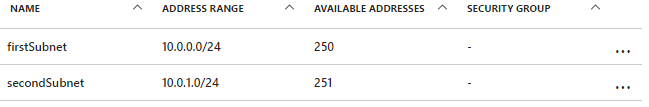
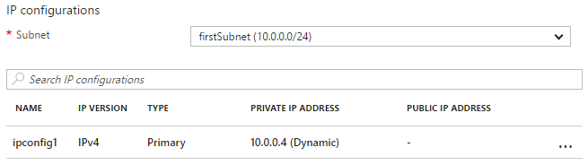

<!-- cSpell:ignore subtemplate ipconfig -->

# Update a resource in an Azure Resource Manager template

There can be times when you need to update a resource during a deployment, such as when you can't specify all the properties for a resource until other, dependent resources are created. For example, if you create a backend pool for a load balancer, you might update the network interfaces (NICs) on your virtual machines (VMs) to include them in the backend pool. Resource Manager does support updating of resources during deployment, but you must design your template correctly to avoid errors and to ensure that the deployment is handled as an update.

When you create a resource and update it later, you reference it twice. You reference it first in the template that creates it. Later, when you update the resource, you reference it by the same name. However, if two resources have the same name in a template, Resource Manager throws an exception. To avoid this error, specify the updated resource in a second template that's either linked or included as a subtemplate that uses the `Microsoft.Resources/deployments` resource type.

In the second template, you must either specify the name of the property to change or a new name for a property to add. You must also specify the names and original values of the properties that don't change. If you fail to specify one or more of the original properties, Resource Manager assumes that you want to create a new resource and deletes the original one.

## Example template

Let's look at an example template that demonstrates the technique. The template deploys a virtual network named `firstVNet` that has one subnet named `firstSubnet`. It then deploys a virtual network interface (NIC) named `nic1` and associates the NIC with the subnet. A deployment resource named `updateVNet` includes a nested template that updates `firstVNet` by adding a second subnet named `secondSubnet`.

```json
{
    "$schema": "https://schema.management.azure.com/schemas/2019-04-01/deploymentTemplate.json#",
    "contentVersion": "1.0.0.0",
    "parameters": {},
    "resources": [
        {
            "apiVersion": "2020-05-01",
            "name": "firstVNet",
            "location": "[resourceGroup().location]",
            "type": "Microsoft.Network/virtualNetworks",
            "properties": {
                "addressSpace": {
                    "addressPrefixes": [
                        "10.0.0.0/22"
                    ]
                },
                "subnets": [
                    {
                        "name": "firstSubnet",
                        "properties": {
                            "addressPrefix": "10.0.0.0/24"
                        }
                    }
                ]
            }
        },
        {
            "apiVersion": "2020-05-01",
            "type": "Microsoft.Network/networkInterfaces",
            "name": "nic1",
            "location": "[resourceGroup().location]",
            "dependsOn": [
                "firstVNet"
            ],
            "properties": {
                "ipConfigurations": [
                    {
                        "name": "ipconfig1",
                        "properties": {
                            "privateIPAllocationMethod": "Dynamic",
                            "subnet": {
                                "id": "[resourceId('Microsoft.Network/virtualNetworks/subnets', 'firstVNet', 'firstSubnet')]"
                            }
                        }
                    }
                ]
            }
        },
        {
            "apiVersion": "2020-06-01",
            "type": "Microsoft.Resources/deployments",
            "name": "updateVNet",
            "dependsOn": [
                "nic1"
            ],
            "properties": {
                "mode": "Incremental",
                "parameters": {},
                "template": {
                    "$schema": "https://schema.management.azure.com/schemas/2019-04-01/deploymentTemplate.json#",
                    "contentVersion": "1.0.0.1",
                    "parameters": {},
                    "variables": {},
                    "resources": [
                        {
                            "apiVersion": "2020-05-01",
                            "name": "firstVNet",
                            "location": "[resourceGroup().location]",
                            "type": "Microsoft.Network/virtualNetworks",
                            "properties": {
                                "addressSpace": "[reference('firstVNet').addressSpace]",
                                "subnets": [
                                    {
                                        "name": "[reference('firstVNet').subnets[0].name]",
                                        "properties": {
                                            "addressPrefix": "[reference('firstVNet').subnets[0].properties.addressPrefix]"
                                        }
                                    },
                                    {
                                        "name": "secondSubnet",
                                        "properties": {
                                            "addressPrefix": "10.0.1.0/24"
                                        }
                                    }
                                ]
                            }
                        }
                    ],
                    "outputs": {}
                }
            }
        }
    ],
    "outputs": {}
}
```

Consider the resource object for our `firstVNet` resource. Notice that we specify again the settings for our `firstVNet` in a nested template—this is because Resource Manager doesn't allow the same deployment name in the same template, and nested templates are considered to be a different template. By again specifying our values for our `firstSubnet` resource, we tell Resource Manager to update the existing resource instead of deleting it and redeploying it. Finally, our new settings for `secondSubnet` are picked up during this update.

## Try the template

An example template is available on [GitHub][github]. To deploy the template, run the following [Azure CLI][cli] commands:

```azurecli
az group create --location <location> --name <resource-group-name>
az deployment group create -g <resource-group-name> \
    --template-uri https://raw.githubusercontent.com/mspnp/template-examples/master/example1-update/deploy.json
```

After deployment finishes, open the resource group that you specified in the portal. You see a virtual network named `firstVNet` and a NIC named `nic1`. Click `firstVNet`, then click `subnets`. You see the `firstSubnet` that was originally created, and you see the `secondSubnet` that was added in the `updateVNet` resource.



Then, go back to the resource group and click `nic1`, and then click `IP configurations`. In the `IP configurations` section, the `subnet` is set to `firstSubnet (10.0.0.0/24)`.



The original `firstVNet` was updated instead of re-created. If `firstVNet` had been re-created, `nic1` wouldn't be associated with `firstVNet`.

## Next steps

- [Azure Resource Manager](https://azure.microsoft.com/get-started/azure-portal/resource-manager)
- [What are ARM templates?](/azure/azure-resource-manager/templates/overview)
- [Tutorial: Create and deploy your first ARM template](/azure/azure-resource-manager/templates/template-tutorial-create-first-template)
- [Tutorial: Add a resource to your ARM template](/azure/azure-resource-manager/templates/template-tutorial-add-resource?tabs=azure-powershell)
- [ARM template best practices](/azure/azure-resource-manager/templates/best-practices)
- [Azure Resource Manager documentation](/azure/azure-resource-manager)
- [ARM template documentation](/azure/azure-resource-manager/templates)

## Related resources

- [Update a resource in an Azure Resource Manager template](update-resource.md)
- [Use objects as parameters in a copy loop in an Azure Resource Manager template](objects-as-parameters.md)
- [Implement a property transformer and collector in an Azure Resource Manager template](collector.md)

[cli]: /cli/azure/
[github]: https://github.com/mspnp/template-examples
