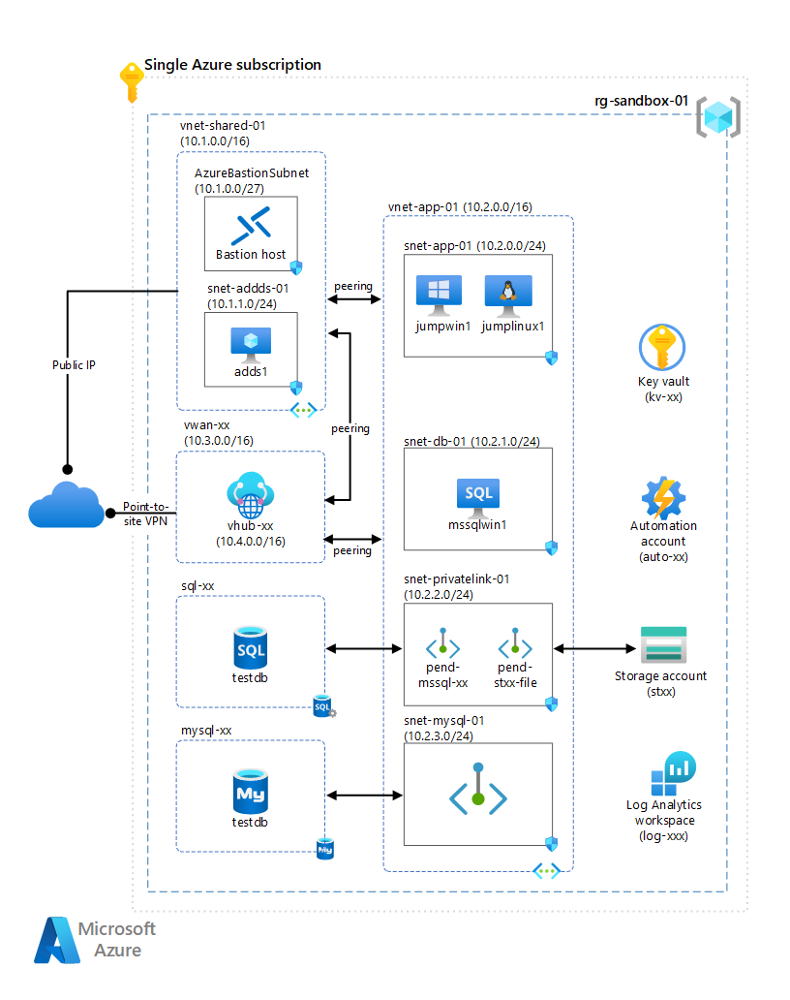

Azure Sandbox is a collection of interdependent [cloud computing](https://azure.microsoft.com/overview/what-is-cloud-computing) configurations for implementing common [Azure](https://azure.microsoft.com/overview/what-is-azure) services on a single [subscription](/azure/azure-glossary-cloud-terminology#subscription). This collection provides a flexible and cost effective sandbox environment for experimenting with Azure services and capabilities.

Depending on your Azure offer type and region, a fully provisioned Azure Sandbox environment can be expensive to run. You can reduce costs by stopping or deallocating virtual machines (VMs) when not in use, or by skipping optional configurations that you don't plan to use.
  
## Architecture

*Download a [Visio file](https://arch-center.azureedge.net/create-an-azure-sandbox.vsdx) of this architecture.*
### Components

You can deploy all the following sandbox configurations, or just the ones you need.

- Shared services virtual network, [Azure Bastion](https://azure.microsoft.com/products/azure-bastion), and Active Directory domain controller
- Application virtual network, Windows Server jump box, Linux jump box, and [Azure Files](https://azure.microsoft.com/products/storage/files) share
- [SQL Server on Azure Virtual Machines](https://azure.microsoft.com/products/virtual-machines/sql-server)
- [Azure SQL Database](https://azure.microsoft.com/products/azure-sql/database)
- [Azure Database for MySQL Flexible Server](/azure/mysql/flexible-server/overview)
- [Azure Virtual WAN](https://azure.microsoft.com/products/virtual-wan) and point-to-site VPN

## Deploy the sandbox

The Azure Sandbox environment requires the following prerequisites:

- An [Azure Active Directory (Azure AD)](https://azure.microsoft.com/products/active-directory) tenant
- An [Azure subscription](https://azure.microsoft.com/support/legal/offer-details)
- The appropriate [Azure role-based access control (RBAC)](/azure/role-based-access-control/overview) role assignments
- A [service principal](/cli/azure/create-an-azure-service-principal-azure-cli)
- A [configured client environment](https://github.com/Azure-Samples/azuresandbox#configure-client-environment)

For more information about how to prepare for a sandbox deployment, see [Prerequisites](https://github.com/Azure-Samples/azuresandbox#prerequisites).

To deploy Azure Sandbox, go to the [AzureSandbox](https://github.com/Azure-Samples/azuresandbox) GitHub repository and begin with [Getting started](https://github.com/Azure-Samples/azuresandbox#getting-started). See [Default Sandbox Deployment](https://github.com/Azure-Samples/azuresandbox#perform-default-sandbox-deployment) to deploy your Azure Sandbox environment. For more information, see [Known issues](https://github.com/Azure-Samples/azuresandbox#known-issues).

## Use cases

A sandbox is ideal for accelerating Azure projects. After you deploy your sandbox environment, you can add services and capabilities. You can use the sandbox for activities like:

- Self-learning
- Hackathons
- Testing
- Development

> [!IMPORTANT]
> Azure Sandbox isn't intended for production use. The deployment uses some best practices, but others intentionally aren't used in favor of simplicity and cost.

## Capabilities

Have you ever wanted to experiment with a particular Azure service or capability, but were blocked by all the foundational prerequisites? A sandbox environment can accelerate your project by provisioning many of the mundane core infrastructure components. You can focus on just the services or capabilities you need to work with.

For example, you can use the following capabilities and configurations that the Azure Sandbox environment provides:

- Connect to a Windows jump box VM from the internet.
  - Option 1: Internet-facing access by using a web browser and Azure Bastion
  - Option 2: Point-to-site VPN connectivity via Azure Virtual WAN
  
- Use an Azure Files preconfigured file share.

- Use a Windows jumpbox VM as a developer workstation.
  - Visual Studio Code preinstalled with Remote-SSH into a Linux jump box
  - Azure Storage Explorer, AzCopy, and Azure Data Studio preinstalled
  - SQL Server Management Studio preinstalled
  - MySQL Workbench preinstalled

- Use a preconfigured SQL Server VM.

- Use a preconfigured Azure SQL database or Azure Database for MySQL Flexible Server through private endpoints.

## Contributors

*This article is maintained by Microsoft. It was originally written by the following contributor.*

Principal author:

- [Roger Doherty](https://www.linkedin.com/in/roger-doherty-805635b/) | Cloud Solution Architect

 *To see non-public LinkedIn profiles, sign in to LinkedIn.*

## Next steps

- [Develop and test on Azure](https://azure.microsoft.com/solutions/dev-test/#overview)
- [Microsoft Cloud Adoption Framework](/azure/cloud-adoption-framework)
- [Cloud Adoption Framework Azure setup guide](/azure/cloud-adoption-framework/ready/azure-setup-guide)
- [Microsoft Azure Well-Architected Framework](/azure/architecture/framework)

## Related resources

- [Technology choices for Azure solutions](../technology-choices/technology-choices-overview.md)
- [Best practices for cloud applications](../../best-practices/index-best-practices.md)
- [Build applications on the Microsoft Cloud](../microsoft-cloud/overview.md)