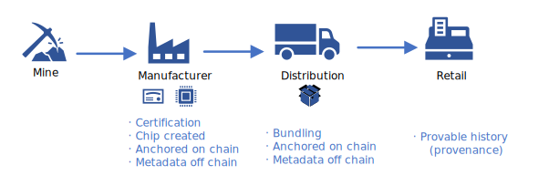

[!INCLUDE [header_file](../../../includes/sol-idea-header.md)]

This article describes how to use Kaleido Blockchain as a Service to track and trace physical assets and their metadata. Blockchain technology helps organizations track and trace a product's life cycle and meet regulatory, financial, ethical, and sustainability requirements.

## Architecture

:::image type="content" source="images/blockchain-service.svg" alt-text="Screenshot that shows the Azure architecture of the blockchain service." lightbox="images/blockchain-service.svg" border="false":::

*Download a [Visio file](https://arch-center.azureedge.net/blockchain-service.vsdx) of this architecture.*

### Dataflow

The following dataflow corresponds to the preceding architecture:

1. **Input or intake**: Input to the app uses existing Azure services. For instance, a traditional web app that runs in [Azure App Service](/azure/app-service) serves as an input from interactive users. Kaleido offers [middleware and Web3 abstraction layers](https://www.kaleido.io/hyperledger-firefly), so full-stack developers can develop apps via RESTful APIs.

   OpenAPI (Swagger) definitions are generated for the Solidity smart contracts that you enable on the Kaleido REST API Gateway. This step makes the blockchain simple to code against, similar to how you code against modern web-based systems. You don't need thick client libraries in your app or complex type-mapping. You can connect directly from your core apps, or use your existing integration tier or enterprise service bus (ESB), such as Azure Service Bus.

1. **Core ledger**: Kaleido Blockchain as a Service handles the input that's persisted in the underlying ledger for the solution. A set of nodes are created as part of the blockchain deployment. The input app can interact with the blockchain directly via those nodes or via the Kaleido REST API Gateway. Nodes can be validators or transaction only. Kaleido Blockchain as a Service scales within its Azure footprint based on which node size you select. The node size is based on [transaction throughput requirements](https://docs.kaleido.io/using-kaleido/resource-limits).

1. **Output or analytics**: In most cases, as data continues to exist in the ledger in Kaleido, existing non-blockchain-based systems need analytics and triggers. The Kaleido platform provides several native capabilities for reporting and analytics. The platform also supports event-driven notifications via webhooks and WebSockets, which send data to off-chain data technologies, such as Azure Cosmos DB or Azure SQL.

   Kaleido also provides a native document storage solution that has folder structures in which you can organize and persist uploaded or received files in Kaleido hosted storage or Azure Blob containers. All transferred data is deterministically hashed, signed, compressed, and asymmetrically encrypted during the transfer. This action guarantees that only the intended recipient can effectively decrypt the packet.

### Components

- [App Service](/azure/well-architected/service-guides/app-service-web-apps) is an HTTP-based service that hosts web apps, REST APIs, and mobile back ends. In this solution, organizations use an interactive web app or API for the supply chain data. App Service reads or references data in all stages.

- [Service Bus](https://azure.microsoft.com/products/service-bus) is a fully managed enterprise message broker with message queues and publish-subscribe topics in a namespace. Manufacturers use Service Bus to add data to the blockchain ledger or off-chain data store.

- Organizations use [Azure Managed Applications](https://azure.microsoft.com/products/managed-applications) to offer cloud solutions that are easy for consumers to deploy and operate. Organizations can publish managed applications to Azure Marketplace for all customers, or they can publish managed applications to an internal catalog for their company's users.

- [Ethlogger](https://github.com/splunk/splunk-connect-for-ethereum/blob/main/docs/cli.md) is an event listener that sends data to off-chain data technologies, such as Azure Cosmos DB and Azure SQL.

- [Azure Cosmos DB](https://azure.microsoft.com/products/cosmos-db) is a fully managed NoSQL database for modern app development that provides single-digit millisecond response times, automatic and instant scalability, and guaranteed speed at any scale. Azure Cosmos DB is used as a data store to house the output of events that are raised on the blockchain, such as state changes that analytics solutions use or simple reporting.

- [Azure SQL Database](https://azure.microsoft.com/products/azure-sql/database) is a fully managed platform as a service (PaaS) database engine that handles most database management functions, such as upgrades, patches, backups, and monitoring. In this scenario, SQL Database is used as a data store to house the output of events that are raised on the blockchain, such as state changes that analytics solutions use or simple reporting. Organizations use the [ledger feature of SQL Database](/azure/azure-sql/database/ledger-landing) to maintain the integrity of the output of events that are replicated from the blockchain to the SQL database.

- [Azure Monitor](https://azure.microsoft.com/products/monitor) provides a comprehensive solution for collecting, analyzing, and acting on telemetry from cloud environments and on-premises environments. Monitor provides availability data and performance data that's related to the architecture components.

## Scenario details

Blockchain technology emerged because organizations wanted to understand more about their products. They wanted to know:

- Where the product originated from.
- How the product was built.
- The processes to build a product.

For some organizations, it isn't worthwhile to build and maintain the electronic data interface (EDI) across suppliers to track and trace parts of a product. Instead, you can use Kaleido Blockchain as a Service to track and trace a tokenized version of a product's physical assets and relevant metadata to meet your organization's requirements. Combine Kaleido Blockchain as a Service with the capabilities of services, like App Service, Azure Key Vault, Service Bus, and Azure Cosmos DB.

Kaleido Blockchain as a Service is a managed ledger service from [Kaleido](https://www.kaleido.io/blockchain-platform/azure). Your organization can use this service to run your own blockchain networks without having to deal with infrastructure management.

Kaleido Blockchain as a Service has the following features:

- **Click-and-go networks**: Launch blockchain networks without the cost and complexity of building from scratch. Start small and rapidly move into production.

- **Custom configurations**: Choose from popular cloud integrations and hybrid deployment options, geographic regions, protocols like Ethereum (Hyperledger Besu, Quorum, Geth), Polygon, Avalanche, Hyperledger Fabric, Corda, and various consensus mechanisms.

- **Plug-and-play services**: Accelerate development with a full stack of plug-and-play services for tokens, wallets, key management, storage, and collaboration.

- **Enterprise-grade infrastructure**: Meet your most rigorous requirements. Kaleido is SOC 2 Type 2 compliant with built-in high availability (HA) and disaster recovery (DR), automatic failover, secure network isolation, service-level agreements (SLAs), and dedicated around-the-clock support.

- **Integration options (Ethereum events)**: Get event-listening models for off-chain storage and integration with open-source tools, such as Ethlogger from Splunk.

- **Integration options (infrastructure management)**: Get management APIs, support for monitoring and logging blockchain nodes, and integration with Azure services, such as Key Vault.

Kaleido is available in Azure Marketplace and also privately. To get Kaleido Blockchain as a Service:

- Sign up directly from [Azure Marketplace](https://azuremarketplace.microsoft.com/marketplace/apps/kaleidoinc1626787540168.kaleido).

- [Inquire with Kaleido](https://www.kaleido.io/contact-us) about a private offering for the Kaleido Asset platform.

### Potential use cases

Your organization can combine the Kaleido platform and Azure services to build solutions that track and provide an immutable history of product parts and their metadata, such as quality certificates. You can add these certificates to a shared ledger to provide information about a product's carbon footprint and recycled components that are in the product.

Blockchain technology provides a logical dataflow model for each physical component that's deployed with each participant in a supply chain. This approach reduces the need for participants to trust a single partner.

Your organization could build a dataflow model by using traditional centralized services and components, but this option isn't ideal for supply chain workloads. Supply chain workloads have their own systems that require isolation from other systems. This solution is ideal for sustainability, manufacturing, energy, and environmental industries.

The following diagram represents the four stages in a supply chain for chip manufacturing. The stages are mining, manufacturing, distribution, and retail. Materials change hands many times during the progression. For a company that values sustainability and ethical responsibility, it's important to track and trace the source of truth and quality details of the materials. Before this organization incorporated Kaleido Blockchain as a Service, each participant put data in their own data technology stack and synchronized the data to other parties.

The following dataflow corresponds to the preceding diagram:

1. **Mine or manufacturer**: Input is created when the manufacturer receives the raw material. The manufacturer checks the certification of the material. They use on-chain data in the ledger and off-chain data in traditional storage to establish the component's ownership.

1. **Distribution**: After the components are manufactured, the distributor bundles them for distribution. They use Kaleido to add the bundle to the ledger, which establishes its place of origin, such as a pallet location. This process uses on-chain data in the ledger and off-chain data in traditional storage.

1. **Retail**: The Kaleido ledger system helps organizations get the history of low-level components that are part of a larger product. This system establishes the ownership of products.

## Contributors

*This article is maintained by Microsoft. It was originally written by the following contributors.*

Principal authors:

- [Samrat Adhikari](https://www.linkedin.com/in/samrat-adhikari-mba-mcis-pmp-csm-8538a9169) | Senior Manager, Technology Solutions Delivery
- [Cale Teeter](https://www.linkedin.com/in/caleteeter) | Senior Software Engineer

Other contributors:

- [Lavanya Kasturi](https://www.linkedin.com/in/lakshmilavanyakasturi) | Technical Writer
- [Jodi Martis](https://www.linkedin.com/in/jodimartis) | Technical Writer

*To see non-public LinkedIn profiles, sign in to LinkedIn.*

## Next steps

- [App Service overview](/azure/app-service/overview)
- [Training module: Introduction to blockchain on Azure](/training/modules/intro-to-blockchain/)

## Related resources

- [Multiparty computing architecture design](multiparty-compute.yml)
